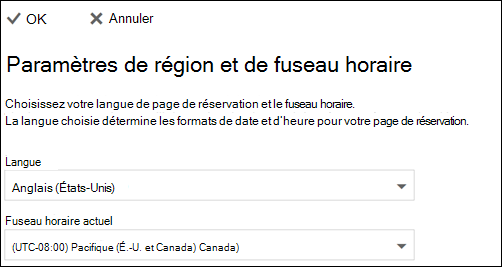

# Définir les fuseaux horaires et les langues dans Microsoft bookings

Si vous utilisez Microsoft bookings et que les livres sont créés à un moment incorrect, il se peut que vous deviez modifier vos paramètres de fuseau horaire. De même, si certains livres se trouvent dans une langue incorrecte, vous devrez peut-être modifier vos paramètres de langue.

Il existe deux paramètres de fuseau horaire et de langue distincts pour les réservations. Le premier paramètre contrôle la langue et le fuseau horaire du calendrier de réservation et est défini à l’aide des paramètres Outlook sur le Web pour le calendrier personnel de l’utilisateur connecté. Le deuxième paramètre affecte la page de réservation libre-service que vos clients utilisent et qui est définie à l’aide d’une page « Paramètres régionaux » qui contrôle la langue et le fuseau horaire uniquement pour cette page.

> [!NOTE]
> Bookings est activé par défaut pour les clients qui disposent des abonnements Microsoft 365 Business standard, Microsoft 365 a3 ou Microsoft 365 a5. Bookings est également disponible pour les clients disposant d’Office 365 entreprise E3 et d’Office 365 entreprise E5, mais il est désactivé par défaut. Pour commencer, consultez la rubrique [obtenir l’accès à Microsoft bookings](get-access.md). Pour activer ou désactiver les réservations, reportez-vous à [la rubrique activer ou désactiver des réservations pour votre organisation](turn-bookings-on-or-off.md).

## Définition de la langue et du fuseau horaire pour un calendrier de réservation

Le calendrier de réservation utilise les paramètres de langue et de fuseau horaire de l’utilisateur connecté. Par exemple, si le fuseau horaire de l’utilisateur connecté est défini sur l’heure de l’est (est), le calendrier de réservation affichera les heures de début et de fin du rendez-vous dans est. Ce fuseau horaire était initialement défini lors de la création des comptes Microsoft 365 et Outlook sur le Web.

Pour définir la langue et le fuseau horaire pour le calendrier de réservation :

1. Connectez-vous à Microsoft 365 et sélectionnez la vignette Outlook sur la page d’accueil (comme illustré dans la capture d’écran ci-dessous) ou dans le lanceur d’applications Microsoft 365.

   

1. Après l’ouverture d’Outlook, sélectionnez l' **icône représentant un engrenage** dans le coin supérieur droit de l’écran pour ouvrir vos paramètres personnels et de compte, puis recherchez « fuseau horaire » dans la zone de recherche du panneau **paramètres** . Le panneau est mis à jour pour afficher vos paramètres de langue personnelle et de fuseau horaire actuels pour ce compte. Comme indiqué ci-dessus, ce paramètre contrôle également la langue et le fuseau horaire du calendrier de réservation.

1. Modifiez la langue ou le fuseau horaire en sélectionnant la flèche déroulante dans la zone **langue ou fuseau horaire actuel** et en choisissant le paramètre souhaité.

1. Cliquez sur **Enregistrer**. Le panneau paramètres se ferme, le redémarrage d’Outlook sur le Web et les nouveaux paramètres de langue et de fuseau horaire sont appliqués.

## Définition de la langue et du fuseau horaire pour la page de réservation

1. Dans Microsoft 365, sélectionnez le lanceur d’applications, puis **livres**.

1. Dans le volet de navigation, sélectionnez réservation de la **page** et sélectionnez **modifier les paramètres de langue et de fuseau horaire**.

   

1. Sélectionnez la langue et le fuseau horaire actuel, puis cliquez sur OK.

   
