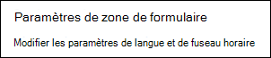

# Définir la langue et les fuseaux horaires dans Microsoft Bookings

Si vous utilisez Microsoft Bookings et que les réservations sont créées au mauvais moment, il peut être nécessaire de modifier vos paramètres de fuseau horaire. De même, si certaines réservations sont dans la mauvaise langue, vous devrez peut-être modifier vos paramètres de langue.

Il existe deux paramètres de langue et de fuseau horaire distincts pour Bookings. Le premier paramètre contrôle la langue et le fuseau horaire du calendrier de réservation et est défini à l’aide des paramètres Outlook sur le web pour le calendrier personnel de l’utilisateur connecté. Le deuxième paramètre affecte la page de réservation en libre-service que vos clients utilisent et est défini à l’aide d’une page « paramètres régionaux » qui contrôle la langue et le fuseau horaire uniquement pour cette page.

## Définition de la langue et du fuseau horaire d’un calendrier de réservation

Le calendrier de réservation utilise les paramètres de langue et de fuseau horaire de l’utilisateur connecté. Par exemple, si le fuseau horaire de l’utilisateur connecté est défini sur l’heure standard de l’Est (EST), le calendrier de réservation affiche les heures de début et de fin de rendez-vous existantes dans EST. Ce fuseau horaire a été défini à l’origine lors de la création des comptes Microsoft 365 et Outlook sur le web de l’utilisateur.

Pour définir la langue et le fuseau horaire du calendrier de réservation :

1. Connectez-vous à Microsoft 365 et sélectionnez la vignette Outlook sur la page d’accueil (comme illustré dans la capture d’écran ci-dessous) ou dans le lanceur d’applications Microsoft 365.

   :::image type="content" source="../media/bookings-outlook-tile.png" alt-text="Vignette Outlook sur la page d’accueil de Microsoft 365.":::

1. Une fois Outlook ouvert, sélectionnez **l’icône d’engrenage** dans le coin supérieur droit de l’écran pour ouvrir vos paramètres personnels et de compte, puis recherchez « Fuseau horaire » dans la zone de recherche du panneau **Paramètres** . Le panneau sera mis à jour pour afficher vos paramètres de langue et de fuseau horaire personnels actuels pour ce compte. Comme indiqué ci-dessus, ce paramètre contrôle également la langue et le fuseau horaire du calendrier de réservation.

1. Modifiez la langue ou le fuseau horaire en sélectionnant la flèche déroulante dans la zone **Langue ou Fuseau horaire actuel** et en choisissant le paramètre souhaité.

1. Cliquez sur **Enregistrer**. Le panneau Paramètres se ferme, Outlook sur le web redémarre, et les nouveaux paramètres de langue et de fuseau horaire sont appliqués.

## Définition de la langue et du fuseau horaire de la page de réservation

1. Dans Microsoft 365, sélectionnez le lanceur d’applications, puis **Bookings**.

1. Dans le volet de navigation, sélectionnez **Page Booking** , puis **modifier les paramètres de langue et de fuseau horaire**.

   

1. Sélectionnez votre langue et votre fuseau horaire actuel, puis choisissez **OK**.

   :::image type="content" source="../media/bookings-region-timezone-settings-1.png" alt-text="Paramètres de langue et de fuseau horaire.":::