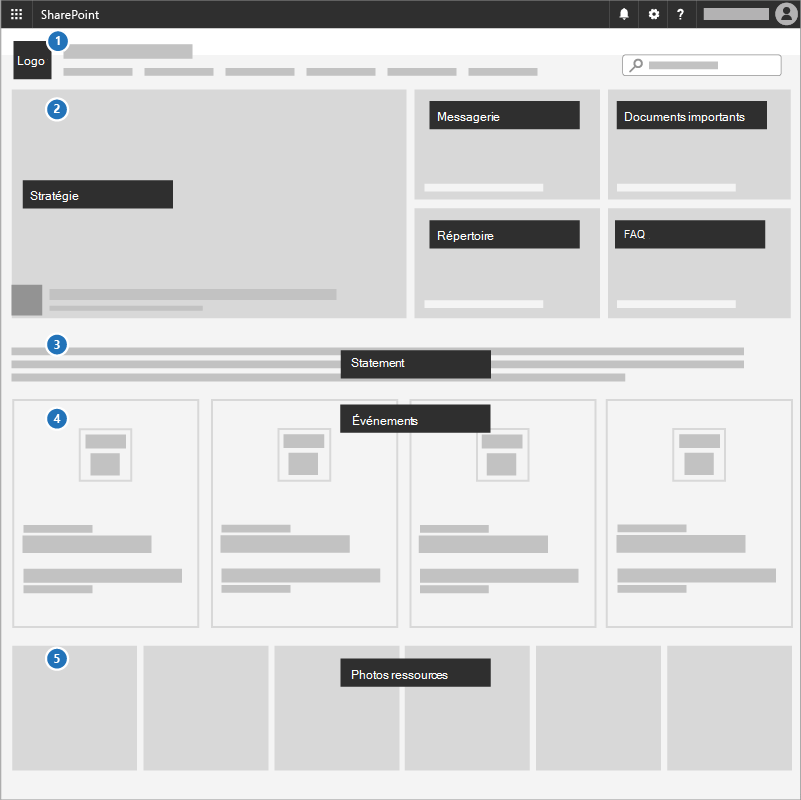

# Créer un site de communication

Un excellent moyen de communiquer les priorités, de partager des documents de stratégie et de mettre en évidence les événements à venir consiste à utiliser un site de communication dans SharePoint, et c’est ce dont cette mission est l’objet. Les sites de communication sont destinés à partager les choses à l’échelle de votre entreprise ou de votre campagne &mdash;, c’est votre site de stratégie interne et votre espace tactique. 

## Meilleures pratiques

Incluez les éléments suivants dans un site communications :

1. Ajoutez votre logo et vos couleurs sous forme d’image d’en-tête et de thème.

2. Dirigez avec votre stratégie, votre message, vos documents importants, un répertoire et des questions fréquentes (FAQ) dans un **composant WebPart Hero**.

3. Incluez une déclaration de chef de la direction ou de candidat à l’équipe dans un **composant WebPart Texte**.

4. Ajoutez des événements à un **composant WebPart Événements** afin que tout le monde puisse voir ce qui se passe.

5. Ajoutez des photos que les utilisateurs peuvent utiliser ou partager dans un **composant WebPart Galerie d’images**.

## Infographie : Créer une infographie de site de communication

Les liens suivants pour PowerPoint et PDF peuvent être téléchargés et imprimés au format tabloïd (également appelé registre, 11 x 17 ou A3).

[PDF](https://download.microsoft.com/download/3/f/f/3ff49b41-e5a4-4993-a00c-7f791a80b627/M365CampaignsCreateCommunicationSite.pdf) | [PowerPoint](https://download.microsoft.com/download/3/f/f/3ff49b41-e5a4-4993-a00c-7f791a80b627/M365CampaignsCreateCommunicationSite.pptx)

## Configuration

1. Connectez-vous à https://Office.com.

2. Dans le coin supérieur gauche de la page, sélectionnez l'icône du lanceur d'applications Icône du lanceur d'applications Office 365, puis la vignette **SharePoint**. Si la vignette **SharePoint** n'apparaît pas, cliquez sur la vignette **Sites** ou sur **Tout** si SharePoint n'est pas visible.

3. En haut de la page d'accueil SharePoint, cliquez sur **+ Créer un site** et choisissez l'option **Site de communication**.

Découvrez tout [sur les sites de communication](https://support.office.com/article/What-is-a-SharePoint-communication-site-94A33429-E580-45C3-A090-5512A8070732) et la [création d’un site de communication dans SharePoint Online](https://support.microsoft.com/en-us/office/create-a-communication-site-in-sharepoint-online-7fb44b20-a72f-4d2c-9173-fc8f59ba50eb).

## Paramètres d’administration

Si vous ne voyez pas le lien **+ Créer** un site, il se peut que la création de sites en libre-service ne soit pas disponible dans Microsoft 365. Pour créer un site d'équipe, contactez la personne qui administre Microsoft 365 dans votre organisation. Si vous êtes un administrateur Microsoft 365, voir [Gérer la création de sites dans SharePoint Online](/sharepoint/manage-site-creation) pour activer la création de sites en libre-service pour votre organisation ou [Gérer les sites dans le nouveau centre d'administration SharePoint ](/sharepoint/manage-sites-in-new-admin-center)pour créer un site à partir du <a href="https://go.microsoft.com/fwlink/?linkid=2185219" target="_blank">centre d'administration SharePoint</a>.

## Prochaine mission

Félicitations &mdash; vous avez terminé la mission ! À présent, concentrez-vous immédiatement sur la [protection des appareils gérés](m365bp-protect-devices.md) pour l’ensemble de l’organisation !