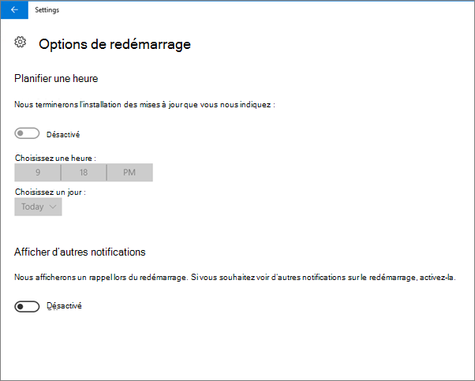

# Valider les paramètres de protection des appareils pour Windows 10 ou 11 PC

## Vérifier que Windows 10 ou 11 stratégies d’appareil sont définies

Après avoir configuré les stratégies d’appareil, l’application de la stratégie sur les appareils des [utilisateurs](../business-premium/m365bp-protection-settings-for-windows-10-devices.md) peut prendre jusqu’à quelques heures. Vous pouvez vérifier que les stratégies ont pris effet en examinant différents écrans paramètres Windows sur les appareils des utilisateurs. Étant donné que les utilisateurs ne pourront pas modifier les paramètres de l’antivirus Windows Update et Microsoft Defender sur leurs Windows 10 ou 11 appareils, de nombreuses options seront grisées.
  
1. Accédez à **Paramètres** \> **Mettre à jour &amp; la sécurité** \> **Windows Update** \> **Options de redémarrage** et vérifiez que tous les paramètres sont grisés.

    
  
2. Accédez à **Paramètres** \> **Mettre à jour &amp; la sécurité** \> **Windows Update** \> **Options avancées** et vérifiez que tous les paramètres sont grisés.

    
  
3. Accédez à La sécurité \> des mises **à jour &amp;** **des paramètres** \> **Windows Update** \> **Options** \> avancées **Choisir la façon dont les mises à jour sont remises**.

    Vérifiez que vous pouvez voir le message (en rouge) indiquant que certains paramètres sont masqués ou gérés par votre organisation, et que toutes les options sont grisées.

    
  
4. Pour ouvrir le centre de sécurité Windows Defender, accédez à **Paramètres** \> **mettre à jour &amp; la sécurité** \> **Windows Defender** \> cliquez sur Ouvrir Windows Defender **paramètres de protection &amp;**\> antivirus contre les menaces virus **de Security Center** \> **&amp;**.

5. Vérifiez que toutes les options sont grisées.

    
  
## Contenu associé

[Documentation et ressources Microsoft 365 pour les entreprises](/admin)

[Définir des configurations d’appareil pour Windows 10 PC](../business-premium/m365bp-protection-settings-for-windows-10-devices.md)
[Meilleures pratiques pour la sécurisation de Microsoft 365 pour les plans d’entreprise](../admin/security-and-compliance/secure-your-business-data.md)

## Objectif suivant

[Examiner et modifier les stratégies de protection](m365bp-view-edit-create-mdb-policies.md)
