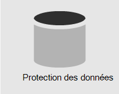
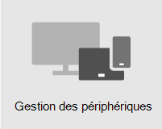

# Vue d’ensemble de la sécurité

> [!VIDEO https://www.microsoft.com/videoplayer/embed/RE4mzxI?autoplay=false]

Microsoft 365 Business Premium offre des fonctionnalités de protection contre les menaces, de protection des données et de gestion des appareils pour vous aider à protéger votre entreprise contre les menaces en ligne et l’accès non autorisé, ainsi qu’à protéger et gérer les données d’entreprise sur vos téléphones, tablettes et ordinateurs.

| [Protection contre les menaces](#threat-protection)|  [Protection des données](#data-protection) |   [Gestion des appareils](#device-management) |
|--|--|--|

## Protection contre les menaces

Microsoft 365 Business Premium inclut Office 365 protection avancée contre les menaces [( ATP),](safe-links.md)un service de filtrage du courrier électronique basé sur le cloud qui vous protège contre les programmes malveillants, les ransomware, les liens dangereux, etc. Les liens sécurisés ATP vous protègent contre les URL malveillantes dans les e-mails ou Office documents. Les pièces jointes sécurisées ATP vous protègent contre les programmes malveillants et les virus joints à des messages ou des documents.

[L’authentification multifacteur (MFA),](turn-on-mfa.md)ou vérification en deux étapes, nécessite que vous présentiez une deuxième forme d’authentification, telle qu’un code de vérification, pour confirmer votre identité avant de pouvoir accéder aux ressources.

[Windows Defender](/windows/security/threat-protection/overview-of-threat-mitigations-in-windows-10) offre une protection complète pour votre système, vos fichiers et vos activités en ligne contre les virus, les programmes malveillants, les logiciels espions et d’autres menaces.

## Protection des données

Les fonctionnalités de protection des Microsoft 365 Business Premium permettent de s’assurer que les données importantes restent sécurisées et que seules les personnes autorisées y ont accès.

Vous pouvez utiliser des stratégies de protection contre la perte de données [(DLP)](set-up-dlp.md) pour identifier et gérer des informations sensibles, telles que des numéros de sécurité sociale ou de carte de crédit, afin de ne pas les partager par erreur.

[chiffrement de messages Office 365](/microsoft-365/compliance/ome) combine les fonctionnalités de chiffrement et de droits d’accès pour garantir que seuls les destinataires prévus peuvent afficher le contenu des messages. chiffrement de messages Office 365 fonctionne avec Outlook.com, Yahoo!, Gmail et d’autres services de messagerie.

[Archivage Exchange Online](/office365/servicedescriptions/exchange-online-archiving-service-description/exchange-online-archiving-service-description) est une solution d’archivage informatique qui fonctionne avec Microsoft Exchange ou Exchange Online pour fournir des fonctionnalités d’archivage avancées, notamment des archives et la redondance des données. Vous pouvez utiliser des stratégies de rétention pour aider votre organisation à réduire les responsabilités associées à la messagerie électronique et à d’autres communications. Si votre entreprise est tenue de conserver les communications liées à un litige, vous pouvez utiliser les conservations In-Place et les conservations pour litige pour conserver les e-mails associés.

## Gestion des appareils

Microsoft 365 Business Premium fonctionnalités avancées de gestion des appareils vous permet de surveiller et de contrôler ce que les utilisateurs peuvent faire avec les appareils inscrits. Ces fonctionnalités incluent l’accès conditionnel, la gestion des périphériques mobiles [(MDM),](/microsoft-365/admin/basic-mobility-security/manage-enrolled-devices)BitLocker et les mises à jour automatiques.

Vous pouvez utiliser des stratégies d’accès conditionnel pour exiger des mesures de sécurité supplémentaires pour certains utilisateurs et tâches. Par exemple, vous pouvez exiger l’authentification multifacteur (MFA) ou bloquer les clients qui ne prenons pas en charge l’accès conditionnel.

Avec la gestion des périphériques mobiles, vous pouvez sécuriser et gérer les appareils mobiles de vos utilisateurs, tels que les iPhone, iPad, Android et Windows mobiles. Vous pouvez créer et gérer des stratégies de sécurité d’appareil, réinitialiser à distance un appareil pour supprimer toutes les données d’entreprise, réinitialiser un appareil aux paramètres d’usine et afficher des rapports détaillés sur les appareils.

Vous pouvez activer BitLocker chiffrement pour protéger les données en cas de perte ou de vol d’un appareil, et activer Windows Exploit Guard pour fournir une protection avancée contre les ransomware.

Vous pouvez configurer les mises à jour automatiques afin que les dernières fonctionnalités de sécurité et mises à jour soient appliquées à tous les appareils utilisateur.

## Recommandations en matière de sécurité

Si vous avez Microsoft Business Premium, la façon la plus rapide de configurer la sécurité et de commencer à collaborer en toute sécurité consiste à suivre les instructions de cette bibliothèque : [Microsoft 365 pour les petites entreprises et les campagnes](../campaigns/index.md). Ces conseils ont été développés en partenariat avec l’équipe Microsoft Microsoft Defending Democracy pour protéger tous les clients de PME contre les menaces informatiques lancées par des pirates informatiques sophistiqués.
