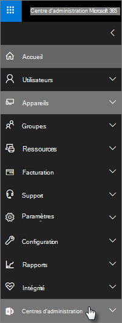

# Microsoft 365 Business Premium de sécurité et de conformité

Microsoft 365 Business Premium offre des fonctionnalités de sécurité simplifiées pour protéger vos données sur les PC, téléphones et tablettes.
    
## Microsoft 365 fonctionnalités de sécurité du Centre d'administration

Vous pouvez gérer de nombreuses fonctionnalités de sécurité Microsoft 365 Business Premium dans le Centre d'administration, ce qui vous offre un moyen simplifié d'activer ou de désactiver ces fonctionnalités. Dans le Centre d'administration, vous pouvez :
  
- [Définissez les paramètres de gestion des applications pour les appareils Android ou iOS.](app-protection-settings-for-android-and-ios.md) 
    
    Ces paramètres incluent la suppression de fichiers d'un appareil inactif après une période définie, le chiffrement des fichiers de travail, l'obligation pour les utilisateurs de définir un code confidentiel, etc.
    
- [Définissez les paramètres de protection des applications pour Windows 10 appareils mobiles.](protection-settings-for-windows-10-devices.md) 
    
    Ces paramètres peuvent être appliqués aux données d'entreprise sur les appareils de l'entreprise ou personnels.
    
- [Définissez les paramètres de protection des appareils Windows 10 appareils.](protection-settings-for-windows-10-pcs.md) 
    
    Vous pouvez [activer](/windows/security/information-protection/bitlocker/bitlocker-frequently-asked-questions) BitLocker chiffrement pour protéger les données en cas de perte ou de vol d'un appareil, et activer [Windows Exploit Guard](/windows/security/threat-protection/microsoft-defender-atp/enable-exploit-protection) pour fournir une protection avancée contre les ransomware. 
    
- [Supprimer les données d'entreprise sur des appareils](remove-company-data.md)
    
    Vous pouvez effacer à distance les données d'entreprise si un appareil est perdu, volé ou si un employé quitte votre entreprise.
    
- [Réinitialisez Windows 10 appareils à leurs paramètres d'usine.](reset-devices-to-factory-settings.md) 
    
    Vous pouvez réinitialiser Windows 10 appareils sur qui des paramètres de protection des appareils sont appliqués.
    
## Autres fonctionnalités de sécurité 

Les fonctionnalités avancées de Microsoft 365 Business Premium sont disponibles pour vous aider à protéger votre activité contre les cybermenaces et protéger les informations sensibles.
  
- **[Microsoft Defender pour Office 365](../security/office-365-security/defender-for-office-365.md)**
    
    Microsoft Defender pour Office 365 protéger votre entreprise contre les attaques par hameçonnage et ransomware sophistiquées conçues pour compromettre les informations des employés ou des clients. Les fonctionnalités sont les suivantes : 
    
  - Analyse sophistiquée des pièces jointes et analyse optimisée par l'IA pour détecter et ignorer les messages dangereux.
    
  - Vérifications automatiques des liens dans les e-mails pour évaluer s'ils font partie d'un schéma de hameçonnage. Cela vous permet d'accéder en toute sécurité aux sites web non sécurisés.

- **[Fonctionnalités complètes d'Intune dans le portail Azure](/mem/intune/fundamentals/what-is-intune)**
    
    L'accès au Centre d'administration Intune dans le portail Azure vous permet de configurer des fonctionnalités de sécurité supplémentaires, telles que la gestion des appareils MacOS, iPhone et Android, ainsi que la gestion avancée des appareils pour Windows, qui ne sont pas disponibles via le Centre d'administration Microsoft 365.
- **Même [accès conditionnel](/azure/active-directory/conditional-access/overview) qu'Azure AD Premium plan P1**

    L'accès conditionnel peut aider à protéger votre organisation contre les risques de se connecte, les tentatives d'accès à partir d'un réseau ou des paramètres régionaux inattendus, les tentatives d'accès à partir de types d'appareils à risque, etc. Les stratégies d'accès conditionnel sont appliquées une fois la première authentification terminée et utilisent les signaux du premier événement d'authentification pour déterminer si l'accès tenté doit être approuvé, refusé ou si une preuve supplémentaire (par exemple, un second formulaire d'identification) est requise.

    Les fonctionnalités d'accès conditionnel incluses sont les suivants :

    - Accès basé sur le nom d'utilisateur, le groupe et le rôle
    - Accès [basé sur une application](/azure/active-directory/conditional-access/app-based-conditional-access) 
    - [Accès basé sur l'emplacement](/azure/active-directory/authentication/howto-registration-mfa-sspr-combined#conditional-access-policies-for-combined-registration);  autoriser uniquement l'accès à partir de plages d'adresses IP de confiance ou de pays spécifiques ; 
    - Exiger l'mf pour l'accès
    - Bloquer l'accès aux applications qui utilisent [l'authentification héritée](/azure/active-directory/conditional-access/block-legacy-authentication)
    - Exiger que les applications utilisent [la protection des applications Intune](/azure/active-directory/conditional-access/app-protection-based-conditional-access)
    - Authentification personnalisée telle que l'authentification multifacteur avec des fournisseurs tiers, par exemple DUO.
   
    Autres fonctionnalités :
    - [Réinitialisation du mot de passe en libre-service](/azure/active-directory/authentication/concept-sspr-customization) pour Azure AD hybride
    
## Fonctionnalités de conformité

Votre abonnement Microsoft 365 Business Premium inclut des fonctionnalités qui vous aident à maintenir les normes de conformité et de réglementation.

- **[En savoir plus sur la protection contre la perte de données](../compliance/dlp-learn-about-dlp.md))** (DLP). 
    
    Vous pouvez configurer DLP pour détecter automatiquement les informations sensibles, telles que les numéros de carte de crédit, les numéros de sécurité sociale, etc., afin d'empêcher leur partage involontaire à l'extérieur de votre entreprise.
    
- **[Archivage Exchange Online](https://products.office.com/exchange/microsoft-exchange-online-archiving-email)**
    
    Archivage Exchange Online licence permet d'archiver facilement des messages à l'aide d'une sauvegarde continue des données. Il stocke tous les messages électroniques d'un utilisateur, y compris les éléments supprimés, au cas où ils se présenteront plus tard pour la découverte ou la restauration. En outre, vous pouvez utiliser différentes stratégies de rétention pour conserver les données de courrier électronique pour les conservations pour litige, eDiscovery ou pour répondre aux exigences de conformité.
    
- **[Étiquettes de confidentialité](../compliance/sensitivity-labels.md)**

   Microsoft 365 Business Premium inclut toutes les fonctionnalités [d'Azure Information Protection Plan 1.](https://go.microsoft.com/fwlink/p/?linkid=871407) Avec ce plan,  vous pouvez créer des étiquettes de niveau de sensibilité qui vous permettent de contrôler l'accès aux informations sensibles dans les e-mails et les documents, avec des contrôles tels que « Ne pas faire avancer » et « Ne pas copier ». Vous pouvez également classer les informations sensibles comme « confidentiels » et spécifier comment les informations classifiées peuvent être partagées à l'extérieur et à l'intérieur de l'entreprise. Enterprise chiffrement de qualité est facile à appliquer aux e-mails et aux documents pour conserver vos informations confidentielles. Vous pouvez également installer le module complémentaire client Azure Information Protection pour Office applications. Pour plus d’informations, consultez [Client d’étiquetage unifié Azure Information Protection](/azure/information-protection/rms-client/unifiedlabelingclient-version-release-history). Pour les étiquettes de sensibilité, installez **leAzInfoProtection_UL.exe**.

Vous pouvez gérer ces fonctionnalités dans le Centre de conformité de la sécurité et le &amp; Centre d'administration Intune. Au fil du temps, les contrôles simplifiés seront ajoutés au centre d Microsoft 365'administration.
  
    
## FAQ

 ### Ces fonctionnalités de sécurité sont-elles disponibles sur tous les marchés ?
  
Oui, ces fonctionnalités sont disponibles dans tous les marchés Microsoft 365 Business Premium sont vendues.
  
### Comment trouver le Centre de conformité &amp; de la sécurité ?
  
1. [Connectez-vous à Microsoft 365 Business Premium](https://portal.microsoft.com/) à l'aide de vos informations d'identification d'administrateur. 
    
2. Dans le navigation gauche, recherchez centres **d'administration** et développez-le. 
    
    
  
3. Choisissez **Conformité de la &amp; sécurité** pour aller au Centre &amp; de conformité de sécurité.
