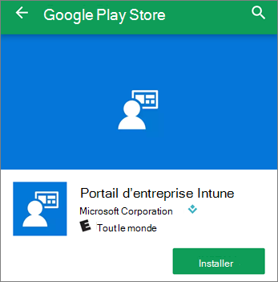

# Configurer des appareils mobiles pour Microsoft 365 pour les utilisateurs professionnels

Suivez les instructions des onglets pour installer Office sur un iPhone ou un téléphone Android. Après avoir suivi ces étapes, vos fichiers professionnels créés dans les applications Office seront protégés par Microsoft 365 pour les entreprises.

L'exemple s'applique à Outlook, mais également à toute autre application Office que vous souhaiteriez installer.
  
## Configurer des appareils mobiles

## [iPhone](#tab/iPhone)
  
Regardez une courte vidéo sur la façon de configurer des applications Office sur des appareils iOS avec Microsoft 365 pour les entreprises.  

> [!VIDEO https://www.microsoft.com/videoplayer/embed/RWee2n] 

Si vous avez trouvé cette vidéo utile, consultez les [séries de formations complètes pour les petites entreprises et les nouveaux utilisateurs de Microsoft 365](https://support.office.com/article/6ab4bbcd-79cf-4000-a0bd-d42ce4d12816).

Accédez à **App store**et tapez Microsoft Outlook dans le champ de recherche.
  

  
Appuyez sur l'icône de nuage pour installer Outlook.
  

  
Lorsque l'installation est terminée, appuyez sur le bouton **Ouvrir** pour ouvrir Outlook, puis appuyez sur **Prise en main**.
  

  
Entrez votre adresse de messagerie professionnelle sur \> **l’écran Ajouter un compte de** **courrier** , puis entrez vos **informations d’identification** \> Microsoft 365 pour les entreprises.
  

  
Si votre organisation protège les fichiers dans les applications, vous verrez une boîte de dialogue indiquant que votre organisation protège désormais les données de l’application et vous devez redémarrer l’application pour continuer à l’utiliser. Appuyez sur **OK** et fermez Outlook. 
  

  
Localisez l'application Outlook sur l'iPhone, puis redémarrez-la. Lorsque vous y êtes invité, entrez un code confidentiel et vérifiez-le. Outlook sur votre iPhone est maintenant prêt à être utilisé.
  

  
## [Android](#tab/Android)
  
Regardez une vidéo sur l’installation d’Outlook et d’Office sur les appareils Android.  

> [!VIDEO https://www.microsoft.com/videoplayer/embed/ecc2e9c0-bc7e-4f26-8b14-91d84dbcfef0] 

Si vous avez trouvé cette vidéo utile, consultez les [séries de formations complètes pour les petites entreprises et les nouveaux utilisateurs de Microsoft 365](https://support.office.com/article/6ab4bbcd-79cf-4000-a0bd-d42ce4d12816).

Pour commencer l’installation sur votre téléphone Android, accédez à la boutique en lecture.
  

  
Entrez Microsoft Outlook dans la zone de recherche Google Play, puis appuyez sur **installer**. Une fois l’installation d’Outlook terminée, appuyez sur **ouvrir**.
  

  
Dans l’application Outlook, appuyez sur **prise en main**, puis ajoutez votre compte \> de messagerie Microsoft 365 pour les entreprises et connectez-vous avec vos informations d’identification de votre organisation. **Continue**
  

  
Dans la boîte de dialogue indiquant que vous devez installer l'application Portail d'entreprise Intune, appuyez sur **Accéder au magasin**.
  

  
Dans la boutique en lecture, installez le portail d’entreprise Intune.
  

  
Ouvrez Outlook à nouveau, et entrez et confirmez un code confidentiel. Vous pouvez maintenant utiliser l'application Outlook.
  

## Voir également

[Vidéos de formation Microsoft 365 pour les entreprises](https://support.office.com/article/6ab4bbcd-79cf-4000-a0bd-d42ce4d12816)

---
