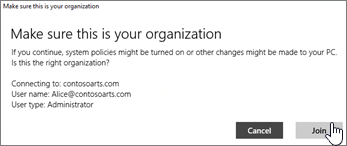

# Configurer des appareils Windows pour les utilisateurs de Microsoft 365 Business Premium

## Conditions préalables à la configuration des appareils Windows pour les utilisateurs de Microsoft 365 Business Premium

Avant de pouvoir configurer les appareils Windows pour les utilisateurs de Microsoft 365 Business Premium, vérifiez que tous les appareils Windows exécutent Windows 10 professionnel, version 1703 (créateurs de mise à jour). Windows 10 professionnel est une condition préalable pour le déploiement de Windows 10 Business, qui est un ensemble de fonctionnalités de gestion des périphériques et de services Cloud qui complètent Windows 10 professionnel et qui permettent les contrôles de sécurité et de gestion centralisés de Microsoft 365 Business Premium.
  
Si vous avez des appareils Windows exécutant Windows 7 professionnel, Windows 8 professionnel ou Windows 8,1 Pro, votre abonnement Microsoft 365 Business Premium vous permet d’effectuer une mise à niveau vers Windows 10.
  
Pour plus d'informations sur la mise à niveau des appareils Windows vers Windows 10 Professionnel Creators Update, suivez les étapes décrites dans cette rubrique : [Mettre à niveau des appareils Windows vers Windows Professionnel Creators Update](upgrade-to-windows-pro-creators-update.md)
  
Consultez [vérifier que l’appareil est connecté à Azure ad](#verify-the-device-is-connected-to-azure-ad) pour vérifier que vous disposez de la mise à niveau ou pour vous assurer que la mise à niveau a fonctionné.

Regardez une courte vidéo sur la connexion de Windows à Microsoft 365.  

> [!VIDEO https://www.microsoft.com/videoplayer/embed/RE3yXh3] 

Si vous avez trouvé cette vidéo utile, consultez les [séries de formations complètes pour les petites entreprises et les nouveaux utilisateurs de Microsoft 365](https://support.microsoft.com/office/6ab4bbcd-79cf-4000-a0bd-d42ce4d12816).
  
## Joindre des appareils Windows 10 au service Azure AD de votre organisation

Lorsque tous les appareils Windows de votre organisation ont été mis à niveau vers Windows 10 professionnel Creators Update ou que vous exécutez déjà Windows 10 Pro Creators Update, vous pouvez joindre ces appareils au service Azure Active Directory de votre organisation. Une fois les appareils joints, ils seront automatiquement mis à niveau vers Windows 10 Business, qui fait partie de votre abonnement Microsoft 365 Business Premium.
  
### Pour un appareil Windows 10 Professionnel ou un appareil qui vient d'être mis à niveau

Suivez ces étapes pour un nouvel appareil exécutant Windows 10 Professionnel Creators Update, ou pour un appareil qui vient d'être mis à niveau vers Windows 10 Professionnel Creators Update sans passer par la configuration d'appareil Windows 10.
  
1. Suivez la configuration d'appareil Windows 10 jusqu'à ce que vous arriviez à la page **Comment souhaitez-vous configurer ?** 
    
    
  
2. Ici, choisissez **configurer pour une organisation** , puis entrez votre nom d’utilisateur et votre mot de passe pour Microsoft 365 Business Premium. 
    
3. Terminez la configuration de l'appareil Windows 10.
    
   Une fois cette opération terminée, l'utilisateur est connecté au domaine Azure AD de votre organisation. Pour vous en assurer, voir [Vérifier qu'un appareil est connecté à Azure AD](#verify-the-device-is-connected-to-azure-ad). 
  
### Pour un appareil qui a déjà été configuré et qui exécute Windows 10 Professionnel

 **Connecter des utilisateurs à Azure AD :**
  
1. Sur le PC Windows de l'utilisateur exécutant Windows 10 Professionnel, version 1703 (Creators Update) (voir [conditions préalables](pre-requisites-for-data-protection.md)), cliquez sur le logo Windows, puis sur l'icône Paramètres.
  
   
  
2. Dans **Paramètres**, accédez à **Comptes**.
  
   
  
3. À la page **Vos informations**, cliquez sur **Accès Professionnel ou Scolaire** \> **Connexion**.
  
   
  
4. Dans la boîte de dialogue **Configurer un compte professionnel ou scolaire**, sous **Autres actions**, sélectionnez **Joindre cet appareil à Azure Active Directory**.
  
   
  
5. À la **page de connexion**, entrez votre adresse e-mail professionnelle ou scolaire \> **Suivant**.
  
   Dans la page **Saisie du mot de passe**, entrez votre mot de passe \> **Se connecter**.
  
   
  
6. Sur la page vérifier qu' **il s’agit de votre organisation** , vérifiez que les informations sont correctes, puis cliquez sur **rejoindre**.
  
   À la page **Vous avez terminé.**, cliquez sur **Terminé**.
  
   
  
Si vous avez chargé des fichiers vers OneDrive Entreprise, synchronisez-les vers votre ordinateur. Si vous avez utilisé un outil tiers pour migrer le profil et les fichiers, synchronisez-les également avec le nouveau profil.
  
## Vérifiez que l’appareil est connecté à Azure AD

Pour vérifier votre statut de synchronisation, dans la page **professionnel ou scolaire** de **paramètres**, cliquez dans la zone **connecté à** _ \<organization name\> _ pour afficher les **informations** sur les boutons et vous **déconnecter**. Cliquez sur **Informations** pour obtenir votre état de synchronisation. 
  
Dans la page État de synchronisation, cliquez sur Synchronisation pour obtenir les stratégies de gestion des appareils mobiles les plus récentes sur votre ordinateur.
  
Pour commencer à utiliser le compte Microsoft 365 Business Premium, accédez au bouton **Démarrer** de Windows, cliquez avec le bouton droit sur l’image de votre compte actuel, puis **changez de compte**. Connectez-vous en utilisant l'adresse e-mail et le mot de passe de votre organisation.
  

  
## Vérifier qu'un appareil a été mis à niveau vers Windows 10 Business

Vérifiez que votre abonnement Azure AD joint Windows 10 appareils ont été mis à niveau vers Windows 10 entreprise dans le cadre de votre abonnement Microsoft 365 Business Premium.
  
1. Accédez à **Paramètres** \> **Système** \> **Informations système**.
    
2. Vérifiez que l' **édition** est bien **Windows 10 Business**.
    
    
  
## Étapes suivantes

Pour configurer vos appareils mobiles, reportez-vous à la rubrique [configurer des appareils mobiles pour les utilisateurs de Microsoft 365 Business Premium](set-up-mobile-devices.md), pour définir les stratégies de protection des applications ou de protection des applications, consultez la rubrique [Manage Microsoft 365 for Business](manage.md).
  
## Pour en savoir plus sur la configuration et l’utilisation de Microsoft 365 Business Premium

[Vidéos de formation Microsoft 365 Entreprise](https://support.microsoft.com/office/6ab4bbcd-79cf-4000-a0bd-d42ce4d12816)
