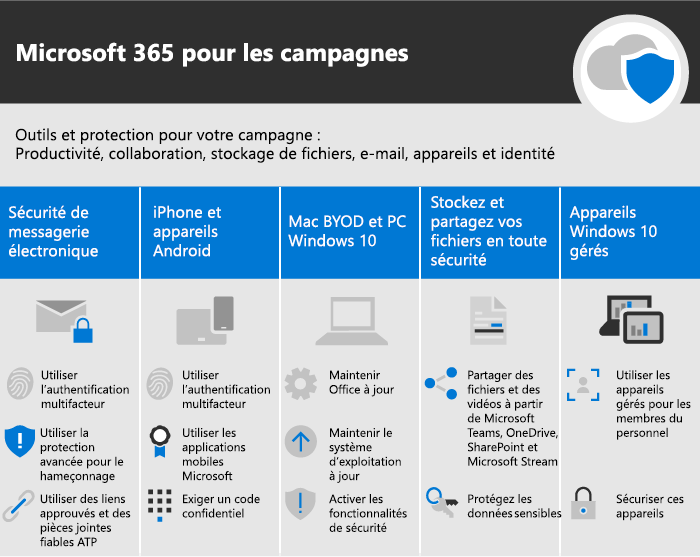

Microsoft 365 pour les campagnes
===========================

Dans notre monde actuel, le maintien de la sécurité des données et des communications est une priorité, notamment pour les campagnes politiques, les pratiques médicales et juridiques, ainsi que de nombreuses autres entreprises. Microsoft 365 pour les campagnes inclut un série de recommandations conçues pour vous aider à protéger vos données. Cette bibliothèque inclut de l’aide pour configurer et utiliser cet environnement recommandé, même si vous n’êtes pas une campagne.

> [!VIDEO https://www.microsoft.com/videoplayer/embed/RE3clbH] 

**Qu’est-ce que Microsoft 365 pour les campagnes ?** Il s’agit d’une configuration sécurisée recommandée qui inclut Microsoft 365 Business Premium afin de vous permettre d’effectuer les opérations suivantes :
- Utiliser les outils de productivité et de collaboration professionnels approuvés, tels que Outlook, Word, Excel et d’autres produits Office 
- Protéger vos fichiers professionnels sur tous vos appareils iOS, Android et Windows 10 grâce à une sécurité de qualité professionnelle facile à gérer 
- Appliquer une protection supplémentaire pour les comptes d’utilisateur et l’identité 

Les campagnes de choix fédérales aux États-Unis éligibles à un tarif spécial pour Microsoft 365 Business Premium peuvent bénéficier de ces instructions pour configurer une sécurité accrue et découvrir comment collaborer en toute sécurité.

Cette bibliothèque comprend les éléments suivants :
- Instructions de configuration pour renforcer la sécurité.
- Aide pour les utilisateurs à configurer des appareils pour un accès sécurisé.
- Des conseils sur la collaboration et le partage sécurisés.

Pour plus d’informations sur les fonctionnalités incluses, consultez [Microsoft 365 Business Premium](https://www.microsoft.com/microsoft-365/business). 

Prise en main
--------------------------

<ul class="panelContent cardsJ">
    <li>
        

            

                

                    

                        

                            
                        

                    

                    

                        
<b>Pour commencer, procédez comme suit :</b>

                        
<a href="get-microsoft-365-campaigns.md">Obtenir les campagnes Microsoft 365</a>

                        
<a href="m365-campaigns-users.md">Découvrez comment vos utilisateurs peuvent utiliser Microsoft 365</a>

                        
<a href="microsoft-365-campaigns-setup-overview.md">Configurer les campagnes Microsoft 365</a>

                    

                

            

        

    </li>
</ul>

Solutions pour votre campagne ou petite entreprise
--------------------------

Une fois que vous avez configuré votre environnement Microsoft 365 sécurisé, vous pouvez utiliser les solutions suivantes pour commencer à travailler :

<ul class="panelContent cardsW cols cols2">
    <li>
        

            

                

                    

                        

                            
                        

                    

                    

                        <h3>Créer Teams pour la collaboration</h3>
                        
Simplifier la communication et la collaboration avec des équipes spécifiques pour les membres du personnel, l’ensemble du personnel, les partenaires et les fournisseurs avec Microsoft Teams.

                        
<a href="create-teams-for-collaboration.md">Créer votre équipe</a>

                    

                

            

        

    </li>
    <li>
        

            

                

                    

                        

                            
                        

                    

                    

                        <h3>Configurer des réunions en ligne</h3>
                        
Planifier une réunion avec l’audio, la vidéo et le partage avec Microsoft Teams.

                        
<a href="set-up-meetings.md">Organiser une réunion</a>

                    

                

            

        

    </li>
    <li>
        

            

                

                    

                        

                            
                        

                    

                    

                        <h3>Chiffrer ou étiqueter votre courrier électronique sensible</h3>
                        
Utiliser les étiquettes de confidentialité et de chiffrement pour protéger les messages électroniques qui contiennent des informations confidentielles ou sensibles.

                        
<a href="send-encrypted-email.md">Envoyer un message électronique chiffré</a>

                    

                

            

        

    </li>
    <li>
        

            

                

                    

                        

                            
                        

                    

                    

                        <h3>Créer un site de communication</h3>
                        
Partager des événements, des messages, des images et bien plus avec les membres de votre équipe dans un site de communications interne créé avec SharePoint.

                        
<a href="create-communications-site.md">Créer votre site</a>

                    

                

            

        

    </li>
    <li>
        

            

                

                    

                        

                            
                        

                    

                    

                        <h3>Partager des fichiers et des vidéos</h3>
                        
Enregistrer vos fichiers et vidéos dans le cloud pour qu’ils soient accessibles à toutes les personnes appropriées.

                        
<a href="share-files-and-videos.md">Démarrer le partage</a>

                    

                

            

        

    </li>
</ul>
