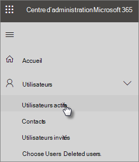

# Protéger vos comptes d’administrateur

Étant donné que les comptes administrateur sont dotés de privilèges élevés, ils sont précieux pour les pirates et les cybercriminels. Cet article décrit les aspects suivants :

- La configuration d’un compte d’administrateur supplémentaire pour les situations d’urgence.
- Comment protéger ces comptes.
 
Lorsque vous vous inscrivez à Microsoft 365 et que vous entrez vos informations, vous devenez automatiquement administrateur général. Un administrateur global a le contrôle ultime des comptes d’utilisateurs et de tous les autres paramètres dans le centre d’administration Microsoft, mais il existe de nombreux types de comptes d’administrateur avec différents degrés d’accès. Pour plus d’informations sur les différents niveaux d’accès pour chaque type de rôle d’administrateur, consultez la rubrique [à propos des rôles d’administrateur](https://docs.microsoft.com/office365/admin/add-users/about-admin-roles) .

## Créer des comptes d’administration supplémentaires

Utilisez les comptes administrateur uniquement pour l’administration. Les administrateurs doivent disposer d’un compte d’utilisateur distinct pour utiliser régulièrement les applications Office et n’utiliser leur compte d’administrateur que si cela est nécessaire pour gérer les comptes et les appareils, et tout en travaillant sur d’autres fonctions d’administration. Il est également recommandé de supprimer la licence Microsoft 365 des comptes d’administrateur de sorte que vous n’ayez pas à les payer.

Vous devez configurer au moins un compte d’administrateur global supplémentaire pour accorder un accès administrateur à un autre employé approuvé. Vous pouvez également créer des comptes d’administration distincts pour la gestion des utilisateurs (ce rôle est appelé **administrateur de gestion des utilisateurs**). Pour plus d’informations, consultez la rubrique [à propos des rôles d’administrateur](https://docs.microsoft.com/office365/admin/add-users/about-admin-roles).

Pour créer des comptes d’administration supplémentaires :

 1. Accédez au <a href="https://go.microsoft.com/fwlink/p/?linkid=837890" target="_blank">Centre d’administration</a> , **puis sélectionnez** \> utilisateurs **actifs** dans le volet de navigation de gauche.

    

2. Sur la page **utilisateurs actifs** , sélectionnez **Ajouter un utilisateur** en haut de la page, puis, dans le panneau **nouvel utilisateur** , entrez le nom et d’autres informations.
3. Développez la section **rôles** , puis choisissez **administrateur général** pour accorder à cet utilisateur l’accès administrateur global. Vous pouvez également choisir **administrateur personnalisé** et choisir l’un des rôles affichés.

    Entrez un autre message dans la zone de texte **adresse de messagerie de substitution** . Vous pouvez utiliser cette adresse pour récupérer vos informations de mot de passe si vous êtes verrouillé. Pour les administrateurs globaux, une déclaration de facturation est également envoyée à cette adresse.

    
    
4. Dans la section **licences de produit** , déplacez le sélecteur de **Microsoft 365 entreprise** sur **désactivé** et l' **utilisateur créer sans licence de produit** sur activé. **On**

    

## Créer un compte d’administrateur d’urgence

Vous devez également créer un compte de sauvegarde qui n’est pas configuré avec l’authentification multifacteur (MFA), afin de ne pas vous verrouiller accidentellement (par exemple, si vous perdez votre téléphone que vous utilisez comme deuxième forme de vérification). Assurez-vous que le mot de passe de ce compte est une phrase ou au moins 16 caractères. On parle souvent de « compte de saut de ligne ».

## Créer un compte d’utilisateur pour vous-même

Utilisez votre compte d’utilisateur pour participer à la collaboration avec votre organisation, notamment en vérifiant le courrier. Cela signifie que vos informations d’identification d’administrateur peuvent ressembler à *Alice. Chavez@Contoso. org* et que votre compte d’utilisateur normal ressemble à *Alice@Contoso. com*.

Pour créer un compte d’utilisateur :
1. Accédez au <a href="https://go.microsoft.com/fwlink/p/?linkid=837890" target="_blank">Centre d’administration</a> , **puis sélectionnez** \> utilisateurs **actifs** dans le volet de navigation de gauche.
2. Sur la page **utilisateurs actifs** , sélectionnez **Ajouter un utilisateur** en haut de la page, puis, dans le panneau **nouvel utilisateur** , entrez le nom et d’autres informations.
3. Développez la section **rôles** , puis choisissez **utilisateur (pas d’accès administratif)**.
1. Dans la section **licences de produit** , déplacez le sélecteur de **Microsoft 365 Business** vers **activé**. 

## Enregistrer chacun de ces comptes pour l’authentification multifacteur

## Recommandations supplémentaires

- Assurez-vous que les comptes administrateur sont également configurés pour l’authentification multifacteur. Nous allons vous montrer comment procéder dans configurer les [stratégies d’accès conditionnel](m365-campaigns-conditional-access.md).
- Avant d’utiliser les comptes d’administrateur, fermez toutes les sessions de navigateur et les applications qui ne sont pas associées, y compris les comptes de messagerie personnels. Vous pouvez également utiliser dans des fenêtres de navigateur privées ou incognito.
- Après avoir effectué les tâches d’administration, veillez à vous déconnecter de la session du navigateur.
