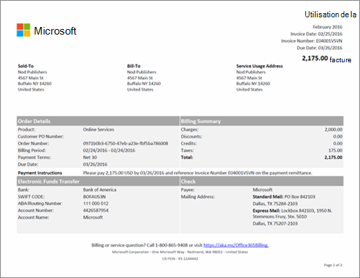

# Consulter votre facture Microsoft 365 pour les entreprises

> [!IMPORTANT]
> Depuis le 26 janvier 2021, les nouveaux comptes bancaires ne sont plus pris en charge pour les clients en Belgique, en France, en Italie, au Luxembourg, au Portugal, en Espagne, et aux États-Unis. Si vous êtes un client existant dans l’un de ces pays, vous pouvez continuer à payer votre abonnement avec un compte bancaire existant et ajouter de nouveaux abonnements à celui-ci, mais pourvu que le compte bancaire soit en règle.

Chaque mois ou année (selon l’option choisie lors de l’achat de votre abonnement), vous recevez un e-mail vous indiquant que votre nouvelle facture est disponible dans le centre d’administration. [Découvrez comment rechercher et afficher votre facture](view-your-bill-or-invoice.md).
  
Votre facture contient deux pages. Page 1 contient un résumé de la facture, ainsi que des informations générales sur la facture, la commande, le montant à payer, les méthodes de paiement et la façon de contacter le support technique.
  

  
La page 2 contient des informations relatives à l'activité de facturation de chaque abonnement.
  

  
Pour obtenir une description des champs et des termes inclus dans votre facture, consultez le [Glossaire des termes de la facture](#invoice-field-glossary) plus loin dans cet article.
  
## Présentation des concepts relatifs à la facturation

Avant d'afficher votre facture, vous devez comprendre certains concepts clés relatifs à la facturation.
  
### Solde de la facture et solde de compte

 Le **solde de la facture** correspond au montant indiqué sur votre facture. Il s’agit uniquement du montant dû pour cette période de facturation spécifique. Le **solde de compte** total correspond à la somme de toutes les factures impayées. Il est indiqué dans la section **Facturation** du centre d'administration.
  
### Périodicité de facturation et fréquence de facturation

 La **périodicité de facturation** correspond à la fréquence à laquelle vous êtes facturé. Les abonnements sont facturés mensuellement ou annuellement, selon l'option que vous avez choisie lors de l'achat de l'abonnement. La **fréquence de facturation** correspond à la fréquence à laquelle vous recevez une facture. Si vous choisissez une fréquence de facturation annuelle, vous ne recevrez qu'une seule facture chaque année, sauf si l'activité de votre abonnement nécessite l'application de frais ou d'un crédit à votre compte.
  
Si vous avez passé plusieurs commandes, vous recevez une facture pour chaque commande.
  
## Glossaire des termes de la facture

Le tableau suivant décrit les termes pouvant figurer sur votre facture. Il est possible que certains termes répertoriés ici ne figurent pas sur votre facture, selon que vous payez par virement, carte bancaire ou compte bancaire.
  
> [!NOTE]
> Le règlement par compte bancaire n’est pas disponible dans certains pays ou régions.
  
|**Name**|**Description**|
|:-----|:-----|
|Prix annuel|Les abonnements sont facturées mensuellement ou annuellement. Si vous avez choisi une facturation annuelle lors de l'achat de l'abonnement, le prix de la licence annuelle est indiqué sur la facture. Si vous voulez modifier la périodicité de facturation, vous devrez annuler votre abonnement et le racheter en sélectionnant une autre périodicité de facturation.|
|Période de facturation|La période de facturation correspond à la période écoulée depuis la date de la dernière facturation. La période de service représente la période pendant laquelle l'utilisation du service vous est facturée.|
|Facturer à|Ceci est l'adresse de votre service de facturation et est généralement identique à l'adresse de vente. Pour mettre à jour votre adresse de facturation, consultez [Modifier vos adresses de facturation](change-your-billing-addresses.md).|
|Frais|La page 1 de votre facture résume tous les frais compris dans la période de facturation de la facture. La page 2 affiche le détail des frais pour chaque abonnement.|
|Chèque|Si vous payez par virement et que paiement par chèque est proposé pour votre pays, le bas de la page 1 inclut des informations sur l'envoi de votre paiement. Veuillez indiquer le numéro de facture sur votre chèque.|
|Crédits|La page 1 de votre facture résume tous les crédits compris dans la période de facturation de la facture. La page 2 affiche le détail des crédits pour chaque abonnement.|
|Numéro du bon de commande client|Votre numéro de bon de commande. Si vous mettez à jour le numéro du bon de commande, il sera inclus dans les prochaines factures. [Changer votre numéro de bon de commande](#change-your-purchase-order-number).    **REMARQUE** Vous ne pouvez pas ajouter un numéro de bon de commande à une facture existante.           |
|Jours|Chaque transaction de facturation est associée à une période de service. La colonne Jours indique le nombre de jours de cette période de service.|
|Remises|La page 1 de votre facture résume toutes les remises comprises dans la période de facturation de la facture. La page 2 affiche le détail des remises pour chaque abonnement.|
|Échéance|Date d'échéance du paiement de la facture. Si vous payez votre abonnement à l'aide d'une carte bancaire ou d'un compte bancaire, nous débiterons votre carte bancaire ou compte bancaire le jour après la date de facturation.  **REMARQUE** Le règlement par compte bancaire n’est pas disponible dans certains pays ou régions.           |
|Transfert électronique de fonds|Si vous avez choisi l'option Facture comme mode de paiement pour votre abonnement, la page 1 indique les coordonnées bancaires de Microsoft pour les paiements électroniques (virement, CCA, SEPA, etc.). En règle générale, votre établissement bancaire vous présente un champ de référence à compléter lorsque vous envoyez un paiement. Veuillez indiquer le numéro de facture figurant dans ce champ.|
|Grand Total|Cette ligne inclut les totaux pour toutes les colonnes Frais, Remises, Crédits, Sous-total, Taxes et Total pour tous les abonnements répertoriés sur la facture.|
|Date de facturation|Date de création de la facture. La date de facturation correspond au jour suivant la fin de votre période de facturation. Par exemple, si votre période de facturation va du 15 janvier au 14 février, votre date de facturation tombe le 15 février.|
|Numéro de facture|Numéro unique attribué à votre facture. Veuillez indiquer le numéro de facture lors de votre paiement.|
|Prix mensuel|Les abonnements sont facturés mensuellement ou annuellement. Si vous avez choisi une facturation mensuelle lors de l'achat de l'abonnement, le prix de la licence mensuelle est indiqué sur la facture. Si vous voulez modifier la périodicité de facturation, vous devrez annuler votre abonnement et le racheter en sélectionnant une autre périodicité de facturation.|
|Numéro de la commande|Une commande est créée à chaque fois que vous achetez un nouvel abonnement. Chaque mois, vous recevez une facture pour chaque commande.|
|Instructions de paiement|If you pay by credit card, you'll see "Do not pay - charged to credit card on file." If you pay by invoice, you'll see instructions for paying by Electronic Funds Transfer (EFT) and check (if applicable).|
|Conditions de paiement|Nombre de jours entre la date de facturation et la date d'échéance du paiement. La norme est de 30 jours.|
|Produit|Sur la page 1 de votre facture, « Services en ligne » est le terme générique utilisé pour décrire vos abonnements. Sur la page 2, vous verrez les noms de chaque abonnement.|
|QTÉ|Nombre de licences achetées durant la période de service.|
|Période de service|La période de service représente la période pendant laquelle l'utilisation du service vous est facturée. La période de facturation est la période qui s'est écoulée depuis la dernière date de facturation.|
|Adresse d'utilisation du service|L'adresse de l'endroit où le service est utilisé, généralement le même que votre adresse de vente. Pour mettre à jour votre adresse d’utilisation du service, consultez [Modifier vos adresses de facturation](change-your-billing-addresses.md).|
|Vente|Le nom et l'adresse de votre société. Pour plus d'informations, consultez [Modifier l'adresse physique et l'adresse de courrier électronique, ainsi que d'autres informations de votre organisation](../../admin/manage/change-address-contact-and-more.md).  |
|Sous-total|Chaque abonnement répertorié sur votre facture a une ligne de sous-total distincte pour toutes les colonnes Frais, Remises, Crédits, Sous-total, Taxes et Total pour cet abonnement.|
|Taxes|La page 1 de votre facture indique le total des taxes. La page 2 indique le taux d'imposition appliqué et le montant total des taxes pour chaque ligne. Si votre facture contient des taxes dont votre entreprise est exonérée, veuillez [contacter le support technique](../../business-video/get-help-support.md).  |
|Total|Le montant dû pour la période de facturation de la facture.|

## Changer votre numéro de bon de commande

Si vous payez par facture, vous pouvez ajouter ou modifier le numéro de bon de commande correspondant à votre abonnement.
  
> [!NOTE]
> Vous ne pouvez pas ajouter un numéro de bon de commande pour une facture existante. Le numéro de bon de commande sera mentionné sur toutes les futures factures.

::: moniker range="o365-worldwide"

1. Dans le centre d’administration, accédez à la page **Facturation** \> <a href="https://go.microsoft.com/fwlink/p/?linkid=842054" target="_blank">Vos produits</a>.

::: moniker-end

::: moniker range="o365-germany"

1. Dans le centre d’administration, accédez à la page **Facturation** \> <a href="https://go.microsoft.com/fwlink/p/?linkid=847745" target="_blank">Vos produits</a>.

::: moniker-end

::: moniker range="o365-21vianet"

1. Dans le centre d’administration, accédez à la page **Facturation** \> <a href="https://go.microsoft.com/fwlink/p/?linkid=850626" target="_blank">Produits</a>.

::: moniker-end

1. Sur l’onglet **Produits**, sélectionnez l’abonnement que vous souhaitez modifier.

1. Dans la page détails de l’abonnement, dans la section **Paramètres** d’abonnement et de paiement, **sélectionnez Modifier la facture.**

1. En bas des **détails de** modification pour le paiement par volet vocal, entrez votre numéro de bon de commande, puis sélectionnez **Enregistrer.**

## Contenu associé

[Découvrez comment rechercher et afficher votre facture](view-your-bill-or-invoice.md) (article)\
[Informations de facturation pour Microsoft 365 pour les entreprises au Mexique](mexico-billing-info.md) (article) \
[Modifier vos adresses de facturation](change-your-billing-addresses.md) (article)\
[Modifier l’adresse de votre organisation, le courrier électronique du contact technique et d’autres informations](../../admin/manage/change-address-contact-and-more.md) (article)\
[Payer votre abonnement Microsoft 365 entreprise](pay-for-your-subscription.md) (article)\
[Options de paiement de Minecraft: Education Edition](/education/windows/school-get-minecraft) (article)
