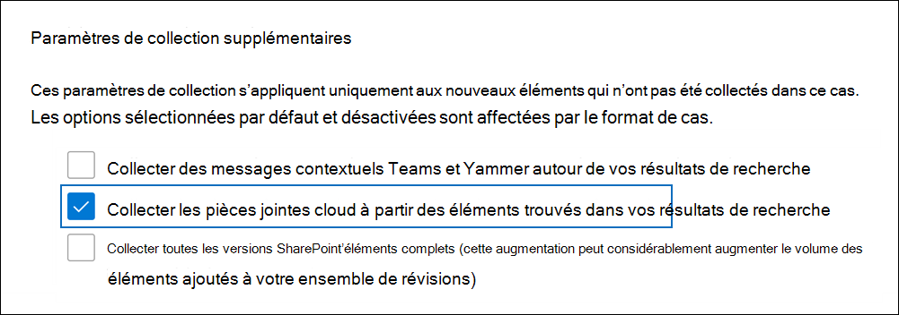

# Collecter des pièces jointes cloud dans Advanced eDiscovery (aperçu)

Les pièces jointes dans le cloud sont des liens vers des documents qui sont généralement stockés dans SharePoint site et OneDrive. Ainsi, au lieu d’attacher une copie réelle d’un document dans un message électronique ou une conversation Teams, vous avez la possibilité de partager un lien vers le fichier. Les pièces jointes dans le cloud sont un moyen efficace de partager des documents et de collaborer avec d’autres personnes de votre organisation. Toutefois, les pièces jointes dans le cloud présentent des difficultés pendant le flux de travail eDiscovery, car seules les pièces jointes dans le cloud et non le contenu réel dans le document partagé sont renvoyées dans une recherche de découverte électronique. Pour résoudre ce problème, Advanced eDiscovery propose deux solutions pour collecter des pièces jointes cloud :  

- Collecte de la version en direct d’un document lié à une pièce jointe dans le cloud.

- Collecte de la version du document au moment où il a été partagé dans une pièce jointe cloud.

## Collecte des pièces jointes cloud

Lorsque vous créez un brouillon de collection et que les résultats de la recherche contiennent des éléments qui incluent des pièces jointes cloud, vous avez la possibilité de collecter la cible de la pièce jointe dans le cloud lorsque vous validerez la collection de brouillons dans un jeu à réviser. Lorsque vous sélectionnez cette option, Advanced eDiscovery ajoute les documents qui sont liés à la pièce jointe cloud à l’ensemble de révision. Cela vous permet de passer en revue les documents cibles et de déterminer si le document est pertinent pour votre cas ou enquête.

La capture d’écran suivante montre l’option d’inclure les cibles des pièces jointes dans le cloud lorsque vous validerez une collection dans un jeu à réviser.

> [!NOTE]
>- Si vous utilisez le [format](advanced-ediscovery-large-cases.md) grand cas dans Advanced eDiscovery, l’option d’inclure des pièces jointes cloud dans le jeu à réviser est sélectionnée par défaut et ne peut pas être désélectionée. 
>- Vous avez également la possibilité d’inclure toutes les versions (en plus de la version qui a été partagée) des pièces jointes cloud dans le jeu à réviser.  
Pour obtenir des instructions sur la validation d’une collection dans un jeu à réviser, voir Valider un brouillon [de collection dans un jeu à réviser.](commit-draft-collection.md)

## Collecte de la version partagée dans une pièce jointe cloud

Le Advanced eDiscovery pour la collecte des pièces jointes cloud inclut uniquement l’ajout de la version la plus récente d’une pièce jointe cloud à un jeu à réviser. Cela signifie que la version qui est collectée et ajoutée à un jeu à réviser peut être différente de la version initialement partagée dans la pièce jointe cloud. Il est donc possible que le contenu présent dans la pièce jointe dans le cloud au moment de son partage soit supprimé et qu’il n’existe pas dans la version actuelle ajoutée au jeu à réviser.

Les organisations ont désormais la possibilité d’utiliser Microsoft 365 étiquettes de rétention pour conserver la version d’un document au moment où il a été partagé en tant que pièce jointe cloud. Pour ce faire, votre organisation peut créer une étiquette de rétention, choisir l’option appliquer l’étiquette aux pièces jointes cloud, puis appliquer automatiquement l’étiquette aux documents stockés dans SharePoint et OneDrive. Une fois cette configuration définie, une copie d’un document est créée au moment où le fichier est partagé. En outre, si le document est modifié et partagé à nouveau en tant que pièce jointe dans le cloud, la version modifiée est également conservée. Si le fichier est modifié et partagé à nouveau, une nouvelle copie du fichier en tant que nouvelle version est conservée.

La conservation des versions partagées des pièces jointes dans le cloud peut aider votre organisation à mettre en place l’étendue de la conservation et de la collection de contenu potentiellement pertinent à la version spécifique du document qui a été partagée plutôt qu’à la version actuelle. Après avoir implémenté cette solution de rétention, la version actuelle d’une pièce jointe dans le cloud et la version qui a été partagée dans la pièce jointe cloud sont collectées et ajoutées à un jeu à réviser.

Pour obtenir des instructions sur la configuration d’une étiquette de rétention et son application automatique aux pièces jointes cloud, consultez l’application automatique d’étiquettes aux pièces [jointes cloud.](apply-retention-labels-automatically.md#auto-apply-labels-to-cloud-attachments)

La capture d’écran suivante montre un document en pièce jointe dans le cloud, nommé *XYZ Research.docx*, qui a été ajouté à un jeu à réviser. Le document a été partagé en tant que pièce jointe cloud dans une conversation Teams conversation. Le jeu à réviser contient également la version initialement partagée dans la pièce jointe cloud. Notez que le nom de cette version de la pièce jointe cloud est généré par le système et que l’auteur est identifié comme **SharePoint**.

En outre, la version actuelle et la version partagée ont la même valeur de propriété **FamilyId,** qui est identique à **l’ID** de famille de l’objet parent (par exemple, un message électronique ou une conversation Teams conversation). Cela vous permet de grouper les pièces jointes cloud avec l’élément dans lequel elles ont été partagées.

Après avoir implémenté l’étiquette de rétention et l’appliquer automatiquement aux documents SharePoint, vous sélectionnez toujours l’option de collecte des pièces jointes cloud lors de la validation d’un brouillon de collection dans un jeu à réviser. Lorsque les pièces jointes cloud sont collectées, la version actuelle et la version initialement partagée sont ajoutées au jeu à réviser.
