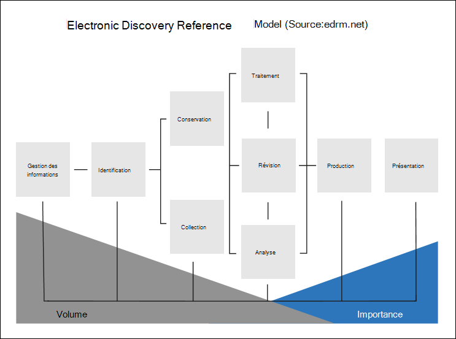

# Alignement advanced eDiscovery avec le modèle de référence de découverte électronique

Le flux de travail intégré d’Advanced eDiscovery dans Microsoft 365 s’aligne sur le processus eDiscovery décrit par le modèle de référence de découverte électronique (EDRM).

(Image source fournie par edrm.net. L’image source a été rendue disponible sous Creative Commons Attribution 3.0 Unported License.)

À un niveau élevé, voici comment Advanced eDiscovery prend en charge le flux de travail EDRM :

- **Identification.** Après avoir identifié les personnes potentielles concernées par une enquête, vous pouvez les ajouter en tant que dépositaires (également *appelés dépositaires* de données, car elles peuvent détenir des informations pertinentes pour l’enquête) à un cas Advanced eDiscovery. Une fois que les utilisateurs sont ajoutés en tant que dépositaires, il est facile de conserver, de collecter et de réviser les documents des dépositaires.

- **Conservation.** Pour conserver et protéger les données pertinentes pour un examen, Advanced eDiscovery vous permet de placer une conservation légale sur les sources de données associées aux dépositaires dans un cas. Vous pouvez également placer en attente les données non privatives. Advanced eDiscovery dispose également d’un flux de travail de communications intégré qui vous permet d’envoyer des notifications de conservation légale aux dépositaires et de suivre leurs accusés de réception.

- **Collection.** Une fois que vous avez identifié (et conservé) les sources de données pertinentes pour l’examen, vous pouvez utiliser l’outil de recherche intégré dans advanced eDiscovery pour rechercher et collecter des données en direct à partir des sources de données privatives (et des sources de données non privatives, le cas échéant) qui peuvent être pertinentes pour le cas.

- **Traitement.** Une fois que vous avez collecté toutes les données pertinentes pour le cas, l’étape suivante consiste à les traiter pour une analyse et un examen approfondis. Dans Advanced eDiscovery, les données sur place que vous avez identifiées lors de la phase de collecte sont copiées dans un emplacement de stockage Azure (appelé ensemble de *révision),* ce qui vous fournit une vue statique des données de cas. 

- **Révision.** Une fois que les données ont été ajoutées à un jeu à réviser, vous pouvez afficher des documents spécifiques et exécuter des requêtes supplémentaires pour réduire les données à ce qui est le plus pertinent pour le cas. Peut également annoter et marquer des documents spécifiques.

- **Analyse.** Advanced eDiscovery fournit un outil d’analyse intégré qui vous permet d’annuler davantage les données du jeu à réviser que vous déterminez ne sont pas pertinentes pour l’examen. En plus de réduire le volume de données pertinentes, Advance eDiscovery vous permet également d’économiser des coûts de révision juridique en vous permettant d’organiser le contenu afin de simplifier et d’améliorer l’efficacité du processus de révision.

- **Production** et **présentation.** Lorsque vous êtes prêt, vous pouvez exporter des documents à partir d’un groupe de révision pour révision légale. Vous pouvez exporter des documents dans leur format natif ou dans un format EDRM spécifié afin qu’ils soient importés dans des applications de révision tierces.

## Plus d’informations

Pour commencer à utiliser Advanced eDiscovery, voir :

- [Configurer Advanced eDiscovery](get-started-with-advanced-ediscovery.md)

- [Créer et gérer un cas Advanced eDiscovery](create-and-manage-advanced-ediscoveryv2-case.md)