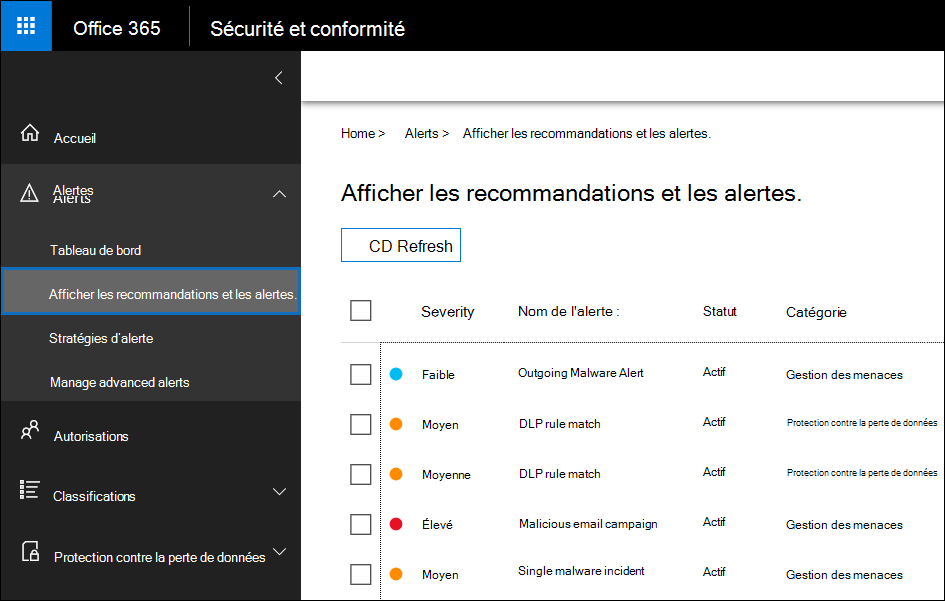

# <a name="alert-policies-in-the-security-and-compliance-center"></a>Stratégies d’alerte dans le Centre de sécurité et de conformité

Vous pouvez utiliser les outils de stratégie d’alerte et de tableau de bord d’alerte dans les centres de sécurité et de conformité Microsoft 365 pour créer des stratégies d’alerte, puis afficher les alertes générées lorsque les utilisateurs effectuent des activités qui correspondent aux conditions d’une stratégie d’alerte. Il existe plusieurs stratégies d’alerte par défaut qui vous permettent de surveiller des activités telles que l’attribution de privilèges d’administrateur dans Exchange Online, les attaques de programmes malveillants, les campagnes de hameçonnage et les niveaux inhabituels de suppressions de fichiers et de partage externe.

Les stratégies d’alerte vous permet de catégoriser les alertes déclenchées par une stratégie, d’appliquer la stratégie à tous les utilisateurs de votre organisation, de définir un niveau de seuil pour le déclenchement d’une alerte et de décider s’il faut recevoir des notifications par courrier électronique lorsque des alertes sont déclenchées. Il existe également une page Afficher les **alertes** dans le centre de sécurité et conformité où vous pouvez afficher et filtrer les alertes, définir un état d’alerte pour vous aider à gérer les alertes, puis ignorer les alertes après avoir résolu ou résolu l’incident sous-jacent.

> [!NOTE]
> Les stratégies d’alerte sont disponibles pour les organisations ayant un abonnement Microsoft 365 Entreprise, Office 365 Entreprise ou Office 365 pour le gouvernement américain E1/F1/G1, E3/F3/G3 ou E5/G5. Les fonctionnalités avancées sont disponibles uniquement pour les organisations qui disposent d’un abonnement E5/G5, ou pour les organisations qui disposent d’un abonnement E1/F1/G1 ou E3/F3/G3 et d’un abonnement Microsoft Defender pour Office 365 P2 ou un Microsoft 365 E5 Conformité ou un abonnement E5 eDiscovery et Audit. Les fonctionnalités qui nécessitent un abonnement E5/G5 ou un module add-on sont mises en évidence dans cette rubrique. Notez également que les stratégies d’alerte sont disponibles dans les environnements Office 365 Cloud de la communauté du secteur public, Cloud de la communauté du secteur public High et DoD pour le gouvernement américain.

## <a name="how-alert-policies-work"></a>Fonctionnement des stratégies d’alerte

Voici une vue d’ensemble rapide du fonctionnement des stratégies d’alerte et des alertes déclenchées lorsque l’activité de l’utilisateur ou de l’administrateur correspond aux conditions d’une stratégie d’alerte.


1. Un administrateur de votre organisation crée, configure et allume une stratégie d’alerte à l’aide de la **page** Stratégies d’alerte dans le Centre de sécurité et conformité. Vous pouvez également créer des stratégies d’alerte à l’aide de la cmdlet [New-ProtectionAlert](/powershell/module/exchange/new-protectionalert) dans le Centre de sécurité & conformité PowerShell.

   Pour créer des stratégies d’alerte, vous devez avoir le rôle Gérer les alertes ou le rôle Configuration de l’organisation dans le centre de sécurité et conformité.

   > [!NOTE]
   > La création ou la mise à jour d’une stratégie d’alerte prend jusqu’à 24 heures avant que les alertes ne soient déclenchées par la stratégie. Cela est dû au fait que la stratégie doit être synchronisée avec le moteur de détection des alertes.

2. Un utilisateur effectue une activité qui correspond aux conditions d’une stratégie d’alerte. Dans le cas d’attaques de programmes malveillants, les messages électroniques infectés envoyés aux utilisateurs de votre organisation déclenchent une alerte.

3. Microsoft 365 génère une alerte qui s’affiche sur la page Afficher les **alertes** dans le Centre de sécurité & conformité. En outre, si les notifications par courrier électronique sont activées pour la stratégie d’alerte, Microsoft envoie une notification à une liste de destinataires. Les alertes qu’un administrateur ou d’autres utilisateurs peuvent voir sur la page Afficher les alertes sont déterminées par les rôles attribués à l’utilisateur. Pour plus d’informations, voir [les autorisations RBAC requises pour afficher les alertes.](#rbac-permissions-required-to-view-alerts)

4. Un administrateur gère les alertes dans le centre de sécurité et conformité. La gestion des alertes consiste à affecter un état d’alerte pour faciliter le suivi et la gestion des enquêtes.

## <a name="alert-policy-settings"></a>Paramètres de stratégie d’alerte

Une stratégie d’alerte se compose d’un ensemble de règles et de conditions qui définissent l’activité de l’utilisateur ou de l’administrateur qui génère une alerte, d’une liste des utilisateurs qui déclenchent l’alerte s’ils exécutent l’activité et d’un seuil qui définit le nombre de fois qu’une activité doit se produire avant le déclenchement d’une alerte. Vous classez également la stratégie et lui affectez un niveau de gravité. Ces deux paramètres vous aident à gérer les stratégies d’alerte (et les alertes déclenchées lorsque les conditions de stratégie sont respectées), car vous pouvez filtrer ces paramètres lors de la gestion des stratégies et de l’affichage des alertes dans le centre de sécurité et conformité. Par exemple, vous pouvez afficher les alertes qui correspondent aux conditions de la même catégorie ou afficher les alertes avec le même niveau de gravité.

Pour afficher et créer des stratégies d’alerte, puis [https://protection.office.com](https://protection.office.com) sélectionnez **Stratégies d’alerte d’alertes.** \> 


Une stratégie d’alerte se compose des paramètres et conditions suivants.

-  Activité que l’alerte suit : vous créez une stratégie pour suivre une activité ou, dans certains cas, quelques activités connexes, telles que le partage d’un fichier avec un utilisateur externe en le partageant, en attribuant des autorisations d’accès ou en créant un lien anonyme. Lorsqu’un utilisateur effectue l’activité définie par la stratégie, une alerte est déclenchée en fonction des paramètres de seuil d’alerte.

    > [!NOTE]
    > Les activités que vous pouvez suivre dépendent du plan Office 365 Entreprise ou Office 365 du gouvernement américain. En règle générale, les activités liées aux campagnes anti-programme malveillant et aux attaques par hameçonnage nécessitent un abonnement E5/G5 ou E1/F1/G1 ou E3/F3/G3 avec un abonnement de module Office 365 [Plan](../security/office-365-security/defender-for-office-365.md) 2.

- **Conditions d’activité** : pour la plupart des activités, vous pouvez définir des conditions supplémentaires qui doivent être remplies pour déclencher une alerte. Les conditions courantes incluent les adresses IP (de sorte qu’une alerte est déclenchée lorsque l’utilisateur effectue l’activité sur un ordinateur avec une adresse IP spécifique ou dans une plage d’adresses IP), si une alerte est déclenchée si un ou plusieurs utilisateurs effectuent cette activité, et si l’activité est effectuée sur un nom de fichier ou une URL spécifique. Vous pouvez également configurer une condition qui déclenche une alerte lorsque l’activité est effectuée par n’importe quel utilisateur de votre organisation. Les conditions disponibles dépendent de l’activité sélectionnée.

- **Lorsque l’alerte est déclenchée :** vous pouvez configurer un paramètre qui définit la fréquence à utiliser pour qu’une activité se produise avant le déclenchement d’une alerte. Cela vous permet de configurer une stratégie pour générer une alerte chaque fois qu’une activité correspond aux conditions de la stratégie, lorsqu’un certain seuil est dépassé ou lorsque l’occurrence de l’activité que l’alerte suit devient inhabituelle pour votre organisation.

    

    Si vous sélectionnez le paramètre en fonction d’une activité inhabituelle, Microsoft établit une valeur de référence qui définit la fréquence normale de l’activité sélectionnée. Il faut jusqu’à sept jours pour établir cette ligne de base, au cours de laquelle les alertes ne seront pas générées. Une fois la ligne de base établie, une alerte est déclenchée lorsque la fréquence de l’activité suivi par la stratégie d’alerte dépasse largement la valeur de référence. Pour les activités liées à l’audit (telles que les activités liées aux fichiers et dossiers), vous pouvez établir une ligne de base basée sur un utilisateur unique ou sur tous les utilisateurs de votre organisation ; pour les activités liées aux programmes malveillants, vous pouvez établir une ligne de base basée sur une famille de programmes malveillants unique, un destinataire unique ou tous les messages de votre organisation.

    > [!NOTE]
    > La possibilité de configurer des stratégies d’alerte basées sur un seuil ou sur la base d’une activité inhabituelle nécessite un abonnement E5/G5, ou un abonnement E1/F1/G1 ou E3/F3/G3 avec Un abonnement Microsoft Defender pour Office 365 P2, Microsoft 365 E5 Conformité ou Microsoft 365 eDiscovery et Audit. Les organisations ayant un abonnement E1/F1/G1 et E3/F3/G3 peuvent uniquement créer des stratégies d’alerte lorsqu’une alerte est déclenchée chaque fois qu’une activité se produit.

- **Catégorie d’alerte** : pour faciliter le suivi et la gestion des alertes générées par une stratégie, vous pouvez affecter l’une des catégories suivantes à une stratégie.

  - Protection contre la perte de données

  - Gouvernance des informations

  - Flux de messagerie

  - Autorisations

  - Gestion des menaces

  - Autres

  Lorsqu’une activité qui correspond aux conditions de la stratégie d’alerte se produit, l’alerte générée est marquée avec la catégorie définie dans ce paramètre. Cela vous permet de suivre et de gérer les alertes qui ont le même paramètre de catégorie sur la page Afficher les **alertes** dans le centre de sécurité et conformité, car vous pouvez trier et filtrer les alertes en fonction de la catégorie.

- **Gravité de l’alerte** : similaire à la catégorie d’alerte, vous affectez un attribut de gravité (**Faible,** **Moyen,** **Élevé** ou **Informationnel)** aux stratégies d’alerte. Comme pour la catégorie d’alerte, lorsqu’une activité qui correspond aux conditions de la stratégie d’alerte se produit, l’alerte générée est marquée avec le même niveau de gravité que celui qui est définie pour la stratégie d’alerte. Là encore, cela vous permet de suivre et de gérer les alertes qui ont le même paramètre de gravité sur la page **Afficher les alertes.** Par exemple, vous pouvez filtrer la liste des  alertes de sorte que seules les alertes avec une gravité élevée soient affichées.

    > [!TIP]
    > Lors de la configuration d’une stratégie d’alerte, envisagez d’affecter une gravité plus élevée aux activités qui peuvent entraîner des conséquences gravement négatives, telles que la détection de programmes malveillants après leur remise aux utilisateurs, l’affichage de données sensibles ou classifiées, le partage de données avec des utilisateurs externes ou d’autres activités qui peuvent entraîner une perte de données ou des menaces de sécurité. Cela peut vous aider à hiérarchiser les alertes et les actions que vous prenez pour examiner et résoudre les causes sous-jacentes.

- **Notifications par courrier électronique** : vous pouvez configurer la stratégie de sorte que les notifications par courrier électronique soient envoyées (ou non) à une liste d’utilisateurs lorsqu’une alerte est déclenchée. Vous pouvez également définir une limite de notification quotidienne de sorte qu’une fois le nombre maximal de notifications atteint, plus aucune notification n’est envoyée pour l’alerte au cours de cette journée. Outre les notifications par courrier électronique, vous ou d’autres administrateurs pouvez afficher les alertes déclenchées par une stratégie dans la page Afficher **les alertes.** Envisagez d’activer les notifications par courrier électronique pour les stratégies d’alerte d’une catégorie spécifique ou qui ont un paramètre de gravité plus élevé.

## <a name="default-alert-policies"></a>Stratégies d’alerte par défaut

Microsoft fournit des stratégies d’alerte intégrées qui permettent d’identifier les abus Exchange autorisations d’administrateur, l’activité des programmes malveillants, les menaces externes et internes potentielles et les risques de gouvernance des informations. Dans la page **Stratégies** d’alerte, les noms de ces stratégies intégrées sont en gras et le type de stratégie est défini en tant que **Système**. Ces stratégies sont désactivées par défaut. Vous pouvez désactiver ces stratégies (ou recommencer), configurer une liste de destinataires pour envoyer des notifications par courrier électronique et définir une limite de notification quotidienne. Les autres paramètres de ces stratégies ne peuvent pas être modifiés.

Le tableau suivant répertorie et décrit les stratégies d’alerte par défaut disponibles et la catégorie à qui chaque stratégie est affectée. La catégorie permet de déterminer les alertes qu’un utilisateur peut afficher dans la page Afficher les alertes. Pour plus d’informations, voir [les autorisations RBAC requises pour afficher les alertes.](#rbac-permissions-required-to-view-alerts)

Le tableau indique également les Office 365 Entreprise et Office 365 pour le gouvernement américain requis pour chacun d’eux. Certaines stratégies d’alerte par défaut sont disponibles si votre organisation dispose de l’abonnement au module complément approprié en plus d’un abonnement E1/F1/G1 ou E3/F3/G3.

| Stratégie d’alerte par défaut | Description | Catégorie | Enterprise abonnement |
|:-----|:-----|:-----|:-----|
|**Un clic d’URL potentiellement malveillant a été détecté**|Génère une alerte lorsqu’un [](../security/office-365-security/safe-links.md) utilisateur protégé par des liens sécurisés dans votre organisation clique sur un lien malveillant. Cet événement est déclenché lorsque les modifications du verdict d’URL sont identifiées par Microsoft Defender pour Office 365 ou lorsque les utilisateurs remplacent les pages de liens sécurisés (en fonction de la stratégie de liens sécurisés Microsoft 365 pour l’entreprise de votre organisation). Cette stratégie d’alerte a un **paramètre** de gravité élevée. Pour les clients Office 365 P2, E5 et G5, cette alerte déclenche automatiquement une enquête et une réponse automatisées [dans Office 365](../security/office-365-security/office-365-air.md). Pour plus d’informations sur les événements qui déclenchent cette alerte, voir [Configurer des stratégies de liens sécurisés.](../security/office-365-security/set-up-safe-links-policies.md)|Gestion des menaces|E5/G5 ou Defender pour Office 365 abonnement au module add-on P2|
|**Résultat de soumission administrateur terminé**|Génère une alerte lorsqu’une soumission [d’administrateur](../security/office-365-security/admin-submission.md) termine la rescan de l’entité soumise. Une alerte est déclenchée chaque fois qu’un résultat de rescan est rendu à partir d’une soumission d’administrateur. Ces alertes sont destinées à vous rappeler de passer en revue les résultats des [soumissions précédentes,](https://protection.office.com/reportsubmission)de soumettre les messages signalés par l’utilisateur pour obtenir la dernière vérification de stratégie et de rescaner les verdicts, et de vous aider à déterminer si les stratégies de filtrage de votre organisation ont l’impact prévu. Cette stratégie a un paramètre **de gravité** d’information.|Gestion des menaces|E1/F1, E3/F3 ou E5|
|**L’administrateur a déclenché une enquête manuelle sur le courrier électronique**|Génère une alerte lorsqu’un administrateur déclenche l’examen manuel d’un e-mail à partir de l’Explorateur de menaces. Pour plus d’informations, voir l’exemple : un administrateur de sécurité [déclenche une enquête à partir de l’Explorateur de menaces.](../security/office-365-security/automated-investigation-response-office.md#example-a-security-administrator-triggers-an-investigation-from-threat-explorer) Cette alerte informe votre organisation que l’enquête a été lancée. L’alerte fournit des informations sur la personne qui l’a déclenchée et inclut un lien vers l’enquête. Cette stratégie a un **paramètre de gravité** d’information.|Gestion des menaces| E5/G5 ou Microsoft Defender pour Office 365 abonnement au module add-on P2| 
|**Création de règle de redirection/transfert**|Génère une alerte lorsqu’une personne de votre organisation crée une règle de boîte de réception pour sa boîte aux lettres qui redirige les messages vers un autre compte de messagerie. Cette stratégie suit uniquement les règles de boîte de réception créées à l’aide de Outlook sur le web (anciennement Outlook Web App) ou Exchange Online PowerShell. Cette stratégie a un paramètre **de gravité** d’information. Pour plus d’informations sur l’utilisation des règles de boîte de réception pour le redirection et le redirection des messages électroniques dans Outlook sur le web, voir Utiliser des règles dans Outlook sur [le web](https://support.office.com/article/1433e3a0-7fb0-4999-b536-50e05cb67fed)pour envoyer automatiquement des messages vers un autre compte.|Gestion des menaces|E1/F1/G1, E3/F3/G3 ou E5/G5|
|**Recherche eDiscovery démarrée ou exportée**|Génère une alerte lorsqu’une personne utilise l’outil de recherche de contenu dans le Centre de sécurité et conformité. Une alerte est déclenchée lorsque les activités de recherche de contenu suivantes sont effectuées : <br/><br/>* Une recherche de contenu est démarrée<br/>* Les résultats d’une recherche de contenu sont exportés<br/>* Un rapport de recherche de contenu est exporté<br/><br/>Les alertes sont également déclenchées lorsque les activités de recherche de contenu précédentes sont effectuées en association avec un cas eDiscovery. Cette stratégie a un paramètre **de gravité** d’information. Pour plus d’informations sur les activités de recherche de contenu, voir Rechercher des activités [eDiscovery dans le journal d’audit.](search-for-ediscovery-activities-in-the-audit-log.md#ediscovery-activities)|Gestion des menaces|E1/F1/G1, E3/F3/G3 ou E5/G5|
|**Élévation du privilège Exchange administrateur**|Génère une alerte lorsqu’une personne se voit attribuer des autorisations administratives dans Exchange Online organisation. Par exemple, lorsqu’un utilisateur est ajouté au groupe de rôles Gestion de l’organisation dans Exchange Online. Cette stratégie a un **paramètre de** gravité faible.|Autorisations|E1/F1/G1, E3/F3/G3 ou E5/G5|
|**Messages de courrier contenant un programme malveillant supprimé après la remise**|Génère une alerte lorsqu’un message contenant un programme malveillant est remis aux boîtes aux lettres de votre organisation. Si cet événement se produit, Microsoft supprime les messages infectés de Exchange Online boîtes aux lettres à l’aide d’une [purge automatique sans heure.](../security/office-365-security/zero-hour-auto-purge.md) Cette stratégie a un paramètre **de** gravité d’information et déclenche automatiquement une enquête et une [réponse automatisées dans Office 365](../security/office-365-security/office-365-air.md).|Gestion des menaces|E5/G5 ou Microsoft Defender pour Office 365 abonnement au module add-on P2|
|**Messages de courrier contenant des URL d’hameçonnage supprimées après la remise**|Génère une alerte lorsque des messages contenant du hameçonnage sont remis aux boîtes aux lettres de votre organisation. Si cet événement se produit, Microsoft supprime les messages infectés de Exchange Online boîtes aux lettres à l’aide d’une [purge automatique sans heure.](../security/office-365-security/zero-hour-auto-purge.md) Cette stratégie a un paramètre **de** gravité d’information et déclenche automatiquement une enquête et une [réponse automatisées dans Office 365](../security/office-365-security/office-365-air.md).|Gestion des menaces|E5/G5 ou Defender pour Office 365 abonnement au module add-on P2|
|**E-mail signalé par l’utilisateur en tant que programme malveillant ou hameçonnage**|Génère une alerte lorsque les utilisateurs de votre organisation signalent des messages en tant que courriers de hameçonnage à l’aide du add-in Signaler un message. Cette stratégie a un **paramètre de** gravité faible. Pour plus d’informations sur ce add-in, voir Utiliser le [add-in Report Message](https://support.office.com/article/b5caa9f1-cdf3-4443-af8c-ff724ea719d2). Pour les clients Office 365 P2, E5 et G5, cette alerte déclenche automatiquement une enquête et une réponse automatisées [dans Office 365](../security/office-365-security/office-365-air.md).|Gestion des menaces|E1/F1/G1, E3/F3/G3 ou E5/G5|
|**Limite d’envoi de courrier électronique dépassée**|Génère une alerte lorsqu’une personne de votre organisation a envoyé plus de messages que ce qui est autorisé par la stratégie anti-courrier indésirable sortant. Cela indique généralement que l’utilisateur envoie trop de messages électroniques ou que le compte peut être compromis. Cette stratégie a un **paramètre de** gravité moyenne. Si vous recevez une alerte générée par cette stratégie d’alerte, il est bon de vérifier si le compte d’utilisateur [est compromis.](../security/office-365-security/responding-to-a-compromised-email-account.md)|Gestion des menaces|E1/F1/G1, E3/F3/G3 ou E5/G5|
|**Formulaire bloqué en raison d’une tentative de hameçonnage potentielle**|Génère une alerte lorsqu’une personne de votre organisation n’a pas pu partager des formulaires et collecter des réponses à l’aide de Microsoft Forms en raison de la détection d’un comportement répété de tentative de hameçonnage. Cette stratégie a un **paramètre de gravité** élevée.|Gestion des menaces|E1, E3/F3 ou E5|
|**Formulaire marqué et confirmé comme hameçonnage**|Génère une alerte lorsqu’un formulaire créé dans Microsoft Forms à partir de votre organisation a été identifié comme hameçonnage potentiel par le biais du signalement de l’abus et confirmé comme hameçonnage par Microsoft. Cette stratégie a un **paramètre de** gravité élevée.|Gestion des menaces|E1, E3/F3 ou E5|
|**Les messages ont été retardés**|Génère une alerte lorsque Microsoft ne peut pas remettre de messages électroniques à votre organisation sur site ou à un serveur partenaire à l’aide d’un connecteur. Lorsque cela se produit, le message est mis en file d’attente Office 365. Cette alerte est déclenchée lorsqu’au moins 2 000 messages ont été mis en file d’attente pendant plus d’une heure. Cette stratégie a un **paramètre de** gravité élevée.|Flux de messagerie|E1/F1/G1, E3/F3/G3 ou E5/G5|
|**Campagne anti-programme malveillant détectée après la remise**|Génère une alerte lorsqu’un nombre anormalement élevé de messages contenant un programme malveillant est remis aux boîtes aux lettres de votre organisation. Si cet événement se produit, Microsoft supprime les messages infectés de Exchange Online boîtes aux lettres. Cette stratégie a un **paramètre de** gravité élevée.|Gestion des menaces|E5/G5 ou Microsoft Defender pour Office 365 abonnement au module add-on P2|
|**Campagne anti-programme malveillant détectée et bloquée**|Génère une alerte lorsqu’une personne a tenté d’envoyer un nombre anormalement élevé de messages électroniques contenant un certain type de programme malveillant aux utilisateurs de votre organisation. Si cet événement se produit, les messages infectés sont bloqués par Microsoft et ne sont pas remis aux boîtes aux lettres. Cette stratégie a un **paramètre de** gravité faible.|Gestion des menaces|E5/G5 ou Defender pour Office 365 abonnement au module add-on P2|
|**Campagne anti-programme malveillant détectée dans SharePoint et OneDrive**|Génère une alerte lorsqu’un volume anormalement élevé de programmes malveillants ou de virus est détecté dans des fichiers situés dans des sites SharePoint ou des comptes OneDrive de votre organisation. Cette stratégie a un **paramètre de** gravité élevée.|Gestion des menaces|E5/G5 ou Defender pour Office 365 abonnement au module add-on P2|
|**Programmes malveillants non détectés car ZAP est désactivé**| Génère une alerte lorsque Microsoft détecte la remise d’un message de programme malveillant à une boîte aux lettres Zero-Hour purge automatique des messages d’hameçonnage est désactivée. Cette stratégie a un **paramètre de gravité** d’information. |Gestion des menaces|E5/G5 ou Defender pour Office 365 abonnement au module add-on P2|
|**Hameçonnage remis car le dossier Courrier indésirable d’un utilisateur est désactivé**|Génère une alerte lorsque Microsoft détecte que le dossier Courrier indésirable d’un utilisateur est désactivé, ce qui permet de transmettre un message de hameçonnage à haut niveau de confiance à une boîte aux lettres. Cette stratégie a un **paramètre de gravité** d’information.|Gestion des menaces|E5/G5 ou Defender pour Office 365 abonnement au module add-on P1 ou P2|
|**Hameçonnage remis en raison d’une substitution ETR**|Génère une alerte lorsque Microsoft détecte une règle de transport Exchange (ETR) qui a autorisé la remise d’un message de hameçonnage à haut niveau de confiance à une boîte aux lettres. Cette stratégie a un **paramètre de gravité** d’information. Pour plus d’informations Exchange règles de transport (règles de flux de messagerie), voir Règles de flux de messagerie (règles de [transport) dans Exchange Online](/exchange/security-and-compliance/mail-flow-rules/mail-flow-rules).|Gestion des menaces|E5/G5 ou Defender pour Office 365 abonnement au module add-on P1 ou P2|
|**Hameçonnage remis en raison d’une stratégie d’adresse IP d’adresses IP**|Génère une alerte lorsque Microsoft détecte une stratégie d’adresse IP autorisée pour la remise d’un message de hameçonnage à haut niveau de confiance à une boîte aux lettres. Cette stratégie a un **paramètre de gravité** d’information. Pour plus d’informations sur la stratégie d’accès IP (filtrage des connexions), voir Configurer la stratégie de filtrage [des connexions](../security/office-365-security/configure-the-connection-filter-policy.md)par défaut - Office 365 .|Gestion des menaces|E5/G5 ou Defender pour Office 365 abonnement au module add-on P1 ou P2|
|**Hameçonnage non- car ZAP est désactivé**| Génère une alerte lorsque Microsoft détecte la remise d’un message de hameçonnage à haut niveau de confiance à une boîte aux lettres, car Zero-Hour purge automatique des messages d’hameçonnage est désactivée. Cette stratégie a un **paramètre de gravité** d’information.|Gestion des menaces|E5/G5 ou Defender pour Office 365 abonnement au module add-on P2|
|**Hameçonnage remis en raison du remplacement du client ou de l’utilisateur**<sup>1</sup>|Génère une alerte lorsque Microsoft détecte qu’un remplacement d’administrateur ou d’utilisateur a autorisé la remise d’un message de hameçonnage à une boîte aux lettres. Parmi les exemples de remplacements figurent une règle de boîte de réception ou de flux de messagerie qui autorise les messages provenant d’un expéditeur ou d’un domaine spécifique, ou une stratégie anti-courrier indésirable qui autorise les messages provenant d’expéditeurs ou de domaines spécifiques. Cette stratégie a un **paramètre de** gravité élevée.|Gestion des menaces|E5/G5 ou Defender pour Office 365 abonnement au module add-on P2|
|**Activité suspecte de transfert d’e-mail**|Génère une alerte lorsqu’une personne de votre organisation a reçu automatiquement des messages électroniques vers un compte externe suspect. Il s’agit d’un avertissement précoce pour un comportement qui peut indiquer que le compte est compromis, mais pas assez grave pour restreindre l’utilisateur. Cette stratégie a un **paramètre de** gravité élevée. Bien que cela soit rare, une alerte générée par cette stratégie peut être une anomalie. Il est bon de vérifier si le [compte d’utilisateur est compromis.](../security/office-365-security/responding-to-a-compromised-email-account.md)|Gestion des menaces|E1/F1/G1, E3/F3/G3 ou E5/G5|
|**Modèles d’envoi de courrier suspects détectés**|Génère une alerte lorsqu’une personne de votre organisation a envoyé des messages suspects et risque d’être limitée à l’envoi de courriers électroniques. Il s’agit d’un avertissement précoce pour un comportement qui peut indiquer que le compte est compromis, mais pas assez grave pour restreindre l’utilisateur. Cette stratégie a un **paramètre de** gravité moyenne. Bien que cela soit rare, une alerte générée par cette stratégie peut être une anomalie. Toutefois, il est bon de vérifier si le compte [d’utilisateur est compromis.](../security/office-365-security/responding-to-a-compromised-email-account.md)|Gestion des menaces|E1/F1/G1, E3/F3/G3 ou E5/G5  |
|**Client restreint à l’envoi de courrier électronique**|Génère une alerte lorsque la plupart du trafic de courrier provenant de votre organisation a été détecté comme suspect et que Microsoft a restreint l’envoi de courriers électroniques à votre organisation. Examinez les comptes d’utilisateur et d’administrateur potentiellement compromis, les nouveaux connecteurs ou les relais ouverts, puis contactez le Support Microsoft pour débloquer votre organisation. Cette stratégie a un **paramètre de** gravité élevée. Pour plus d’informations sur la raison pour laquelle les organisations sont bloquées, voir Corriger les problèmes de remise des e-mails pour le code d’erreur [5.7.7xx dans Exchange Online](/Exchange/mail-flow-best-practices/non-delivery-reports-in-exchange-online/fix-error-code-5-7-700-through-5-7-750).|Gestion des menaces|E1/F1/G1, E3/F3/G3 ou E5/G5|
|**Activité inhabituelle de fichier d’utilisateur externe**|Génère une alerte lorsqu’un nombre anormalement élevé d’activités est effectué sur des fichiers dans SharePoint ou OneDrive par des utilisateurs en dehors de votre organisation. Cela inclut des activités telles que l’accès aux fichiers, le téléchargement de fichiers et la suppression de fichiers. Cette stratégie a un **paramètre de** gravité élevée.|Gouvernance des informations|E5/G5, Microsoft Defender pour Office 365 P2 ou un abonnement Microsoft 365 E5 modules logiciels|
|**Volume inhabituel de partage de fichiers externes**|Génère une alerte lorsqu’un nombre anormalement élevé de fichiers dans SharePoint ou OneDrive sont partagés avec des utilisateurs en dehors de votre organisation. Cette stratégie a un **paramètre de** gravité moyenne.|Gouvernance des informations|E5/G5, Defender pour Office 365 P2 ou un abonnement Microsoft 365 E5 modules add-on|
|**Volume inhabituel de suppression de fichiers**|Génère une alerte lorsqu’un nombre anormalement élevé de fichiers sont supprimés SharePoint ou OneDrive dans un court laps de temps. Cette stratégie a un **paramètre de** gravité moyenne.|Gouvernance des informations|E5/G5, Defender pour Office 365 P2 ou un abonnement Microsoft 365 E5 modules add-on|
|**Augmentation inhabituelle des e-mails signalés en tant que hameçonnage**|Génère une alerte en cas d’augmentation significative du nombre de personnes dans votre organisation qui utilisent le Outlook Signaler un message pour signaler des messages comme courrier de hameçonnage. Cette stratégie a un **paramètre de** gravité moyenne. Pour plus d’informations sur ce add-in, voir Utiliser le [add-in Report Message](https://support.office.com/article/b5caa9f1-cdf3-4443-af8c-ff724ea719d2).|Gestion des menaces|E5/G5 ou Defender pour Office 365 abonnement au module add-on P2|
|**Hameçonnage d’emprunt d’identité d’utilisateur remis dans la boîte de réception/le** dossier <sup>1,</sup><sup>2</sup>|Génère une alerte lorsque Microsoft détecte qu’un remplacement d’administrateur ou d’utilisateur a autorisé la remise d’un message de hameçonnage d’emprunt d’identité d’utilisateur dans la boîte de réception (ou un autre dossier accessible à l’utilisateur) d’une boîte aux lettres. Parmi les exemples de remplacements figurent une règle de boîte de réception ou de flux de messagerie qui autorise les messages provenant d’un expéditeur ou d’un domaine spécifique, ou une stratégie anti-courrier indésirable qui autorise les messages provenant d’expéditeurs ou de domaines spécifiques. Cette stratégie a un **paramètre de** gravité moyenne.|Gestion des menaces|E5/G5 ou Defender pour Office 365 abonnement au module add-on P2|
|**Utilisateur restreint à l’envoi de courrier électronique**|Génère une alerte lorsqu’une personne de votre organisation est limitée à l’envoi de messages sortants. Cela se produit généralement lorsqu’un compte est compromis et que l’utilisateur est répertorié sur la **page** Utilisateurs restreints dans le Centre de sécurité & conformité. (Pour accéder à cette page, accédez à Gestion des **menaces > examiner > utilisateurs restreints).** Cette stratégie a un **paramètre de** gravité élevée. Pour plus d’informations sur les utilisateurs restreints, voir Suppression d’un utilisateur, d’un domaine ou d’une adresse IP d’une liste d’adresses IP bloqués après l’envoi de [courrier indésirable.](/office365/securitycompliance/removing-user-from-restricted-users-portal-after-spam)|Gestion des menaces|E1/F1/G1, E3/F3/G3 ou E5/G5|
|**Utilisateur restreint au partage de formulaires et à la collecte de réponses**|Génère une alerte lorsqu’une personne de votre organisation n’a pas pu partager des formulaires et collecter des réponses à l’aide de Microsoft Forms en raison de la détection d’un comportement répété de tentative de hameçonnage. Cette stratégie a un **paramètre de** gravité élevée.|Gestion des menaces|E1, E3/F3 ou E5|
|||||

> [!NOTE]
> <sup>1</sup> Nous avons temporairement supprimé cette stratégie d’alerte par défaut en fonction des commentaires des clients. Nous travaillons pour l’améliorer et la remplacerons par une nouvelle version prochainement. En attendant, vous pouvez créer une stratégie d’alerte personnalisée pour remplacer cette fonctionnalité à l’aide des paramètres suivants :<br/>&nbsp; * L’activité est le courrier de hameçonnage détecté au moment de la remise<br/>&nbsp; * Le courrier n’est pas ZAP’d<br/>&nbsp; * Direction du courrier entrant<br/>&nbsp; * L’état de remise du courrier est remis<br/>&nbsp; * La technologie de détection est la rétention d’URL malveillantes, la détonation d’URL, le filtre d’hameçonnage avancé, le filtre d’hameçonnage général, l’emprunt d’identité de domaine, l’emprunt d’identité d’utilisateur et l’emprunt d’identité de marque<br/><br/>&nbsp;&nbsp;&nbsp;Pour plus d’informations sur l’anti-hameçonnage dans Office 365, voir Configurer des stratégies [anti-hameçonnage et anti-hameçonnage.](../security/office-365-security/set-up-anti-phishing-policies.md)<br/><br/><sup>2 Pour recréer</sup> cette stratégie d’alerte, suivez les instructions de la note de bas de page précédente, mais choisissez l’emprunt d’identité d’utilisateur comme seule technologie de détection.

L’activité inhabituelle surveillée par certaines des stratégies intégrées est basée sur le même processus que le paramètre de seuil d’alerte précédemment décrit. Microsoft établit une valeur de référence qui définit la fréquence normale de l’activité « habituelle ». Les alertes sont ensuite déclenchées lorsque la fréquence des activités de suivi par la stratégie d’alerte intégrée dépasse largement la valeur de référence.

## <a name="viewing-alerts"></a>Affichage des alertes

Lorsqu’une activité effectuée par les utilisateurs de votre organisation correspond aux paramètres d’une stratégie d’alerte, une alerte est générée et affichée sur la page Afficher les **alertes** dans le centre de sécurité et conformité. Selon les paramètres d’une stratégie d’alerte, une notification par courrier électronique est également envoyée à une liste d’utilisateurs spécifiés lorsqu’une alerte est déclenchée. Pour chaque alerte, le tableau de bord de la page Afficher les **alertes** affiche le nom de la stratégie d’alerte correspondante, la gravité et la catégorie de l’alerte (définie dans la stratégie d’alerte) et le nombre de fois qu’une activité s’est produite et a généré l’alerte. Cette valeur est basée sur le paramètre de seuil de la stratégie d’alerte. Le tableau de bord affiche également l’état de chaque alerte. Pour plus d’informations sur l’utilisation de la propriété d’état pour gérer les alertes, voir [Gestion des alertes.](#managing-alerts)

Pour afficher les alertes, sélectionnez [https://protection.office.com](https://protection.office.com) **Alertes** \> **Afficher les alertes.**



Vous pouvez utiliser les filtres suivants pour afficher un sous-ensemble de toutes les alertes dans la page **Afficher les alertes.**

- **État.** Utilisez ce filtre pour afficher les alertes affectées à un état particulier. L’état par défaut est **Actif**. Vous ou d’autres administrateurs pouvez modifier la valeur d’état.

- **Stratégie.** Utilisez ce filtre pour afficher les alertes qui correspondent au paramètre d’une ou plusieurs stratégies d’alerte. Vous pouvez également afficher toutes les alertes pour toutes les stratégies d’alerte.

- **Plage de temps.** Utilisez ce filtre pour afficher les alertes qui ont été générées dans une plage de date et d’heure spécifique.

- **Gravité.** Utilisez ce filtre pour afficher les alertes affectées d’une gravité spécifique.

- **Catégorie.** Utilisez ce filtre pour afficher les alertes d’une ou de plusieurs catégories d’alertes.

- **Balises.** Utilisez ce filtre pour afficher les alertes à partir d’une ou plusieurs balises utilisateur. Les balises sont reflétées en fonction des boîtes aux lettres marquées ou des utilisateurs qui apparaissent dans les alertes. Pour en savoir plus, consultez les balises utilisateur [Office 356 ATP.](../security/office-365-security/user-tags.md)

- **Source.** Utilisez ce filtre pour afficher les alertes déclenchées par les stratégies d’alerte dans le centre de sécurité et conformité ou les alertes déclenchées par Sécurité des applications cloud Office 365 stratégies, ou les deux. Pour plus d’informations sur Sécurité des applications cloud Office 365 alertes, consultez La Sécurité des applications cloud [alertes.](#viewing-cloud-app-security-alerts)

> [!IMPORTANT]
> Le filtrage et le tri par balises utilisateur sont actuellement en prévisualisation publique.
> Il peut être considérablement modifié avant sa publication commerciale. Microsoft n’offre aucune garantie, expressément ou implicite, en ce qui concerne les informations fournies à son sujet.

## <a name="alert-aggregation"></a>Agrégation d’alertes

Lorsque plusieurs événements qui correspondent aux conditions d’une stratégie d’alerte se produisent sur une courte période de temps, ils sont ajoutés à une alerte existante par un processus appelé *agrégation d’alertes*. Lorsqu’un événement déclenche une alerte, l’alerte est générée et affichée sur la page Afficher les **alertes** et une notification est envoyée. Si le même événement se produit dans l’intervalle d’agrégation, Microsoft 365 ajoute des détails sur le nouvel événement à l’alerte existante au lieu de déclencher une nouvelle alerte. L’objectif de l’agrégation d’alertes est de réduire la « lassitude » des alertes et de vous permettre de vous concentrer et d’agir sur moins d’alertes pour le même événement.

La durée de l’intervalle d’agrégation dépend de votre abonnement Office 365 ou Microsoft 365 abonnement.

|Abonnement|Intervalle d’agrégation|
|:---------|:---------:|
|Office 365 ou Microsoft 365 E5/G5|1 minute|
|Microsoft Defender pour Office 365 Plan 2 |1 minute|
|Module de conformité E5 ou module de découverte et audit E5|1 minute|
|Office 365 ou Microsoft 365 E1/F1/G1 ou E3/F3/G3|15 minutes|
|Defender for Office 365 Plan 1 ou Exchange Online Protection|15 minutes|
|||

Lorsque des événements qui correspondent à la même stratégie d’alerte se produisent dans l’intervalle d’agrégation, des détails sur l’événement suivant sont ajoutés à l’alerte d’origine. Pour tous les événements, les informations sur les événements agrégés sont affichées dans le champ Détails et le nombre de fois qu’un événement s’est produit avec l’intervalle d’agrégation est affiché dans le champ activité/nombre d’accès. Vous pouvez afficher plus d’informations sur toutes les instances d’événements agrégés en visualxant la liste d’activités.

La capture d’écran suivante montre une alerte avec quatre événements agrégés. La liste d’activités contient des informations sur les quatre messages électroniques pertinents pour l’alerte.


Gardez les éléments suivants à l’esprit concernant l’agrégation d’alertes :

- Les alertes déclenchées par le clic sur une **URL potentiellement** malveillante ont été détectées comme stratégie d’alerte par défaut ne sont pas agrégées. [](#default-alert-policies) En raison du fait que les alertes déclenchées par cette stratégie sont propres à chaque utilisateur et message électronique.

- Pour l’instant, la propriété **d’alerte** de nombre de résultats n’indique pas le nombre d’événements agrégés pour toutes les stratégies d’alerte. Pour les alertes déclenchées par ces stratégies d’alerte, vous pouvez afficher les événements agrégés en cliquant sur Afficher la liste des **messages** ou afficher l’activité **sur** l’alerte. Nous travaillons pour que le nombre d’événements agrégés répertoriés dans la propriété d’alerte de nombre de frappes soit disponible pour toutes les stratégies d’alerte. 

## <a name="rbac-permissions-required-to-view-alerts"></a>Autorisations RBAC requises pour afficher les alertes

Les autorisations RBAC (Contrôle d’accès basé sur un rôle) attribuées aux utilisateurs de votre organisation déterminent les alertes qu’un utilisateur peut voir dans la page Afficher **les alertes.** Comment cela s’accomplit-t-il ? Les rôles de gestion attribués aux utilisateurs (en fonction de leur appartenance aux groupes de rôles dans le Centre de sécurité & conformité) déterminent les catégories d’alertes qu’un utilisateur peut voir dans la page Afficher les **alertes.** Voici quelques exemples :

- Les membres du groupe de rôles Gestion des enregistrements peuvent afficher uniquement les alertes générées par les stratégies d’alerte affectées à la **catégorie de gouvernance des** informations.

- Les membres du groupe de rôles Administrateur de conformité ne peuvent pas afficher les alertes générées par les stratégies d’alerte affectées à la catégorie **de gestion des** menaces.

- Les membres du groupe de rôles Gestionnaire eDiscovery ne peuvent pas afficher les alertes, car aucun des rôles attribués ne permet d’afficher les alertes à partir d’une catégorie d’alerte.

Cette conception (basée sur les autorisations RBAC) vous permet de déterminer les alertes qui peuvent être vues (et gérées) par les utilisateurs dans des rôles spécifiques au sein de votre organisation.

Le tableau suivant répertorie les rôles requis pour afficher les alertes des six catégories d’alertes différentes. La première colonne des tableaux répertorie tous les rôles du Centre de sécurité & conformité.  Une coche indique qu’un utilisateur affecté à ce rôle peut afficher les alertes de la catégorie d’alerte correspondante répertoriée dans la ligne supérieure.

Pour voir à quelle catégorie une stratégie d’alerte par défaut est affectée, consultez le tableau dans stratégies [d’alerte par défaut.](#default-alert-policies)

|Role|Gouvernance des informations|Protection contre la perte de données|Flux de messagerie|Autorisations|Gestion des menaces|Autres|
|:---------|:---------:|:---------:|:---------:|:---------:|:---------:|:---------:|
|Journaux d’audit|||||||
|Gestion des cas|||||||
|Administrateur de conformité|||||||
|Recherche de conformité|||||||
|Gestion des appareils|||||||
|Gestion de la disposition|||||||
|Gestion de la conformité DLP|||||||
|Exporter|||||||
|Suspension|||||||
|Gérer les alertes|||||||
|Configuration de l’organisation|||||||
|Aperçu|||||||
|Gestion des enregistrement|||||||
|Gestion de la rétention|||||||
|Révision|||||||
|Déchiffrement RMS|||||||
|Gestion des rôles|||||||
|Recherche et purge|||||||
|Administrateur de sécurité|||||||
|Lecteur de sécurité||||||
|Affichage De l’assurance service|||||||
|Administrateur de la révision de surveillance|||||||
|Journaux d'audit en affichage seul|||||||
|View-Only gestion des périphériques|||||||
|View-Only de conformité DLP|||||||
|View-Only gérer les alertes|||||||
|Afficher uniquement les destinataires|||||||
|View-Only gestion des enregistrement|||||||
|View-Only rétention des données|||||||
|||||||

> [!TIP]
> Pour afficher les rôles attribués à chacun des groupes de rôles par défaut, exécutez les commandes suivantes dans le Centre de sécurité & conformité PowerShell :
> 
> ```powershell
> $RoleGroups = Get-RoleGroup
> ```
> 
> ```powershell
> $RoleGroups | foreach {Write-Output -InputObject `r`n,$_.Name,"-----------------------"; Get-RoleGroup $_.Identity | Select-Object -ExpandProperty Roles}
> ```
> 
> Vous pouvez également afficher les rôles attribués à un groupe de rôles dans le Centre de sécurité & conformité. Go to the **Permissions** page, and select a role group. Les rôles attribués sont répertoriés dans la page volante.

## <a name="managing-alerts"></a>Gestion des alertes

Une fois les alertes générées et affichées sur la page Afficher les **alertes** dans le centre de sécurité et conformité, vous pouvez les trier, les examiner et les résoudre. Voici quelques tâches que vous pouvez effectuer pour gérer les alertes.

- **Attribuez un état aux alertes.** Vous pouvez affecter l’un des états suivants aux alertes : **Actif** (valeur par **défaut),** En cours d’investigation, **Résolu** ou **Rejeté**. Ensuite, vous pouvez filtrer ce paramètre pour afficher les alertes avec le même paramètre d’état. Ce paramètre d’état peut vous aider à suivre le processus de gestion des alertes.

- **Afficher les détails de l’alerte.** Vous pouvez sélectionner une alerte pour afficher une page volante avec des détails sur l’alerte. Les informations détaillées dépendent de la stratégie d’alerte correspondante, mais elles incluent généralement les éléments suivants : le nom de l’opération qui a déclenché l’alerte (par exemple, une cmdlet), une description de l’activité ayant déclenché l’alerte, l’utilisateur (ou la liste des utilisateurs) qui a déclenché l’alerte et le nom (et le lien vers) de la stratégie d’alerte correspondante.

  - Nom de l’opération qui a déclenché l’alerte, telle qu’une cmdlet ou une opération de journal d’audit.

  - Description de l’activité qui a déclenché l’alerte.

  - Utilisateur qui a déclenché l’alerte. Il est inclus uniquement pour les stratégies d’alerte qui sont définies pour suivre un seul utilisateur ou une seule activité.

  - Nombre de fois que l’activité suivi par l’alerte a été effectuée. Ce nombre peut ne pas correspondre au nombre réel d’alertes associées répertoriées dans la page Afficher les alertes, car d’autres alertes peuvent avoir été déclenchées.

  - Lien vers une liste d’activités qui inclut un élément pour chaque activité qui a déclenché l’alerte. Chaque entrée de cette liste identifie le moment où l’activité s’est produite, le nom de l’opération réelle (telle que « FileDeleted ») et l’utilisateur qui a effectué l’activité, l’objet (par exemple, un fichier, un cas eDiscovery ou une boîte aux lettres) sur qui l’activité a été effectuée et l’adresse IP de l’ordinateur de l’utilisateur. Pour les alertes liées aux programmes malveillants, il s’agit d’un lien vers une liste de messages.

  - Nom (et lien vers) de la stratégie d’alerte correspondante.

- **Supprimer les notifications par courrier électronique.** Vous pouvez désactiver (ou supprimer) les notifications par courrier électronique à partir de la page volante pour une alerte. Lorsque vous supprimez des notifications par courrier électronique, Microsoft n’envoie pas de notifications lorsque des activités ou des événements qui correspondent aux conditions de la stratégie d’alerte. Toutefois, les alertes sont déclenchées lorsque les activités effectuées par les utilisateurs correspondent aux conditions de la stratégie d’alerte. Vous pouvez également désactiver les notifications par courrier électronique en éditant la stratégie d’alerte.

- **Résoudre les alertes.** Vous pouvez marquer une alerte comme résolue dans la page volante d’une alerte (qui définit l’état de l’alerte **sur Résolu).** Sauf si vous modifiez le filtre, les alertes résolues ne sont pas affichées dans la page Afficher **les alertes.**

## <a name="viewing-cloud-app-security-alerts"></a>Affichage Sécurité des applications cloud alertes

Les alertes déclenchées par Sécurité des applications cloud Office 365 stratégies de sécurité sont désormais affichées dans la page Afficher les **alertes** dans le centre de sécurité et conformité. Cela inclut les alertes déclenchées par les stratégies d’activité et les alertes déclenchées par des stratégies de détection d’anomalies Sécurité des applications cloud Office 365. Cela signifie que vous pouvez afficher toutes les alertes dans le centre de sécurité et conformité. Sécurité des applications cloud Office 365 est disponible uniquement pour les organisations Office 365 Entreprise un abonnement E5 ou Office 365 gouvernement américain G5. Pour plus d’informations, voir [Vue d’ensemble Sécurité des applications cloud](/cloud-app-security/what-is-cloud-app-security).

Les organisations qui ont des Microsoft Cloud App Security dans le cadre d’un abonnement Enterprise Mobility + Security E5 ou en tant que service autonome peuvent également afficher les alertes Sécurité des applications cloud liées aux applications et services Office 365 dans le Centre de sécurité et conformité &.

Pour afficher uniquement Sécurité des applications cloud alertes dans le centre de sécurité et conformité, utilisez le filtre **Source** et sélectionnez **Sécurité des applications cloud**.


Comme une alerte déclenchée par une stratégie d’alerte dans le centre de sécurité et conformité, vous pouvez sélectionner une alerte Sécurité des applications cloud pour afficher une page de présentation avec des détails sur l’alerte. L’alerte inclut un lien pour afficher les détails et gérer l’alerte dans le portail Sécurité des applications cloud et un lien vers la stratégie Sécurité des applications cloud correspondante qui a déclenché l’alerte. Voir [Surveiller les alertes dans Sécurité des applications cloud](/cloud-app-security/monitor-alerts).


> [!IMPORTANT]
> La modification de l’état d’une alerte Sécurité des applications cloud dans le centre de sécurité et conformité ne met pas à jour l’état de résolution de la même alerte dans le portail Sécurité des applications cloud web. Par exemple, si vous marquez  l’état de l’alerte comme résolu dans le centre de sécurité et conformité, l’état de l’alerte dans le portail Sécurité des applications cloud reste inchangé. Pour résoudre ou ignorer une alerte Sécurité des applications cloud, gérez l’alerte dans le portail Sécurité des applications cloud web.
