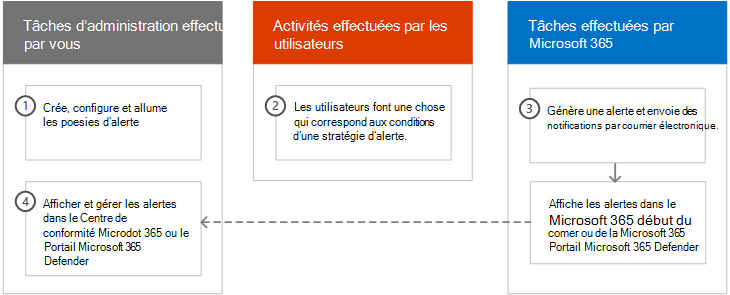
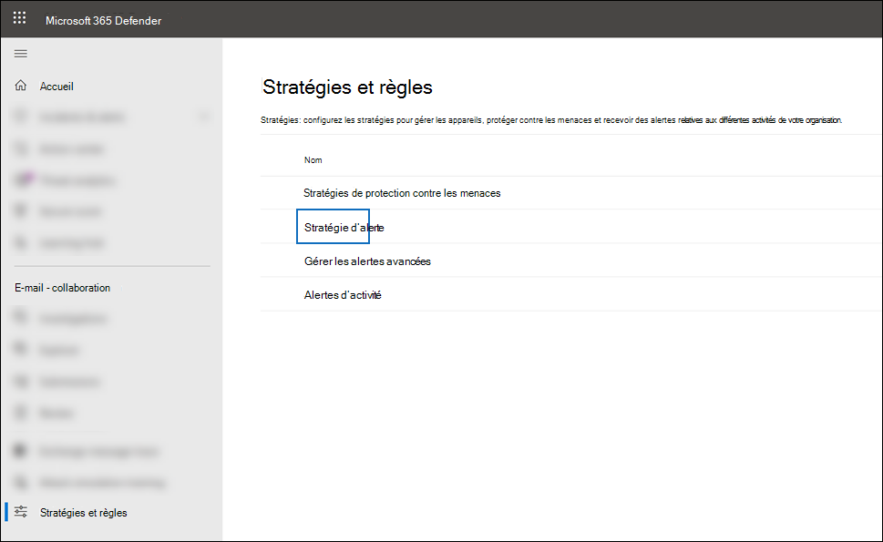
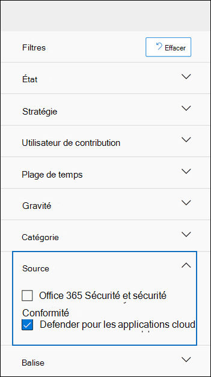

# <a name="alert-policies-in-microsoft-365"></a>Stratégies d’alerte dans Microsoft 365

Vous pouvez utiliser des stratégies d’alerte et le tableau de bord des alertes dans le portail de conformité Microsoft Purview ou le portail Microsoft 365 Defender pour créer des stratégies d’alerte, puis afficher les alertes générées lorsque les utilisateurs effectuent des activités qui correspondent aux conditions d’une stratégie d’alerte. Il existe plusieurs stratégies d’alerte par défaut qui vous aident à surveiller des activités telles que l’attribution de privilèges d’administrateur dans Exchange Online, les attaques de programmes malveillants, les campagnes de hameçonnage et les niveaux inhabituels de suppressions de fichiers et de partage externe.

> [!TIP]
> Accédez à la section [Stratégies d’alerte par défaut](#default-alert-policies) de cet article pour obtenir une liste et une description des stratégies d’alerte disponibles.

Les politiques d'alerte vous permettent de catégoriser les alertes déclenchées par une politique, d'appliquer cette politique à tous les utilisateurs de votre organisation, de définir un niveau de seuil pour le déclenchement d'une alerte et de décider si vous souhaitez recevoir des notifications par courriel lorsque des alertes sont déclenchées. Il existe également une page **Alertes** dans laquelle vous pouvez afficher et filtrer des alertes, définir un état d’alerte pour vous aider à gérer les alertes, puis ignorer les alertes une fois que vous avez résolu ou résolu l’incident sous-jacent.

> [!NOTE]
> Les stratégies d’alerte sont disponibles pour les organisations disposant d’un abonnement Microsoft 365 Entreprise, Office 365 Entreprise ou Office 365 us Government E1/F1/G1, E3/F3/G3 ou E5/G5. Les fonctionnalités avancées sont disponibles uniquement pour les organisations disposant d’un abonnement E5/G5, ou pour les organisations disposant d’un abonnement E1/F1/G1 ou E3/F3/G3 et d’un Microsoft Defender pour Office 365 P2 ou d’un Microsoft 365 E5 Conformité ou d’un abonnement E5 eDiscovery et Audit. La fonctionnalité qui nécessite un abonnement E5/G5 ou un module complémentaire est mise en surbrillance dans cette rubrique. Notez également que les stratégies d’alerte sont disponibles dans Office 365 environnements gcc, GCC High et DoD us government.

## <a name="how-alert-policies-work"></a>Fonctionnement des stratégies d’alerte

Voici une vue d’ensemble rapide du fonctionnement des stratégies d’alerte et des alertes qui se déclenchent lorsque l’activité de l’utilisateur ou de l’administrateur correspond aux conditions d’une stratégie d’alerte.



1. Un administrateur de votre organisation crée, configure et active une stratégie d’alerte à l’aide de la page **Stratégies d’alerte** dans le portail de conformité ou le portail Microsoft 365 Defender. Vous pouvez également créer des stratégies d’alerte à l’aide de l’applet de commande [New-ProtectionAlert](/powershell/module/exchange/new-protectionalert) dans Security & Compliance PowerShell.

   Pour créer des stratégies d’alerte, vous devez disposer du rôle Gérer les alertes ou du rôle Configuration de l’organisation dans le portail de conformité ou le portail Defender.

   > [!NOTE]
   > La création ou la mise à jour d’une stratégie d’alerte prend jusqu’à 24 heures avant que les alertes puissent être déclenchées par la stratégie. Cela est dû au fait que la stratégie doit être synchronisée avec le moteur de détection d’alerte.

2. Un utilisateur effectue une activité qui correspond aux conditions d’une stratégie d’alerte. En cas d’attaques par programme malveillant, les messages électroniques infectés envoyés aux utilisateurs de votre organisation déclenchent une alerte.

3. Microsoft 365 génère une alerte qui s’affiche sur la page **Alertes** dans le portail de conformité ou le portail Defender. En outre, si les notifications par e-mail sont activées pour la stratégie d’alerte, Microsoft envoie une notification à une liste de destinataires. Les alertes qu’un administrateur ou d’autres utilisateurs peuvent voir sur la page Alertes sont déterminées par les rôles attribués à l’utilisateur. Pour plus d’informations, consultez [les autorisations RBAC requises pour afficher les alertes](#rbac-permissions-required-to-view-alerts).

4. Un administrateur gère les alertes dans le portail de conformité Microsoft Purview. La gestion des alertes consiste à attribuer un état d’alerte pour faciliter le suivi et la gestion de toute investigation.

## <a name="alert-policy-settings"></a>Paramètres de stratégie d’alerte

Une politique d'alerte consiste en un ensemble de règles et de conditions qui définissent l'activité de l'utilisateur ou de l'administrateur qui génère une alerte, une liste d'utilisateurs qui déclenchent l'alerte s'ils effectuent l'activité, et un seuil qui définit combien de fois l'activité doit se produire avant qu'une alerte soit déclenchée. Vous classez également la stratégie et lui affectez un niveau de gravité. Ces deux paramètres vous aident à gérer les stratégies d’alerte (et les alertes déclenchées lorsque les conditions de stratégie sont mises en correspondance), car vous pouvez filtrer ces paramètres lors de la gestion des stratégies et de l’affichage des alertes dans le portail de conformité Microsoft Purview. Par exemple, vous pouvez afficher les alertes qui correspondent aux conditions de la même catégorie ou afficher les alertes avec le même niveau de gravité.

Pour afficher et créer des stratégies d’alerte :

- **portail de conformité Microsoft Purview** :

  Accédez au <a href="https://go.microsoft.com/fwlink/p/?linkid=2077149" target="_blank">portail de conformité</a>, puis sélectionnez **stratégies** \> **d’alerte** \> de **stratégies**.

  

- **portail Microsoft 365 Defender** :

  Accédez au <a href="https://go.microsoft.com/fwlink/p/?linkid=2077139" target="_blank">portail Microsoft 365 Defender</a> et, sous **Email & collaboration**, sélectionnez **Stratégies & règles** \> **Stratégie d’alerte**. Vous pouvez également accéder directement à <https://security.microsoft.com/alertpolicies>.

  

> [!NOTE]
> Vous devez disposer du rôle View-Only Gérer les alertes pour afficher les stratégies d’alerte dans le portail de conformité Microsoft Purview ou le portail Microsoft 365 Defender. Le rôle Gérer les alertes doit vous être attribué pour créer et modifier des stratégies d’alerte. Pour plus d’informations, consultez la rubrique [Autorisations dans le portail de conformité Microsoft Purview](microsoft-365-compliance-center-permissions.md).

Une stratégie d’alerte se compose des paramètres et conditions suivants.

- **Activité suivie par l’alerte**. Vous créez une stratégie pour suivre une activité ou, dans certains cas, quelques activités connexes, telles que le partage d’un fichier avec un utilisateur externe en le partageant, en lui attribuant des autorisations d’accès ou en créant un lien anonyme. Lorsqu’un utilisateur effectue l’activité définie par la stratégie, une alerte est déclenchée en fonction des paramètres de seuil d’alerte.

    > [!NOTE]
    > Les activités que vous pouvez suivre dépendent du Office 365 Entreprise ou Office 365 plan du gouvernement des États-Unis de votre organisation. En général, les activités liées aux campagnes de programmes malveillants et aux attaques par hameçonnage nécessitent un abonnement E5/G5 ou un abonnement E1/F1/G1 ou E3/F3/G3 avec un abonnement [de module complémentaire Defender pour Office 365](../security/office-365-security/defender-for-office-365.md) Plan 2.

- **Conditions d’activité**. Pour la plupart des activités, vous pouvez définir des conditions supplémentaires qui doivent être remplies pour déclencher une alerte. Les conditions courantes incluent les adresses IP (de sorte qu’une alerte est déclenchée quand l’utilisateur effectue l’activité sur un ordinateur avec une adresse IP spécifique ou dans une plage d’adresses IP), si une alerte est déclenchée si un utilisateur ou un utilisateur spécifique effectue cette activité, et si l’activité est effectuée sur un nom de fichier ou une URL spécifique. Vous pouvez également configurer une condition qui déclenche une alerte lorsque l’activité est effectuée par n’importe quel utilisateur de votre organisation. Les conditions disponibles dépendent de l’activité sélectionnée.

Vous pouvez également définir des balises utilisateur comme condition d’une stratégie d’alerte. Cela entraîne les alertes déclenchées par la stratégie pour inclure le contexte de l’utilisateur concerné. Vous pouvez utiliser des balises utilisateur système ou des balises utilisateur personnalisées. Pour plus d’informations, consultez [les balises utilisateur dans Microsoft Defender pour Office 365](/microsoft-365/security/office-365-security/user-tags).

- **Lorsque l’alerte est déclenchée**. Vous pouvez configurer un paramètre qui définit la fréquence à laquelle une activité peut se produire avant le déclenchement d’une alerte. Cela vous permet de configurer une stratégie pour générer une alerte chaque fois qu’une activité correspond aux conditions de stratégie, lorsqu’un certain seuil est dépassé ou lorsque l’occurrence de l’activité suivie par l’alerte devient inhabituelle pour votre organisation.

    

    Si vous sélectionnez le paramètre en fonction d’une activité inhabituelle, Microsoft établit une valeur de base qui définit la fréquence normale de l’activité sélectionnée. L’établissement de cette base de référence prend jusqu’à sept jours, pendant lesquels les alertes ne seront pas générées. Une fois la base de référence établie, une alerte est déclenchée lorsque la fréquence de l’activité suivie par la stratégie d’alerte dépasse considérablement la valeur de base de référence. Pour les activités liées à l’audit (telles que les activités de fichiers et de dossiers), vous pouvez établir une base de référence basée sur un seul utilisateur ou sur tous les utilisateurs de votre organisation ; pour les activités liées aux programmes malveillants, vous pouvez établir une base de référence basée sur une famille de programmes malveillants unique, un seul destinataire ou tous les messages de votre organisation.

    > [!NOTE]
    > La possibilité de configurer des stratégies d’alerte en fonction d’un seuil ou d’une activité inhabituelle nécessite un abonnement E5/G5, ou un abonnement E1/F1/G1 ou E3/F3/G3 avec un abonnement P2, Microsoft 365 E5 Conformité ou Microsoft 365 eDiscovery et Audit complémentaire Microsoft Defender pour Office 365. Les organisations disposant d’un abonnement E1/F1/G1 et E3/F3/G3 peuvent uniquement créer des stratégies d’alerte lorsqu’une alerte est déclenchée chaque fois qu’une activité se produit.

- **Catégorie d’alerte**. Pour faciliter le suivi et la gestion des alertes générées par une stratégie, vous pouvez affecter l’une des catégories suivantes à une stratégie.

  - Protection contre la perte de données
  - Gouvernance des informations
  - Flux de messagerie
  - Autorisations
  - Gestion des menaces
  - Autres

  Lorsqu’une activité correspond aux conditions de la stratégie d’alerte, l’alerte générée est marquée avec la catégorie définie dans ce paramètre. Cela vous permet de suivre et de gérer les alertes qui ont le même paramètre de catégorie sur la page **Alertes** dans le portail Microsoft Purview, car vous pouvez trier et filtrer les alertes en fonction de la catégorie.

- **Gravité de l’alerte**. Comme pour la catégorie d’alerte, vous attribuez un attribut de gravité (**Faible**, **Moyen**, **Élevé** ou **Informationnel**) aux stratégies d’alerte. Comme pour la catégorie d'alerte, lorsqu'une activité correspondant aux conditions de la politique d'alerte se produit, l'alerte générée est étiquetée avec le même niveau de gravité que celui défini pour la politique d'alerte. Là encore, cela vous permet de suivre et de gérer les alertes qui ont le même paramètre de gravité sur la page **Alertes** . Par exemple, vous pouvez filtrer la liste des alertes afin que seules les alertes avec une gravité **élevée** soient affichées.

    > [!TIP]
    > Lors de la configuration d’une stratégie d’alerte, envisagez d’attribuer une gravité plus élevée aux activités qui peuvent entraîner des conséquences sévèrement négatives, telles que la détection de programmes malveillants après la remise aux utilisateurs, l’affichage de données sensibles ou classifiées, le partage de données avec des utilisateurs externes ou d’autres activités pouvant entraîner une perte de données ou des menaces de sécurité. Cela peut vous aider à hiérarchiser les alertes et les actions que vous effectuez pour examiner et résoudre les causes sous-jacentes.

- **Investigations automatisées**. Certaines alertes déclenchent des investigations automatisées pour identifier les menaces et les risques potentiels qui nécessitent une correction ou une atténuation. Dans la plupart des cas, ces alertes sont déclenchées par la détection d’e-mails ou d’activités malveillants, mais dans certains cas, les alertes sont déclenchées par des actions de l’administrateur dans le portail de sécurité. Pour plus d’informations sur les enquêtes automatisées, consultez Air [(Automated Investigation and Response) dans Microsoft Defender pour Office 365](../security/office-365-security/office-365-air.md).

- **Email notifications**. Vous pouvez configurer la stratégie afin que les notifications par e-mail soient envoyées (ou non) à une liste d’utilisateurs lorsqu’une alerte est déclenchée. Vous pouvez également définir une limite de notification quotidienne afin qu’une fois le nombre maximal de notifications atteint, aucune notification supplémentaire ne soit envoyée pour l’alerte au cours de cette journée. En plus des notifications par e-mail, vous ou d’autres administrateurs pouvez afficher les alertes déclenchées par une stratégie sur la page **Alertes** . Envisagez d’activer les notifications par e-mail pour les stratégies d’alerte d’une catégorie spécifique ou qui ont un paramètre de gravité plus élevé.

## <a name="default-alert-policies"></a>Stratégies d’alerte par défaut

Microsoft fournit des stratégies d’alerte intégrées qui permettent d’identifier les abus d’autorisations d’administrateur Exchange, l’activité des programmes malveillants, les menaces externes et internes potentielles et les risques de gouvernance des informations. Dans la page **Stratégies d’alerte** , les noms de ces stratégies intégrées sont en gras et le type de stratégie est défini comme **système**. Ces stratégies sont activées par défaut. Vous pouvez désactiver ces stratégies (ou revenir en arrière), configurer une liste de destinataires pour envoyer des notifications par e-mail et définir une limite de notification quotidienne. Les autres paramètres de ces stratégies ne peuvent pas être modifiés.

Les tableaux suivants répertorient et décrivent les stratégies d’alerte par défaut disponibles et la catégorie à laquelle chaque stratégie est affectée. La catégorie est utilisée pour déterminer les alertes qu’un utilisateur peut afficher sur la page Alertes. Pour plus d’informations, consultez [les autorisations RBAC requises pour afficher les alertes](#rbac-permissions-required-to-view-alerts).

Les tableaux indiquent également les Office 365 Entreprise et Office 365 plan du gouvernement des États-Unis requis pour chacun d’eux. Certaines stratégies d’alerte par défaut sont disponibles si votre organisation dispose de l’abonnement de module complémentaire approprié en plus d’un abonnement E1/F1/G1 ou E3/F3/G3.

> [!NOTE]
> L’activité inhabituelle surveillée par certaines des stratégies intégrées est basée sur le même processus que le paramètre de seuil d’alerte décrit précédemment. Microsoft établit une valeur de base qui définit la fréquence normale pour l’activité « habituelle ». Les alertes sont ensuite déclenchées lorsque la fréquence des activités suivies par la stratégie d’alerte intégrée dépasse considérablement la valeur de référence.

### <a name="information-governance-alert-policies"></a>Stratégies d’alerte de gouvernance des informations

|Nom|Description|Severity|Investigation automatisée|Abonnement Entreprise|
|---|---|---|---|---|
|**Activité inhabituelle des fichiers utilisateur externes**|Génère une alerte lorsqu’un nombre anormalement élevé d’activités sont effectuées sur des fichiers dans SharePoint ou OneDrive par des utilisateurs extérieurs à votre organisation. Cela inclut des activités telles que l’accès aux fichiers, le téléchargement de fichiers et la suppression de fichiers.|Élevé|Non|Abonnement E5/G5, Microsoft Defender pour Office 365 P2 ou Microsoft 365 E5 module complémentaire|
|**Volume inhabituel de partage de fichiers externes**|Génère une alerte lorsqu’un nombre anormalement élevé de fichiers dans SharePoint ou OneDrive est partagé avec des utilisateurs extérieurs à votre organisation.|Moyen|Non|Abonnement E5/G5, Defender pour Office 365 P2 ou Microsoft 365 E5 module complémentaire|
|**Volume inhabituel de suppression de fichier**|Génère une alerte lorsqu’un nombre anormalement élevé de fichiers est supprimé dans SharePoint ou OneDrive dans un laps de temps court.|Moyen|Non|Abonnement E5/G5, Defender pour Office 365 P2 ou Microsoft 365 E5 module complémentaire|

### <a name="mail-flow-alert-policies"></a>Stratégies d’alerte de flux de courrier

|Nom|Description|Severity|Investigation automatisée|Abonnement Entreprise|
|---|---|---|---|---|
|**Les messages ont été retardés**|Génère une alerte quand Microsoft ne peut pas remettre de messages électroniques à votre organisation locale ou à un serveur partenaire à l’aide d’un connecteur. Dans ce cas, le message est mis en file d’attente dans Office 365. Cette alerte est déclenchée quand 2 000 messages ou plus sont mis en file d’attente depuis plus d’une heure.|Élevé|Non|E1/F1/G1, E3/F3/G3 ou E5/G5|

### <a name="permissions-alert-policies"></a>Stratégies d’alerte d’autorisations

|Nom|Description|Severity|Investigation automatisée|Abonnement Entreprise|
|---|---|---|---|---|
|**Élévation du privilège d’administrateur Exchange**|Génère une alerte lorsqu’une personne reçoit des autorisations d’administration dans votre organisation Exchange Online. Par exemple, lorsqu’un utilisateur est ajouté au groupe de rôles Gestion de l’organisation dans Exchange Online.|Faible|Non|E1/F1/G1, E3/F3/G3 ou E5/G5|

### <a name="threat-management-alert-policies"></a>Stratégies d’alerte de gestion des menaces

> [!NOTE]
> Nous avons temporairement supprimé le **phish remis en raison du remplacement du locataire ou de l’utilisateur** et du **hameçonnage d’emprunt d’identité de l’utilisateur remis aux stratégies d’alerte par défaut de boîte de réception/dossier** en fonction des commentaires des clients. Nous nous efforçons de les améliorer et nous les remplacerons par de nouvelles versions. En attendant, vous pouvez créer des stratégies d’alerte personnalisées pour remplacer leurs fonctionnalités en utilisant les conditions suivantes :
>
> - **Activité :** e-mail d’hameçonnage détecté au moment de la remise
> - **Le courrier n’est pas ZAP’d**
> - **La direction du courrier est** : Entrant
> - **L’état de remise du courrier est** : Remis
> - **La technologie de détection est la suivante** :
>   - Pour répliquer **phish remis en raison d’un remplacement de locataire ou d’utilisateur** : rétention d’URL malveillante, détonation d’URL, filtre de hameçonnage avancé, filtre de hameçonnage général, emprunt d’identité de domaine, emprunt d’identité d’utilisateur et emprunt d’identité de marque.
>   - Pour répliquer **le phish d’emprunt d’identité de l’utilisateur remis à la boîte de réception/dossier** : emprunt d’identité de l’utilisateur
>
> Pour plus d’informations sur la lutte contre le hameçonnage dans Office 365, consultez Configurer les stratégies [anti-hameçonnage et anti-hameçonnage](../security/office-365-security/set-up-anti-phishing-policies.md).

|Nom|Description|Severity|Investigation automatisée|Abonnement Entreprise|
|---|---|---|---|---|
|**Un clic d’URL potentiellement malveillant a été détecté**|Génère une alerte lorsqu’un utilisateur protégé par [des liens fiables](/microsoft-365/security/office-365-security/safe-links) dans votre organisation clique sur un lien malveillant. Cette alerte est générée lorsqu’un utilisateur clique sur un lien et que cet événement déclenche une identification de changement de verdict d’URL par Microsoft Defender pour Office 365. Cette alerte déclenche automatiquement une [investigation et une réponse automatisées dans Office 365](/microsoft-365/security/office-365-security/office-365-air). Pour plus d’informations sur les événements qui déclenchent cette alerte, consultez [Configurer des stratégies de liens fiables](/microsoft-365/security/office-365-security/set-up-safe-links-policies).|Élevé|Oui|Abonnement au module complémentaire E5/G5 ou Defender pour Office 365 P2|
|**Un utilisateur a cliqué sur une URL potentiellement malveillante**|Génère une alerte lorsqu’un utilisateur protégé par [des liens fiables](/microsoft-365/security/office-365-security/safe-links) dans votre organisation clique sur un lien malveillant. Cet événement est déclenché lorsque l’utilisateur clique sur une URL (identifiée comme malveillante ou en attente de validation) et remplace la page d’avertissement Liens sécurisés (en fonction de la stratégie De liens sécurisés Microsoft 365 pour les entreprises de votre organisation) pour continuer à accéder à la page /contenu hébergé par l’URL. Pour Defender pour Office 365 clients P2, E5 et G5, cette alerte déclenche automatiquement une [investigation et une réponse automatisées dans Office 365](/microsoft-365/security/office-365-security/office-365-air). Pour plus d’informations sur les événements qui déclenchent cette alerte, consultez [Configurer des stratégies de liens fiables](/microsoft-365/security/office-365-security/set-up-safe-links-policies).|Élevé|Oui|Abonnement au module complémentaire E5/G5 ou Defender pour Office 365 P2|
|**Administration résultat de l’envoi terminé**|Génère une alerte lorsqu’une [soumission Administration](../security/office-365-security/admin-submission.md) termine la nouvelle analyse de l’entité envoyée. Une alerte est déclenchée chaque fois qu’un résultat de nouvelle analyse est rendu à partir d’une soumission Administration. <br/><br/> Ces alertes sont destinées à vous rappeler [de passer en revue les résultats des soumissions précédentes](https://compliance.microsoft.com/reportsubmission), d’envoyer des messages signalés par l’utilisateur pour obtenir les derniers verdicts de vérification et de nouvelle analyse de stratégie, et de vous aider à déterminer si les stratégies de filtrage de votre organisation ont l’impact prévu.|Informatif|Non|E1/F1, E3/F3 ou E5|
|**Administration déclenché une investigation manuelle de l’e-mail**|Génère une alerte lorsqu’un administrateur déclenche l’examen manuel d’un e-mail à partir de l’Explorateur de menaces. Pour plus d’informations, consultez [Exemple : un administrateur de sécurité déclenche une enquête à partir de l’Explorateur de menaces](../security/office-365-security/automated-investigation-response-office.md#example-a-security-administrator-triggers-an-investigation-from-threat-explorer). <br/><br/> Cette alerte informe votre organisation que l’enquête a été démarrée. L’alerte fournit des informations sur les personnes qui l’ont déclenchée et inclut un lien vers l’enquête.|Informatif|Oui|Abonnement aux modules complémentaires E5/G5 ou Microsoft Defender pour Office 365 P2|
|**Administration l’examen de compromission de l’utilisateur a été déclenché**|Génère une alerte lorsqu’un administrateur déclenche l’examen manuel de compromission utilisateur d’un expéditeur ou d’un destinataire de l’Explorateur de menaces. Pour plus d’informations, consultez [Exemple : un administrateur de sécurité déclenche une enquête à partir de l’Explorateur de menaces](../security/office-365-security/automated-investigation-response-office.md#example-a-security-administrator-triggers-an-investigation-from-threat-explorer), qui montre le déclenchement manuel associé d’une enquête sur un e-mail. Cette alerte avertit votre organisation que l’enquête de compromission de l’utilisateur a été démarrée. <br/><br/> L’alerte fournit des informations sur les personnes qui l’ont déclenchée et inclut un lien vers l’enquête.|Moyen|Oui|Abonnement aux modules complémentaires E5/G5 ou Microsoft Defender pour Office 365 P2|
|**Action administrative soumise par un administrateur**|Les administrateurs peuvent effectuer des actions de messagerie manuelles sur des entités de messagerie à l’aide de différentes surfaces. Par exemple, l’Explorateur de menaces, la chasse avancée ou la détection personnalisée. Lorsque la correction démarre, elle génère une alerte. Cette alerte s’affiche dans la file d’attente d’alertes avec le nom **Action d’administration envoyée par un administrateur** pour indiquer qu’un administrateur a pris l’action de corriger une entité. L’alerte contient des détails tels que le type d’action, le lien d’investigation de prise en charge, l’heure, etc. Il est utile de savoir chaque fois qu’une action sensible telle que la correction est effectuée sur des entités.|Informatif|Oui|Abonnement au module complémentaire E5/G5 ou Defender pour Office 365 P2|
|**Création de règle de redirection/transfert**|Génère une alerte lorsqu’une personne de votre organisation crée une règle de boîte de réception pour sa boîte aux lettres qui transfère ou redirige les messages vers un autre compte de messagerie. Cette stratégie effectue uniquement le suivi des règles de boîte de réception créées à l’aide de Outlook sur le web (anciennement Outlook Web App) ou Exchange Online PowerShell. Pour plus d’informations sur l’utilisation de règles de boîte de réception pour transférer et rediriger des e-mails dans Outlook sur le web, consultez [Les règles d’utilisation dans Outlook sur le web pour transférer automatiquement les messages vers un autre compte](https://support.office.com/article/1433e3a0-7fb0-4999-b536-50e05cb67fed).|Informatif|Non|E1/F1/G1, E3/F3/G3 ou E5/G5|
|**Recherche eDiscovery démarrée ou exportée**|Génère une alerte lorsqu’une personne utilise l’outil de recherche de contenu dans le portail Microsoft Purview. Une alerte est déclenchée lorsque les activités de recherche de contenu suivantes sont effectuées : <br><br> <li> Une recherche de contenu est démarrée <li> Les résultats d’une recherche de contenu sont exportés <li> Un rapport de recherche de contenu est exporté <br><br> Des alertes sont également déclenchées lorsque les activités de recherche de contenu précédentes sont effectuées en association avec un cas eDiscovery. Pour plus d’informations sur les activités de recherche de contenu, consultez [Rechercher des activités eDiscovery dans le journal d’audit](search-for-ediscovery-activities-in-the-audit-log.md#ediscovery-activities).|Informatif|Non|E1/F1/G1, E3/F3/G3 ou E5/G5|
|**Messages de courrier contenant un fichier malveillant supprimé après la remise**|Génère une alerte quand tous les messages contenant un fichier malveillant sont remis aux boîtes aux lettres de votre organisation. Si cet événement se produit, Microsoft supprime les messages infectés des boîtes aux lettres Exchange Online à l’aide du [vidage automatique de zéro heure](../security/office-365-security/zero-hour-auto-purge.md). Cette stratégie déclenche automatiquement une [investigation et une réponse automatisées dans Office 365](../security/office-365-security/office-365-air.md). Pour plus d’informations sur cette nouvelle stratégie, consultez [Nouvelles stratégies d’alerte dans Microsoft Defender pour Office 365](new-defender-alert-policies.md).|Informatif|Oui|Abonnement aux modules complémentaires E5/G5 ou Microsoft Defender pour Office 365 P2|
|**Messages de courrier contenant une URL malveillante supprimée après la remise**|Génère une alerte quand les messages contenant une URL malveillante sont remis aux boîtes aux lettres de votre organisation. Si cet événement se produit, Microsoft supprime les messages infectés des boîtes aux lettres Exchange Online à l’aide du [vidage automatique de zéro heure](../security/office-365-security/zero-hour-auto-purge.md). Cette stratégie déclenche automatiquement une [investigation et une réponse automatisées dans Office 365](../security/office-365-security/office-365-air.md). Pour plus d’informations sur cette nouvelle stratégie, consultez [Nouvelles stratégies d’alerte dans Microsoft Defender pour Office 365](new-defender-alert-policies.md).|Informatif|Oui|Abonnement au module complémentaire E5/G5 ou Defender pour Office 365 P2|
|**Messages de courrier contenant un programme malveillant supprimé après la remise**|**Remarque** : cette stratégie d’alerte a été remplacée par **Email messages contenant un fichier malveillant supprimé après la remise**. Cette stratégie d’alerte disparaîtra. Nous vous recommandons donc de désactiver cette stratégie d’alerte et d’utiliser **Email messages contenant un fichier malveillant supprimé après la remise**. Pour plus d’informations, consultez [Nouvelles stratégies d’alerte dans Microsoft Defender pour Office 365](new-defender-alert-policies.md).|Informatif|Oui|Abonnement aux modules complémentaires E5/G5 ou Microsoft Defender pour Office 365 P2|
|**Messages de courrier contenant des URL d’hameçonnage supprimées après la remise**|**Remarque** : cette stratégie d’alerte a été remplacée par **Email messages contenant une URL malveillante supprimée après la remise**. Cette stratégie d’alerte disparaîtra. Nous vous recommandons donc de désactiver cette stratégie d’alerte et d’utiliser **Email messages contenant une URL malveillante supprimée après la remise**. Pour plus d’informations, consultez [Nouvelles stratégies d’alerte dans Microsoft Defender pour Office 365](new-defender-alert-policies.md).|Informatif|Oui|Abonnement au module complémentaire E5/G5 ou Defender pour Office 365 P2|
|**Email messages d’une campagne supprimés après la remise**|Génère une alerte quand tous les messages associés à une [campagne](../security/office-365-security/campaigns.md) sont remis aux boîtes aux lettres de votre organisation. Si cet événement se produit, Microsoft supprime les messages infectés des boîtes aux lettres Exchange Online à l’aide du [vidage automatique de zéro heure](../security/office-365-security/zero-hour-auto-purge.md). Cette stratégie déclenche automatiquement une [investigation et une réponse automatisées dans Office 365](../security/office-365-security/office-365-air.md). Pour plus d’informations sur cette nouvelle stratégie, consultez [Nouvelles stratégies d’alerte dans Microsoft Defender pour Office 365](new-defender-alert-policies.md).|Informatif|Oui|Abonnement au module complémentaire E5/G5 ou Defender pour Office 365 P2|
|**Messages électroniques supprimés après la remise**|Génère une alerte quand des messages malveillants qui ne contiennent pas d’entité malveillante (URL ou fichier) ou associés à une campagne sont remis aux boîtes aux lettres de votre organisation. Si cet événement se produit, Microsoft supprime les messages infectés des boîtes aux lettres Exchange Online à l’aide du [vidage automatique de zéro heure](../security/office-365-security/zero-hour-auto-purge.md). Cette stratégie déclenche automatiquement une [investigation et une réponse automatisées dans Office 365](../security/office-365-security/office-365-air.md). Pour plus d’informations sur cette nouvelle stratégie, consultez [Nouvelles stratégies d’alerte dans Microsoft Defender pour Office 365](new-defender-alert-policies.md).|Informatif|Oui|Abonnement au module complémentaire E5/G5 ou Defender pour Office 365 P2|
|**E-mail signalé par l’utilisateur en tant que programme malveillant ou hameçonnage**|Génère une alerte lorsque les utilisateurs de votre organisation signalent des messages en tant qu’e-mail de hameçonnage à l’aide du complément Message de rapport. Pour plus d’informations sur ce complément, consultez [Utiliser le complément Message de rapport](https://support.office.com/article/b5caa9f1-cdf3-4443-af8c-ff724ea719d2). Pour Defender pour Office 365 clients P2, E5 et G5, cette alerte déclenche automatiquement une [investigation et une réponse automatisées dans Office 365](../security/office-365-security/office-365-air.md).|Faible|Oui|E1/F1/G1, E3/F3/G3 ou E5/G5|
|**Email limite d’envoi dépassée**|Génère une alerte lorsqu’une personne de votre organisation a envoyé plus de courriers que ce qui est autorisé par la stratégie de courrier indésirable sortant. Cela indique généralement que l’utilisateur envoie trop d’e-mails ou que le compte peut être compromis. Si vous recevez une alerte générée par cette stratégie d’alerte, il est judicieux de [vérifier si le compte d’utilisateur est compromis](../security/office-365-security/responding-to-a-compromised-email-account.md).|Moyen|Non|E1/F1/G1, E3/F3/G3 ou E5/G5|
|**Formulaire bloqué en raison d’une tentative d’hameçonnage potentielle**|Génère une alerte lorsqu’une personne de votre organisation a été empêchée de partager des formulaires et de collecter des réponses à l’aide de Microsoft Forms en raison d’un comportement de tentative d’hameçonnage répété détecté.|Élevé|Non|E1, E3/F3 ou E5|
|**Formulaire marqué d'un indicateur et confirmé comme hameçonnage**|Génère une alerte lorsqu’un formulaire créé dans Microsoft Forms à partir de votre organisation a été identifié comme hameçonnage potentiel par le biais d’abus de rapports et confirmé comme hameçonnage par Microsoft.|Élevé|Non|E1, E3/F3 ou E5|
|**HVE Un clic d’URL potentiellement malveillant a été détecté**|Génère une alerte lorsqu’une personne marquée comme [un compte Priority](../admin/setup/priority-accounts.md) clique sur un lien malveillant. Cet événement est déclenché lorsque l’utilisateur clique sur une URL identifiée comme malveillante ou en attente de validation, et remplace la page d’avertissement Liens fiables pour continuer à l’URL ou au contenu d’origine (en fonction des paramètres de stratégie Liens fiables de votre organisation). Cet événement déclenche une identification de changement de verdict d’URL par Microsoft Defender pour Office 365. <br/><br/> Pour Defender pour Office 365 clients P2, E5 et G5, cette alerte déclenche automatiquement une [investigation et une réponse automatisées](/microsoft-365/security/office-365-security/office-365-air). Pour plus d’informations, consultez [les balises utilisateur dans Microsoft Defender pour Office 365](../security/office-365-security/user-tags.md) et [configurez des stratégies liens sécurisés](/microsoft-365/security/office-365-security/set-up-safe-links-policies).|Élevé|Non|E1/F1, E3/F3 ou E5|
|**Une campagne de programmes malveillants a été détectée après la remise**|Génère une alerte lorsqu’un nombre anormalement élevé de messages contenant des programmes malveillants est remis aux boîtes aux lettres de votre organisation. Si cet événement se produit, Microsoft supprime les messages infectés des boîtes aux lettres Exchange Online.|Élevé|Non|Abonnement aux modules complémentaires E5/G5 ou Microsoft Defender pour Office 365 P2|
|**Une campagne de programmes malveillants a été détectée et bloquée**|Génère une alerte lorsqu’une personne tente d’envoyer un nombre anormalement élevé de messages électroniques contenant un certain type de programmes malveillants aux utilisateurs de votre organisation. Si cet événement se produit, les messages infectés sont bloqués par Microsoft et ne sont pas remis aux boîtes aux lettres.|Faible|Non|Abonnement au module complémentaire E5/G5 ou Defender pour Office 365 P2|
|**Campagne de programmes malveillants détectée dans SharePoint et OneDrive**|Génère une alerte lorsqu’un volume anormalement élevé de programmes malveillants ou de virus est détecté dans des fichiers situés dans des sites SharePoint ou des comptes OneDrive de votre organisation.|Élevé|Non|Abonnement au module complémentaire E5/G5 ou Defender pour Office 365 P2|
|**Programme malveillant non invalidé car ZAP est désactivé**| Génère une alerte lorsque Microsoft détecte la remise d’un message malveillant à une boîte aux lettres, car Zero-Hour vidage automatique des messages phish est désactivé.|Informatif|Non|Abonnement au module complémentaire E5/G5 ou Defender pour Office 365 P2|
|**Messages contenant une entité malveillante non supprimée après la remise**|Génère une alerte quand tout message contenant du contenu malveillant (fichier, URL, campagne, aucune entité) est remis aux boîtes aux lettres de votre organisation. Si cet événement se produit, Microsoft a tenté de supprimer les messages infectés de Exchange Online boîtes aux lettres à l’aide du [vidage automatique de zéro heure](../security/office-365-security/zero-hour-auto-purge.md), mais le message n’a pas été supprimé en raison d’un échec. Une investigation supplémentaire est recommandée. Cette stratégie déclenche automatiquement une [investigation et une réponse automatisées dans Office 365](../security/office-365-security/office-365-air.md).|Moyen|Oui|Abonnement au module complémentaire E5/G5 ou Defender pour Office 365 P2|
|**Hameçonnage remis parce que le dossier Courrier indésirable d’un utilisateur est désactivé**|**Remarque** : cette stratégie d’alerte est en cours de dépréciation. Les paramètres de boîte aux lettres ne déterminent plus si les messages détectés peuvent être déplacés vers le dossier Junk Email. Pour plus d’informations, voir [Configurer les paramètres du courrier indésirable sur les boîtes aux lettres Exchange Online](/microsoft-365/security/office-365-security/configure-junk-email-settings-on-exo-mailboxes).|Informatif|Non|E1/F1/G1, E3/F3/G3 ou E5/G5|
|**Phish livré en raison d’un remplacement ETR**|Génère une alerte quand Microsoft détecte une règle de transport Exchange (également appelée règle de flux de messagerie) qui a autorisé la remise d’un message de hameçonnage à haut niveau de confiance à une boîte aux lettres. Pour plus d’informations sur les règles de transport Exchange (règles de flux de messagerie), consultez [les règles de flux de courrier (règles de transport) dans Exchange Online](/exchange/security-and-compliance/mail-flow-rules/mail-flow-rules).|Informatif|Non|E1/F1/G1, E3/F3/G3 ou E5/G5|
|**Phish remis en raison d’une stratégie d’autorisation IP**|Génère une alerte lorsque Microsoft détecte une stratégie d’autorisation IP qui a autorisé la remise d’un message de hameçonnage à haut niveau de confiance à une boîte aux lettres. Pour plus d’informations sur la stratégie d’autorisation IP (filtrage de connexion), consultez [Configurer la stratégie de filtre de connexion par défaut - Office 365](../security/office-365-security/configure-the-connection-filter-policy.md).|Informatif|Non|E1/F1/G1, E3/F3/G3 ou E5/G5|
|**Le hameçonnage n’est pas zappé, car ZAP est désactivé**|Génère une alerte lorsque Microsoft détecte la remise d’un message de hameçonnage à haut niveau de confiance à une boîte aux lettres, car Zero-Hour vidage automatique des messages phish est désactivé.|Informatif|Non|Abonnement au module complémentaire E5/G5 ou Defender pour Office 365 P2|
|**Activité potentielle de l’État-nation**|Microsoft Threat Intelligence Center a détecté une tentative de compromission de comptes à partir de votre locataire.|Élevé|Non|Abonnement au module complémentaire E5/G5 ou Defender pour Office 365 P2|
|**Action de correction effectuée par l’administrateur sur les e-mails, l’URL ou l’expéditeur**|**Remarque** : cette stratégie d’alerte a été remplacée par **l’action d’administration envoyée par une stratégie d’alerte administrateur** . Cette stratégie d’alerte disparaîtra. Nous vous recommandons donc de désactiver cette stratégie d’alerte et d’utiliser **l’action d’administration envoyée par un administrateur à la** place. <br/><br/> Cette alerte est déclenchée lorsqu’un administrateur effectue une action de correction sur l’entité sélectionnée|Informatif|Oui|Abonnement au module complémentaire E5/G5 ou Defender pour Office 365 P2|
|**Activité suspecte du connecteur**|Génère une alerte lorsqu’une activité suspecte est détectée sur un connecteur entrant dans votre organisation. Le courrier n’est pas autorisé à utiliser le connecteur entrant. L’administrateur reçoit une notification par e-mail et une alerte. Cette alerte fournit des conseils sur la façon d’examiner, de rétablir les modifications et de débloquer un connecteur restreint. Pour savoir comment répondre à cette alerte, consultez [Répondre à un connecteur compromis](/microsoft-365/security/office-365-security/respond-compromised-connector).|Élevé|Non|E1/F1/G1, E3/F3/G3 ou E5/G5|
|**Activité suspecte de transfert d’e-mail**|Génère une alerte lorsqu’une personne de votre organisation a envoyé automatiquement un e-mail à un compte externe suspect. Il s’agit d’un avertissement précoce pour le comportement qui peut indiquer que le compte est compromis, mais pas assez grave pour restreindre l’utilisateur. Bien qu’il soit rare, une alerte générée par cette stratégie peut être une anomalie. Il est judicieux de [vérifier si le compte d’utilisateur est compromis](../security/office-365-security/responding-to-a-compromised-email-account.md).|Élevé|Non|E1/F1/G1, E3/F3/G3 ou E5/G5|
|**Modèles d’envoi de courrier suspect détectés**|Génère une alerte lorsqu’une personne de votre organisation a envoyé un e-mail suspect et risque d’être empêchée d’envoyer des e-mails. Il s’agit d’un avertissement précoce pour le comportement qui peut indiquer que le compte est compromis, mais pas assez grave pour restreindre l’utilisateur. Bien qu’il soit rare, une alerte générée par cette stratégie peut être une anomalie. Toutefois, il est judicieux de [vérifier si le compte d’utilisateur est compromis](../security/office-365-security/responding-to-a-compromised-email-account.md).|Moyen|Oui|E1/F1/G1, E3/F3/G3 ou E5/G5|
|**L’entrée d’autorisation/liste de blocage du locataire est sur le point d’expirer**|Génère une alerte lorsqu’une entrée d’autorisation/de liste de blocage de locataire est sur le point d’être supprimée. Cet événement est déclenché trois jours avant la date d’expiration, qui est basée sur la création ou la dernière mise à jour de l’entrée. <br/><br/> Pour les blocs, vous pouvez étendre la date d’expiration pour conserver le bloc en place. Pour autoriser, vous devez soumettre à nouveau l’élément afin que nos analystes puissent prendre un autre regard. Toutefois, si l’autorisation a déjà été notée comme faux positif, l’entrée n’expire que lorsque les filtres système ont été mis à jour pour autoriser naturellement l’entrée. Pour plus d’informations sur les événements qui déclenchent cette alerte, consultez [Manage the Tenant Allow/Block list](../security/office-365-security/tenant-allow-block-list.md).|Informatif|Non|Abonnement au module complémentaire E5/G5 ou Defender pour Office 365 P2|
|**Locataire limité à l’envoi de courrier électronique**|Génère une alerte lorsque la majeure partie du trafic de messagerie de votre organisation a été détectée comme suspecte et que Microsoft a empêché votre organisation d’envoyer des e-mails. Examinez les comptes d’utilisateur et d’administrateur potentiellement compromis, les nouveaux connecteurs ou les relais ouverts, puis contactez Support Microsoft pour débloquer votre organisation. Pour plus d’informations sur la raison pour laquelle les organisations sont bloquées, consultez [Corriger les problèmes de remise des e-mails pour le code d’erreur 5.7.7xx dans Exchange Online](/Exchange/mail-flow-best-practices/non-delivery-reports-in-exchange-online/fix-error-code-5-7-700-through-5-7-750).|Élevé|Non|E1/F1/G1, E3/F3/G3 ou E5/G5|
|**Le locataire est limité à l’envoi d’e-mails non approvisionnés**|Génère une alerte en cas d’envoi d’un trop grand nombre d’e-mails à partir de domaines non inscrits (également appelés domaines _non approvisionnés_ ). Office 365 autorise l'envoi d'un certain nombre d'e-mails à partir de domaines non enregistrés, mais nous vous recommandons de configurer chaque domaine utilisé pour envoyer du courrier en tant que domaine accepté. Cette alerte indique que tous les utilisateurs de l’organisation ne peuvent plus envoyer de courrier électronique. Pour plus d’informations sur la raison pour laquelle les organisations sont bloquées, consultez [Corriger les problèmes de remise des e-mails pour le code d’erreur 5.7.7xx dans Exchange Online](/Exchange/mail-flow-best-practices/non-delivery-reports-in-exchange-online/fix-error-code-5-7-700-through-5-7-750).|Élevé|Non|E1/F1/G1, E3/F3/G3 ou E5/G5|
|**Augmentation inhabituelle des e-mails signalés en tant que hameçonnage**|Génère une alerte en cas d’augmentation significative du nombre de personnes de votre organisation qui utilisent le complément Message de rapport dans Outlook pour signaler des messages en tant que courrier de hameçonnage. Pour plus d’informations sur ce complément, consultez [Utiliser le complément Message de rapport](https://support.office.com/article/b5caa9f1-cdf3-4443-af8c-ff724ea719d2).|Moyen|Non|Abonnement au module complémentaire E5/G5 ou Defender pour Office 365 P2|
|**L’utilisateur a demandé à libérer un message mis en quarantaine**|Génère une alerte lorsqu’un utilisateur demande la libération d’un message mis en quarantaine. Pour demander la libération des messages mis en quarantaine, les **destinataires autorisés à demander la libération d’un message à partir de l’autorisation de mise en quarantaine** (_PermissionToRequestRelease_) sont requis dans la stratégie de quarantaine (par exemple, à partir du groupe d’autorisations prédéfinies d’accès **limité** ). Pour plus d’informations, consultez [Autoriser les destinataires à demander la libération d’un message à partir de l’autorisation de mise en quarantaine](../security/office-365-security/quarantine-policies.md#allow-recipients-to-request-a-message-to-be-released-from-quarantine-permission).|Informatif|Non|Microsoft Business Basic, Microsoft Business Standard, Microsoft Business Premium, E1/F1/G1, E3/F3/G3 ou E5/G5|
|**Utilisateur limité à l’envoi de courrier électronique**|Génère une alerte lorsqu’une personne de votre organisation ne peut pas envoyer de courrier sortant. Cela se produit généralement lorsqu’un compte est compromis et que l’utilisateur est répertorié sur la page **Utilisateurs restreints** dans le portail de conformité. (Pour accéder à cette page, accédez à **Threat Management \> Review \> Restricted Users**). Pour plus d’informations sur les utilisateurs restreints, consultez [Suppression d’un utilisateur, d’un domaine ou d’une adresse IP d’une liste de blocage après avoir envoyé un courrier indésirable](/office365/securitycompliance/removing-user-from-restricted-users-portal-after-spam).|Élevé|Oui|Microsoft Business Basic, Microsoft Business Standard, Microsoft Business Premium, E1/F1/G1, E3/F3/G3 ou E5/G5|
|**L’utilisateur ne peut pas partager de formulaires et collecter des réponses**.|Génère une alerte lorsqu’une personne de votre organisation a été empêchée de partager des formulaires et de collecter des réponses à l’aide de Microsoft Forms en raison d’un comportement de tentative d’hameçonnage répété détecté.|Élevé|Non|E1, E3/F3 ou E5|

## <a name="view-alerts"></a>Afficher les alertes

Lorsqu’une activité effectuée par des utilisateurs de votre organisation correspond aux paramètres d’une stratégie d’alerte, une alerte est générée et affichée sur la page **Alertes** dans le portail Microsoft Purview ou le portail Defender. Selon les paramètres d’une stratégie d’alerte, une notification par e-mail est également envoyée à une liste d’utilisateurs spécifiés lorsqu’une alerte est déclenchée. Pour chaque alerte, le tableau de bord de la page **Alertes** affiche le nom de la stratégie d’alerte correspondante, la gravité et la catégorie de l’alerte (définies dans la stratégie d’alerte) et le nombre de fois qu’une activité s’est produite et a entraîné la génération de l’alerte. Cette valeur est basée sur le paramètre de seuil de la stratégie d’alerte. Le tableau de bord affiche également l’état de chaque alerte. Pour plus d’informations sur l’utilisation de la propriété d’état pour gérer les alertes, consultez [Gestion des alertes](#manage-alerts).

Pour afficher les alertes :

### <a name="microsoft-purview-compliance-portal"></a>Portail de conformité Microsoft Purview

 Accédez, <https://compliance.microsoft.com> puis sélectionnez **Alertes**. Vous pouvez également accéder directement à <https://compliance.microsoft.com/compliancealerts>.


### <a name="microsoft-365-defender-portal"></a>Portail Microsoft 365 Defender

Accédez à <a href="https://go.microsoft.com/fwlink/p/?linkid=2077139" target="_blank">Microsoft 365 Defender portail</a>, puis sélectionnez **Incidents & alertes** > **Alertes**. Vous pouvez également accéder directement à <https://security.microsoft.com/alerts>.


Vous pouvez utiliser les filtres suivants pour afficher un sous-ensemble de toutes les alertes sur la page **Alertes** :

- **État** : afficher les alertes qui se voient attribuer un état particulier. L’état par défaut est **Actif**. Vous ou d’autres administrateurs pouvez modifier la valeur d’état.
- **Stratégie** : afficher les alertes qui correspondent au paramètre d’une ou plusieurs stratégies d’alerte. Vous pouvez également afficher toutes les alertes pour toutes les stratégies d’alerte.
- **Intervalle de temps** : afficher les alertes qui ont été générées dans un intervalle de date et d’heure spécifique.
- **Gravité** : afficher les alertes qui se voient attribuer une gravité spécifique.
- **Catégorie** : afficher les alertes d’une ou plusieurs catégories d’alertes.
- **Balises** : afficher les alertes d’une ou plusieurs balises utilisateur. Les balises sont reflétées en fonction des boîtes aux lettres balisés ou des utilisateurs qui apparaissent dans les alertes. Consultez [les balises utilisateur dans Defender pour Office 365](../security/office-365-security/user-tags.md) pour en savoir plus.
- **Source** : utilisez ce filtre pour afficher les alertes déclenchées par les stratégies d’alerte dans le portail Microsoft Purview ou les alertes déclenchées par Microsoft Defender for Cloud Apps stratégies, ou les deux. Pour plus d’informations sur Les alertes Defender pour Sécurité des applications infonuagiques, consultez la section [Afficher les alertes Defender pour Cloud Apps](#view-defender-for-cloud-apps-alerts) dans cet article.

> [!IMPORTANT]
> Le filtrage et le tri par balises utilisateur sont actuellement en préversion publique et peuvent être considérablement modifiés avant leur disponibilité générale. Microsoft n’offre aucune garantie, expresse ou implicite, en ce qui concerne les informations fournies à son sujet.

## <a name="alert-aggregation"></a>Agrégation d’alertes

Lorsque plusieurs événements qui correspondent aux conditions d’une stratégie d’alerte se produisent sur une courte période, ils sont ajoutés à une alerte existante par un processus appelé _agrégation d’alerte_. Lorsqu’un événement déclenche une alerte, l’alerte est générée et affichée sur la page **Alertes** et une notification est envoyée. Si le même événement se produit dans l’intervalle d’agrégation, Microsoft 365 ajoute des détails sur le nouvel événement à l’alerte existante au lieu de déclencher une nouvelle alerte. L’objectif de l’agrégation des alertes est de réduire la « fatigue » des alertes et de vous permettre de vous concentrer et d’agir sur moins d’alertes pour le même événement.

La longueur de l’intervalle d’agrégation dépend de votre abonnement Office 365 ou Microsoft 365.

|Abonnement|Agrégation<br>interval|
|---|:---:|
|Office 365 ou Microsoft 365 E5/G5|1 minute|
|Microsoft Defender pour Office 365 Plan 2 |1 minute|
|Module complémentaire de conformité E5 ou module complémentaire de découverte et d’audit E5|1 minute|
|Office 365 ou Microsoft 365 E1/F1/G1 ou E3/F3/G3|15 minutes|
|Defender pour Office 365 plan 1 ou Exchange Online Protection|15 minutes|

Lorsque des événements qui correspondent à la même stratégie d’alerte se produisent dans l’intervalle d’agrégation, des détails sur l’événement suivant sont ajoutés à l’alerte d’origine. Pour tous les événements, les informations sur les événements agrégés sont affichées dans le champ de détails et le nombre de fois qu’un événement s’est produit avec l’intervalle d’agrégation est affiché dans le champ activité/nombre d’accès. Vous pouvez afficher plus d’informations sur toutes les instances d’événements agrégés en consultant la liste d’activités.

La capture d’écran suivante montre une alerte avec quatre événements agrégés. La liste d’activités contient des informations sur les quatre messages électroniques pertinents pour l’alerte.


Gardez à l’esprit les éléments suivants concernant l’agrégation d’alertes :

- Les alertes déclenchées par le **clic D’URL potentiellement malveillante ont été détectées et la** [stratégie d’alerte par défaut](#default-alert-policies) n’est pas agrégée. Cela est dû au fait que les alertes déclenchées par cette stratégie sont propres à chaque utilisateur et message électronique.

- À ce stade, la propriété d’alerte de **nombre** d’accès n’indique pas le nombre d’événements agrégés pour toutes les stratégies d’alerte. Pour les alertes déclenchées par ces stratégies d’alerte, vous pouvez afficher les événements agrégés en cliquant sur **Afficher la liste des messages** ou **afficher l’activité** sur l’alerte. Nous nous efforçons de rendre le nombre d’événements agrégés répertoriés dans la propriété d’alerte de **nombre** d’accès disponible pour toutes les stratégies d’alerte.

## <a name="rbac-permissions-required-to-view-alerts"></a>Autorisations RBAC requises pour afficher les alertes

Les autorisations RBAC (Role Based Access Control) attribuées aux utilisateurs de votre organisation déterminent les alertes qu’un utilisateur peut voir sur la page **Alertes**. Comment cela se fait-il ? Les rôles de gestion attribués aux utilisateurs (en fonction de leur appartenance à des groupes de rôles dans le portail de conformité ou le portail Microsoft 365 Defender) déterminent les catégories d’alertes qu’un utilisateur peut voir sur la page **Alertes**. Voici quelques exemples :

- Les membres du groupe de rôles Gestion des documents ne peuvent visualiser que les alertes générées par les politiques d'alerte auxquelles est attribuée la catégorie **Gouvernance de l'information**.
- Les membres du groupe de rôles Administrateur de la conformité ne peuvent pas visualiser les alertes générées par les politiques d'alerte auxquelles est attribuée la catégorie **Gestion des menaces**.
- Les membres du groupe de rôles eDiscovery Manager ne peuvent pas afficher d'alertes car aucun des rôles attribués ne permet d'afficher les alertes d'une quelconque catégorie d'alerte.

Cette conception (basée sur les autorisations RBAC) vous permet de déterminer quelles alertes peuvent être affichées (et gérées) par les utilisateurs dans des rôles de travail spécifiques dans votre organisation.

Le tableau suivant répertorie les rôles nécessaires pour afficher les alertes des six catégories d’alertes différentes. Une coche indique qu’un utilisateur auquel ce rôle est attribué peut afficher les alertes de la catégorie d’alerte correspondante répertoriée dans la ligne de titre.

Pour voir la catégorie à laquelle une stratégie d’alerte par défaut est affectée, consultez les tables des stratégies [d’alerte par défaut](#default-alert-policies).

|Rôle|Informations<br>Gouvernance|Perte de données<br>Prévention|Courrier<br>Flux|Autorisations|Menaces<br>gestion|Autres|
|---|:---:|:---:|:---:|:---:|:---:|:---:|
|Administrateur de conformité|✔|✔||✔||✔|
|<!---X--->Gestion de la conformité DLP||✔|||||
|Administrateur Information Protection||✔|||||
|Analyste Information Protection||✔|||||
|Enquêteur Information Protection||✔|||||
|Gérer les alertes||||||✔|
|Configuration de l’organisation||||||✔|
|Gestion de la confidentialité|||||||
|Quarantaine|||||||
|<!---X--->Gestion des enregistrements|✔||||||
|Gestion de la rétention|✔||||||
|Gestion des rôles||||✔|||
|Administrateur de sécurité||✔||✔|✔|✔|
|Lecteur de sécurité||✔||✔|✔|✔|
|Hygiène de transport|||||||
|<!---X--->View-Only gestion de la conformité DLP||✔|||||
|Afficher uniquement la configuration|||||||
|View-Only gérer les alertes||||||✔|
|Afficher uniquement les destinataires|||✔||||
|<!---X--->gestion des enregistrements View-Only|✔||||||
|<!---X--->gestion de la rétention View-Only|✔||||||

> [!TIP]
> Pour afficher les rôles attribués à chacun des groupes de rôles par défaut, exécutez les commandes suivantes dans Security & Compliance PowerShell :
>
> ```powershell
> $RoleGroups = Get-RoleGroup
> $RoleGroups | foreach {Write-Output -InputObject `r`n,$_.Name,("-"*25); Get-RoleGroup $_.Identity | Select-Object -ExpandProperty Roles}
> ```
>
> Vous pouvez également afficher les rôles attribués à un groupe de rôles dans le portail de conformité ou le portail Microsoft 365 Defender. Accédez à la page **Autorisations** , puis sélectionnez un groupe de rôles. Les rôles attribués sont répertoriés dans la page de menu volant.

## <a name="manage-alerts"></a>Gérer des alertes

Une fois les alertes générées et affichées sur la page **Alertes** dans le portail Microsoft Purview, vous pouvez les trier, les examiner et les résoudre. Les [mêmes autorisations RBAC](#rbac-permissions-required-to-view-alerts) qui donnent aux utilisateurs l’accès aux alertes leur donnent également la possibilité de gérer les alertes.

Voici quelques tâches que vous pouvez effectuer pour gérer les alertes.

- **Affecter un état aux alertes** : vous pouvez affecter l’un des états suivants aux alertes : **Actif** (valeur par défaut), **Investigation**, **Résolu** ou **Ignoré**. Ensuite, vous pouvez filtrer sur ce paramètre pour afficher les alertes avec le même paramètre d’état. Ce paramètre d’état peut vous aider à suivre le processus de gestion des alertes.

- **Afficher les détails de l’alerte** : vous pouvez sélectionner une alerte pour afficher une page de menu volant avec des détails sur l’alerte. Les informations détaillées dépendent de la stratégie d’alerte correspondante, mais elles incluent généralement les informations suivantes :

  - Nom de l’opération réelle qui a déclenché l’alerte, telle qu’une applet de commande ou une opération de journal d’audit.
  - Description de l’activité qui a déclenché l’alerte.
  - Utilisateur (ou liste d’utilisateurs) qui a déclenché l’alerte. Cela est inclus uniquement pour les stratégies d’alerte configurées pour suivre un seul utilisateur ou une seule activité.
  - Nombre de fois où l’activité suivie par l’alerte a été effectuée. Ce nombre peut ne pas correspondre au nombre réel d’alertes associées répertoriées sur la page Alertes, car d’autres alertes peuvent avoir été déclenchées.
  - Lien vers une liste d’activités qui inclut un élément pour chaque activité effectuée qui a déclenché l’alerte. Chaque entrée de cette liste identifie le moment où l’activité s’est produite, le nom de l’opération réelle (par exemple, « FileDeleted »), l’utilisateur qui a effectué l’activité, l’objet (tel qu’un fichier, un cas eDiscovery ou une boîte aux lettres) sur lequel l’activité a été effectuée et l’adresse IP de l’ordinateur de l’utilisateur. Pour les alertes liées aux programmes malveillants, il s’agit d’un lien vers une liste de messages.
  - Nom (et lien) de la stratégie d’alerte correspondante.

- **Supprimer les notifications par e-mail** : vous pouvez désactiver (ou supprimer) les notifications par e-mail à partir de la page de menu volant pour une alerte. Lorsque vous supprimez des notifications par e-mail, Microsoft n’envoie pas de notifications lorsque des activités ou des événements qui correspondent aux conditions de la stratégie d’alerte se produisent. Toutefois, les alertes sont déclenchées lorsque les activités effectuées par les utilisateurs correspondent aux conditions de la stratégie d’alerte. Vous pouvez également désactiver les notifications par e-mail en modifiant la stratégie d’alerte.

- **Résoudre les alertes** : vous pouvez marquer une alerte comme résolue dans la page de menu volant pour une alerte (qui définit l’état de l’alerte sur **Résolu**). Sauf si vous modifiez le filtre, les alertes résolues ne sont pas affichées sur la page **Alertes** .

## <a name="view-defender-for-cloud-apps-alerts"></a>Afficher les alertes Defender pour Cloud Apps

Les alertes déclenchées par les stratégies de sécurité defender pour les applications cloud sont désormais affichées sur la page **Alertes** du portail Microsoft Purview. Cela inclut les alertes déclenchées par les stratégies d’activité et les alertes déclenchées par les stratégies de détection d’anomalies dans Defender pour Cloud Apps Security. Cela signifie que vous pouvez afficher toutes les alertes dans le portail Microsoft Purview. Defender pour Sécurité des applications infonuagiques est disponible uniquement pour les organisations disposant d’un abonnement Office 365 Entreprise E5 ou Office 365 G5 du gouvernement des États-Unis. Pour plus [d’informations, consultez Vue d’ensemble de Defender pour Cloud Apps](/cloud-app-security/what-is-cloud-app-security).

Les organisations qui ont Microsoft Defender for Cloud Apps dans le cadre d’un abonnement Enterprise Mobility + Security E5 ou en tant que service autonome peuvent également afficher les alertes Defender pour Cloud Apps liées aux applications et services Microsoft 365 dans le portail de conformité ou le portail Microsoft 365 Defender.

Pour afficher uniquement les alertes Defender pour Cloud Apps dans le portail Microsoft Purview ou le portail Defender, utilisez le filtre **source** et sélectionnez **Defender pour Cloud Apps**.



À l’instar d’une alerte déclenchée par une stratégie d’alerte dans le portail Microsoft Purview, vous pouvez sélectionner une alerte Defender pour Cloud Apps pour afficher une page volante avec des détails sur l’alerte. L’alerte inclut un lien pour afficher les détails et gérer l’alerte dans le portail Defender pour Cloud Apps et un lien vers la stratégie Defender pour Cloud Apps correspondante qui a déclenché l’alerte. Consultez [Les alertes Monitor dans Defender pour Cloud Apps](/cloud-app-security/monitor-alerts).


> [!IMPORTANT]
> La modification de l’état d’une alerte Defender pour Cloud Apps dans le portail Microsoft Purview ne met pas à jour l’état de résolution de la même alerte dans le portail Defender pour Cloud Apps. Par exemple, si vous marquez l’état de l’alerte comme **résolu** dans le portail Microsoft Purview, l’état de l’alerte dans le portail Defender pour Cloud Apps est inchangé. Pour résoudre ou ignorer une alerte Defender pour Cloud Apps, gérez l’alerte dans le portail Defender pour Cloud Apps.
