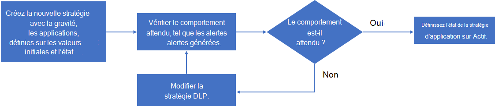

# Créer des stratégies d’application

>*[Guide de sécurité et conformité pour les licences Microsoft 365](https://aka.ms/ComplianceSD).*

En plus d’un ensemble intégré de fonctionnalités permettant de détecter le comportement anormal des applications et de générer des alertes, les stratégies d’application dans la gouvernance des applications Microsoft vous permettent d’effectuer les opérations suivantes :

- Spécifiez les conditions selon lesquelles la gouvernance des applications peut vous avertir du comportement de l’application pour la correction automatique ou manuelle.
- Implémentez les stratégies de conformité des applications pour votre organisation.

Vous pouvez créer des politiques d'application à partir de modèles fournis qui peuvent être personnalisés, vous pouvez aussi bien créer votre propre politique d'application personnalisée.

Pour créer une stratégie d’application, accédez à **Centre de conformité Microsoft 365 > Protection d’applications et gouvernance > Page vue d’ensemble > Politiques**:

- Pour créer une nouvelle stratégie d’application avec des modèles conçus pour l’utilisation des applications, sélectionnez **Créer une stratégie** sous **Créer une politique d’utilisation des applications**.
- Pour créer une nouvelle stratégie d’application avec des modèles conçus pour les autorisations d’application, sélectionnez **Créer une stratégie** sous **Créer une stratégie d’autorisations**.
- Pour créer une nouvelle stratégie d’application pour la certification d’application ou pour une stratégie personnalisée, sélectionnez **Créer une nouvelle**.

## Modèles de stratégie d’application

Pour créer une nouvelle stratégie d’application basée sur un modèle de stratégie d’application, dans la **Page Choisir un modèle de stratégie d’application**, sélectionnez une catégorie de modèle d’application, sélectionnez le nom du modèle, puis sélectionnez **Suivant**.

La gouvernance des applications comporte trois catégories de modèles de stratégie d’application.

### Utilisateurs de l’application et accès aux données

La gouvernance des applications inclut ces modèles pour générer des alertes pour l’utilisation des applications.

| Nom du modèle | Description |
|:-------|:-----|
| Nouvelle application avec un volume élevé d’accès aux données | Met en évidence toutes les applications récemment inscrites avec un accès aux données en volume élevé pour s’assurer que ces modèles de données sont attendus.    Par défaut, cette stratégie signale toutes les applications qui ont été inscrites au cours des 7 derniers jours et qui ont eu plus de 1 Go d’accès aux données au cours de cette période. Cette stratégie peut être personnalisée avec davantage de conditions et d’actions. |
|||

### Autorisations d’application

La gouvernance des applications inclut ces modèles pour générer des alertes pour les autorisations d’application.

| Nom du modèle | Description |
|:-------|:-----|
| Applications sur-privilégiées | Met en évidence toutes les applications avec plus d’autorisations accordées que celles utilisées par ces applications pour identifier les opportunités de réduction potentielle des autorisations.    Par défaut, cette stratégie signale toutes les applications marquées comme étant sur-privilégiées si elles ne sont pas utilisées pendant 90 jours. Ce filtre de période peut être personnalisé avec plus de conditions et d’actions. |
| Nouvelle application avec des autorisations à privilèges élevés | Met en évidence toutes les nouvelles applications disposant d’autorisations à privilèges élevés pour identifier les applications potentielles à encombrement élevé qui peuvent nécessiter une investigation plus approfondie.    Par défaut, cette stratégie signalera toutes les applications enregistrées au cours des sept derniers jours qui disposent d’autorisations étendues. |
|||

### Certification des applications

La gouvernance des applications inclut ces modèles pour générer des alertes pour la certification des applications.

| Nom du modèle | Description |
|:-------|:-----|
| Nouvelle application non certifiée | Met en évidence les nouvelles applications qui n’ont pas fait l’objet du processus de certification des applications pour s’assurer qu’elles sont attendues dans le client.    Par défaut, cette stratégie signale toutes les applications qui ont été inscrites au cours des 7 derniers jours et qui ne sont pas certifiées. |
|||

## Stratégies d’application personnalisées

Utilisez une stratégie d’application personnalisée lorsque vous devez effectuer une opération qui n’est pas déjà effectuée par l’un des modèles intégrés.

Pour créer une stratégie d’application personnalisée, sélectionnez d’abord **Créer une nouvelle** dans la page **Stratégies**. Dans la **Page Choisir un modèle de stratégie d’application**, sélectionnez la catégorie **Personnalisé**, le modèle de **Stratégie personnalisée**, puis sélectionnez **Suivant**.

Dans la page **Nom et description**, configurez les éléments suivants :

- Nom de la stratégie

- Description de la stratégie

- Sélectionnez la gravité de la stratégie, qui définit la gravité des alertes générées par cette stratégie.

  - Élevé
  - Moyen
  - Faible

Dans la page **Choisir les paramètres et conditions de stratégie**, pour **Choisissez à quelles applications cette stratégie est applicables**, sélectionnez :

- Toutes les applications
- Choisir des applications spécifiques

  Un volet vous permet de sélectionner une ou plusieurs applications.
  Cliquez sur **Ajouter**.

Sélectionnez **Suivant**.

Dans la page **Choisir les paramètres et conditions de stratégie** , sélectionnez **Définir de nouvelles conditions pour la stratégie**, puis sélectionnez **Suivant**.

Le volet **Créer une règle** vous permet de sélectionner les conditions d’une nouvelle règle. Sélectionnez **Ajouter une condition** et sélectionnez dans la liste des conditions, puis spécifiez la valeur de la condition. Vous pouvez ajouter plusieurs conditions.

Voici les conditions disponibles pour une stratégie d’application personnalisée.

|Condition | Valeurs de condition acceptées | Plus d’informations |
|:-------|:-----|:-------|
| Âge de l’inscription de l’application | Au cours des X derniers jours |  |
| Certification des applications | Conformité de base, conformité MCAS ou N/A | [Certification Microsoft 365](https://docs.microsoft.com/microsoft-365-app-certification/docs/enterprise-app-certification-guide) |
| Vérification de l’éditeur | Oui ou Non | [Vérification de l’éditeur](https://docs.microsoft.com/azure/active-directory/develop/publisher-verification-overview) |
| Autorisation de l’application | Sélectionnez une ou plusieurs entrées dans la liste. | [Référence des autorisations de Microsoft Graph](https://docs.microsoft.com/graph/permissions-reference) |
| Autorisation déléguée | Sélectionnez une ou plusieurs entrées dans la liste. | [Référence des autorisations de Microsoft Graph](https://docs.microsoft.com/graph/permissions-reference) |
| Privilège élevé | Oui ou Non | Il s’agit d’une désignation interne basée sur la même logique que celle utilisée par MCAS. |
| Application avec trop de privilèges | Oui ou Non | Applications avec plus d’autorisations accordées que celles utilisées par ces applications. |
| Accès aux données de l’application | Accès aux données supérieur à X Go par heure |  |
| Tendance d’accès aux données de l’application | Augmentation de X % de l’utilisation des données au cours des 7 derniers jours |  |
| Accès à l’API de l’application | Appels d’API supérieurs à X par heure |  |
| Tendance d’accès à l’API d’application | Augmentation de X % des appels d’API au cours des 7 derniers jours     |  |
| Utilisateurs qui ont accepté | (Supérieur ou inférieur à) X utilisateurs consentés |  |
| L’utilisateur prioritaire a donné son consentement | Oui ou Non | Un utilisateur disposant d’un [compte de priorité](https://docs.microsoft.com/microsoft-365/admin/setup/priority-accounts). |
| Application autorisée par | Sélectionner des utilisateurs dans la liste |  |
| Rôle de l'utilisateur consentant | Sélectionnez un ou plusieurs : Administrateur Teams, Lecteurs d’annuaires, Lecteur de sécurité, Administrateur de conformité, Administrateur de la sécurité, Administrateur du support technique, Administrateur SharePoint, Administrateur Exchange, Lecteur général, Administrateur général, Administrateur des données de conformité, Administrateur des utilisateurs, Administrateur du support technique | Sélections multiples autorisées.    Tout rôle Azure AD avec un membre affecté doit être mis à disposition dans cette liste. |
| Charge de travail consultée | OneDrive et/ou SharePoint et/ou Exchange | Sélections multiples autorisées. |
| Taux d’erreur | Le taux d’erreur est supérieur à X% au cours des 7 derniers jours, où X est une valeur définie par l’administrateur |  |
||||

<!--
NOTE TO WRITER: Replace X in the above table with correct values.
-->

Toutes les conditions spécifiées doivent être remplies pour que cette stratégie d’application s’applique.

Lorsque vous avez terminé de spécifier les conditions, sélectionnez **Enregistrer**, puis sélectionnez **Suivant**.

Dans la page **Définir des actions de stratégie**, sélectionnez **Désactiver l’application** si vous souhaitez que la gouvernance des applications désactive l’application lorsqu’une alerte basée sur cette stratégie est générée, puis sélectionnez **Suivant**.

Dans la page **Définir l’état de la stratégie** , sélectionnez l’une des options suivantes :

- **Mode d’audit**: les stratégies sont évaluées, mais les actions configurées ne se produisent pas. Les stratégies de mode d’audit apparaissent avec l’état **Audit** dans la liste des stratégies.
- **Actif**: les stratégies sont évaluées et des actions configurées se produisent.
- **Inactif**: les stratégies ne sont pas évaluées et les actions configurées ne se produisent pas.

<!--
## Configure a user-based policy

## Create an app metadata-based policy

Publish metadata-based policies

## Configure access permissions
-->

## Tester et surveiller votre nouvelle stratégie d’application

Maintenant que votre stratégie d’application est créée, vous devez la surveiller sur la page **Stratégies** pour vous assurer qu’elle inscrit un nombre attendu d’alertes actives et le nombre total d’alertes pendant le test. 

Si le nombre d’alertes est une valeur faible inattendue, modifiez les paramètres de la stratégie d’application pour vous assurer que vous l’avez correctement configurée avant de définir son état.

Voici un exemple de processus permettant de créer une stratégie, de la tester, puis de la rendre active :

1. Créez la stratégie avec la gravité, les applications, les conditions et les actions définies sur les valeurs initiales et l’état défini sur **Mode Audit**.
2. Vérifiez le comportement attendu, tel que les alertes générées.
3. Si le comportement n’est pas attendu, modifiez les applications de stratégie, les conditions et les paramètres d’action en fonction des besoins, puis revenez à l’étape 2.
4. Si le comportement est attendu, modifiez la stratégie et remplacez son état par **Actif**.

## Étape suivante

[Gérez vos stratégies d’application.](app-governance-app-policies-manage.md)
