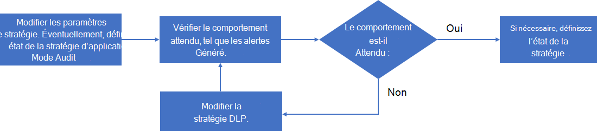

# Gérer les stratégies d’application

>*[Guide de sécurité et conformité pour les licences Microsoft 365](https://aka.ms/ComplianceSD).*

Pour suivre les dernières applications utilisées par votre organisation, répondre aux nouvelles attaques basées sur les applications et, pour les modifications continues apportées aux besoins de conformité de votre application, vous devrez peut-être gérer vos stratégies d’application de ces manières :

- Créer des stratégies destinées aux nouvelles applications
- Modifier l’état d’une stratégie existante (active, inactive, mode audit)
- Modifier les conditions d’une stratégie existante
- Modifier les actions d’une stratégie existante pour la correction automatique des alertes

Voici un exemple de processus de gestion d’une stratégie existante :

1. Modifiez la stratégie :

  - Modifiez les paramètres de la stratégie.
  - Si nécessaire, remplacez l’état par **Mode audit** à des fins de test.

2. Vérifiez le comportement attendu, tel que les alertes générées.
1. Si le comportement n’est pas attendu, revenez à l’étape 1.
1. Si le comportement est attendu, modifiez la stratégie et remplacez son état par actif (si nécessaire).

## Modification d’une configuration de stratégie d’application

Pour modifier la configuration d’une stratégie d’application existante :

- Sélectionnez la stratégie dans la liste des stratégies, puis sélectionnez **Modifier** dans le volet stratégie de l’application.
- Sélectionnez les points de suspension verticaux pour la stratégie dans la liste, puis sélectionnez **Modifier**.

Pour la page **Modifier la stratégie** , parcourez les pages et apportez les modifications appropriées :

- **Description**: modifiez la description pour faciliter la compréhension de l’objectif de la stratégie.
- **Gravité**
- **Paramètres de stratégie**: modifiez l’ensemble des applications auxquelles la stratégie s’applique. Vous pouvez également choisir d’utiliser les conditions existantes ou de modifier les conditions
- **Actions**: modifiez l’action de correction automatique pour les alertes générées par la stratégie.
- **État**: modifiez l’état de la stratégie.

## Suppression d’une stratégie d’application

Pour supprimer une stratégie d’application, vous pouvez :

- Sélectionnez la stratégie dans la liste des stratégies, puis sélectionnez **Supprimer** dans le volet stratégie de l’application.
- Sélectionnez les points de suspension verticaux pour la stratégie dans la liste, puis sélectionnez **Supprimer**.

Une alternative à la suppression d’une stratégie d’application consiste à remplacer son état par inactif. Une fois inactive, elle ne génère pas d’alertes. Par exemple, au lieu de supprimer une stratégie d’application pour une application avec un ensemble spécifique de conditions utiles pour une stratégie future, renommez la stratégie d’application pour indiquer son utilité et définissez son état sur inactif. Vous pouvez revenir ultérieurement à la stratégie et la modifier pour une application similaire et définir son état sur le mode audit ou inactif.
