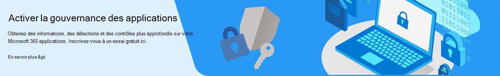

# Démarrage avec la gouvernance des applications (en préversion)

Pour commencer à utiliser le module complémentaire de gouvernance des applications pour Microsoft Cloud App Security, vous devez effectuer trois étapes:

1. [Vérifiez les conditions préalables pour les licences et les administrateurs.](#licensing-and-administrator-role-prerequisites)
1. [Inscrivez-vous à la version d’essai de gouvernance des applications.](#sign-up-for-free-trial-of-app-governance)
1. [Ajoutez l’intégration MCAS](#add-integration-with-mcas).

## Inscrivez-vous à un essai gratuit de la gouvernance des applications

Pour les clients Microsoft 365 existants :

1. Accédez à la [page d’inscription pour version d’évaluation gratuite](https://aka.ms/appgovernancetrial).
1. Effectuez les étapes pour ajouter la gouvernance des applications. L’inscription est simple, comme illustré dans le graphique suivant.

<!--
:::image type="content" source="../media/manage-app-protection-governance/sign-up-page.png" alt-text="Simple steps to add app governance to your account.":::
-->

Si vous n’êtes pas déjà client Microsoft 365, vous pouvez vous inscrire à un essai gratuit :

1. En haut de cette page, sélectionnez le bouton  **Compte gratuit** .
1. Sous  **Essayez Microsoft 365 pour les entreprises** sélectionnez **Essai gratuit d’un mois**.
1. Effectuez les étapes de l’inscription.

## Ajouter une intégration à MCAS

Conditions préalables :

- Office 365 est connecté dans Sécurité des applications cloud
- Les applications office 365 Azure AD sont activées

Pour activer la synchronisation de la gouvernance des applications avec Sécurité des applications cloud, procédez comme suit :

1. Accédez à votre portail Microsoft Cloud App Security : [https://portal.cloudappsecurity.com](https://portal.cloudappsecurity.com)
1. Sélectionnez l’icône d’engrenage (coin supérieur droit), puis sélectionnez **Paramètres**.
1. Sous **Protection contre les menaces**, sélectionnez **Gouvernance des applications**.
1. Sélectionnez **Activer l’intégration de la gouvernance des applications**, puis sélectionnez **Enregistrer**.

Pour vérifier que l’intégration avec MCAS est active, recherchez les stratégies de gouvernance d’application répertoriées ci-dessous pour apparaître dans MCAS. L’affichage des nouvelles stratégies peut prendre quelques minutes une fois l’intégration activée.

- Réputation de l’application OAuth Microsoft 365
- Détection de l'hameçonnage de OAuth Microsoft 365
- Gouvernance des applications OAuth Microsoft 365

## Conditions préalables aux licences et au rôle d’administrateur

1. Vérifiez que votre compte a le [niveau de licence approprié](#licensing-for-app-governance). La gouvernance des applications est une fonctionnalité complémentaire pour Microsoft Cloud App Security (MCAS). Par conséquent, MCAS doit être présent dans votre compte en tant que produit autonome ou dans le cadre des différents packages de licence.
1. Vous devez avoir l’un des [rôles d’administrateur](#administrator-roles) répertoriés ci-dessous pour accéder aux pages de gouvernance des applications dans le portail.
1. L'adresse de facturation de votre organisation doit se trouver dans l'une[ des zones prises en charge en Amérique du Nord, en Europe ou en Afrique](app-governance-countries.md) afin d'activer l'essai gratuit.

### Licences pour la gouvernance des applications

Avant de vous lancer dans la gouvernance des applications, vous devez confirmer votre centre d'administration [Microsoft 365 – les abonnements](https://admin.microsoft.com/Adminportal/Home?source=applauncher#/subscriptions) et les éventuels modules complémentaires. Pour accéder à la gouvernance des applications et l’utiliser, votre organisation doit disposer de l’un des abonnements ou modules complémentaires suivants :

- Microsoft Cloud App Security
- Microsoft 365 E5/A5
- Conformité Microsoft 365 E5/A5
- Microsoft 365 E5/A5 Protection de l’information et Gouvernance
- Microsoft 365 sécurité E5/A5
- Module complémentaire de conformité F5 Microsoft 365
- Module complémentaire sécurité + conformité Microsoft 365 F5

### Rôles d'administrateur

> [!NOTE]
> Seul un rôle d’administrateur global peut activer l'essai gratuit de la gouvernance de l'application.

L'un des rôles d'administrateur suivants est requis pour voir les pages de gouvernance des applications ou gérer les stratégies et les paramètres :

- Administrateur de l'application
- Administrateur de l'application cloud
- Administrateur de la société
- Administrateur de conformité
- Administrateur de conformité des données
- Lecteur de conformité (en lecture seule)
- Lecteur général
- Administrateur de sécurité
- Opérateur de sécurité
- Lecteur sécurité (en lecture seule)

Voici les fonctionnalités de chaque rôle.

| Rôle | Lire le tableau de bord | Lire toutes les applications |Lire les stratégies | Créer, mettre à jour ou supprimer des stratégies | Lire les alertes | Mettre à jour des alertes | Lire les paramètres | Définir les paramètres de mise à jour | Lire la correction | Mettre à jour la correction |
|:-------|:-----|:-------|:-------|:-------|:-------|:-------|:-------|:-------|:-------|:-------|
| Administrateur de l'application |  |  |  |  |  |  |  |  |  |  |
| Administrateur de l'application cloud |  | | | | | | | | | |
| Administrateur de la société |  |  |  |  |  |  |  |  |  |  |
| Administrateur de conformité |  |  |  |  |  |  |  |  |  | |
| Administrateur de conformité des données |  |  |  |  |  |  |  |  |  | |
| Lecteur de conformité |  |  |  |  |  |  |  |  | | |
| Lecteur général  |  |  |  |  |  |  |  |  | | |
| Administrateur de sécurité |  |  |  |  |  |  |  |  |  | |
| Opérateur de sécurité |  |  |  |  |  |  |  |  |  | |
| Lecteur de sécurité  |  |  |  |  |  |  |  |  |  | |
|||||||||| | |

Pour plus d’informations sur chaque rôle, consultez [Autorisations de rôle Administrateur](/azure/active-directory/roles/permissions-reference).

## Annulation de votre version d'évaluation

Si vous n'avez pas participé à la préversion privée et que vous souhaitez annuler votre version d'évaluation de la gouvernance des applications, vous pouvez communiquer avec votre contact CXE ou suivre les étapes suivantes :

1. Dans le Centre d’administration Microsoft 365, accédez à **Facturation** > <a href="https://go.microsoft.com/fwlink/p/?linkid=842054" target="_blank">**Vos produits**</a>.
1. Accédez à la version d’évaluation de la gouvernance des applications, cliquez sur les trois points, puis sélectionnez **Annuler l’abonnement**.
1. Dans le volet volant qui en résulte, indiquez la raison de l’annulation, les commentaires supplémentaires, puis sélectionnez **Annuler l’abonnement**.
1. Sélectionnez **Annuler l’abonnement** dans l’écran contextuel qui en résulte. Votre version d’évaluation est annulée, vous perdrez l’accès à la gouvernance des applications et vos données de gouvernance d’application seront supprimées (les données de journal utilisées pour créer les détections et les insights de gouvernance des applications , aucun e-mail ou autre fichier ne sera affecté).

## Problèmes connus dans la préversion publique

L’équipe de gouvernance des applications a identifié les problèmes connus suivants pour la préversion : 

- Synchronisation bidirectionnelle entre Microsoft Defender et les alertes de gouvernance des applications : actuellement, les alertes résolues dans Defender doivent également être résolues manuellement dans la gouvernance des applications.
