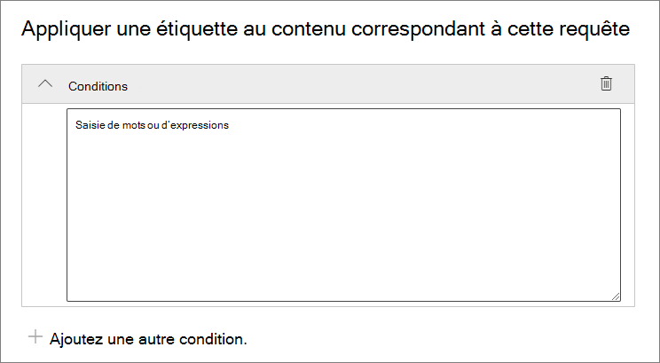
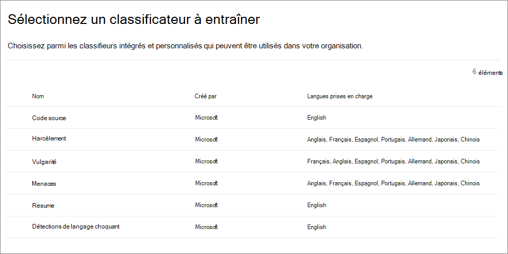

# Application automatique d’une étiquette de rétention pour conserver ou supprimer du contenu

>*[Guide de sécurité et conformité pour les licences Microsoft 365](https://aka.ms/ComplianceSD).*

L’une des fonctionnalités les plus puissantes des [étiquettes de rétention](retention.md) est la possibilité d’appliquer celles-ci automatiquement à tout contenu correspondant à certaines conditions spécifiques. Dans ce cas, les personnes au sein de votre organisation ne doivent pas appliquer les étiquettes de rétention. Microsoft 365 s’en charge à leur place.
  
Les étiquettes de rétention appliquées automatiquement sont puissantes pour les raisons suivantes :
  
- Vous n’avez pas besoin de former les utilisateurs concernant l’ensemble de vos classifications.
    
- Vous n’avez pas à dépendre des utilisateurs pour classer tout le contenu correctement.
    
- Les utilisateurs n’ont plus besoin de connaître les stratégies de gouvernance des données : ils peuvent se concentrer sur leur travail.
    
Vous pouvez appliquer automatiquement des étiquettes de rétention à du contenu lorsque celui-ci contient des informations sensibles, des mots clés, des propriétés pouvant faire l’objet d’une recherche ou une correspondance pour des [classifieurs pouvant être formés](classifier-get-started-with.md).

Les processus d’application automatique d’une étiquette de rétention sont fonction des conditions suivantes :

Utilisez les instructions suivantes pour les deux étapes d’administration.

> [!NOTE]
> Les stratégies automatiques utilisent l’étiquetage côté service avec des conditions pour appliquer automatiquement des étiquettes de rétention. Vous pouvez également appliquer automatiquement une étiquette de rétention avec une stratégie d’étiquette lorsque vous procédez comme suit : 
>
> - Appliquez une étiquette de rétention par défaut à une bibliothèque, un dossier ou à un groupe de documents SharePoint afin que le contenu sans étiquette dans ce conteneur soit automatiquement étiqueté
>- Application automatique d’une étiquette de rétention pour les e-mails à l’aide de règles
>
> Pour ces scénarios, voir [Créer des étiquettes de rétention et les appliquer dans les applications](create-apply-retention-labels.md).

## Avant de commencer

L’administrateur général de votre organisation dispose de toutes les autorisations pour créer et gérer les étiquettes de rétention et leurs stratégies. Si vous ne vous connectez pas en tant qu’administrateur général, voir [Autorisations nécessaires pour créer et gérer des stratégies et des étiquettes de confidentialité](get-started-with-retention.md#permissions-required-to-create-and-manage-retention-policies-and-retention-labels).

## Application automatique d’étiquettes de rétention

Tout d’abord, créez votre étiquette de rétention. Créez ensuite une stratégie automatique pour appliquer l’étiquette. Si vous avez déjà créé votre étiquette de rétention, passez à [Création d’une stratégie automatique](#step-2-create-an-auto-apply-policy).

Les instructions de navigation varient selon que vous utilisez la [gestion des enregistrements](records-management.md) ou non. Des instructions sont fournies pour les deux scénarios.

### Étape 1 : créer une étiquette de rétention

1. Dans le [Centre de conformité Microsoft 365](https://compliance.microsoft.com/), accédez à l’un des emplacements suivants :
    
    - Si vous utilisez la gestion des enregistrements :
        - **Solutions** > **Gestion des enregistrements** > **Plan de fichiers** onglet > **+ Créer une étiquette** > **Étiquette de rétention**
        
    - Si vous n’utilisez pas la gestion des enregistrements :
       - **Solutions** > **Gouvernance d’informations** > **Étiquettes** onglet > + **Créer une étiquette**
    
    Votre option ne s’affiche pas immédiatement ? Sélectionnez tout d’abord **Afficher tout**. 

2. Suivez les invites de l’Assistant. Si vous utilisez la gestion des enregistrements :
    
    - Pour plus d’informations sur les descripteurs de plan de fichier, consultez [Utiliser le plan de gestion des fichiers pour gérer les étiquettes de rétention](file-plan-manager.md)
    
    - Pour utiliser l’étiquette de rétention afin de déclarer un [enregistrement](records-management.md#records), activez l’option **Marquer les éléments comme enregistrement**.

3. Une fois l’étiquette créée, les options permettant de la publier s’affichent. Appliquez automatiquement l’étiquette, ou enregistrez-la simplement : sélectionnez **Appliquer automatiquement cette étiquette à un type spécifique de contenu**, puis sélectionnez **Terminé** pour démarrer l’assistant à la création d’attribution automatique d’étiquettes qui vous conduit directement à l’étape 2 de la procédure suivante.

Pour modifier une étiquette existante, sélectionnez-la, puis sélectionnez **Modifier l’étiquette** pour démarrer l’assistant à l’édition de rétention qui vous permet de modifier les descriptions d’étiquettes et les [paramètres éligibles](#updating-retention-labels-and-their-policies) à partir de l’étape 2.

### Étape 2 : créer une stratégie d’application automatique

Lorsque vous créez une stratégie d’application automatique, vous sélectionnez une étiquette de rétention pour l’appliquer automatiquement à du contenu, en fonction des conditions spécifiées.

1. Dans le [Centre de conformité Microsoft 365](https://compliance.microsoft.com/), accédez à l’un des emplacements suivants :
    
    - Si vous utilisez la gestion des enregistrements : **Gouvernance d’informations** :
        - **Solutions** > **Gestion des enregistrements** > **Stratégies des étiquettes** onglet > **Auto-appliquer une étiquette**
    
    - Si vous n’utilisez pas la gestion des enregistrements :
        - **Solutions** > **Gouvernance d’informations** > **Stratégies des étiquettes** onglet > **Auto-appliquer une étiquette**
    
    Votre option ne s’affiche pas immédiatement ? Sélectionnez tout d’abord **Afficher tout**. 

2. Suivez les invites de l’assistant à la création d’attribution automatique d’étiquettes.
    
    Pour plus d’informations sur la configuration des conditions qui appliquent automatiquement l’étiquette de rétention, voir la section [Configuration des conditions d’application automatique des étiquettes de rétention](#configuring-conditions-for-auto-apply-retention-labels) sur cette page.
    
    Pour plus d’informations sur la prise en charge des emplacements par des étiquettes de rétention, voir la section [Étiquettes de rétention et emplacements](retention.md#retention-label-policies-and-locations).

Pour modifier une stratégie d’application automatique d’étiquettes existante, sélectionnez-la pour démarrer l’assistant à la modification de stratégie de rétention qui vous permet de modifier l’étiquette de rétention sélectionnée et les [paramètres éligibles](#updating-retention-labels-and-their-policies) à partir de l’étape 2.

### Configuration des conditions d’application automatique des étiquettes de rétention

Vous pouvez appliquer automatiquement des étiquettes de rétention au contenu quand celui-ci inclut :

- [Types spécifiques d’informations sensibles](#auto-apply-labels-to-content-with-specific-types-of-sensitive-information)

- [Mots clés spécifiques ou propriétés pouvant faire l’objet d’une recherche qui correspondent à une requête que vous créez](#auto-apply-labels-to-content-with-keywords-or-searchable-properties)

- [Correspondance pour les classifieurs entraînables](#auto-apply-labels-to-content-by-using-trainable-classifiers)

#### Application automatique d’étiquettes au contenu incluant des types spécifiques d’informations sensibles

Lorsque vous créez des étiquettes de rétention d’application automatique pour des informations sensibles, vous voyez s’afficher la même liste de modèles de stratégie que lorsque vous créez une stratégie de protection contre la perte de données. Chaque modèle est préconfiguré pour rechercher des types spécifiques d’informations sensibles. Par exemple, le modèle présenté ici recherche les numéros américains d’identification fiscale (ITIN), de sécurité sociale (SSN) et de passeports depuis la catégorie **Confidentialité**, ainsi que le **modèle de données d’informations d’identification personnelle (PII) américaines** :

Pour plus d’informations sur les types d’informations sensibles, voir les [définitions d’entités de types d’informations sensibles](sensitive-information-type-entity-definitions.md).

Après avoir sélectionné un modèle de stratégie, vous pouvez ajouter ou supprimer tout type d’informations sensibles, ainsi que modifier le nombre d’instances et la précision de correspondance. Sur la capture d’écran d’exemple présentée ensuite, une étiquette de rétention est appliquée automatiquement uniquement lorsque :
  
- Le type d’information sensible est détecté avec une précision de correspondance (ou niveau de confiance) minimale de 75. De nombreux types d’informations sensibles sont définis avec plusieurs modèles. Un modèle définissant une précision de correspondance élevée impose davantage de critères (par exemple, mots clés, dates ou adresses) qu’un modèle définissant une précision de correspondance moindre. Plus la valeur de précision de correspondance **min** est faible, plus il y a de contenu correspondant à la condition.

- Le contenu comprend entre 1 et 9 instances de n’importe quel de ces trois types d’informations sensibles. Vous pouvez supprimer la valeur **jusqu’à** de façon à ce qu’elle soit remplacée par **Tout**.

Pour plus d’informations sur ces options, reportez-vous aux instructions suivantes de la documentation DLP : [Affiner les réglages pour rendre la correspondance plus ou moins précise](data-loss-prevention-policies.md#tuning-rules-to-make-them-easier-or-harder-to-match).
    

  
#### Application automatique d’étiquettes au contenu comprenant des mots clés ou des propriétés pouvant faire l’objet d’une recherche

Vous pouvez appliquer automatiquement des étiquettes au contenu à l’aide d’une requête qui contient des mots, des phrases ou des valeurs de propriétés pouvant faire l’objet d’une recherche. Vous pouvez affiner votre requête en utilisant des opérateurs de recherche tels que et, ou et non.

Pour plus d’informations sur la syntaxe de requête qui utilise le langage de requête de mot clé (KQL), consultez [Référence de syntaxe de langage de requête de mot clé (KQL)](https://docs.microsoft.com/sharepoint/dev/general-development/keyword-query-language-kql-syntax-reference).

Les étiquettes basées sur une requête utilisent l’index de recherche pour identifier le contenu. Pour plus d’informations sur les propriétés pouvant faire l’objet d’une recherche, consultez :

- [Requêtes par mots clés et conditions de recherche pour la recherche de contenu](keyword-queries-and-search-conditions.md)
- [Vue d’ensemble des propriétés analysées et gérées dans SharePoint Server](https://docs.microsoft.com/SharePoint/technical-reference/crawled-and-managed-properties-overview)

> [!NOTE]
> Bien que les propriétés gérées de SharePoint prennent en charge les alias, ne les utilisez pas lorsque vous configurez vos étiquettes de rétention. Spécifiez toujours le nom réel de la propriété gérée (par exemple, « RefinableString01 »).

Exemples de requêtes :

| Charge de travail | Exemple |
|:-----|:-----|
|Exchange   | `subject:"Quarterly Financials"` |
|Exchange   | `recipients:garthf@contoso.com` |
|SharePoint | `contenttype:contract` |
|SharePoint | `site:https://contoso.sharepoint.com/sites/teams/procurement AND contenttype:contract`|

#### Appliquer automatiquement des étiquettes au contenu à l’aide de classifieurs entraînables

Lorsque vous choisissez l’option de classifieur entraînable, vous pouvez sélectionner un classifieur intégré ou un classifieur personnalisé. Les classifieurs intégrés incluent : **CV**, **SourceCode**, **Harcèlement ciblé**, **Blasphème** et la **Menace** :

> [!CAUTION]
> Nous déprécions le **langage inconvenant** classifieur intégré, car il génère un grand nombre de faux positifs. N’utilisez pas ce classifieur intégré et si vous l’utilisez actuellement, vous devez déplacer vos processus métier. Nous vous recommandons d’utiliser les classifieurs intégrés de **Harcèlement ciblée** , de **blasphème** et de **Menace** à la place.

Pour appliquer automatiquement une étiquette à l’aide de cette option, les sites et boîtes aux lettres SharePoint doivent avoir au moins 10 Mo de données.

Pour plus d’informations sur les classifieurs de formation, consultez [Découvrez les classifieurs de formation (préversion)](classifier-learn-about.md).

> [!TIP]
> Si vous utilisez des classifieurs entraînables pour Exchange, voir le récent article [Comment recycler un classifieur dans l’Explorateur de contenu (préversion)](classifier-how-to-retrain-content-explorer.md).

## Délai d’activation des étiquettes de rétention

Lorsque vous appliquez automatiquement des étiquettes de rétention, l’application de ces étiquettes à ce contenu peut prendre jusqu’à sept jours.
  

  
## Mise à jour des étiquettes de rétention et de leurs stratégies

Lorsque vous modifiez une étiquette de rétention ou une stratégie d’application automatique et que l’étiquette de rétention est déjà appliquée au contenu, vos paramètres mis à jour sont automatiquement appliqués à ce contenu, en plus du contenu nouvellement identifié.

Certains paramètres ne peuvent pas être modifiés une fois l’étiquette ou la stratégie créée et enregistrée, notamment :
- Paramètres de rétention à l’exception de la période de rétention, sauf si vous avez configuré l’étiquette pour conserver ou supprimer le contenu en fonction de sa date de création.
- Option de marquage des éléments comme enregistrement.

## Prochaines étapes

Consultez [Utiliser les étiquettes de rétention pour gérer le cycle de vie des documents stockés dans SharePoint](auto-apply-retention-labels-scenario.md) pour un exemple de scénario qui utilise une stratégie d’application automatique avec des propriétés gérées dans SharePoint et la rétention basée sur les événements pour démarrer la période de rétention.
