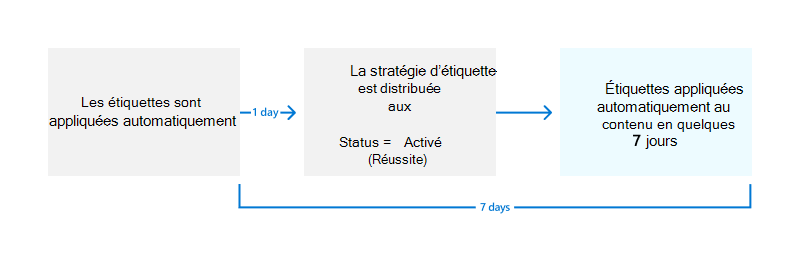

# <a name="automatically-apply-a-retention-label-to-retain-or-delete-content"></a>Application automatique d’une étiquette de rétention pour conserver ou supprimer du contenu

>*[Guide de sécurité et conformité pour les licences Microsoft 365](/office365/servicedescriptions/microsoft-365-service-descriptions/microsoft-365-tenantlevel-services-licensing-guidance/microsoft-365-security-compliance-licensing-guidance).*

> [!NOTE]
> Ce scénario n'est pas pris en charge pour [les enregistrements réglementaires](records-management.md#records) ou les étiquettes par défaut pour une structure d'organisation telle qu'un ensemble de documents ou une bibliothèque dans Microsoft Office SharePoint Online, ou un dossier dans Exchange. Ces scénarios nécessitent une [stratégie d'étiquette de rétention publiée](create-apply-retention-labels.md#step-2-publish-retention-labels).

L’une des fonctionnalités les plus puissantes des [étiquettes de rétention](retention.md) est la possibilité de les appliquer automatiquement au contenu qui remplit les conditions spécifiées. Dans ce cas, les membres de votre organisation n’ont pas besoin d’appliquer les étiquettes de rétention. Microsoft 365 s’en charge à leur place.
  
Les étiquettes de rétention appliquées automatiquement sont puissantes pour les raisons suivantes :
  
- Vous n’avez pas besoin de former les utilisateurs concernant l’ensemble de vos classifications.
    
- Vous n’avez pas à dépendre des utilisateurs pour classer tout le contenu correctement.
    
- Les utilisateurs n’ont plus besoin de connaître les stratégies de gouvernance des données : ils peuvent se concentrer sur leur travail.
    
Vous pouvez appliquer automatiquement des étiquettes de rétention à du contenu lorsque celui-ci ne contient pas encore d’étiquette de rétention appliquée et des informations sensibles, des mots clés, des propriétés pouvant faire l’objet d’une recherche ou une correspondance pour des [classifieurs pouvant être formés](classifier-get-started-with.md). Désormais en prévisualisation, vous pouvez également appliquer automatiquement une étiquette de rétention aux pièces jointes dans le cloud qui sont stockées dans SharePoint ou OneDrive.

> [!TIP]
> Utilisez des propriétés de recherche pour identifier [les enregistrements de réunion Teams](#microsoft-teams-meeting-recordings) et [les éléments auxquels une étiquette de confidentialité est appliquée](#identify-files-and-emails-that-have-a-sensitivity-label).

Les processus d’application automatique d’une étiquette de rétention sont fonction des conditions suivantes :


Utilisez les instructions suivantes pour les deux étapes d’administration.

> [!NOTE]
> Les stratégies automatiques utilisent l’étiquetage côté service avec des conditions pour appliquer automatiquement des étiquettes de rétention. Vous pouvez également appliquer automatiquement une étiquette de rétention avec une stratégie d’étiquette lorsque vous procédez comme suit : 
>
> - Application d’une étiquette de rétention à un modèle de compréhension de document dans SharePoint Syntex.
> - Application d’une étiquette de rétention par défaut pour SharePoint et Outlook
> - Application d’une étiquette de rétention pour les e-mails à l’aide de règles Outlook
>
> Pour ces scénarios, voir [Créer des étiquettes de rétention et les appliquer dans les applications](create-apply-retention-labels.md).

## <a name="before-you-begin"></a>Avant de commencer

L’administrateur général de votre organisation dispose de toutes les autorisations pour créer et gérer les étiquettes de rétention et leurs stratégies. Si vous ne vous connectez pas en tant qu’administrateur général, voir [Autorisations nécessaires pour créer et gérer des stratégies et des étiquettes de confidentialité](get-started-with-retention.md#permissions-required-to-create-and-manage-retention-policies-and-retention-labels).

Déterminez avant de créer votre stratégie d’étiquette de rétention si elle sera **adaptative** ou **statique.** Pour plus d’informations, voir étendues de stratégie adaptative ou statique [pour la rétention.](retention.md#adaptive-or-static-policy-scopes-for-retention) Si vous décidez d’utiliser une stratégie adaptative, vous devez créer une ou plusieurs étendues adaptatives avant de créer votre stratégie d’étiquette de rétention, puis les sélectionner au cours du processus de création de stratégie d’étiquette de rétention. Pour obtenir des instructions, [consultez les informations de configuration pour les étendues adaptatives.](retention-settings.md#configuration-information-for-adaptive-scopes)

## <a name="how-to-auto-apply-a-retention-label"></a>Application automatique d’étiquettes de rétention

Tout d’abord, créez votre étiquette de rétention. Créez ensuite une stratégie automatique pour appliquer l’étiquette. Si vous avez déjà créé votre étiquette de rétention, passez à [Création d’une stratégie automatique](#step-2-create-an-auto-apply-policy).

Les instructions de navigation varient selon que vous utilisez ou non [la gestion des enregistrements](records-management.md). Des instructions sont fournies pour les deux scénarios.

### <a name="step-1-create-a-retention-label"></a>Étape 1 : créer une étiquette de rétention

1. Dans le [Centre de conformité Microsoft 365](https://compliance.microsoft.com/), accédez à l’un des emplacements suivants :
    
    - Si vous utilisez la gestion des enregistrements :
        - **Solutions** > **Gestion des enregistrements** > **Plan de fichiers** onglet > **+ Créer une étiquette** > **Étiquette de rétention**
        
    - Si vous n’utilisez pas la gestion des enregistrements :
       - **Solutions** > **Gouvernance d’informations** > **Étiquettes** onglet > + **Créer une étiquette**
    
    Vous ne voyez pas immédiatement votre solution dans le volet de navigation ? Sélectionnez tout d’abord **Afficher tout**. 

2. Suivez les instructions de l’Assistant pour effectuer la configuration.
    
    Pour plus d’informations sur les paramètres de rétention, voir Paramètres pour [conserver et supprimer du contenu.](retention-settings.md#settings-for-retaining-and-deleting-content) Toutefois, si l’étiquette est utilisée pour les pièces [jointes](#auto-apply-labels-to-cloud-attachments)cloud, veillez à configurer le début de la période de rétention sur « Lorsque les éléments ont **été étiquetés**».
    
    Si vous utilisez la gestion des enregistrements :
    
    - Pour plus d’informations sur les descripteurs de plan de fichier, consultez [Utiliser le plan de gestion des fichiers pour gérer les étiquettes de rétention](file-plan-manager.md)
    
    - Pour utiliser l’étiquette de rétention pour déclarer des enregistrements, sélectionnez **Marquer les éléments comme enregistrements**, ou **Marquer les éléments comme enregistrements réglementaires**. Pour plus d’information, voir [Configuration d’étiquettes de rétention pour déclarer des enregistrements](declare-records.md#configuring-retention-labels-to-declare-records).

3. Une fois l’étiquette créée, les options permettant de la publier s’affichent. Appliquez automatiquement l’étiquette, ou enregistrez-la simplement : sélectionnez **Appliquer automatiquement cette étiquette à un type spécifique de contenu**, puis sélectionnez **Terminé**. 

Pour modifier une étiquette existante, sélectionnez-la, puis sélectionnez l’option **Modifier l’étiquette** pour démarrer la configuration **Modifier l’étiquette de rétention** qui vous permet de modifier les descriptions d’étiquettes et les [paramètres éligibles](#updating-retention-labels-and-their-policies) à partir de l’étape 2.

### <a name="step-2-create-an-auto-apply-policy"></a>Étape 2 : créer une stratégie d’application automatique

Lorsque vous créez une stratégie d’application automatique, vous sélectionnez une étiquette de rétention pour l’appliquer automatiquement à du contenu, en fonction des conditions spécifiées.

1. Dans le [Centre de conformité Microsoft 365](https://compliance.microsoft.com/), accédez à l’un des emplacements suivants :
    
    - Si vous utilisez la gestion des enregistrements : **Gouvernance d’informations** :
        - **Solutions** > **Gestion des enregistrements** > **Stratégies des étiquettes** onglet > **Auto-appliquer une étiquette**
    
    - Si vous n’utilisez pas la gestion des enregistrements :
        - **Solutions** > **Gouvernance d’informations** > **Stratégies des étiquettes** onglet > **Auto-appliquer une étiquette**
    
    Vous ne voyez pas immédiatement votre solution dans le volet de navigation? Sélectionnez tout d’abord **Afficher tout**. 

2. Entrez un nom et une description pour cette stratégie d’étiquetage automatique, puis sélectionnez **Suivant**.

3. Pour choisir le type de contenu à appliquer à cette **étiquette,** sélectionnez l’une des conditions disponibles. Pour plus d’informations sur la configuration des conditions qui appliquent automatiquement l’étiquette de rétention, voir la section [Configuration des conditions d’application automatique des étiquettes de rétention](#configuring-conditions-for-auto-apply-retention-labels) sur cette page.

4. Pour choisir **le type** de stratégie de rétention à créer, sélectionnez **Adaptatif** ou **Statique,** en fonction du choix que vous avez effectué à partir des [instructions](#before-you-begin) avant de commencer. Si vous n’avez pas encore créé **d’étendues adaptatives, vous pouvez sélectionner Adaptive**, mais comme il n’y aura aucune étendue adaptative à sélectionner, vous ne pourrez pas terminer l’Assistant avec cette option.

5. En fonction de l’étendue sélectionnée :
    
    - Si vous **avez** choisi Adaptatif : dans la page Choisir les étendues et les **emplacements** de stratégie adaptative, sélectionnez Ajouter des **étendues** et sélectionnez une ou plusieurs étendues adaptatives qui ont été créées. Sélectionnez ensuite un ou plusieurs emplacements. Les emplacements que vous pouvez sélectionner dépendent des [types d’étendue](retention-settings.md#configuration-information-for-adaptive-scopes) ajoutés. Par exemple, si vous avez uniquement **ajouté un type d’étendue** d’utilisateur, vous pourrez sélectionner Exchange **courrier** électronique, mais pas SharePoint **sites.** 
    
    - Si vous avez choisi **Statique :** dans **la** page Choisir des emplacements pour activer ou désactiver l'un des emplacements. Vous pouvez laisser pour chaque emplacement la valeur par défaut [Appliquer la stratégie à l’intégralité de l’emplacement](retention-settings.md#a-policy-that-applies-to-entire-locations) ou [Spécifier des inclusions et des exclusions](retention-settings.md#a-policy-with-specific-inclusions-or-exclusions).
    
    Pour plus d’informations sur les choix d’emplacement, voir [Emplacements.](retention-settings.md#locations)

6. Suivez les instructions de l'assistant pour sélectionner une étiquette de conservation, puis révisez et soumettez vos choix de configuration.

Pour modifier une stratégie d’application automatique d’étiquettes existante, sélectionnez-la pour démarrer la configuration **Modifier une stratégie de rétention** qui vous permet de modifier l’étiquette de rétention sélectionnée et les [paramètres éligibles](#updating-retention-labels-and-their-policies) à partir de l’étape 2.

Une fois le contenu étiqueté à l'aide d'une stratégie d'étiquette d'application automatique, l'étiquette appliquée ne peut pas être automatiquement supprimée ou modifiée en modifiant le contenu ou la stratégie, ou par une nouvelle stratégie d'étiquette d'application automatique. Pour plus d'informations, voir [Une seule étiquette de rétention à la fois](retention.md#only-one-retention-label-at-a-time).

> [!NOTE]
> Une stratégie d’application automatique des étiquettes de rétention ne remplacera jamais une étiquette de rétention existante appliquée au contenu. Si vous souhaitez réétiqueter du contenu à l’aide des conditions que vous configurez, vous devez supprimer manuellement l’étiquette de rétention actuelle du contenu existant.

### <a name="configuring-conditions-for-auto-apply-retention-labels"></a>Configuration des conditions d’application automatique des étiquettes de rétention

Vous pouvez appliquer automatiquement des étiquettes de rétention au contenu quand celui-ci inclut :

- [Types spécifiques d’informations sensibles](#auto-apply-labels-to-content-with-specific-types-of-sensitive-information)

- [Mots clés spécifiques ou propriétés pouvant faire l’objet d’une recherche qui correspondent à une requête que vous créez](#auto-apply-labels-to-content-with-keywords-or-searchable-properties)

- [Correspondance pour les classifieurs entraînables](#auto-apply-labels-to-content-by-using-trainable-classifiers)

Vous pouvez également appliquer automatiquement des étiquettes de rétention aux pièces [jointes sur le nuage nouvellement partagées.](#auto-apply-labels-to-cloud-attachments)

Lorsque vous configurez les étiquettes de rétention pour qu'elles s'appliquent automatiquement sur la base d'informations sensibles, de mots-clés ou de propriétés interrogeables, ou de classificateurs entraînables, utilisez le tableau suivant pour identifier quand les étiquettes de rétention peuvent être appliquées automatiquement.

Exchange :

|Condition|Éléments en transit (envoyés ou reçus) |Éléments existants (données au repos)|
|:-----|:-----|:-----|
|Types d’informations sensibles – intégrés| Oui | Non |
|Types d’informations sensibles – personnalisés| Oui | Non |
|Mots clés spécifiques ou propriétés pouvant faire l’objet d’une recherche| Oui |Oui |
|Classifieurs pouvant être formés| Oui | Oui (six derniers mois uniquement) |

SharePoint et OneDrive:

|Condition|Éléments modifiés ou nouveaux |Éléments existants (données au repos)|
|:-----|:-----|:-----|
|Types d’informations sensibles – intégrés| Oui | Oui |
|Types d’informations sensibles – personnalisés| Oui | Non |
|Mots clés spécifiques ou propriétés pouvant faire l’objet d’une recherche| Oui |Oui |
|Classifieurs pouvant être formés| Oui | Oui (six derniers mois uniquement) |

En outre, les éléments SharePoint qui sont dans les brouillons ou qui n’ont jamais été publiés ne sont pas pris en charge pour ce scénario.

#### <a name="auto-apply-labels-to-content-with-specific-types-of-sensitive-information"></a>Application automatique d’étiquettes au contenu incluant des types spécifiques d’informations sensibles

> [!IMPORTANT]
> Pour les e-mails que vous appliquez automatiquement en identifiant des informations sensibles, toutes les boîtes aux lettres sont automatiquement incluses, ce qui inclut les boîtes aux lettres de Microsoft 365 groupes.
> 
> Bien que les boîtes aux lettres de groupe soient généralement incluses en sélectionnant l’emplacement des groupes **Microsoft 365,** pour cette configuration de stratégie spécifique, l’emplacement des groupes inclut uniquement les sites SharePoint connectés à un groupe Microsoft 365.

Lorsque vous créez des étiquettes de rétention d’application automatique pour des informations sensibles, vous voyez s’afficher la même liste de modèles de stratégie que lorsque vous créez une stratégie de protection contre la perte de données. Chaque modèle est préconfiguré pour rechercher des types spécifiques d’informations sensibles. Dans l’exemple suivant, les types d’informations sensibles proviennent de la catégorie **Confidentialité** et du modèle **Informations d’identification personnelle (PII) des États-Unis** :


Pour en savoir plus sur les types d’informations de confidentialité, consultez [En savoir plus sur les types d’informations sensibles](sensitive-information-type-learn-about.md#learn-about-sensitive-information-types). Actuellement, [les informations sur la correspondance exacte des données en fonction des types d'informations sensibles](sit-learn-about-exact-data-match-based-sits.md#learn-about-exact-data-match-based-sensitive-information-types) et [l'empreinte digitale des documents](document-fingerprinting.md) ne sont pas prises en charge pour ce scénario.

Après avoir sélectionné un modèle de stratégie, vous pouvez ajouter ou supprimer tous les types d’informations sensibles, et vous pouvez modifier le niveau de confiance et le nombre d’instances. Dans l’exemple de capture d’écran précédent, ces options ont été modifiées afin qu’une étiquette de rétention soit appliquée automatiquement uniquement lorsque :
  
- Le type d'informations sensibles détectées a une précision de correspondance (ou [niveau de confiance](sensitive-information-type-learn-about.md#more-on-confidence-levels)) d'au moins **une confiance moyenne** pour deux des types d'informations sensibles et **une confiance élevée** pour un. De nombreux types d'informations sensibles sont définis avec plusieurs modèles, où un modèle avec une précision de correspondance plus élevée nécessite plus de preuves à trouver (comme des mots-clés, des dates ou des adresses), tandis qu'un modèle avec une précision de correspondance plus faible nécessite moins de preuves. Plus le niveau de confiance est bas, plus il est facile pour le contenu de correspondre à la condition, mais avec un potentiel de plus de faux positifs.

- Le contenu comprend entre 1 et 9 instances de n’importe quel de ces trois types d’informations sensibles. La valeur par défaut de **à** est **N’importe lequel**.

Pour plus d’informations sur ces options, reportez-vous aux instructions suivantes de la documentation DLP : [Affiner les réglages pour rendre la correspondance plus ou moins précise](data-loss-prevention-policies.md#tuning-rules-to-make-them-easier-or-harder-to-match).

Lorsque vous utilisez des types d’informations sensibles pour appliquer automatiquement des étiquettes de rétention :

- Si vous utilisez des types d’informations sensibles personnalisés, ceux-ci ne peuvent pas étiqueter automatiquement des éléments existants dans SharePoint et OneDrive.

- Pour les e-mails, vous ne pouvez pas sélectionner des destinataires spécifiques à inclure ou exclure ; seul le **paramètre Tous les destinataires** est pris en charge et pour cette configuration uniquement, il inclut les boîtes aux lettres de Microsoft 365 groupes. 

#### <a name="auto-apply-labels-to-content-with-keywords-or-searchable-properties"></a>Application automatique d’étiquettes au contenu comprenant des mots clés ou des propriétés pouvant faire l’objet d’une recherche

Vous pouvez appliquer automatiquement des étiquettes au contenu à l’aide d’une requête qui contient des mots, des phrases ou des valeurs de propriétés pouvant faire l’objet d’une recherche. Vous pouvez affiner votre requête en utilisant des opérateurs de recherche tels que et, ou et non.


Pour plus d’informations sur la syntaxe de requête qui utilise le langage de requête de mot clé (KQL), consultez [Référence de syntaxe de langage de requête de mot clé (KQL)](/sharepoint/dev/general-development/keyword-query-language-kql-syntax-reference).

Les stratégies d’application automatique basées sur une requête utilisent le même index de recherche que la recherche de contenu eDiscovery pour identifier du contenu. Pour plus d’informations sur ces propriétés utilisables dans une requête, consultez [Requêtes par mots clés et conditions de recherche pour la recherche de contenu](keyword-queries-and-search-conditions.md).

Éléments à prendre en compte lorsque vous utilisez des mots clés ou des propriétés utilisables dans une requête pour appliquer automatiquement des étiquettes de rétention

- Pour SharePoint, les propriétés analysées et les propriétés personnalisées ne sont pas prises en charge pour ces requêtes KQL et vous devez utiliser uniquement des propriétés gérées prédéfinies. Toutefois, vous pouvez utiliser des mappages au niveau du client avec les propriétés gérées prédéfinies qui sont activées comme affinements par défaut (RefinableDate00-19, RefinableString00-99, RefinableInt00-49, RefinableDecimals00-09 et RefinableDouble00-09). Pour plus d’informations, consultez[vue d’ensemble des propriétés analysées et gérées dans SharePoint Server](/SharePoint/technical-reference/crawled-and-managed-properties-overview)et pour obtenir des instructions, consultez [créer une propriété gérée](/sharepoint/manage-search-schema#create-a-new-managed-property).

- Si vous mappez une propriété personnalisée à l’une des propriétés d’affinement, attendez 24 heures avant de l’utiliser dans votre requête KQL pour une étiquette de rétention.

- Bien que les propriétés gérées de SharePoint puissent être renommées à l’aide d’alias, ne les utilisez pas pour les requêtes KQL dans vos étiquettes. Spécifiez toujours le nom réel de la propriété gérée (par exemple, « RefinableString01 »).

- Pour rechercher les valeurs qui contiennent des espaces ou des caractères spéciaux, utilisez les guillemets (`" "`) pour contenir la phrase; par exemple `subject:"Financial Statements"`.

- Utilisez la propriété *DocumentLink* au lieu de *Path* pour faire correspondre un élément en fonction de son URL. 

- Les recherches par caractères génériques suffixées (telles que `*cat`) ou les recherches par caractères génériques de sous-chaîne (telles que `*cat*`) ne sont pas prises en charge. Cependant, les recherches par caractères génériques suffixées (telles que `cat*`) sont prises en charge.

- Sachez que les éléments partiellement indexés peuvent être responsables du fait de ne pas étiqueter les éléments que vous attendez, ou d'étiqueter des éléments que vous pensez être exclus de l'étiquetage lorsque vous utilisez l'opérateur NOT. Pour plus d'informations, voir [Éléments partiellement indexés dans la recherche de contenu](partially-indexed-items-in-content-search.md).


Exemples de requêtes :

| Charge de travail | Exemple |
|:-----|:-----|
|Exchange   | `subject:"Financial Statements"` |
|Exchange   | `recipients:garthf@contoso.com` |
|SharePoint | `contenttype:document` |
|SharePoint | `site:https://contoso.sharepoint.com/sites/teams/procurement AND contenttype:document`|
|Exchange ou SharePoint | `"customer information" OR "private"`|

Exemples plus complexes :

La requête suivante pour SharePoint identifie des documents Word ou des feuilles de calcul Excel lorsque ces fichiers contiennent les mots clés **mot de passe**, **mots de passe** ou **pw**:

```
(password OR passwords OR pw) AND (filetype:doc* OR filetype:xls*)
```

La requête Exchange suivante identifie tout document Word ou PDF contenant le mot **accord de confidentialité** ou l’expression **contrat de non-divulgation** lorsque ces documents sont joints à un e-mail :

```
(nda OR "non disclosure agreement") AND (attachmentnames:.doc* OR attachmentnames:.pdf)
```

La requête SharePoint suivante identifie les documents qui contiennent un numéro de carte de crédit : 

```
sensitivetype:"credit card number"
```

La requête suivante contient des mots clés courants pour vous aider à identifier les documents ou les e-mails qui contiennent du contenu juridique :

```
ACP OR (Attorney Client Privilege*) OR (AC Privilege)
```

La requête suivante contient des mots clés courants pour vous aider à identifier les documents ou les e-mails des ressources humaines : 

```
(resume AND staff AND employee AND salary AND recruitment AND candidate)
```

Notez que ce dernier exemple utilise la pratique recommandée qui consiste à toujours inclure des opérateurs entre les mots clés. Un espace entre des mots-clés (ou deux expressions de valeur de propriété) revient au même que l’utilisation de l’opérateur AND. En ajoutant toujours des opérateurs, il est plus facile de voir que cet exemple de requête identifie uniquement le contenu qui contient tous ces mots clés, au lieu du contenu contenant tous les mots clés. Si vous avez l’intention d’identifier le contenu contenant l’un des mots clés, spécifiez ou au lieu de et. Comme cet exemple montre, lorsque vous spécifiez toujours les opérateurs, il est plus facile d’interpréter correctement la requête. 

##### <a name="microsoft-teams-meeting-recordings"></a>Enregistrements de réunion Microsoft Teams

> [!NOTE]
> La possibilité de conserver et de supprimer les enregistrements de réunions Teams et ne fonctionnera pas avant la sauvegarde des enregistrements dans OneDrive ou SharePoint. Pour plus d’informations, consultez [Utiliser OneDrive Entreprise et SharePoint Online ou Stream pour les enregistrements de réunion](/MicrosoftTeams/tmr-meeting-recording-change).

Pour identifier les enregistrements de réunion Microsoft Teams stockés dans les comptes OneDrive des utilisateurs ou dans SharePoint, spécifiez les éléments suivants pour **l’éditeur de requête de mot clé**:

```
ProgID:Media AND ProgID:Meeting
```

La plupart du temps, les enregistrements de réunion sont enregistrés dans OneDrive, mais pour les réunions de canal, ils sont enregistrés dans SharePoint.

##### <a name="identify-files-and-emails-that-have-a-sensitivity-label"></a>Identifiez les fichiers et les e-mails qui ont une étiquette de sensibilité

Pour identifier les fichiers dans les e-mails Microsoft Office SharePoint Online ou OneDrive et Exchange auxquels une [étiquette de confidentialité](sensitivity-labels.md) spécifique est appliquée, spécifiez les éléments suivants pour **l'éditeur de requêtes par mot-clé** :

```
InformationProtectionLabelId:<GUID>
```

Pour trouver le GUID, utilisez [l'applet de commande](/powershell/module/exchange/get-label) Get-Label de [Security & Compliance Center PowerShell](/powershell/exchange/scc-powershell) :

````powershell
Get-Label | Format-Table -Property DisplayName, Name, Guid
````

#### <a name="auto-apply-labels-to-content-by-using-trainable-classifiers"></a>Appliquer automatiquement des étiquettes au contenu à l’aide de classifieurs entraînables

Lorsque vous choisissez l'option pour un classificateur entraînable, vous pouvez sélectionner un ou plusieurs classificateurs pré-entraînés ou personnalisés :


> [!CAUTION]
> Nous supprimons le classificateur pré-entraîné **Langage offensif** car il a produit un nombre élevé de faux positifs. N'utilisez pas ce classificateur et si vous l'utilisez actuellement, nous vous recommandons d'abandonner vos processus d'entreprise et d'utiliser plutôt les classificateurs pré-entraînés **Harcèlement ciblé** , **Profanation** , et **Menace**.

Pour appliquer automatiquement une étiquette à l’aide de cette option, les sites et boîtes aux lettres SharePoint doivent avoir au moins 10 Mo de données.

Pour plus d’informations sur les classifieurs avec capacité de formation, consultez [Découvrez les classifieurs avec capacité de formation](classifier-learn-about.md).

> [!TIP]
> Si vous utilisez des classifieurs avec capacité de formation pour Exchange, consultez [Comment recycler un classifieur dans l’explorateur de contenu](classifier-how-to-retrain-content-explorer.md).

Lorsque vous utilisez des classificateurs pouvant apprendre pour appliquer automatiquement des étiquettes de rétention :

- Vous ne pouvez pas étiqueter automatiquement des éléments qui ont plus de six mois dans SharePoint ou OneDrive.

#### <a name="auto-apply-labels-to-cloud-attachments"></a>Appliquer automatiquement des étiquettes aux pièces jointes cloud

> [!NOTE]
> Cette option est progressivement mise en place en prévisualisation et peut faire l’objet de changements.

Vous devrez peut-être utiliser cette option si vous devez capturer et conserver toutes les copies de fichiers dans votre client qui sont envoyées via les communications par les utilisateurs. Vous utilisez cette option conjointement avec les stratégies de rétention pour les services de communication eux-mêmes, Exchange et Teams.

> [!IMPORTANT]
> Lorsque vous sélectionnez une étiquette à utiliser pour appliquer automatiquement des **étiquettes de rétention pour les pièces jointes cloud**, assurez-vous que le paramètre de rétention des étiquettes démarre la période de rétention en fonction de l’étiquette des **éléments.**

Les pièces jointes cloud, parfois appelées pièces jointes modernes, sont un mécanisme de partage qui utilise des liens incorporés vers des fichiers stockés dans le nuage. Ils peuvent prendre en charge le stockage centralisé pour le contenu partagé avec des avantages collaboratifs, tels que le contrôle de version. Les pièces jointes cloud ne sont pas des copies jointes d’un fichier ou un lien de texte d’URL vers un fichier. Il peut s’avérer utile de consulter les listes de contrôle visuelles pour les pièces jointes cloud [Outlook](/office365/troubleshoot/retention/cannot-retain-cloud-attachments#cloud-attachments-in-outlook) et [Teams](/office365/troubleshoot/retention/cannot-retain-cloud-attachments#cloud-attachments-in-teams).

Lorsque vous choisissez l’option d’application d’une étiquette de rétention aux pièces jointes dans le cloud, à des fins de conformité, une copie de ce fichier est créée au moment du partage. L'étiquette de conservation que vous avez choisie est alors appliquée à la copie qui peut ensuite être identifiée à l'aide de l'eDiscovery. Les utilisateurs ne connaissent pas la copie stockée dans la bibliothèque de conservation et de préservation des données. L’étiquette de rétention n’est pas appliquée au message lui-même ou au fichier d’origine.

Si le fichier est modifié et partagé à nouveau, une nouvelle copie du fichier en tant que nouvelle version est enregistrée dans la bibliothèque de conservation et de préservation. Pour plus d’informations, notamment **sur la raison pour laquelle vous devez utiliser le paramètre** Lorsque les éléments ont été étiquetés, voir Comment fonctionne la rétention avec les pièces [jointes cloud](retention-policies-sharepoint.md#how-retention-works-with-cloud-attachments).

Les pièces jointes cloud prises en charge pour cette option sont des fichiers tels que des documents, des vidéos et des images qui sont stockés dans SharePoint et OneDrive. Pour Teams, les pièces jointes cloud partagées dans les messages de conversation et les canaux standard et privés sont pris en charge. Les pièces jointes cloud partagées sur les invitations aux réunions et les applications autres que Teams ou Outlook ne sont pas pris en charge. Les pièces jointes cloud doivent être partagées par les utilisateurs; les pièces jointes cloud envoyées via des bots ne sont pas pris en charge.

Bien que cela ne soit pas obligatoire pour cette option, nous vous recommandons de vous assurer que le traitement des versions est activé pour vos sites SharePoint et comptes OneDrive afin que la version partagée puisse être capturée avec précision. Si le jeu de versions n’est pas activé, la dernière version disponible est conservée. Les documents en brouillon ou qui n’ont jamais été publiés ne sont pas pris en charge.

Lorsque vous sélectionnez une étiquette à utiliser pour appliquer automatiquement des étiquettes **de rétention pour les pièces jointes cloud, assurez-vous que le paramètre de rétention des étiquettes démarre la période de** rétention en fonction de l’étiquette des **éléments.** 

Lorsque vous configurez les emplacements de cette option, vous pouvez sélectionner :

- **SharePoint sites** pour les fichiers partagés stockés dans des sites de communication SharePoint, des sites d’équipe qui ne sont pas connectés par des groupes Microsoft 365 et des sites classiques. 
- **Microsoft 365 groupes pour** les fichiers partagés stockés dans des sites d’équipe connectés Microsoft 365 groupes.
- OneDrive pour les fichiers **partagés** stockés dans les comptes de OneDrive.

Vous devrez créer des stratégies de rétention distinctes si vous souhaitez conserver ou supprimer les fichiers, messages électroniques ou messages Teams d’origine.

> [!NOTE]
> Si vous souhaitez que les pièces jointes dans le cloud conservées expirent en même temps que les messages qui les contenaient, configurez l’étiquette de rétention de manière à ce qu’elle soit conservée, puis supprimez les actions et les délais que vos stratégies de rétention pour Exchange et Teams.

À prendre en compte lors de l’application automatique d’étiquettes de rétention aux pièces jointes cloud :

- Seules les pièces jointes cloud nouvellement partagées seront automatiquement étiquetées pour la rétention.

- Les pièces jointes cloud partagées en dehors Teams et Outlook ne sont pas pris en charge.

- Les éléments suivants ne sont pas pris en charge en tant que pièces jointes cloud qui peuvent être conservées :
    - SharePoint sites, pages, listes, formulaires, dossiers, ensembles de documents et pages OneNote pages.
    - Fichiers partagés par des utilisateurs qui n’ont pas accès à ces fichiers.
    - Fichiers supprimés avant l’envoi de la pièce jointe cloud Cela peut se produire si un utilisateur copie et copie une pièce jointe partagée précédemment à partir d’un autre message, sans confirmer au préalable que le fichier est toujours disponible. Ou bien, quelqu’un envoie un ancien message lorsque le fichier est maintenant supprimé.
    - Fichiers partagés par des invités ou des utilisateurs externes à votre organisation
    - Fichiers dans les messages électroniques provisoires et les messages qui ne sont pas envoyés
    - Fichiers vides

## <a name="how-long-it-takes-for-retention-labels-to-take-effect"></a>Délai d’activation des étiquettes de rétention

Lorsque vous appliquez automatiquement des étiquettes de conservation basées sur des informations sensibles, des mots-clés ou des propriétés interrogeables, ou des classificateurs entraînables, l'application des étiquettes de conservation peut prendre jusqu'à sept jours :
  


Si les étiquettes attendues n’apparaissent pas après sept jours, consultez l’**État** de la stratégie d’application automatique en sélectionnant celle-ci dans la page des **Stratégies d’étiquette** dans le centre de conformité. Si vous voyez l’état de **Désactivé (erreur)** et dans les détails des emplacements, consultez un message indiquant qu’il prend plus de temps que prévu pour déployer la stratégie (pour SharePoint) ou essayez de redéployer la stratégie (pour OneDrive), essayez d’exécuter la commande PowerShell [RetentionCompliancePolicy](/powershell/module/exchange/set-retentioncompliancepolicy) pour réessayer la distribution de la stratégie :

1. [Se connecter à l’interface PowerShell du Centre de sécurité et conformité](/powershell/exchange/connect-to-scc-powershell).

2. Exécutez la commande suivante :
    
    ```PowerShell
    Set-RetentionCompliancePolicy -Identity <policy name> -RetryDistribution
    ```

## <a name="updating-retention-labels-and-their-policies"></a>Mise à jour des étiquettes de rétention et de leurs stratégies

Pour appliquer automatiquement les politiques d'étiquetage de conservation qui sont configurées pour les informations sensibles, les mots-clés ou les propriétés recherchables, ou une correspondance pour les classificateurs entraînables : Lorsqu'une étiquette de conservation de la politique est déjà appliquée au contenu, un changement de configuration de l'étiquette et de la politique sélectionnées sera automatiquement appliqué à ce contenu en plus du contenu nouvellement identifié.

Pour les stratégies d’étiquette de rétention à appliquer automatiquement qui sont configurées pour les pièces jointes dans le cloud : étant donné que cette stratégie s’applique aux nouveaux fichiers partagés plutôt qu’aux fichiers existants, une modification de la configuration de l’étiquette et de la stratégie sélectionnées sera automatiquement appliquée au contenu nouvellement partagé uniquement.

Certains paramètres ne peuvent pas être modifiés une fois l’étiquette ou la stratégie créée et enregistrée, notamment :
- Étiquette de rétention et le nom de la stratégie, et les paramètres de rétention à l’exception de la période de rétention. Cependant, vous ne pouvez pas modifier la période de rétention lorsque la période de rétention est basée sur la période d’étiquetage des éléments.
- Option de marquage des éléments comme enregistrement.

### <a name="deleting-retention-labels"></a>Suppression des étiquettes de rétention.

Vous pouvez supprimer des étiquettes de rétention qui ne sont pas actuellement incluses dans les stratégies d’étiquette de rétention, qui ne sont pas configurées pour la rétention basée sur des événements, ou qui marquent des éléments comme enregistrements réglementaires.

Pour les étiquettes de rétention que vous pouvez supprimer, si elles ont été appliquées à des éléments, la suppression échoue et un lien vers l’explorateur de contenu permettant d’identifier les éléments étiquetés s’affiche.

Toutefois, l’affichage des éléments étiquetés par l’explorateur de contenu peut prendre deux jours maximum. Dans ce scénario, l’étiquette de rétention pourrait être supprimée sans l’affichage du lien vers l’explorateur de contenu.

## <a name="locking-the-policy-to-prevent-changes"></a>Verrouillage de la stratégie pour empêcher toute modification

Si vous avez besoin de vérifier que personne ne peut désactiver la stratégie, supprimer la stratégie ou la rendre moins restrictive, veuillez consulter la rubrique [Utiliser le Verrou de Conservation pour restreindre les modifications apportées aux stratégies de rétention et aux stratégies d’étiquette de rétention](retention-preservation-lock.md).

## <a name="next-steps"></a>Prochaines étapes

Consultez [Utiliser les étiquettes de rétention pour gérer le cycle de vie des documents stockés dans SharePoint](auto-apply-retention-labels-scenario.md) pour un exemple de scénario qui utilise une stratégie d’application automatique avec des propriétés gérées dans SharePoint et la rétention basée sur les événements pour démarrer la période de rétention.
