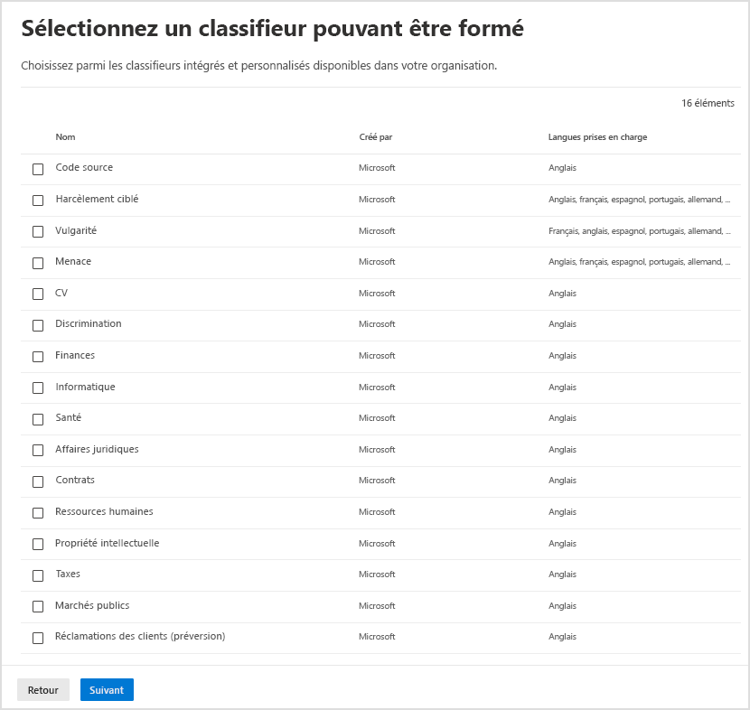

# <a name="automatically-apply-a-retention-label-to-retain-or-delete-content"></a>Application automatique d’une étiquette de rétention pour conserver ou supprimer du contenu

>*[Guide de sécurité et conformité pour les licences Microsoft 365](https://aka.ms/ComplianceSD).*

> [!NOTE]
> Ce scénario n’est pas pris en charge pour les [enregistrements réglementaires](records-management.md#records).

L’une des fonctionnalités les plus puissantes des [étiquettes de rétention](retention.md) est la possibilité de les appliquer automatiquement au contenu qui remplit certaines conditions. Dans ce cas, les membres de votre organisation n’ont pas besoin d’appliquer les étiquettes de rétention. Microsoft 365 s’en charge à leur place.
  
Les étiquettes de rétention appliquées automatiquement sont puissantes pour les raisons suivantes :
  
- Vous n’avez pas besoin de former les utilisateurs concernant l’ensemble de vos classifications.
    
- Vous n’avez pas à dépendre des utilisateurs pour classer tout le contenu correctement.
    
- Les utilisateurs n’ont plus besoin de connaître les stratégies de gouvernance des données : ils peuvent se concentrer sur leur travail.
    
Vous pouvez appliquer automatiquement des étiquettes de rétention à du contenu lorsque celui-ci contient des informations sensibles, des mots clés, des propriétés pouvant faire l’objet d’une recherche ou une correspondance pour des [classifieurs pouvant être formés](classifier-get-started-with.md).

> [!TIP]
> A présent dans l’aperçu, utiliser les propriétés de recherche pour identifier [Les enregistrements de réunion Teams](#microsoft-teams-meeting-recordings).

Les processus d’application automatique d’une étiquette de rétention sont fonction des conditions suivantes :


Utilisez les instructions suivantes pour les deux étapes d’administration.

> [!NOTE]
> Les polices automatiques utilisent l'étiquetage côté service avec des conditions pour appliquer automatiquement des étiquettes de conservation. Vous pouvez également appliquer automatiquement un label de conservation avec une politique d'étiquetage lorsque vous faites ce qui suit : 
>
> - Appliquer un label de conservation par défaut pour sharePoint et Outlook, de sorte que les contenus non étiquetés soient automatiquement étiquetés
>- Appliquer automatiquement un label de conservation au e-mail en utilisant des règles
>
> Pour ces scénarios, voir [Créer des étiquettes de rétention et les appliquer dans les applications](create-apply-retention-labels.md).

## <a name="before-you-begin"></a>Avant de commencer

L’administrateur général de votre organisation dispose de toutes les autorisations pour créer et modifier les étiquettes de rétention ainsi que leurs stratégies. Si vous ne vous connectez pas en tant qu’administrateur général, consultez [Autorisations nécessaires pour créer et gérer des stratégies et des étiquettes de rétention](get-started-with-retention.md#permissions-required-to-create-and-manage-retention-policies-and-retention-labels).

## <a name="how-to-auto-apply-a-retention-label"></a>Application automatique d’étiquettes de rétention

Tout d’abord, créez votre étiquette de rétention. Puis créez une stratégie automatique pour appliquer cette étiquette. Si vous avez déjà créé votre étiquette de rétention, passez à [création d’une stratégie automatique](#step-2-create-an-auto-apply-policy).

Les instructions de navigation varient selon que vous utilisez la [gestion des enregistrements](records-management.md) ou non. Il existe des instructions pour les deux scénarios. 

### <a name="step-1-create-a-retention-label"></a>Étape 1 : créer une étiquette de rétention

1. Dans le [Centre de conformité Microsoft 365](https://compliance.microsoft.com/), accédez à l’un des emplacements suivants :
    
    - Si vous utilisez la gestion des enregistrements :
        - **Solutions** > **Gestion des enregistrements** > **Plan de fichiers** onglet > **+ Créer une étiquette** > **Étiquette de rétention**
        
    - Si vous n’utilisez pas la gestion des enregistrements :
       - **Solutions** > **Gouvernance d’informations** > **Étiquettes** onglet > + **Créer une étiquette**
    
    Si vous ne voyez pas immédiatement votre option, sélectionnez d’abord **Tout afficher**. 

2. Suivez les invites de l’Assistant. Si vous utilisez la gestion des enregistrements :
    
    - Pour plus d’informations sur les descripteurs de plan de fichier, consultez [Utiliser le plan de gestion des fichiers pour gérer les étiquettes de rétention](file-plan-manager.md)
    
    - Pour utiliser l’étiquette de rétention pour déclarer des enregistrements, sélectionnez **Marquer les éléments comme enregistrements**, ou **Marquer les éléments comme enregistrements réglementaires**. Pour plus d’informations, consultez [Configuration des étiquettes de rétention pour déclarer les enregistrements](declare-records.md#configuring-retention-labels-to-declare-records)

3. Une fois l’étiquette créée, les options permettant de la publier s’affichent. Appliquez automatiquement l’étiquette, ou enregistrez-la simplement : sélectionnez **Appliquer automatiquement cette étiquette à un type spécifique de contenu**, puis sélectionnez **Terminé** pour démarrer l’assistant à la création d’attribution automatique d’étiquettes qui vous conduit directement à l’étape 2 de la procédure suivante.

Pour modifier une étiquette existante, sélectionnez-la, puis sélectionnez **Modifier l’étiquette** pour démarrer l’assistant à l’édition de rétention qui vous permet de modifier les descriptions d’étiquettes et les [paramètres éligibles](#updating-retention-labels-and-their-policies) à partir de l’étape 2.

### <a name="step-2-create-an-auto-apply-policy"></a>Étape 2 : créer une stratégie d’application automatique

Lorsque vous créez une stratégie d’application automatique, vous sélectionnez une étiquette de rétention pour l’appliquer automatiquement à du contenu, en fonction des conditions spécifiées.

1. Dans le [Centre de conformité Microsoft 365](https://compliance.microsoft.com/), accédez à l’un des emplacements suivants :
    
    - Si vous utilisez la gestion des enregistrements : **Gouvernance d’informations** :
        - **Solutions** > **Gestion des enregistrements** > **Stratégies des étiquettes** onglet > **Auto-appliquer une étiquette**
    
    - Si vous n’utilisez pas la gestion des enregistrements :
        - **Solutions** > **Gouvernance d’informations** > **Stratégies des étiquettes** onglet > **Auto-appliquer une étiquette**
    
    Si vous ne voyez pas immédiatement votre option, sélectionnez d’abord **Tout afficher**. 

2. Suivez les invites de l’assistant à la création d’attribution automatique d’étiquettes.
    
    Pour plus d’informations sur la configuration des conditions qui appliquent automatiquement l’étiquette de rétention, voir la section [Configuration des conditions d’application automatique des étiquettes de rétention](#configuring-conditions-for-auto-apply-retention-labels) sur cette page.
    
    Pour plus d’informations sur la prise en charge des emplacements par des étiquettes de rétention, voir la section [Étiquettes de rétention et emplacements](retention.md#retention-label-policies-and-locations).

Pour modifier une politique d'application automatique existante, sélectionnez-la pour lancer l'assistant Modifier la politique de conservation qui vous permet de modifier l'étiquette de conservation sélectionnée et tous[les paramètres admissibles](#updating-retention-labels-and-their-policies)à partir de l'étape 2.

Une fois que le contenu est étiqueté au moyen d'une politique d'étiquetage automatique, l'étiquette appliquée ne peut pas être automatiquement retirée ou modifiée en changeant le contenu ou la politique, ou par une nouvelle politique d'étiquetage automatique. Pour plus d'informations, voir [Une seule étiquette de conservation à la fois](retention.md#only-one-retention-label-at-a-time).

### <a name="configuring-conditions-for-auto-apply-retention-labels"></a>Configurer les conditions d'application automatique des étiquettes de conservation

Vous pouvez appliquer automatiquement des étiquettes de rétention au contenu quand celui-ci inclut :

- [Types spécifiques d’informations sensibles](#auto-apply-labels-to-content-with-specific-types-of-sensitive-information)

- [Mots clés spécifiques ou propriétés pouvant faire l’objet d’une recherche qui correspondent à une requête que vous créez](#auto-apply-labels-to-content-with-keywords-or-searchable-properties)

- [Correspondance pour les classifieurs entraînables](#auto-apply-labels-to-content-by-using-trainable-classifiers)

#### <a name="auto-apply-labels-to-content-with-specific-types-of-sensitive-information"></a>Application automatique d’étiquettes au contenu incluant des types spécifiques d’informations sensibles

Lorsque vous créez des stratégies d’étiquettes de rétention à appliquer automatiquement pour des informations sensibles, vous observez la même liste de modèles de stratégies que lorsque vous créez une stratégie de prévention contre la perte de données (DLP). Chaque modèle de stratégie est préconfiguré pour rechercher des types spécifiques d’informations sensibles. Par exemple, le modèle présenté ici recherche les numéros d’identification fiscale individuels américains (ITIN), les numéros de sécurité sociale et les numéros de passeport à partir de la catégorie **Confidentialité** et **du modèle de données relatives aux Informations personnelles américain** :


Pour plus d’informations sur les types d’informations sensibles, voir les [définitions d’entités de types d’informations sensibles](sensitive-information-type-entity-definitions.md).

Après avoir sélectionné un modèle de stratégie, vous pouvez ajouter ou supprimer tout type d’informations sensibles, et vous pouvez modifier le nombre d’instances et  la précision de correspondance. Dans l’exemple de capture d’écran présenté ici, une étiquette de rétention sera appliquée automatiquement uniquement dans les cas suivants :
  
- Le type d’informations sensibles détecté a une précision de correspondance (ou niveau de confiance) minimale de 75. De nombreux types d’informations sensibles sont définis avec plusieurs modèles. Tandis qu’un modèle avec une précision de correspondance plus élevée nécessite un nombre de preuves plus important (par exemple, des mots clés, des dates ou des adresses), un modèle avec une précision de correspondance inférieure nécessite moins de preuves. En d’autres termes, plus la précision de correspondance **min** est faible, plus il est facile de faire correspondre le contenu à la condition de correspondance

- Le contenu comprend entre 1 et 9 instances de chacun des trois types d’informations sensibles. Vous pouvez supprimer la valeur **à** pour la définir sur **Tous**.

Pour plus d’informations sur ces options, reportez-vous aux instructions suivantes de la documentation DLP : [Affiner les réglages pour rendre la correspondance plus ou moins précise](data-loss-prevention-policies.md#tuning-rules-to-make-them-easier-or-harder-to-match).
    


Lorsque vous utilisez des types d’informations sensibles pour appliquer automatiquement des étiquettes de rétention :

- Les éléments nouveaux et modifiés peuvent être étiquetés automatiquement.

#### <a name="auto-apply-labels-to-content-with-keywords-or-searchable-properties"></a>Application automatique d’étiquettes au contenu comprenant des mots clés ou des propriétés pouvant faire l’objet d’une recherche

Vous pouvez appliquer automatiquement des étiquettes au contenu à l’aide d’une requête qui contient des mots, des phrases ou des valeurs de propriétés pouvant faire l’objet d’une recherche. Vous pouvez affiner votre requête en utilisant des opérateurs de recherche tels que et, ou et non.


Pour plus d’informations sur la syntaxe de requête qui utilise le langage de requête de mot clé (KQL), consultez [Référence de syntaxe de langage de requête de mot clé (KQL)](https://docs.microsoft.com/sharepoint/dev/general-development/keyword-query-language-kql-syntax-reference).

Les stratégies d’application automatique basées sur une requête utilisent le même index de recherche que la recherche de contenu eDiscovery pour identifier du contenu. Pour plus d’informations sur ces propriétés utilisables dans une requête, consultez [Requêtes par mots clés et conditions de recherche pour la recherche de contenu](keyword-queries-and-search-conditions.md).

Éléments à prendre en compte lorsque vous utilisez des mots clés ou des propriétés utilisables dans une requête pour appliquer automatiquement des étiquettes de rétention

- Les éléments nouveaux, modifiés et existants sont automatiquement étiquetés pour SharePoint, OneDrive et Exchange.

- Pour SharePoint, les propriétés analysées et les propriétés personnalisées ne sont pas prises en charge pour ces requêtes KQL et vous devez utiliser uniquement des propriétés gérées prédéfinies. Toutefois, vous pouvez utiliser des mappages au niveau du client avec les propriétés gérées prédéfinies qui sont activées comme affinements par défaut (RefinableDate00-19, RefinableString00-99, RefinableInt00-49, RefinableDecimals00-09 et RefinableDouble00-09). Pour plus d’informations, consultez[vue d’ensemble des propriétés analysées et gérées dans SharePoint Server](https://docs.microsoft.com/SharePoint/technical-reference/crawled-and-managed-properties-overview)et pour obtenir des instructions, consultez [créer une propriété gérée](https://docs.microsoft.com/sharepoint/manage-search-schema#create-a-new-managed-property).

- Si vous mappez une propriété personnalisée à l’une des propriétés d’affinement, attendez 24 heures avant de l’utiliser dans votre requête KQL pour une étiquette de rétention.

- Bien que les propriétés gérées de SharePoint puissent être renommées à l’aide d’alias, ne les utilisez pas pour les requêtes KQL dans vos étiquettes. Spécifiez toujours le nom réel de la propriété gérée (par exemple, « RefinableString01 »).

- Pour rechercher les valeurs qui contiennent des espaces ou des caractères spéciaux, utilisez les guillemets (`" "`) pour contenir la phrase; par exemple `subject:"Financial Statements"`.

- Utilisez la propriété *DocumentLink* au lieu de *Path* pour faire correspondre un élément en fonction de son URL. 

- Les recherches par caractères génériques suffixées (telles que `*cat`) ou les recherches par caractères génériques de sous-chaîne (telles que `*cat*`) ne sont pas prises en charge. Cependant, les recherches par caractères génériques suffixées (telles que `cat*`) sont prises en charge.

- N’oubliez pas que les éléments partiellement indexés peuvent être responsables du non étiquetage des éléments attendus, ou de l’étiquetage des éléments que vous souhaitez exclure de l’étiquetage lorsque vous utilisez l’opérateur non. Si vous souhaitez en savoir plus, consultez  [Éléments partiellement indexés dans la recherche de contenu](partially-indexed-items-in-content-search.md).


Exemples de requêtes :

| Charge de travail | Exemple |
|:-----|:-----|
|Exchange   | `subject:"Financial Statements"` |
|Exchange   | `recipients:garthf@contoso.com` |
|SharePoint | `contenttype:document` |
|SharePoint | `site:https://contoso.sharepoint.com/sites/teams/procurement AND contenttype:document`|
|Exchange ou SharePoint | `"customer information" OR "private"`|

Exemples plus complexes :

La requête suivante pour SharePoint identifie des documents Word ou des feuilles de calcul Excel lorsque ces fichiers contiennent les mots clés **mot de passe**, **mots de passe** ou **pw**:

```
(password OR passwords OR pw) AND (filetype:doc* OR filetype:xls*)
```

La requête Exchange suivante identifie tout document Word ou PDF contenant le mot **accord de confidentialité** ou l’expression **contrat de non-divulgation** lorsque ces documents sont joints à un e-mail :

```
(nda OR "non disclosure agreement") AND (attachmentnames:.doc* OR attachmentnames:.pdf)
```

La requête SharePoint suivante identifie les documents qui contiennent un numéro de carte de crédit : 

```
sensitivetype:"credit card number"
```

La requête suivante contient des mots clés courants pour vous aider à identifier les documents ou les e-mails qui contiennent du contenu juridique :

```
ACP OR (Attorney Client Privilege*) OR (AC Privilege)
```

La requête suivante contient des mots clés courants pour vous aider à identifier les documents ou les e-mails des ressources humaines : 

```
(resume AND staff AND employee AND salary AND recruitment AND candidate)
```

Notez que ce dernier exemple utilise la pratique recommandée qui consiste à toujours inclure des opérateurs entre les mots clés. Un espace entre des mots-clés (ou deux expressions de valeur de propriété) revient au même que l’utilisation de l’opérateur AND. En ajoutant toujours des opérateurs, il est plus facile de voir que cet exemple de requête identifie uniquement le contenu qui contient tous ces mots clés, au lieu du contenu contenant tous les mots clés. Si vous avez l’intention d’identifier le contenu contenant l’un des mots clés, spécifiez ou au lieu de et. Comme cet exemple montre, lorsque vous spécifiez toujours les opérateurs, il est plus facile d’interpréter correctement la requête. 

##### <a name="microsoft-teams-meeting-recordings"></a>Enregistrements de réunion Microsoft Teams

> [!NOTE]
> La possibilité de conserver et de supprimer les enregistrements de réunions Teams est déployé dans l’aperçu et ne fonctionnera pas avant la sauvegarde des enregistrements dans OneDrive ou SharePoint. Pour plus d’informations, consultez [Utiliser OneDrive Entreprise et SharePoint Online ou Stream pour les enregistrements de réunion](https://docs.microsoft.com/MicrosoftTeams/tmr-meeting-recording-change).

Pour identifier les enregistrements de réunion Microsoft Teams stockés dans les comptes OneDrive des utilisateurs ou dans SharePoint, spécifiez les éléments suivants pour **l’éditeur de requête de mot clé**:

``` 
ProgID:Media AND ProgID:Meeting
```

La plupart du temps, les enregistrements de réunion sont enregistrés dans OneDrive. Mais les réunions de canal sont enregistrés dans SharePoint.


#### <a name="auto-apply-labels-to-content-by-using-trainable-classifiers"></a>Appliquer automatiquement des étiquettes au contenu à l’aide de classificateurs entraînables

Lorsque vous choisissez l’option de classifieur entraînable, vous pouvez sélectionner un classifieur intégré ou un classifieur personnalisé. Les classifieurs intégrés incluent : **CV**, **SourceCode**, **Harcèlement ciblé**, **Blasphème** et la **Menace** :



> [!CAUTION]
> Nous déprécions le **langage inconvenant** classifieur intégré, car il génère un grand nombre de faux positifs. N’utilisez pas ce classifieur intégré et si vous l’utilisez actuellement, vous devez déplacer vos processus métier. Nous vous recommandons d’utiliser les classifieurs intégrés de **Harcèlement ciblée** , de **blasphème** et de **Menace** à la place.

Pour appliquer automatiquement une étiquette à l’aide de cette option, les sites et boîtes aux lettres SharePoint doivent avoir au moins 10 Mo de données.

Pour plus d’informations sur les classifieurs de formation, consultez [Découvrez les classifieurs de formation (préversion)](classifier-learn-about.md).

> [!TIP]
> Si vous utilisez des classifieurs entraînables pour Exchange, voir le récent article [Comment recycler un classifieur dans l’Explorateur de contenu (préversion)](classifier-how-to-retrain-content-explorer.md).

Lorsque vous utilisez des classificateurs pouvant apprendre pour appliquer automatiquement des étiquettes de rétention :

- Les éléments nouveaux et modifiés peuvent être étiquetés automatiquement ainsi que les éléments existants des six derniers mois.

## <a name="how-long-it-takes-for-retention-labels-to-take-effect"></a>Délai d’activation des étiquettes de rétention

Lorsque vous appliquez automatiquement des étiquettes de rétention, l’application de ces étiquettes à ce contenu peut prendre jusqu’à sept jours.
  


Si les étiquettes attendues n’apparaissent pas après sept jours, consultez l’**État** de la stratégie d’application automatique en sélectionnant celle-ci dans la page des **Stratégies d’étiquette** dans le centre de conformité. Si vous voyez l’état de **Désactivé (erreur)** et dans les détails des emplacements, consultez un message indiquant qu’il prend plus de temps que prévu pour déployer la stratégie (pour SharePoint) ou essayez de redéployer la stratégie (pour OneDrive), essayez d’exécuter la commande PowerShell [RetentionCompliancePolicy](https://docs.microsoft.com/powershell/module/exchange/set-retentioncompliancepolicy) pour réessayer la distribution de la stratégie :

1. [Se connecter à l’interface PowerShell du Centre de sécurité et conformité](https://docs.microsoft.com/powershell/exchange/connect-to-scc-powershell).

2. Exécutez la commande suivante :
    
    ``` PowerShell
    Set-RetentionCompliancePolicy -Identity <policy name> -RetryDistribution
   ```

## <a name="updating-retention-labels-and-their-policies"></a>Mise à jour des étiquettes de rétention et de leurs stratégies

Lorsque vous modifiez une étiquette de rétention ou une stratégie d’application automatique et que l’étiquette de rétention est déjà appliquée au contenu, vos paramètres mis à jour sont automatiquement appliqués à ce contenu, en plus du contenu nouvellement identifié.

Certains paramètres ne peuvent pas être modifiés une fois l’étiquette ou la stratégie créée et enregistrée, notamment :
- Étiquette de rétention et le nom de la stratégie, et les paramètres de rétention à l’exception de la période de rétention. Cependant, vous ne pouvez pas modifier la période de rétention lorsque la période de rétention est basée sur la période d’étiquetage des éléments.
- Option de marquage des éléments comme enregistrement.

## <a name="locking-the-policy-to-prevent-changes"></a>Verrouillage de la stratégie pour empêcher toute modification

Si vous voulez vous assurer que personne ne peut désactiver la stratégie, supprimer la stratégie ou la rendre moins restrictive, consultez [Utiliser le Verrou de Conservation pour restreindre les modifications apportées aux stratégies de rétention et aux stratégies d’étiquette de rétention](retention-preservation-lock.md).

## <a name="next-steps"></a>Prochaines étapes

Consultez [Utiliser les étiquettes de rétention pour gérer le cycle de vie des documents stockés dans SharePoint](auto-apply-retention-labels-scenario.md) pour un exemple de scénario qui utilise une stratégie d’application automatique avec des propriétés gérées dans SharePoint et la rétention basée sur les événements pour démarrer la période de rétention.
