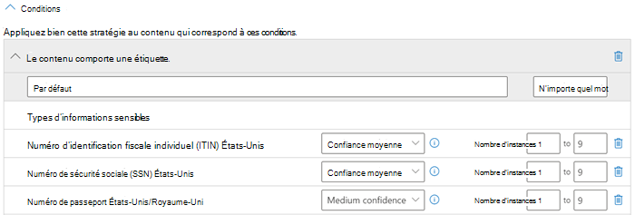

# <a name="apply-a-sensitivity-label-to-content-automatically"></a>Appliquer automatiquement une étiquette de confidentialité au contenu

>*[Guide de sécurité et conformité pour les licences Microsoft 365](/office365/servicedescriptions/microsoft-365-service-descriptions/microsoft-365-tenantlevel-services-licensing-guidance/microsoft-365-security-compliance-licensing-guidance).*

> [!NOTE]
> Pour plus d’informations sur l’application automatique d’une étiquette de sensibilité dans Azure Purview, voir [Étiquetage dans Azure Purview](/azure/purview/create-sensitivity-label).

Lorsque vous créez une étiquette de confidentialité, vous pouvez attribuer automatiquement cette étiquette au contenu lorsque celle-ci répond aux conditions que vous spécifiez.

La possibilité d’appliquer automatiquement des étiquettes à du contenu est importante pour les raisons suivantes :

- Vous n’avez pas besoin de former vos utilisateurs pour leur apprendre à utiliser chacune de vos classifications.

- Vous n’avez pas à dépendre des utilisateurs pour classer correctement tout le contenu.

- Vos utilisateurs n’ont plus besoin de connaître vos stratégies. À la place, ils peuvent porter leur attention sur leur travail.

Deux méthodes s’offrent à vous pour appliquer automatiquement une étiquette de confidentialité au contenu dans Microsoft 365 :

- **Étiquetage côté client lorsque les utilisateurs modifient des documents ou rédigent des e-mails (lorsqu’ils répondent ou transfèrent un e-mail également)** : utilisez une étiquette configurée pour l’étiquetage automatique des fichiers et des e-mails (cela inclut Word, Excel, PowerPoint et Outlook).

    Cette méthode prend en charge la recommandation d’une étiquette aux utilisateurs ainsi que l’application automatique d’une étiquette. Dans les deux cas, l’utilisateur décide d’accepter ou de refuser l’étiquette afin de garantir l’étiquetage correct du contenu. Cet étiquetage côté client présente un délai minimal pour les documents, car l’étiquette peut être appliquée avant même que le document ne soit enregistré. Cependant, toutes les applications clientes ne prennent pas en charge l’étiquetage automatique. Cette fonctionnalité est prise en charge par l’étiquetage intégré avec [certaines versions de Office](sensitivity-labels-office-apps.md#support-for-sensitivity-label-capabilities-in-apps),ainsi que le client d’étiquetage unifié Azure Information Protection.

    Pour des instructions de configuration, consultez l’article [Comment configurer l’étiquetage automatique pour les applications Office](#how-to-configure-auto-labeling-for-office-apps) sur cette page.

- **Étiquetage côté service lorsque le contenu est déjà enregistré (dans SharePoint ou dans OneDrive) ou est envoyé par e-mail (traité par Exchange Online)** : utilisez une stratégie d’étiquetage automatique.
    
    Cette méthode est également appelée étiquetage automatique des données au repos (documents dans SharePoint et dans OneDrive) et des données en transit (e-mails envoyés ou reçus par Exchange). Dans le cas d’Exchange, cela n’inclut pas les e-mails au repos (boîtes aux lettres).
    
    Comme cet étiquetage est appliqué par les services plutôt que par les applications, vous n’avez pas à vous soucier des applications des utilisateurs et de leur version. Par conséquent, cette fonctionnalité est immédiatement disponible dans toute l’organisation et est appropriée pour l’étiquetage à grande échelle. Les stratégies d’étiquetage automatique ne prennent pas en charge l’étiquetage recommandé, car l’utilisateur n’interagit pas avec le processus d’étiquetage. Au lieu de cela, l’administrateur exécute les stratégies dans la simulation pour garantir l’étiquetage correct du contenu avant d’appliquer réellement l’étiquette.

    Pour des instructions de configuration, consultez l’article [Configurer les stratégies d’étiquetage automatique pour SharePoint, OneDrive et Exchange](#how-to-configure-auto-labeling-policies-for-sharepoint-onedrive-and-exchange) sur cette page.
    
    Spécifique à l’étiquetage automatique pour SharePoint et OneDrive :
    
    - Les fichiers Office de Word (.docx), PowerPoint (.pptx) et Excel (.xlsx) sont pris en charge.
        - Ces fichiers peuvent être étiquetés automatiquement au repos avant ou après la création des stratégies d’étiquette automatique. Les fichiers ne peuvent pas être étiquetés automatiquement s’ils font partie d’une session ouverte (le fichier est ouvert).
        - Les pièces jointes aux éléments de liste ne sont actuellement pas prises en charge et ne seront pas étiquetées automatiquement.
    - Jusqu’à 25 000 fichiers automatiquement étiquetés dans votre client par jour.
    - Maximum de 100 politiques d'étiquetage automatique par locataire, chacune visant jusqu'à 100 sites (SharePoint ou OneDrive) lorsqu'elles sont spécifiées individuellement. Vous pouvez également spécifier tous les sites, et cette configuration est exemptée du maximum de 100 sites.
    - Les valeurs existantes pour les valeurs modifiées, modifiées par et la date ne sont pas modifiées en raison des stratégies d’étiquetage automatique, pour le mode de simulation et le moment où les étiquettes sont appliquées.
    - Lorsque l’étiquette applique le chiffrement, [l’émetteur des droits de gestion et le propriétaire de la gestion des droits](/azure/information-protection/configure-usage-rights#rights-management-issuer-and-rights-management-owner) correspond au dernier compte qui a modifié le fichier. Si ce compte n’est plus dans Azure Active Directory Domain Services, l’étiquette ne sera pas appliquée, car ces valeurs ne peuvent pas être définies.

    Spécifique à l’étiquetage automatique pour Exchange :
    
    - Contrairement à l’étiquetage manuel ou à l’étiquetage automatique avec les applications Office, les pièces jointes au format PDF ainsi que les pièces jointes Office sont également analysées pour les conditions que vous spécifiez dans votre stratégie d’étiquetage automatique. Lorsqu’une correspondance est trouvée, l’e-mail est étiqueté, mais pas la pièce jointe.
        - Pour les fichiers PDF, si l’étiquette applique le chiffrement, ces fichiers sont chiffrés à l’aide du [Chiffrement de messages Office 365 (OME)](ome.md) lorsque votre client est [activé pour les pièces jointes PDF](ome-faq.yml#are-pdf-file-attachments-supported-).
        - Ces fichiers Office sont pris en charge dans Word, PowerPoint et Excel. Si l’étiquette applique le chiffrement, elles sont chiffrées à l’aide de [chiffrement de messages Office 365 (OME)](ome.md).
    - Si vous disposez de règles de flux de messagerie Exchange ou de stratégies de protection contre la perte de données (DLP) qui appliquent le chiffrement IRM : l’étiquette est appliquée lorsque le contenu est identifié par ces règles ou ces stratégies et par une stratégie d’étiquetage automatique. Si cette étiquette applique le chiffrement, les paramètres IRM des règles de flux de messagerie Exchange ou des stratégies de protection contre la perte de données sont ignorés. Toutefois, si cette étiquette n’applique pas le chiffrement, les paramètres IRM des règles de flux de messagerie ou des stratégies de protection contre la perte de données sont appliqués en plus de l’étiquette.
    - Les e-mails dont le chiffrement IRM n’a pas d’étiquette sont remplacés par une étiquette avec tous les paramètres de chiffrement lorsqu’il existe une correspondance à l’aide de l’étiquetage automatique.
    - Les e-mails entrant sont étiquetés lorsqu’il existe une correspondance avec vos conditions d’étiquetage automatique. Si cette étiquette est configurée pour [chiffrement](encryption-sensitivity-labels.md), ce chiffrement est toujours appliqué lorsque l’expéditeur est de votre organisation. Par défaut, ce chiffrement n’est pas appliqué lorsque l’expéditeur est en dehors de votre organisation, mais peut être appliqué en configurant **Paramètres supplémentaires pour messagerie** et en spécifiant un propriétaire Rights Management.
    - Lorsque l’étiquette applique le chiffrement, l’[émetteur Rights Management et propriétaire Rights Management](/azure/information-protection/configure-usage-rights#rights-management-issuer-and-rights-management-owner) est la personne qui envoie l’e-mail lorsque l’expéditeur est de votre propre organisation. Lorsque l’expéditeur est en dehors de votre organisation, vous pouvez spécifier un propriétaire Rights Management pour les e-mails entrants étiquetés et chiffrés par votre stratégie.
    - Si l’étiquette est configurée pour appliquer [marquages dynamiques](sensitivity-labels-office-apps.md#dynamic-markings-with-variables), sachez que pour les e-mails entrants, cette configuration peut entraîner l’affichage des noms des personnes extérieures à votre organisation.

## <a name="compare-auto-labeling-for-office-apps-with-auto-labeling-policies"></a>Comparer l’étiquetage automatique pour les applications Office et les stratégies d’étiquetage automatique

Utilisez le tableau suivant pour vous aider à déterminer les différences de comportement de ces deux méthodes d’étiquetage automatiques complémentaires :

|Fonctionnalité ou comportement|Paramètre de l’étiquette : étiquetage automatique des fichiers et des e-mails  |Stratégie : étiquetage automatique|
|:-----|:-----|:-----|
|Dépendance de l’application|Oui ([versions minimales](sensitivity-labels-office-apps.md#support-for-sensitivity-label-capabilities-in-apps)) |Non \* |
|Limiter par emplacement|Non |Oui |
|Conditions : classifieurs formés|Oui |Non |
|Conditions : options de partage et options supplémentaires pour le courrier électronique|Non |Oui |
|Conditions : exceptions|Non |Oui (e-mail uniquement) |
|Recommandations, info-bulle de stratégie et remplacements de l’utilisateur|Oui |Non |
|Mode simulation|Non |Oui |
|Pièces jointes Exchange vérifiées pour les conditions|Non | Oui|
|Appliquer des marquages visuels |Oui |Oui (e-mail uniquement) |
|Remplacer le chiffrement IRM appliqué sans étiquette|Oui, si l’utilisateur dispose du droit d’utilisation minimal d’exportation |Oui (e-mail uniquement) |
|Étiquette du courrier électronique entrant|Non |Oui|
|Affecter un propriétaire Rights Management pour les e-mails envoyés à partir d’une autre organisation |Non |Oui|
|Pour les e-mails, remplacez l’étiquette existante ayant la même priorité ou une priorité inférieure |Non |Oui (configurable)|

\* L’étiquetage automatique n’est actuellement pas disponible dans toutes les régions en raison d’une dépendance Azure back-end. Si votre client ne prend pas en charge cette fonctionnalité, l’onglet **Étiquetage automatique** ne s’affiche pas dans le Centre de conformité. Pour plus d’informations, voir [Disponibilité des dépendances Azure par pays](/troubleshoot/azure/general/dependency-availability-by-country).

## <a name="how-multiple-conditions-are-evaluated-when-they-apply-to-more-than-one-label"></a>Comment plusieurs conditions sont évaluées lorsqu’elles s’appliquent à plusieurs étiquettes

Les étiquettes sont classées pour évaluation en fonction de leur position que vous spécifiez dans la stratégie: l’étiquette positionné a tout d’abord la position la plus basse (au moins sensible) et l’étiquette positionnée a dernière position plus élevée (plus sensible). Pour plus d’informations sur la priorité, voir [Priorité étiquettes (ordre aspects importants)](sensitivity-labels.md#label-priority-order-matters).

## <a name="dont-configure-a-parent-label-to-be-applied-automatically-or-recommended"></a>Ne configurez pas une étiquette parent pour l’appliquer automatiquement ou la recommander.

Une étiquette parent (une étiquette comportant des sous-étiquettes) ne peut pas être appliquée au contenu. Assurez-vous de ne pas configurer d’étiquette parent pour qu’elle soit appliquée automatiquement ou recommandée dans les applications Office ; ne sélectionnez pas d’étiquette parent pour une stratégie d’attribution automatique d’étiquette. Dans le cas contraire, l’étiquette parent ne sera pas appliquée au contenu.

Pour utiliser l’étiquetage automatique avec des sous-étiquettes, assurez-vous de publier l’étiquette parent et la sous-étiquette.

Pour en savoir plus sur les étiquettes parents et les sous-étiquettes, consultez la section [Sous-étiquettes (regroupement d’étiquettes)](sensitivity-labels.md#sublabels-grouping-labels).

## <a name="will-an-existing-label-be-overridden"></a>Une étiquette existante sera-t-elle remplacée ?

> [!NOTE]
> Un paramètre récemment ajouté pour les stratégies d’étiquetage automatique des e-mails vous permet de spécifier qu’une étiquette de confidentialité correspondante remplacera toujours une étiquette existante.

Comportement par défaut indiquant si l’étiquetage automatique remplace une étiquette existante :

- Lorsque le contenu a été étiqueté manuellement, cette étiquette ne sera pas remplacée par l’étiquetage automatique.

- L’étiquetage automatique remplace une [étiquette de confidentialité de priorité inférieure](sensitivity-labels.md#label-priority-order-matters) qui a été appliquée automatiquement, mais pas une étiquette de priorité plus élevée.
    
    > [!TIP]
    > Par exemple, l’étiquette de confidentialité en haut de la liste dans le centre de conformité est nommée **Public** avec un numéro de commande (priorité) de 0, et l’étiquette de confidentialité en bas de la liste est nommée **Très Confidentiel** avec un numéro de commande (priorité de 4). L’étiquette **Très Confidentiel** peut remplacer l’étiquette **Public** mais pas l’inverse.

Pour les stratégies d’étiquetage automatique des e-mails uniquement, vous pouvez sélectionner un paramètre pour toujours remplacer une étiquette de confidentialité existante, quelle que soit la façon dont elle a été appliquée.

|Étiquette existante |Remplacer par le paramètre d’étiquette : étiquetage automatique pour les fichiers et les e-mails  |Remplacer par la stratégie : étiquetage automatique|
|:-----|:-----|:-----|
|Appliqué manuellement, n’importe quelle priorité|Word, Excel, PowerPoint : Non <br /><br> Outlook : Non  |SharePoint et OneDrive : Non <br /><br> Exchange : Non par défaut, mais configurable |
|Application automatique ou étiquette par défaut de la stratégie, priorité inférieure |Word, Excel, PowerPoint : Oui <br /><br> Outlook : Oui | SharePoint et OneDrive : Oui <br /><br> Exchange : Oui |
|Application automatique ou étiquette par défaut de la stratégie, priorité supérieure |Word, Excel, PowerPoint : Non <br /><br> Outlook : Non |SharePoint et OneDrive : Non <br /><br> Exchange : Non par défaut, mais configurable |

Le paramètre configurable pour les stratégies d’étiquetage automatique de l’e-mail se trouve sur la page **Paramètres supplémentaires pour le courrier électronique**. Cette page s’affiche une fois que vous avez sélectionné une étiquette de confidentialité pour une stratégie d’étiquetage automatique qui inclut l’emplacement Exchange.

## <a name="how-to-configure-auto-labeling-for-office-apps"></a>Comment configurer l’étiquetage automatique pour les applications Office

Pour l’étiquetage intégré dans Office applications, vérifiez les [versions](sensitivity-labels-office-apps.md#support-for-sensitivity-label-capabilities-in-apps) minimales requises pour l’étiquetage automatique dans Office applications.

Le client d'étiquetage unifié Azure Information Protection prend en charge l'étiquetage automatique uniquement pour les types d'informations sensibles intégrés et personnalisés, et ne prend pas en charge les classificateurs pouvant être formés ou les types d'informations sensibles qui utilisent la correspondance exacte des données (EDM) ou les entités nommées.

Les paramètres d’étiquetage automatique des applications Office sont disponibles lorsque vous [créer ou modifier une étiquette de confidentialité](create-sensitivity-labels.md). Assurez-vous que **Fichiers et e-mails** est sélectionné comme étendue de l’étiquette :


À mesure que vous avancez dans la configuration, vous voyez la page **Étiquetage automatique pour les fichiers et e-mails** dans laquelle vous pouvez choisir parmi une liste de types d’informations sensibles ou de classifieurs pouvant être formés :


Lorsqu’une étiquette de confidentialité est appliquée automatiquement, l’utilisateur voit une notification dans son application Office. Par exemple :


### <a name="configuring-sensitive-info-types-for-a-label"></a>Configuration des types d’informations sensibles pour une étiquette

Lorsque vous sélectionnez l’option **Types d’informations sensibles**, vous voyez la même liste de types d’informations sensibles que lorsque vous créez une stratégie de protection contre la perte de données (DLP). Par exemple, vous pouvez appliquer automatiquement une étiquette Hautement confidentiel à tout contenu contenant les informations personnelles des clients, tels que les numéros de carte de crédit, les numéros de sécurité sociale ou les numéros de passeport :


De même, lorsque vous configurez les stratégies DLP, vous pouvez affiner votre condition en modifiant le nombre d’instances et la précision de correspondance. Par exemple :



Vous pouvez en savoir plus sur ces options de configuration dans la documentation de DLP : [Optimisation des règles pour une correspondance plus facile ou plus difficile](data-loss-prevention-policies.md#tuning-rules-to-make-them-easier-or-harder-to-match).

> [!IMPORTANT]
> Les types d’informations sensibles ont deux manières différentes de définir le nombre maximal de paramètres de d’instances uniques. Pour plus d’informations, consultez [Valeurs prises en charge par le nombre d’instances pour SIT](create-a-custom-sensitive-information-type.md#instance-count-supported-values-for-sit).

De même, comme pour la configuration de la stratégie DLP, vous pouvez choisir si une condition doit détecter tous les types d’informations sensibles, ou un seul d’entre eux. Pour rendre vos conditions plus flexibles ou complexes, vous pouvez ajouter[ groups et utiliser des opérateurs](data-loss-prevention-policies.md).

> [!NOTE]
> L’étiquetage automatique basé sur des types d’informations sensibles personnalisés s’applique uniquement au contenu nouvellement créé ou modifié dans OneDrive et SharePoint ; pas au contenu existant. Cette limitation s’applique également aux stratégies d’étiquetage automatique.

#### <a name="custom-sensitive-information-types-with-exact-data-match"></a>Types d’informations sensibles personnalisés à l’aide de la correspondance de données exacte

Vous pouvez configurer une étiquette de confidentialité pour utiliser des [types d’informations sensibles basés sur des correspondances de données exactes](sit-learn-about-exact-data-match-based-sits.md#learn-about-exact-data-match-based-sensitive-information-types) pour les types d’informations sensibles personnalisés. Toutefois, actuellement, vous devez également spécifier au moins un type d’informations sensibles qui n’utilise pas EDM. Par exemple, l’un des types d’informations sensibles intégrés, comme **Numéro de carte de crédit**.

Si vous configurez une étiquette de confidentialité avec uniquement EDM comme condition de type d’informations sensibles, le paramètre d’étiquetage automatique est automatiquement désactivé pour l’étiquette.

### <a name="configuring-trainable-classifiers-for-a-label"></a>Configuration des classifieurs pouvant être formés pour une étiquette

Si vous utilisez cette option avec Microsoft 365 Apps pour Windows version 2106 ou inférieure, ou Microsoft 365 Apps pour Mac version 16.50 ou inférieure, assurez-vous que vous avez publié dans votre locataire au moins une autre étiquette de sensibilité configurée pour l'étiquetage automatique et l'[option des types d'informations sensibles](#configuring-sensitive-info-types-for-a-label). Cette exigence n’est pas nécessaire lorsque vous utilisez des versions ultérieures sur ces plateformes.

Lorsque vous sélectionnez l’option **Classifieurs pouvant être formés**, sélectionnez un ou plusieurs classifieurs pouvant être formés ou personnalisés :


> [!CAUTION]
> Nous déconseillons le classificateur **Langage choquant** pré-formé, car il a produit un grand nombre de faux positifs. N’utilisez pas ce classificateur et si vous l’utilisez actuellement, nous vous recommandons de déplacer vos processus d’entreprise hors de celui-ci et d’utiliser plutôt les classifieurs pré-formés **Harcèlement ciblé**, **Vulgarité** et **Menace**.

Pour plus d’informations sur ces classifieurs, voir [En savoir plus sur les classifieurs de formation](classifier-learn-about.md).

### <a name="recommend-that-the-user-applies-a-sensitivity-label"></a>Recommander que l’utilisateur applique une étiquette de critère de sensibilité

Si vous le souhaitez, vous pouvez recommander à vos utilisateurs qu’ils appliquent l’étiquette. Cette option permet à vos utilisateurs d’accepter la classification et toute protection associée ou faire disparaitre la valeur recommandée si l’étiquette n’est pas adaptée à leur contenu.


Voici un exemple d’une invite du client de l’étiquetage unifié d’Azure Information Protection lorsque vous configurez une condition pour appliquer une étiquette comme action recommandée avec un conseil de stratégie personnalisé. Vous pouvez choisir le texte qui s’affiche dans le conseil de stratégie.


### <a name="when-automatic-or-recommended-labels-are-applied"></a>Quand les étiquettes automatiques ou recommandées sont appliquées

L’implémentation de l’étiquetage automatique et recommandé dans les applications Office varie selon que vous utilisez l’étiquetage intégré à Office ou le client de l’étiquetage unifié d’Azure Information Protection. Toutefois, dans les deux cas :

- Vous ne pouvez pas utiliser l’étiquetage automatique pour les documents et les e-mails qui ont été précédemment étiquetés manuellement ou automatiquement avec un niveau de confidentialité supérieur. N’oubliez pas que vous ne pouvez appliquer qu’une seule étiquette de confidentialité à un document ou un e-mail (en plus d’une seule étiquette de rétention).

- Vous ne pouvez pas utiliser l’étiquetage recommandé pour les documents ou e-mails qui ont été précédemment étiquetés avec un niveau de confidentialité supérieur. Lorsque le contenu est déjà étiqueté avec un niveau de confidentialité supérieur, l’utilisateur ne voit pas l’invite avec la recommandation et le conseil de stratégie.

Spécifique à l’étiquetage intégré :

- Les applications Office ne prennent pas toutes en charge l’étiquetage automatique (et recommandé). Pour plus d’informations, voir [Prise en charge des fonctionnalités d’étiquettes de confidentialité dans les applications](sensitivity-labels-office-apps.md#support-for-sensitivity-label-capabilities-in-apps).

- Pour les étiquettes recommandées dans les versions de bureau de Word, le contenu sensible ayant déclenché la recommandation est signalé de sorte que les utilisateurs puissent examiner et supprimer le contenu sensible au lieu d’appliquer l’étiquette de confidentialité recommandée.

- Pour plus d’informations sur l’application de ces étiquettes dans les applications Office, les captures d’écran et la détection d’informations sensibles, voir [Appliquer ou recommander automatiquement des étiquettes de confidentialité à vos fichiers et e-mails dans Office](https://support.microsoft.com/office/automatically-apply-or-recommend-sensitivity-labels-to-your-files-and-emails-in-office-622e0d9c-f38c-470a-bcdb-9e90b24d71a1).

Spécifique au client d’étiquetage unifié Azure Information Protection :

- L’étiquetage automatique et recommandé s’applique à Word, Excel et PowerPoint lors de l’enregistrement d’un document et à Outlook lorsque vous envoyez un courrier électronique.

- Pour qu’Outlook prenne en charge l’étiquetage recommandé, vous devez commencer par configurer un [paramètre de stratégie avancé](/azure/information-protection/rms-client/clientv2-admin-guide-customizations#enable-recommended-classification-in-outlook).

- Les informations sensibles peuvent être détectées dans le corps de texte dans les documents et les courriers électroniques, ainsi que dans les en-têtes et pieds de page, mais pas dans la ligne d’objet ni dans les pièces jointes du courrier électronique.

## <a name="how-to-configure-auto-labeling-policies-for-sharepoint-onedrive-and-exchange"></a>Configurer les stratégies d’étiquetage automatique pour SharePoint, OneDrive et Exchange

N’oubliez pas de connaître les conditions préalables avant de configurer les stratégies d’attribution automatique d’étiquette.

### <a name="prerequisites-for-auto-labeling-policies"></a>Conditions préalables pour les stratégies d’étiquetage automatique

- Mode de simulation :
  - L’audit de Microsoft 365 doit être activé. Si vous devez activer l’audit ou si vous ne savez pas si l’audit est déjà activé, consultez [Activez ou désactivez la recherche dans le journal d’audit](turn-audit-log-search-on-or-off.md).
  - Pour afficher le contenu d’un fichier ou d’un e-mail dans la vue source, vous devez disposer du rôle **Visionneuse de contenu de classification des données**, qui est inclus dans le groupe de rôles **Visionneuse de contenu de l’Explorateur de contenu**  ou les groupes de rôles **Information Protection** et **Investigateurs Information Protection** (actuellement en préversion). Sans le rôle requis, vous ne voyez pas le volet d’aperçu lorsque vous sélectionnez un élément à partir de l’onglet **Éléments correspondants**. Les administrateurs généraux n’ont pas ce rôle par défaut.

- Pour étiqueter automatiquement des fichiers dans SharePoint et OneDrive :
  - Vous avez [activé les étiquettes de confidentialité pour les fichiers Office dans SharePoint et OneDrive](sensitivity-labels-sharepoint-onedrive-files.md).
  - Lors de l’exécution de la stratégie d’étiquetage automatique, le fichier ne doit pas être ouvert par un autre processus ni un autre utilisateur. Un fichier examiné pour la modification est inclus dans cette catégorie.

- Si vous envisagez d’utiliser des [types d’informations sensibles personnalisés](sensitive-information-type-learn-about.md) plutôt que les types de sensibilité prédéfinis :
  - Les types d’informations de confidentialité personnalisées s’appliquent uniquement au contenu ajouté ou modifié dans SharePoint ou OneDrive une fois les types d’informations de confidentialité personnalisés créés.
  - Pour tester de nouveaux types d’informations sensibles personnalisés, créez-les avant de créer votre stratégie d’étiquetage automatique, puis créez de nouveaux documents avec des exemples de données pour pouvoir les tester.

- Une ou plusieurs étiquettes de confidentialité [créées et publiées ](create-sensitivity-labels.md)(à au moins un utilisateur) que vous pouvez sélectionner pour vos stratégies d’étiquetage automatique. Pour ces étiquettes : 
  - Cela n’a pas d’importance si le paramètre d’étiquetage automatique dans les applications Office est activé ou désactivé, car ce paramètre d’étiquette complète les stratégies d’étiquetage automatique, comme expliqué dans l’introduction.
  - Si les étiquettes que vous souhaitez utiliser pour l'étiquetage automatique sont configurées pour utiliser des marquages visuels (en-têtes, pieds de page, filigranes), notez que ceux-ci ne sont pas appliqués aux documents.
  - Si les étiquettes appliquent le [chiffrement](encryption-sensitivity-labels.md) :
    - Lorsque la stratégie d’étiquetage automatique inclut des emplacements pour SharePoint ou OneDrive, vous devez configurer l’étiquette pour le paramètre **Attribuer des autorisations maintenant**.
    - Lorsque la stratégie d’étiquetage automatique s’applique uniquement à Exchange, vous pouvez configurer l’étiquette pour **Attribuer des autorisations maintenant** ou **Autoriser les utilisateurs à attribuer des autorisations** (pour les options Ne pas transférer ou Chiffrer uniquement).

### <a name="learn-about-simulation-mode"></a>En savoir plus sur le mode simulation

Le mode simulation est propre aux stratégies d’étiquetage automatique et est intégré au flux de travail. Vous ne pourrez étiqueter automatiquement les documents et les courriers que lorsque votre stratégie aura exécuté au moins une simulation.

Le mode simulation prend en charge jusqu’à 1 000 000 fichiers mis en correspondance. Si le nombre de fichiers correspond à un nombre supérieur à celui d’une stratégie d’étiquetage automatique, vous ne pouvez pas activer la stratégie pour appliquer les étiquettes. Dans ce cas, vous devez reconfigurer la politique d'étiquetage automatique de manière à ce que moins de fichiers soient mis en correspondance, puis relancer la simulation. Ce maximum de 1 000 000 fichiers mis en correspondance s’applique uniquement au mode simulation et non à une stratégie d’étiquetage automatique déjà activée pour appliquer des étiquettes de confidentialité.

Flux de travail pour une stratégie d’étiquetage automatique :

1. Créer et configurer une stratégie d’étiquetage automatique.

2. Exécutez la stratégie en mode de simulation, ce qui peut prendre 12 heures. La simulation effectuée déclenche une notification par courrier qui est envoyée à l’utilisateur configuré pour recevoir les [alertes d’activité](alert-policies.md).

3. Examinez les résultats et, si nécessaire, affinez votre stratégie. Par exemple, vous devrez peut-être modifier les règles de stratégie pour réduire les faux positifs ou supprimer certains sites afin que le nombre de fichiers correspondants ne dépasse pas 1 000 000. Réexécutez le mode de simulation et attendez sa fin.

4. Répétez l’étape 3 si besoin.

5. Déployez en production.

Le déploiement simulé s’exécute comme le paramètre WhatIf pour PowerShell. Vous voyez les résultats signalés comme si la stratégie d’étiquetage automatique avait appliqué l’étiquette sélectionnée en utilisant les règles que vous avez définies. Vous pouvez ensuite affiner vos règles de précision si nécessaire et exécuter de nouveau la simulation. Cependant, comme l'étiquetage automatique pour Exchange s'applique aux courriels envoyés et reçus, plutôt qu'aux courriels stockés dans les boîtes aux lettres, ne vous attendez pas à ce que les résultats pour les courriels dans une simulation soient cohérents, à moins que vous puissiez envoyer et recevoir exactement les mêmes courriels.

Le mode simulation vous permet également d’augmenter progressivement l’étendue de votre stratégie d’étiquetage automatique avant de procéder au déploiement. Par exemple, vous pouvez commencer avec un seul emplacement, comme un site SharePoint, avec une seule bibliothèque de documents. Ensuite, avec des modifications itératives, augmentez l’étendue sur plusieurs sites, puis sur un autre emplacement, comme OneDrive.

Enfin, vous pouvez utiliser le mode simulation pour fournir une approximation du temps nécessaire à l’exécution de votre stratégie d’étiquetage automatique et pour vous aider à planifier et à programmer l’exécution sans le mode simulation.

#### <a name="deleted-onedrive-accounts-and-simulation-results"></a>Comptes OneDrive supprimés et résultats de simulation

Attendez-vous à des différences d’affichage possibles dans les résultats de la simulation lorsque les comptes OneDrive supprimés sont toujours à [l’étape de rétention du processus de suppression](/onedrive/retention-and-deletion#the-onedrive-deletion-process). Par exemple, un employé a quitté l’organisation et son responsable dispose d’un accès temporaire aux fichiers OneDrive de cet utilisateur.

Dans ce scénario, si le compte OneDrive a été spécifié par URL dans la stratégie d’étiquetage automatique, les fichiers correspondants du compte OneDrive supprimé sont inclus dans les résultats de la simulation.

Toutefois, si le compte OneDrive n’a pas été spécifié par l’URL, mais a été inclus dans le paramètre par défaut **Tous** :
- Lorsque l’emplacement SharePoint est inclus dans la stratégie, les fichiers correspondants du compte OneDrive supprimé s’affichent en tant qu’éléments SharePoint dans les résultats de la simulation.
- Lorsque l’emplacement SharePoint n’est pas inclus dans la stratégie, les fichiers correspondants du compte OneDrive supprimé ne sont pas inclus dans les résultats de la simulation.

Dans tous les cas, les fichiers correspondants sont étiquetés jusqu’à ce que le compte OneDrive soit définitivement supprimé. Les différences d’affichage répertoriées s’appliquent uniquement aux résultats de simulation.

### <a name="creating-an-auto-labeling-policy"></a>Création d’une stratégie d’étiquetage automatique

1. Dans le <a href="https://go.microsoft.com/fwlink/p/?linkid=2077149" target="_blank">Centre de conformité Microsoft 365</a>, accédez aux étiquettes de confidentialité :

    - **Solutions** > **Information protection**

    Si vous ne voyez pas immédiatement cette option, sélectionnez tout d’abord **Tout afficher**.

2. Sélectionnez l’onglet **Étiquetage automatique** :

    

    > [!NOTE]
    > Si vous ne voyez pas l’onglet **Étiquetage azure**, cette fonctionnalité n’est pas disponible dans votre région en raison d’une dépendance Azure principale. Pour plus d’informations, consultez [ Disponibilité des dépendances Azure par country](/troubleshoot/azure/general/dependency-availability-by-country).

3. Sélectionnez **+ créer une stratégie d’étiquetage automatique**. Cette opération démarre la Nouvelle configuration de stratégie :

    

4. Pour la page **Choisir les informations auxquelles vous souhaitez appliquer cette étiquette** : sélectionnez un modèle, par exemple, **Financier** or **Confidentialité**. Vous pouvez affiner votre recherche à l’aide du menu déroulant **Afficher les options pour**. Vous pouvez également sélectionner **Stratégie personnalisée** si les modèles ne répondent pas à vos besoins. Sélectionnez **Suivant**.

5. Pour la page **Nommer votre stratégie d’étiquetage automatique** : donnez un nom unique et éventuellement une description pour vous aider à identifier l’étiquette, les emplacements et les conditions appliqués automatiquement qui identifient le contenu à étiqueter.

6. Pour la page **Choisir les emplacements dans lesquels vous souhaitez appliquer l’étiquette** : sélectionner et spécifier les emplacements pour Exchange, SharePoint et OneDrive. Si vous ne souhaitez pas conserver la valeur par défaut de **Tout** pour les emplacements choisis, sélectionnez le lien pour choisir des instances spécifiques à inclure, ou sélectionnez le lien pour choisir des instances spécifiques à exclure. Ensuite, sélectionnez **Suivant**.

    
    
    Pour spécifier des comptes OneDrive individuels, consultez [Obtenir la liste de toutes les URL OneDrive des utilisateurs de votre organisation.](/onedrive/list-onedrive-urls)

7. Pour la page **Configurer des règles communes ou avancées** : conservez la valeur par défaut de **Règles communes** pour définir des règles qui identifient le contenu à étiqueter dans tous vos emplacements sélectionnés. Si vous avez besoin de règles différentes par emplacement, sélectionnez **Règles avancées**. Sélectionnez ensuite **Suivant**.

    Les règles utilisent des conditions qui incluent des types d’informations sensibles et des options de partage :
    - Vous pouvez sélectionner des types d’informations sensibles intégrés et personnalisés.
    - Pour les options partagées, vous pouvez choisir **uniquement avec des personnes au sein de mon organisation** ou **avec des personnes extérieures à mon organisation**.

    Si votre seul emplacement est **Exchange**, ou si vous sélectionnez **Règles avancées**, vous pouvez sélectionner d'autres conditions :
    - L’adresse IP de l’expéditeur est
    - Le domaine du destinataire est
    - Le destinataire est
    - L’extension du fichier de pièce jointe est
    - La pièce jointe est protégée par mot de passe
    - Le contenu de la pièce jointe n’a pas pu être analysé
    - L’analyse du contenu de la pièce jointe n’a pas été terminée
    - L’en-tête correspond aux modèles
    - L’objet correspond aux modèles
    - L'adresse du destinataire contient les mots
    - L’adresse du destinataire correspond aux modèles
    - L’adresse de l’expéditeur correspond aux modèles
    - Le domaine de l’expéditeur est
    - Le destinataire est membre de
    - L’expéditeur est

    Pour chacune de ces conditions, vous pouvez ensuite spécifier des exceptions.

8. Selon vos choix précédents, vous aurez maintenant la possibilité de créer des règles à l’aide de conditions et d’exceptions.

    Les options de configuration pour les types d’informations sensibles sont identiques à celles que vous sélectionnez pour l’étiquetage automatique pour les applications Office. Si vous souhaitez en savoir plus, consultez l’article [Configuration des types d’informations sensibles pour une étiquette](#configuring-sensitive-info-types-for-a-label).

    Lorsque vous avez défini toutes les règles dont vous avez besoin et confirmé que leur statut est activé, sélectionnez **Suivant** pour passer au choix d'une étiquette à appliquer automatiquement.

9. Pour la page **Choisir une étiquette à appliquer automatiquement** : sélectionnez **+ Choisir une étiquette**, puis, sélectionnez une étiquette dans le volet **Choisir une étiquette de confidentialité**, et enfin, sélectionnez **Suivant**.

10. Si votre stratégie inclut l’emplacement Exchange : spécifiez des configurations facultatives dans la page **Paramètres supplémentaires pour la messagerie** :
    
    - **Remplacez automatiquement les étiquettes existantes ayant la même priorité ou une priorité inférieure**: applicable aux e-mails entrants et sortants, lorsque vous sélectionnez ce paramètre, une étiquette de confidentialité correspondante est toujours appliquée. Si vous ne sélectionnez pas ce paramètre, une étiquette de confidentialité correspondante ne sera pas appliquée aux e-mails qui ont une étiquette de confidentialité existante avec une [priorité plus élevée](sensitivity-labels.md#label-priority-order-matters) ou qui ont été étiquetés manuellement.
    
    - **Application du chiffrement aux e-mails reçus en dehors de votre organisation** : lorsque vous sélectionnez cette option, vous devez attribuer un [propriétaire de Gestion des droits](/azure/information-protection/configure-usage-rights#rights-management-issuer-and-rights-management-owner) pour vous assurer qu’une personne autorisée de votre organisation dispose [des droits utilisateur](/azure/information-protection/configure-usage-rights#usage-rights-and-descriptions) de contrôle total pour les e-mails envoyés en dehors de votre organisation et vos étiquettes de stratégie avec chiffrement. Ce rôle peut être nécessaire pour supprimer ultérieurement le chiffrement ou attribuer différents droits d’utilisation pour les utilisateurs de votre organisation.
        
        Pour **Affecter un propriétaire Rights Management**, spécifiez un utilisateur unique par une adresse e-mail appartenant à votre organisation. Ne spécifiez pas de contact de messagerie, de boîte aux lettres partagée ou de type de groupe, car ceux-ci ne sont pas pris en charge pour ce rôle.

10. Pour la page **Décider si vous voulez tester la stratégie maintenant ou plus tard** : sélectionnez **Exécuter la stratégie en mode de simulation** si vous êtes prêt à exécuter la stratégie d’étiquetage automatique maintenant, en mode simulation. Sinon, sélectionnez **Quitter la stratégie désactivée**. Sélectionnez **Suivant** :

    

11. Pour la page **Résumé** : consultez la configuration de votre stratégie d’étiquetage automatique et apportez les modifications nécessaires, puis terminez la configuration.

Désormais, sur la page **Protection des informations**  >  onglet **Etiquetage automatique**, vous pouvez voir votre stratégie d’attribution automatique dans les sections **Simulation** ou **Désactivée**, selon que vous avez choisi de l’exécuter en mode de simulation ou non. Sélectionnez votre stratégie pour afficher les détails de la configuration et de son état (par exemple, **La simulation de stratégie est en cours d’exécution**). Pour les stratégies en mode simulation, sélectionnez l’onglet **éléments correspondants** pour afficher les messages électroniques ou les documents correspondants aux règles que vous avez spécifiées.

Vous pouvez modifier votre stratégie directement à partir de cette interface :

- Pour une stratégie dans la section **Désactivé**, sélectionnez le bouton **Modifier la stratégie**.

- Pour la stratégie dans la section de la **simulation** de, sélectionnez l’option **modifier la stratégie** en haut de la page, sous l’un des onglets suivants :

    

    Lorsque vous êtes prêt à exécuter la stratégie sans simulation, sélectionnez l’option **Activer la stratégie**.

Les stratégies d’étiquetage automatique s’exécutent en continu jusqu’à ce qu’elles soient supprimées. Par exemple, les fichiers nouveaux et modifiés sont inclus dans les paramètres de stratégie actuels.

### <a name="monitoring-your-auto-labeling-policy"></a>Surveillance de votre stratégie d’étiquetage automatique

Une fois votre stratégie d’étiquetage automatique activée, vous pouvez afficher la progression de l’étiquetage des fichiers dans les emplacements SharePoint et OneDrive que vous avez choisis. Les courriels ne sont pas inclus dans la progression de l'étiquetage car ils sont automatiquement étiquetés au fur et à mesure de leur envoi.

La progression de l’étiquetage inclut les fichiers à étiqueter par la stratégie, les fichiers étiquetés au cours des sept derniers jours et le nombre total de fichiers étiquetés. En raison du nombre maximal de 25 000 fichiers étiquetés par jour, ces informations vous donnent une visibilité sur la progression actuelle de l’étiquetage de votre stratégie et le nombre de fichiers à étiqueter.

Lorsque vous activez votre police pour la première fois, vous voyez initialement une valeur de 0 pour les fichiers à étiqueter jusqu'à ce que les dernières données soient récupérées. Ces informations de progression sont mises à jour toutes les 48 heures. Vous pouvez donc vous attendre à voir les données les plus récentes tous les deux jours. Lorsque vous sélectionnez une stratégie d’étiquetage automatique, vous pouvez voir plus de détails sur la stratégie dans un volet volant, qui inclut la progression de l’étiquetage par les 10 principaux sites. Les informations de ce volet volant peuvent être plus à jour que les informations de stratégie agrégées affichées sur la page principale de **l’étiquetage automatique**.

Vous pouvez également afficher les résultats de votre stratégie d’étiquetage automatique à l’aide de l’[explorateur de contenu](data-classification-content-explorer.md) lorsque vous disposez des [autorisations](data-classification-content-explorer.md#permissions) appropriées :

- Le groupe de rôles **Visionneuse de listes de l’Explorateur de contenu** vous permet de d’afficher l’étiquette d’un fichier, mais pas le contenu du fichier.
- Le groupe de rôles **Visionneuse de contenu de l’Explorateur de contenu**, et les groupes de rôles de **Information Protection** et **investigateurs Information Protection** (actuellement en préversion) vous permettent d’afficher le contenu du fichier.

> [!TIP]
> Vous pouvez également utiliser l’Explorateur de contenu pour identifier les emplacements qui ont des documents contenant des informations sensibles, mais qui ne sont pas étiquetés. À l’aide de ces informations, songez à ajouter ces emplacements à votre stratégie d’étiquetage automatique, et incluez les types d’informations sensibles identifiés comme règles.

### <a name="use-powershell-for-auto-labeling-policies"></a>Utiliser PowerShell pour les stratégies d’étiquetage automatique

Vous pouvez utiliser l’[Interface PowerShell du Centre de sécurité et conformité](/powershell/exchange/scc-powershell) pour créer et configurer les stratégies d’étiquetage automatique. Cela signifie que vous pouvez créer des scripts pour une prise en charge complète de la création et de la maintenance de vos stratégies d’étiquetage automatique, ce qui permet également de spécifier plus efficacement plusieurs URL pour les emplacements OneDrive et SharePoint.

Avant d’exécuter les commandes dans PowerShell, vous devez tout d’abord vous [connecter au Centre de sécurité et conformité PowerShell](/powershell/exchange/connect-to-scc-powershell).

Pour créer une stratégie d’étiquetage automatique :

```powershell
New-AutoSensitivityLabelPolicy -Name <AutoLabelingPolicyName> -SharePointLocation "<SharePointSiteLocation>" -ApplySensitivityLabel <Label> -Mode TestWithoutNotifications
```

Cette commande crée une stratégie d’étiquetage automatique pour un site SharePoint que vous spécifiez. Pour un emplacement OneDrive, utilisez plutôt le paramètre *OneDriveLocation*.

Pour ajouter d'autres sites à une politique d'étiquetage automatique existante :

```powershell
$spoLocations = @("<SharePointSiteLocation1>","<SharePointSiteLocation2>")
Set-AutoSensitivityLabelPolicy -Identity <AutoLabelingPolicyName> -AddSharePointLocation $spoLocations -ApplySensitivityLabel <Label> -Mode TestWithoutNotifications
```

Cette commande spécifie les nouvelles URL SharePoint dans une variable qui est ensuite ajoutée à une politique d'étiquetage automatique existante. Pour ajouter à la place des emplacements OneDrive, utilisez le paramètre *AddOneDriveLocation* avec une variable différente, comme *$OneDriveLocations*.

Pour créer une règle de stratégie d’étiquetage automatique :

```powershell
New-AutoSensitivityLabelRule -Policy <AutoLabelingPolicyName> -Name <AutoLabelingRuleName> -ContentContainsSensitiveInformation @{"name"= "a44669fe-0d48-453d-a9b1-2cc83f2cba77"; "mincount" = "2"} -Workload SharePoint
```

Pour une stratégie d’étiquetage automatique existante, cette commande crée une règle de stratégie afin de détecter les informations sensibles de type **Numéro de sécurité sociale américain (SSN)**, dont l’ID d’entité est a44669fe-0d48-453d-a9b1-2cc83f2cba77. Pour trouver les ID d’entité d’autres types d’informations sensibles, voir [Définitions des entités de types d’informations sensibles](sensitive-information-type-entity-definitions.md).

Pour plus d’informations sur les applets de commande PowerShell qui prennent en charge les stratégies d’étiquetage automatique, leurs paramètres disponibles et quelques exemples, voir l’aide des applet de commande suivantes :

- [Get-AutoSensitivityLabelPolicy](/powershell/module/exchange/get-autosensitivitylabelpolicy)
- [New-AutoSensitivityLabelPolicy](/powershell/module/exchange/new-autosensitivitylabelpolicy)
- [New-AutoSensitivityLabelRule](/powershell/module/exchange/new-autosensitivitylabelrule)
- [Remove-AutoSensitivityLabelPolicy](/powershell/module/exchange/remove-autosensitivitylabelpolicy)
- [Remove-AutoSensitivityLabelRule](/powershell/module/exchange/remove-autosensitivitylabelrule)
- [Set-AutoSensitivityLabelPolicy](/powershell/module/exchange/set-autosensitivitylabelpolicy)
- [Set-AutoSensitivityLabelRule](/powershell/module/exchange/set-autosensitivitylabelrule)

## <a name="tips-to-increase-labeling-reach"></a>Conseils pour augmenter la portée de l’étiquetage

Bien que l'étiquetage automatique soit l'un des moyens les plus efficaces de classer, d'étiqueter et de protéger les fichiers Office que possède votre organisation, vérifiez si vous pouvez le compléter par l'une des méthodes suivantes pour augmenter la portée de votre étiquetage :

- Avec SharePoint Syntex, vous pouvez [appliquer une étiquette de confidentialité à un modèle de compréhension de document](/microsoft-365/contentunderstanding/apply-a-sensitivity-label-to-a-model), afin que les documents identifiés dans une bibliothèque SharePoint soient automatiquement étiquetés.

- Lorsque vous utilisez le[Client d’étiquetage unifié Azure Information Protection](/azure/information-protection/rms-client/aip-clientv2) :

  - Pour les fichiers des magasins de données locaux tels que les partages réseau et les bibliothèques SharePoint Server : utilisez le [scanner](/azure/information-protection/deploy-aip-scanner) pour découvrir des informations sensibles dans ces fichiers et les étiqueter de manière appropriée. Si vous prévoyez de migrer ou de télécharger ces fichiers vers SharePoint dans Microsoft 365, utilisez le scanner pour étiqueter les fichiers avant de les déplacer vers le cloud.

  - Si vous avez utilisé une autre solution d'étiquetage avant d'utiliser des étiquettes de sensibilité : Utilisez PowerShell et [un paramètre avancé pour réutiliser les étiquettes](/azure/information-protection/rms-client/clientv2-admin-guide-customizations#migrate-labels-from-secure-islands-and-other-labeling-solutions) de ces solutions.

- Encouragez [d’étiquetage manuel](https://support.microsoft.com/office/apply-sensitivity-labels-to-your-files-and-email-in-office-2f96e7cd-d5a4-403b-8bd7-4cc636bae0f9) après avoir fourni aux utilisateurs une formation sur les étiquettes de confidentialité à appliquer. Lorsque vous êtes certain que les utilisateurs comprennent quelle étiquette appliquer, envisagez de configurer une étiquette par défaut et l’étiquetage obligatoire en tant que [paramètres de stratégie](sensitivity-labels.md#what-label-policies-can-do).

Par ailleurs, envisagez [de marquer nouveaux fichiers comme sensibles par défaut](/sharepoint/sensitive-by-default) dans SharePoint pour empêcher les invités d’accéder aux fichiers nouvellement ajoutés jusqu’à ce qu’au moins une stratégie DLP analyse le contenu du fichier.
