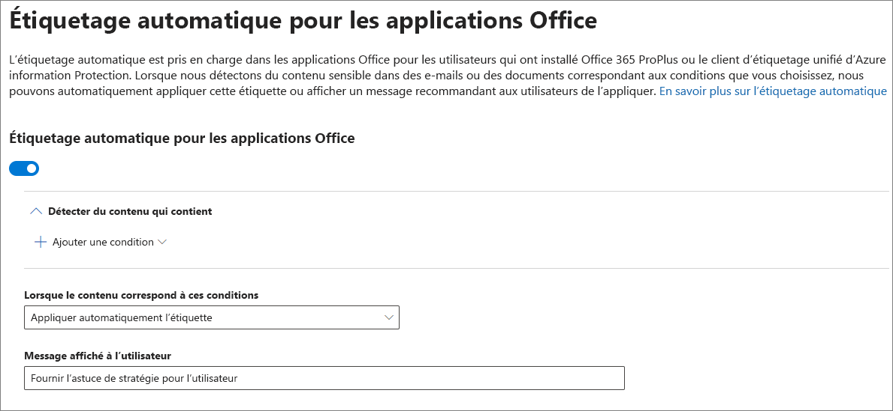

# Appliquer automatiquement une étiquette sensibilité au contenu

Lorsque vous créez une étiquette de sensibilité, vous pouvez affecter automatiquement une étiquette à un document ou message électronique ou vous pouvez inviter les utilisateurs pour sélectionner l’étiquette que vous recommandez.

La possibilité d’appliquer automatiquement des étiquettes à du contenu est importante pour les raisons suivantes :

- Vous n’avez pas besoin de former les utilisateurs concernant l’ensemble de vos classifications.

- Vous n’avez pas à dépendre des utilisateurs pour classer correctement tout le contenu.

- Les utilisateurs n’ont plus à connaître les stratégies de gouvernance des données : à la place, ils peuvent se concentrer sur leur travail.

Pour plus d’informations sur les licences nécessaires, voir les [Conditions d’abonnement et de licence pour les étiquettes de confidentialité](sensitivity-labels-office-apps.md#subscription-and-licensing-requirements-for-sensitivity-labels).

Les paramètres d’étiquetage automatique sont disponibles lorsque vous créez une étiquette de sensibilité dans le Centre de conformité Microsoft 365, le Centre de sécurité Microsoft 365 ou le Centre de sécurité et conformité Office 365 sous **Classification** > **Étiquettes de sensibilité**.

## Application d’une étiquette automatiquement en fonction des conditions

L’une des fonctionnalités les plus puissantes des étiquettes de confidentialité est la possibilité d’appliquer celles-ci automatiquement à tout contenu correspondant à certaines conditions. Dans ce cas, les personnes au sein de votre organisation n’ont pas besoin d’appliquer les étiquettes de confidentialité. Office 365 s’en charge à leur place.

Vous pouvez choisir d’appliquer automatiquement des étiquettes de sensibilité au contenu quand celui-ci inclut des types spécifiques d’informations sensibles. Lorsque vous configurez une étiquette de sensibilité à être appliquée automatiquement, vous voyez la même liste de types d’informations sensibles comme lorsque vous créez une stratégie prévention contre la perte de données. Par conséquent vous pouvez, par exemple, appliquer automatiquement une étiquette hautement confidentielle à tout contenu qui contient des informations d’identification personnelle des clients (PII) telles que les numéros de sécurité sociale ou carte bancaire.

Après avoir choisi vos types d’informations sensibles, vous pouvez affiner votre condition en modifiant le nombre d’instances ou la précision des correspondances. Pour plus d’informations, voir[Optimisation des règles afin de les rendre plus facile ou plus difficile à associer](data-loss-prevention-policies.md#tuning-rules-to-make-them-easier-or-harder-to-match).

De plus, vous pouvez choisir si une condition doit détecter tous les types d’informations sensibles ou seulement l’un d’eux. Pour améliorer la flexibilité ou la complexité de vos conditions, vous pouvez ajouter des groupes et utiliser des opérateurs logiques entre les groupes. Pour plus d’informations, voir [Regroupement et opérateurs logiques](data-loss-prevention-policies.md#grouping-and-logical-operators).

Lorsqu’une étiquette de critère de diffusion est automatiquement appliquée, l’utilisateur voit une notification dans leur application Office. Ils peuvent choisir **OK**pour fermer la notification.

## Recommandé que l’utilisateur applique une étiquette de critère de diffusion

Si vous le souhaitez, vous pouvez recommander à vos utilisateurs qu’ils appliquent l’étiquette. Cette option permet à vos utilisateurs d’accepter la classification et toute protection associée, ou d’ignorer la recommandation si l’étiquette ne convient pas à leur document ou à leur courrier électronique.

Les étiquettes recommandées sont prises en charge dans Word, PowerPoint et Excel (et requièrent que l’étiquette client Protection Informations Azure unifiée soit bien installée). 

Voici un exemple d’une invite de commandes lorsque vous configurez une condition à appliquer une étiquette comme action recommandée avec un Conseil de stratégie personnalisé. Vous pouvez choisir quel texte s’affiche dans le Conseil de stratégie.

## Comment les étiquettes automatiques ou recommandées sont appliquées

- L’étiquetage automatique s’applique à Word, Excel et PowerPoint lors de l’enregistrement d’un document et à Outlook lorsque vous envoyez un courrier électronique. Ces conditions détectent les informations sensibles dans le corps de texte dans les documents et les courriers électroniques, ainsi que dans les en-têtes et pieds de page, mais pas dans la ligne d’objet ni dans les pièces jointes du courrier électronique.

- Vous ne pouvez pas utiliser la classification automatique pour les documents et les messages électroniques qui ont été étiquetés manuellement précédemment ou étiquetés automatiquement avec une classification supérieure. N’oubliez pas que vous ne pouvez appliquer qu’une seule étiquette de confidentialité à un document ou un message électronique (en plus d’une seule étiquette de rétention).

- La classification recommandée s’applique à Word, Excel et PowerPoint lorsque vous enregistrez des documents.

- Vous ne pouvez pas utiliser la classification recommandée pour les documents qui ont été étiquetés précédemment avec une classification supérieure. Lorsque le contenu est déjà labellisé avec une classification supérieure, l’invite pour la recommandation et le conseil de stratégie ne seront pas affichés pour l’utilisateur.

## Comment plusieurs conditions sont évaluées lorsqu’elles s’appliquent à plus d’une étiquette

Les étiquettes sont classées pour évaluation en fonction de leur position que vous spécifiez dans la stratégie: l’étiquette positionné a tout d’abord la position la plus basse (au moins sensible) et l’étiquette positionnée a dernière position plus élevée (plus sensible). Pour plus d’informations sur la priorité, voir [Priorité étiquettes (ordre aspects importants)](sensitivity-labels.md#label-priority-order-matters).

## Ne configurez pas une étiquette parent pour l’appliquer automatiquement ou la recommander.

Une étiquette parent (une étiquette comportant des sous-étiquettes) ne peut pas être appliquée au contenu. Évitez de configurer une étiquette parent pour l’appliquer automatiquement ou la recommander, car elle ne sera pas appliquée au contenu des applications Office qui utilisent le client d’étiquetage unifié Azure Information Protection. Pour en savoir plus sur les étiquettes parents et les sous-étiquettes, consultez la section [Sous-étiquettes (regroupement d’étiquettes)](sensitivity-labels.md#sublabels-grouping-labels).
