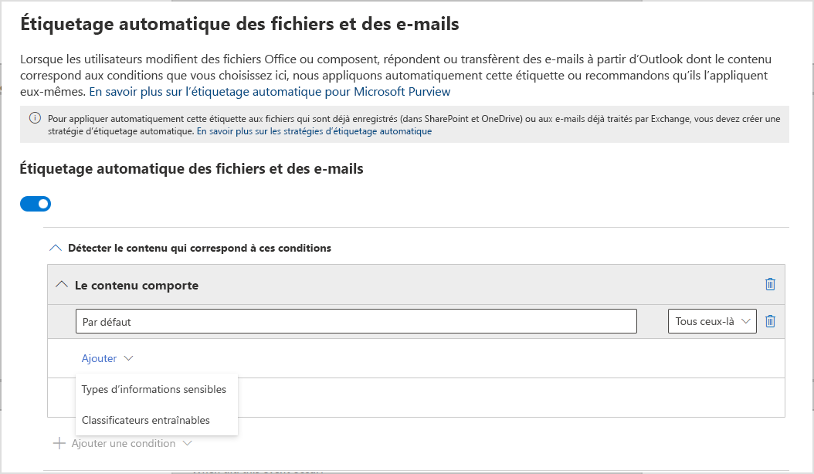
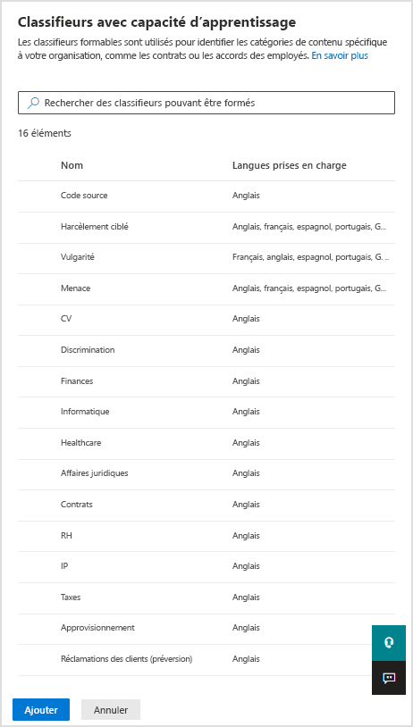
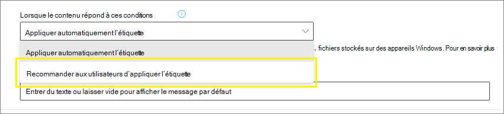
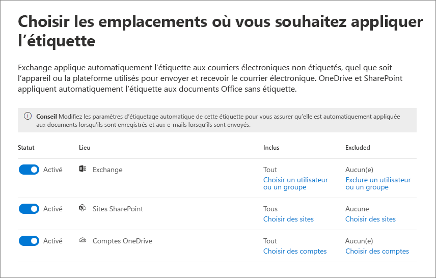
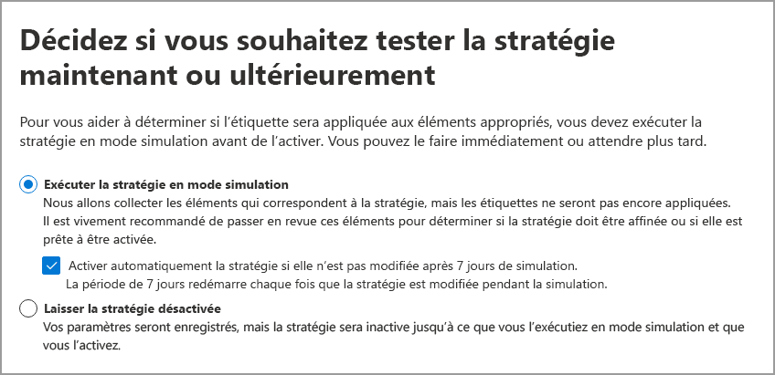

# <a name="apply-a-sensitivity-label-to-content-automatically"></a>Appliquer automatiquement une étiquette sensibilité au contenu

>*[Guide de sécurité et conformité pour les licences Microsoft 365](https://aka.ms/ComplianceSD).*

Lorsque vous créez une étiquette de confidentialité, vous pouvez attribuer automatiquement cette étiquette au contenu lorsque celle-ci répond aux conditions que vous spécifiez.

La possibilité d’appliquer automatiquement des étiquettes à du contenu est importante pour les raisons suivantes :

- Vous n’avez pas besoin de former vos utilisateurs pour leur apprendre quand ils doivent utiliser chacune de vos classifications.

- Vous n’avez pas à dépendre des utilisateurs pour classer correctement tout le contenu.

- Vos utilisateurs n’ont plus besoin de connaître vos stratégies. À la place, ils peuvent porter leur attention sur leur travail.

Deux méthodes s’offrent à vous pour appliquer automatiquement une étiquette de confidentialité :

- **Étiquetage côté client lorsque les utilisateurs modifient des documents ou rédigent des e-mails (lorsqu’ils répondent ou transfèrent également)**  : utilisez une étiquette configurée pour l’étiquetage automatique pour les applications Office (Word, Excel, PowerPoint et Outlook). 
    
    Cette méthode prend en charge la recommandation d’une étiquette aux utilisateurs ainsi que l’application automatique d’une étiquette. Dans les deux cas, l’utilisateur décide d’accepter ou de refuser l’étiquette afin de garantir l’étiquetage correct du contenu. Cet étiquetage côté client présente un délai minimal pour les documents, car l’étiquette peut être appliquée avant même que le document ne soit enregistré. Cependant, toutes les applications clientes ne prennent pas en charge l’étiquetage automatique. Cette fonctionnalité est prise en charge par le client d’étiquetage unifié Azure Information Protection et par [certaines versions d’Office](sensitivity-labels-office-apps.md#support-for-sensitivity-label-capabilities-in-apps). 
    
    Pour des instructions de configuration, consultez l’article [Comment configurer l’étiquetage automatique pour les applications Office](#how-to-configure-auto-labeling-for-office-apps) sur cette page.

- **Étiquetage côté service lorsque le contenu est déjà enregistré (dans SharePoint ou dans OneDrive) ou est envoyé par e-mail (traité par Exchange Online)**  : utilisez une stratégie d’étiquetage automatique. 
    
    Cette méthode est également appelée étiquetage automatique des données au repos (documents dans SharePoint et dans OneDrive) et de données en transit (courriers envoyés ou reçus par Exchange). Dans le cas d’Exchange, cela n’inclut pas les e-mails au repos (boîtes aux lettres). 
    
    Comme cet étiquetage est appliqué par les services plutôt que par les applications, vous n’avez pas à vous soucier des applications des utilisateurs et de leur version. Par conséquent, cette fonctionnalité est immédiatement disponible dans toute l’organisation et est appropriée pour l’étiquetage à grande échelle. Les stratégies d’étiquetage automatique ne prennent pas en charge l’étiquetage recommandé, car l’utilisateur n’interagit pas avec le processus d’étiquetage. En effet, l’administrateur exécute les stratégies en mode simulation pour s’assurer que le contenu est correctement étiqueté avant d’appliquer réellement l’étiquette.
    
    Pour des instructions de configuration, consultez l’article [Configurer les stratégies d’étiquetage automatique pour SharePoint, OneDrive et Exchange](#how-to-configure-auto-labeling-policies-for-sharepoint-onedrive-and-exchange) sur cette page.
    
    Spécifique à l’étiquetage automatique pour SharePoint et OneDrive :
    - Les fichiers Office sont pris en charge dans Word, PowerPoint et Excel. Le format Open XML est pris en charge (par exemple, .docx et .xlsx), mais pas le format Microsoft Office 97-2003 (par exemple, .doc et .xls).
    - Jusqu’à 25 000 fichiers automatiquement étiquetés dans votre client par jour.
    - Jusqu’à 10 stratégies d’attribution automatique de nom par client, chacune ciblant 10 sites (SharePoint ou OneDrive).
    - Les valeurs existantes pour modifié, modifié par et la date ne sont pas changées du fait des stratégies d’étiquetage automatique pour le mode de simulation et lors de l’application des étiquettes.
    - Lorsque l’étiquette applique le chiffrement, [l’émetteur des droits de gestion et le propriétaire de la gestion des droits](https://docs.microsoft.com/azure/information-protection/configure-usage-rights#rights-management-issuer-and-rights-management-owner) correspond à la personne qui a créé l’étiquette de confidentialité.

    Spécifique à l’étiquetage automatique pour Exchange :
    - Contrairement à l’étiquetage manuel ou à l’étiquetage automatique avec les applications Office, les pièces jointes Office (fichiers Word, Excel et PowerPoint) et les pièces jointes au format PDF sont également analysées pour les conditions que vous spécifiez dans votre stratégie d’étiquetage automatique. Lorsqu’une correspondance est trouvée, l’e-mail est étiqueté, mais pas la pièce jointe.
        - Pour ces fichiers Office, le format Open XML est pris en charge (par exemple, .docx et .xlsx), mais pas le format Microsoft Office 97-2003 (par exemple, .doc et .xls).
    - Si vous disposez de règles de flux de messagerie Exchange ou de stratégies de protection contre la perte de données (DLP) qui appliquent le chiffrement IRM : l’étiquette est appliquée lorsque le contenu est identifié par ces règles ou ces stratégies et par une stratégie d’étiquetage automatique. Si cette étiquette applique le chiffrement, les paramètres IRM des règles de flux de messagerie Exchange ou des stratégies de protection contre la perte de données sont ignorés. Toutefois, si cette étiquette n’applique pas le chiffrement, les paramètres IRM des règles de flux de messagerie ou des stratégies de protection contre la perte de données sont appliqués en plus de l’étiquette.
    - Les e-mails dont le chiffrement IRM n’inclut aucune étiquette sont remplacés par une étiquette avec des paramètres de chiffrement lorsqu’il existe une correspondance à l’aide de l’étiquetage automatique.
    - Les e-mails entrant sont étiquetés lorsqu’il existe une correspondance avec vos conditions d’étiquetage automatique. Toutefois, si l’étiquette est configurée pour le chiffrement, celui-ci n’est pas appliqué.
    - Lorsque l’étiquette applique le chiffrement, [l’émetteur des droits de gestion et le propriétaire de la gestion des droits](https://docs.microsoft.com/azure/information-protection/configure-usage-rights#rights-management-issuer-and-rights-management-owner) correspond à la personne qui envoie le courrier électronique.
    

## <a name="compare-auto-labeling-for-office-apps-with-auto-labeling-policies"></a>Comparer l’étiquetage automatique pour les applications Office et les stratégies d’étiquetage automatique

Utilisez le tableau suivant pour vous aider à déterminer les différences de comportement de ces deux méthodes d’étiquetage automatiques complémentaires :

|Fonctionnalité ou comportement|Paramètre d’étiquette : étiquetage automatique pour les applications Office |Stratégie : étiquetage automatique|
|:-----|:-----|:-----|
|Dépendance de l’application|[Oui](sensitivity-labels-office-apps.md#support-for-sensitivity-label-capabilities-in-apps) |Non |
|Limiter par emplacement|Non |Oui |
|Conditions : classifieurs formés|Oui |Non |
|Conditions : options de partage et options supplémentaires pour le courrier électronique|Non |Oui |
|Recommandations, info-bulle de stratégie et remplacements de l’utilisateur|Oui |Non |
|Mode simulation|Non |Oui |
|Pièces jointes Exchange vérifiées pour les conditions|Non | Oui|
|Appliquer des marquages visuels |Oui |Oui (e-mail uniquement) |
|Remplacer le chiffrement IRM appliqué sans étiquette|Oui, si l’utilisateur dispose du droit d’utilisation minimal d’exportation |Oui (e-mail uniquement) |
|Étiquette du courrier électronique entrant|Non |Oui (chiffrement non appliqué) |

> [!NOTE]
> Lorsque le contenu est étiqueté manuellement, l’étiquette n’est jamais remplacée par l’étiquetage automatique. Toutefois, les stratégies d’étiquetage automatique peuvent remplacer une [étiquette de priorité plus faible](sensitivity-labels.md#label-priority-order-matters) appliquée à l’aide de l’étiquetage automatique pour les applications Office.

## <a name="how-multiple-conditions-are-evaluated-when-they-apply-to-more-than-one-label"></a>Comment plusieurs conditions sont évaluées lorsqu’elles s’appliquent à plus d’une étiquette

Les étiquettes sont classées pour évaluation en fonction de leur position que vous spécifiez dans la stratégie: l’étiquette positionné a tout d’abord la position la plus basse (au moins sensible) et l’étiquette positionnée a dernière position plus élevée (plus sensible). Pour plus d’informations sur la priorité, voir [Priorité étiquettes (ordre aspects importants)](sensitivity-labels.md#label-priority-order-matters).

## <a name="dont-configure-a-parent-label-to-be-applied-automatically-or-recommended"></a>Ne configurez pas une étiquette parent pour l’appliquer automatiquement ou la recommander.

Une étiquette parent (une étiquette comportant des sous-étiquettes) ne peut pas être appliquée au contenu. Assurez-vous de ne pas configurer d’étiquette parent pour qu’elle soit appliquée automatiquement ou recommandée dans les applications Office ; ne sélectionnez pas d’étiquette parent pour une stratégie d’attribution automatique d’étiquette. Dans le cas contraire, l’étiquette parent ne sera pas appliquée au contenu.

Pour utiliser l’étiquetage automatique avec des sous-étiquettes, assurez-vous de publier l’étiquette parent et la sous-étiquette.

Pour en savoir plus sur les étiquettes parents et les sous-étiquettes, consultez la section [Sous-étiquettes (regroupement d’étiquettes)](sensitivity-labels.md#sublabels-grouping-labels).

## <a name="how-to-configure-auto-labeling-for-office-apps"></a>Comment configurer l’étiquetage automatique pour les applications Office

L’étiquetage automatique dans les applications Office pour Windows est pris en charge par le client d’étiquetage unifié Azure Information Protection. Pour l’étiquetage intégré dans les applications Office, cette fonctionnalité est disponible dans [Différentes étapes de disponibilité pour différentes applications](sensitivity-labels-office-apps.md#support-for-sensitivity-label-capabilities-in-apps).

Les paramètres d’étiquetage automatique des applications Office sont disponibles lorsque vous [créer ou modifier une étiquette de confidentialité](create-sensitivity-labels.md). Vous pouvez choisir d’appliquer automatiquement des étiquettes de confidentialité au contenu lorsque des informations sensibles sont détectées. Choisissez parmi une liste de types d’information sensibles ou de classificateurs pouvant être formés :



Lorsqu’une étiquette de confidentialité est appliquée automatiquement, les utilisateurs voit une notification dans leur application Office. Par exemple :


### <a name="configuring-sensitive-info-types-for-a-label"></a>Configuration des types d’informations sensibles pour une étiquette

Lorsque vous sélectionnez l’option **types d’informations sensibles**, vous voyez la même liste de types d'informations sensibles que lorsque vous créez une stratégie de protection contre la perte des données (DLP, data loss prevention). Par exemple, vous pouvez appliquer automatiquement une étiquette hautement confidentiel à tout contenu ayant des informations d’identification personnelle (PII) de clients, comme les numéros de carte de crédit ou les numéros de sécurité sociale :


Après avoir sélectionné vos types d’informations sensibles, vous pouvez affiner votre condition en modifiant le nombre d’instances ou la précision des correspondances. Pour plus d’informations, voir[Optimisation des règles afin de les rendre plus facile ou plus difficile à associer](data-loss-prevention-policies.md#tuning-rules-to-make-them-easier-or-harder-to-match).

De plus, vous pouvez choisir si une condition doit détecter tous les types d’informations sensibles ou seulement l’un d’eux. Pour améliorer la flexibilité ou la complexité de vos conditions, vous pouvez ajouter des groupes et utiliser des opérateurs logiques entre les groupes. Pour plus d’informations, voir [Regroupement et opérateurs logiques](data-loss-prevention-policies.md#grouping-and-logical-operators).


### <a name="configuring-trainable-classifiers-for-a-label"></a>Configuration des classifieurs pouvant être formés pour une étiquette

Cette option est actuellement en préversion.

Lorsque vous sélectionnez l’option **Classifieurs pouvant être formés**, sélectionnez un ou plusieurs classifieurs pouvant être formés prédéfinis. Si vous avez créé vos propres classifieurs pouvant être formés personnalisés, vous pouvez également les sélectionner :



> [!CAUTION]
> Nous déprécions le **langage inconvenant** classifieur intégré, car il génère un grand nombre de faux positifs. N’utilisez pas ce classifieur intégré et si vous l’utilisez actuellement, vous devez déplacer vos processus métier. Nous vous recommandons d’utiliser les classifieurs intégrés de **Harcèlement ciblée** , de **blasphème** et de **Menace** à la place.

Pour plus d’informations sur ces classifieurs, voir [Prise en main des classifieurs de formation (préversion)](classifier-getting-started-with.md).

Pendant la période de préversion pour cette option, les applications suivantes prennent en charge les classifieurs pouvant être formés pour les étiquettes de confidentialité :

- Les applications Microsoft 365 pour les entreprises ([anciennement Office 365 ProPlus](https://docs.microsoft.com/deployoffice/name-change)) pour Windows, actuellement en cours de déploiement sur le [Canal actuel](https://docs.microsoft.com/deployoffice/overview-update-channels#current-channel-overview) dans la version 2006 et les versions ultérieures :
    - Word
    - Excel
    - PowerPoint

- Office pour les applications Web, lorsque vous avez [activé les étiquettes de confidentialité pour les fichiers Office dans SharePoint et OneDrive](sensitivity-labels-sharepoint-onedrive-files.md) :
    - Word
    - Excel
    - PowerPoint
    - Outlook

### <a name="recommend-that-the-user-applies-a-sensitivity-label"></a>Recommander que l’utilisateur applique une étiquette de critère de sensibilité

Si vous le souhaitez, vous pouvez recommander à vos utilisateurs qu’ils appliquent l’étiquette. Cette option permet à vos utilisateurs d’accepter la classification et toute protection associée, ou d’ignorer la recommandation si l’étiquette ne convient pas à leur contenu.



Voici un exemple d’une invite de commandes d’Azure Information Protection lorsque vous configurez une condition pour appliquer une étiquette comme action recommandée avec un conseil de stratégie personnalisé. Vous pouvez choisir le texte qui s’affiche dans le conseil de stratégie.


### <a name="when-automatic-or-recommended-labels-are-applied"></a>Quand les étiquettes automatiques ou recommandées sont appliquées

L’implémentation de l’étiquetage automatique et recommandé dans les applications Office varie selon que vous utilisez l’étiquetage intégré à Office ou le client d’étiquetage unifié d’Azure Information Protection. Dans les deux cas, toutefois :

- Vous ne pouvez pas utiliser la classification automatique pour les documents et les e-mails qui ont été précédemment étiquetés manuellement ou automatiquement avec une classification supérieure. N’oubliez pas que vous ne pouvez appliquer qu’une seule étiquette de confidentialité à un document ou un e-mail (en plus d’une seule étiquette de rétention).

- Vous ne pouvez pas utiliser la classification recommandée pour les documents ou e-mails qui ont été étiquetés précédemment avec une classification supérieure. Lorsque le contenu est déjà étiqueté avec une classification supérieure, l'utilisateur ne voit pas l'invite avec la recommandation et le conseil de stratégie.

Spécifique à l’étiquetage intégré :

- Les applications Office ne prennent pas toutes en charge l’étiquetage automatique (et recommandé). Pour plus d’informations, voir [Prise en charge des fonctionnalités d’étiquettes de confidentialité dans les applications](sensitivity-labels-office-apps.md#support-for-sensitivity-label-capabilities-in-apps).

- Pour les étiquettes recommandées dans les versions de bureau de Word, le contenu sensible ayant déclenché la recommandation est signalé de sorte que les utilisateurs puissent examiner et supprimer le contenu sensible au lieu d’appliquer l’étiquette de confidentialité recommandée.

- Pour plus d’informations sur l’application de ces étiquettes dans les applications Office, les captures d’écran et la détection d’informations sensibles, voir [Appliquer ou recommander automatiquement des étiquettes de confidentialité à vos fichiers et e-mails dans Office](https://support.office.com/fr-FR/article/automatically-apply-or-recommend-sensitivity-labels-to-your-files-and-emails-in-office-622e0d9c-f38c-470a-bcdb-9e90b24d71a1).

Spécifique au client d’étiquetage unifié Azure Information Protection :

-  L’étiquetage automatique et recommandé s’applique à Word, Excel et PowerPoint lors de l’enregistrement d’un document et à Outlook lorsque vous envoyez un courrier électronique.

- Pour qu’Outlook prenne en charge l’étiquetage recommandé, vous devez commencer par configurer un [paramètre de stratégie avancé](https://docs.microsoft.com/azure/information-protection/rms-client/clientv2-admin-guide-customizations#enable-recommended-classification-in-outlook).

- Les informations sensibles peuvent être détectées dans le corps de texte dans les documents et les courriers électroniques, ainsi que dans les en-têtes et pieds de page, mais pas dans la ligne d’objet ni dans les pièces jointes du courrier électronique.

## <a name="how-to-configure-auto-labeling-policies-for-sharepoint-onedrive-and-exchange"></a>Configurer les stratégies d’étiquetage automatique pour SharePoint, OneDrive et Exchange

N’oubliez pas de connaître les conditions préalables avant de configurer les stratégies d’attribution automatique d’étiquette. 

### <a name="prerequisites-for-auto-labeling-policies"></a>Conditions préalables pour les stratégies d’étiquetage automatique

- Mode de simulation :
    - L’audit pour Microsoft 365 doit être activé. Si vous devez activer l’audit ou si vous ne savez pas celui-ci est déjà activé, consultez l’article [Activer ou désactiver la recherche dans un journal d’audit](turn-audit-log-search-on-or-off.md).
    - Pour afficher le contenu d’un fichier en mode Source, vous devez disposer du rôle de **visionneur de contenu** de . Par défaut, les administrateurs généraux n’ont pas ce rôle. Si vous n’avez pas cette autorisation, le volet générateur ne s’affiche pas lorsque vous sélectionnez un élément dans l’onglet **éléments correspondants**.

- Pour étiqueter automatiquement des fichiers dans SharePoint et OneDrive :
    - Vous avez [activé les étiquettes de confidentialité pour les fichiers Office dans SharePoint et OneDrive](sensitivity-labels-sharepoint-onedrive-files.md).
    - Lors de l’exécution de la stratégie d’étiquetage automatique, le fichier ne doit pas être ouvert par un autre processus ni un autre utilisateur. Un fichier examiné pour la modification est inclus dans cette catégorie.

- Si vous envisagez d’utiliser des [types d’informations sensibles personnalisés](custom-sensitive-info-types.md) plutôt que les types de sensibilité prédéfinis : 
    - Les types d’informations de confidentialité personnalisés sont évalués pour le contenu créé après l’enregistrement des types d’informations de confidentialité personnalisés. 
    - Pour tester de nouveaux types d’informations sensibles personnalisés, créez-les avant de créer votre stratégie d’étiquetage automatique, puis créez de nouveaux documents avec des exemples de données pour pouvoir les tester.

- Une ou plusieurs étiquettes de confidentialité [créées et publiées](create-sensitivity-labels.md) (à au moins un utilisateur) que vous pouvez sélectionner pour vos stratégies d’étiquetage automatique. Pour ces étiquettes :
    - Cela n’a pas d’importance si le paramètre d’étiquetage automatique dans les applications Office est activé ou désactivé, car ce paramètre d’étiquette complète les stratégies d’étiquetage automatique, comme expliqué dans l’introduction.
    - Si les étiquettes que vous souhaitez utiliser pour l’étiquetage automatique sont configurées pour utiliser les marquages visuels (en-têtes, pieds de page, filigranes), notez que ceux-ci ne sont pas appliqués aux documents.
    - Si les étiquettes appliquent le [chiffrement](encryption-sensitivity-labels.md), celles-ci doivent être configurées pour le paramètre **Attribuer des autorisations maintenant**.

### <a name="learn-about-simulation-mode"></a>En savoir plus sur le mode simulation

Le mode simulation est propre aux stratégies d’étiquetage automatique et est intégré au flux de travail. Vous ne pourrez étiqueter automatiquement les documents et les courriers que lorsque votre stratégie aura exécuté au moins une simulation.

Flux de travail pour une stratégie d’étiquetage automatique :

1. Créer et configurer une stratégie d’étiquetage automatique.

2. Exécutez la stratégie en mode simulation et patientez 24 heures, ou jusqu’à la fin de la simulation.

3. Examinez les résultats et, si nécessaire, affinez votre stratégie. Exécutez de nouveau la stratégie en mode simulation et patientez une nouvelle fois 24 heures, ou jusqu’à la fin de la simulation.

4. Répétez l’étape 3 si besoin.

5. Déployez en production.

Le déploiement simulé s’exécute comme le paramètre WhatIf pour PowerShell. Vous voyez les résultats signalés comme si la stratégie d’étiquetage automatique avait appliqué l’étiquette sélectionnée en utilisant les règles que vous avez définies. Vous pouvez ensuite affiner vos règles de précision si nécessaire et exécuter de nouveau la simulation. Cependant, comme l’étiquetage automatique pour Exchange s’applique aux courriers envoyés et reçus, plutôt qu’aux courriers stockés dans les boîtes aux lettres, ne vous attendez pas à ce que les résultats des courriers dans une simulation soient cohérents, sauf si vous êtes en mesure d’envoyer et de recevoir exactement les mêmes courriers électroniques.

Le mode simulation vous permet également d’augmenter progressivement l’étendue de votre stratégie d’étiquetage automatique avant de procéder au déploiement. Par exemple, vous pouvez commencer avec un seul emplacement, comme un site SharePoint, avec une seule bibliothèque de documents. Ensuite, avec des modifications itératives, augmentez l’étendue sur plusieurs sites, puis sur un autre emplacement, comme OneDrive.

Enfin, vous pouvez utiliser le mode simulation pour fournir une approximation du temps nécessaire à l’exécution de votre stratégie d’étiquetage automatique et pour vous aider à planifier et à programmer l’exécution sans le mode simulation.

### <a name="creating-an-auto-labeling-policy"></a>Création d’une stratégie d’étiquetage automatique

1. Dans le [Centre de conformité Microsoft 365](https://compliance.microsoft.com/), accédez aux étiquettes de confidentialité :
    
    - **Solutions** > **Information protection**
    
    Si vous ne voyez pas immédiatement cette option, sélectionnez tout d’abord **Tout afficher**.

2. Sélectionnez l’onglet **Étiquetage automatique** :
    
    
    

3. Sélectionnez **+ créer une stratégie d’étiquetage automatique**. Cette opération démarre l’Assistant Nouvelle stratégie :
    
    

4. Pour la page **Choisir les informations auxquelles vous souhaitez appliquer cette étiquette** : sélectionnez un modèle, par exemple, **Financier** or **Confidentialité**. Vous pouvez affiner votre recherche à l’aide du menu déroulant **Afficher les options pour**. Vous pouvez également sélectionner **Stratégie personnalisée** si les modèles ne répondent pas à vos besoins. Sélectionnez **Suivant**.

5. Pour la page **Nommer votre stratégie d’étiquetage automatique** : donnez un nom unique et éventuellement une description pour vous aider à identifier l’étiquette, les emplacements et les conditions appliqués automatiquement qui identifient le contenu à étiqueter.

6. Pour la page **Choisir les emplacements dans lesquels vous souhaitez appliquer l’étiquette** : sélectionner et spécifier les emplacements pour Exchange, les sites SharePoint et OneDrive. Ensuite, sélectionnez **Suivant**.
    
    
    
    Vous devez spécifier des sites SharePoint et des comptes OneDrive individuels. Pour OneDrive, l’URL du compte d’un utilisateur OneDrive est au format suivant : `https://<tenant name>-my.sharepoint.com/personal/<user_name>_<tenant name>_com`
    
    Par exemple, pour un utilisateur du client contoso dont le nom d’utilisateur est « rsimone » : `https://contoso-my.sharepoint.com/personal/rsimone_contoso_onmicrosoft_com`
    
    Pour vérifier la syntaxe de votre client et identifier les URL des utilisateurs, voir [Obtenir la liste de toutes les URL OneDrive utilisateur de votre organisation](https://docs.microsoft.com/onedrive/list-onedrive-urls).

7. Pour la **configurer les règles courantes ou avancées** page : conservez la valeur par défaut de **règles courantes** pour définir des règles qui identifient le contenu à étiqueter dans tous les emplacements sélectionnés. Si vous avez besoin de règles différentes pour chaque emplacement, sélectionnez **Paramètres avancés**. Ensuite, sélectionnez **Suivant**.
    
    Les règles utilisent des conditions qui incluent des types d’informations sensibles et des options de partage :
    - Vous pouvez sélectionner des types d’informations sensibles intégrés et personnalisés.
    - Pour les options partagées, vous pouvez choisir **uniquement avec des personnes au sein de mon organisation** ou **avec des personnes extérieures à mon organisation**.
    
    Si votre seul emplacement est **Exchange**, ou si vous sélectionnez **Paramètres avancés**, vous pouvez sélectionner des conditions supplémentaires :
    - L’adresse IP de l’expéditeur est
    - Le domaine du destinataire est
    - Le destinataire est
    - L’extension du fichier de pièce jointe est
    - La pièce jointe est protégée par mot de passe
    - Le contenu de la pièce jointe n’a pas pu être analysé
    - L’analyse du contenu de la pièce jointe n’a pas été terminée

8. Selon vos choix précédents, vous aurez maintenant la possibilité de créer des règles à l’aide de conditions et d’exceptions.
    
    Les options de configuration pour les types d’informations sensibles sont identiques à celles que vous sélectionnez pour l’étiquetage automatique pour les applications Office. Si vous souhaitez en savoir plus, consultez l’article [Configuration des types d’informations sensibles pour une étiquette](#configuring-sensitive-info-types-for-a-label).
    
    Lorsque vous avez défini toutes les règles dont vous avez besoin et confirmé que leur état est activé, sélectionnez **suivant** pour passer à la sélection automatique d’une étiquette.

11. Pour la page **Choisir une étiquette à appliquer automatiquement** : sélectionnez **+ Choisir une étiquette**, puis, sélectionnez une étiquette dans le volet **Choisir une étiquette de confidentialité**, et enfin, sélectionnez **Suivant**.

12. Pour les **décidez si vous voulez tester la stratégie maintenant ou plus tard** page : sélectionnez **exécuter la stratégie en mode de simulation** si vous êtes prêt à exécuter la stratégie d’attribution automatique d’étiquette maintenant, en mode de simulation. Dans le cas contraire, sélectionnez **Stratégie désactivée**. Sélectionnez **suivant ** : 
    
    

13. Pour la page **Résumé** : consultez la configuration de votre stratégie d’étiquetage automatique et apportez les modifications nécessaires, puis terminez l’Assistant.
    
    Contrairement à l’étiquetage automatique pour les applications Office, il n’y a pas d’option de publication distincte. Cependant, comme pour la publication d’étiquettes, prévoyez jusqu’à 24 heures pour que la stratégie d’étiquetage automatique soit reproduite dans toute votre organisation.

Désormais, sur la page **Protection des informations**  >  onglet **Etiquetage automatique**, vous pouvez voir votre stratégie d’attribution automatique dans les sections **Simulation **ou **Désactivée**, selon que vous avez choisi de l’exécuter en mode de simulation ou non. Sélectionnez votre stratégie pour afficher les détails de la configuration et de son état (par exemple, **La simulation de stratégie est en cours d’exécution**). Pour les stratégies en mode simulation, sélectionnez l’onglet **éléments correspondants** pour afficher les messages électroniques ou les documents correspondants aux règles que vous avez spécifiées.

Vous pouvez modifier votre stratégie directement à partir de cette interface :

- Pour une stratégie dans la section **Désactivé**, sélectionnez le bouton **Modifier la stratégie**.

- Pour la stratégie dans la section de la **simulation** de, sélectionnez l’option **modifier la stratégie** en haut de la page, sous l’un des onglets suivants :
    
    
    
    Lorsque vous êtes prêt à exécuter la stratégie sans simulation, sélectionnez l’option **Activer la stratégie**.

Vos stratégies automatiques fonctionnent en continu jusqu’à leur suppression. Par exemple, les documents nouveaux et modifiés sont inclus dans les paramètres de la stratégie actuelle.

Vous pouvez également afficher les résultats de votre stratégie d’étiquetage automatique à l’aide de l’[explorateur de contenu](data-classification-content-explorer.md) lorsque vous disposez des [autorisations](data-classification-content-explorer.md#permissions) appropriées :
- La **visionneuse de liste de l’Explorateur de contenu** vous permet de voir l’étiquette d’un fichier, mais pas le contenu du fichier.
- La **visionneuse de contenu de l’Explorateur de contenu** vous permet de voir le contenu du fichier.

> [!TIP]
> Vous pouvez également utiliser l’Explorateur de contenu pour identifier les emplacements qui ont des documents contenant des informations sensibles, mais qui ne sont pas étiquetés. À l’aide de ces informations, songez à ajouter ces emplacements à votre stratégie d’étiquetage automatique, et incluez les types d’informations sensibles identifiés comme règles.

### <a name="use-powershell-for-auto-labeling-policies"></a>Utiliser PowerShell pour les stratégies d’étiquetage automatique

Vous pouvez désormais utiliser l’[Interface PowerShell du Centre de sécurité et conformité](https://docs.microsoft.com/powershell/exchange/office-365-scc/office-365-scc-powershell) pour créer et configurer les stratégies d’étiquetage automatique. Cela signifie que vous pouvez maintenant créer des scripts pour une prise en charge complète de la création et de la maintenance de vos stratégies d’étiquetage automatique, ce qui permet également de spécifier plus efficacement plusieurs URL pour les emplacements OneDrive et SharePoint.

Avant d’exécuter les commandes dans PowerShell, vous devez tout d’abord vous [connecter au Centre de sécurité et conformité PowerShell](https://docs.microsoft.com/powershell/exchange/office-365-scc/connect-to-scc-powershell/connect-to-scc-powershell).

Pour créer une stratégie d’étiquetage automatique : 

```powershell
New-AutoSensitivityLabelPolicy -Name <AutoLabelingPolicyName> -SharePointLocation "<SharePointSiteLocation>" -ApplySensitivityLabel <Label> -Mode TestWithoutNotifications
```
Cette commande crée une stratégie d’étiquetage automatique pour un site SharePoint que vous spécifiez. Pour un emplacement OneDrive, utilisez plutôt le paramètre *OneDriveLocation*. 

Pour ajouter des sites à une stratégie d’étiquetage automatique existante :

```powershell
$spoLocations = @("<SharePointSiteLocation1>","<SharePointSiteLocation2>")
Set-AutoSensitivityLabelPolicy -Identity <AutoLabelingPolicyName> -AddSharePointLocation $spoLocations -ApplySensitivityLabel <Label> -Mode TestWithoutNotifications
```

Cette commande spécifie les URL SharePoint supplémentaires dans une variable qui est ensuite ajoutée à une stratégie d’étiquetage automatique existante. Pour ajouter à la place des emplacements OneDrive, utilisez le paramètre *AddOneDriveLocation* avec une variable différente, comme *$OneDriveLocations*.

Pour créer une règle de stratégie d’étiquetage automatique :

```powershell
New-AutoSensitivityLabelRule -Policy <AutoLabelingPolicyName> -Name <AutoLabelingRuleName> -ContentContainsSensitiveInformation @{"name"= "a44669fe-0d48-453d-a9b1-2cc83f2cba77"; "mincount" = "2"} -Workload SharePoint
```

Pour une stratégie d’étiquetage automatique existante, cette commande crée une règle de stratégie afin de détecter les informations sensibles de type **Numéro de sécurité sociale américain (SSN)**, dont l’ID d’entité est a44669fe-0d48-453d-a9b1-2cc83f2cba77. Pour trouver les ID d’entité d’autres types d’informations sensibles, voir [Définitions des entités de types d’informations sensibles](sensitive-information-type-entity-definitions.md).

Pour plus d’informations sur les applets de commande PowerShell qui prennent en charge les stratégies d’étiquetage automatique, leurs paramètres disponibles et quelques exemples, voir l’aide des applet de commande suivantes :

- [Get-AutoSensitivityLabelPolicy](https://docs.microsoft.com/powershell/module/exchange/get-autosensitivitylabelpolicy)
- [New-AutoSensitivityLabelPolicy](https://docs.microsoft.com/powershell/module/exchange/new-autosensitivitylabelpolicy)
- [New-AutoSensitivityLabelRule](https://docs.microsoft.com/powershell/module/exchange/new-autosensitivitylabelrule)
- [Remove-AutoSensitivityLabelPolicy](https://docs.microsoft.com/powershell/module/exchange/remove-autosensitivitylabelpolicy)
- [Remove-AutoSensitivityLabelRule](https://docs.microsoft.com/powershell/module/exchange/remove-autosensitivitylabelrule)
- [Set-AutoSensitivityLabelPolicy](https://docs.microsoft.com/powershell/module/exchange/set-autosensitivitylabelpolicy)
- [Set-AutoSensitivityLabelRule](https://docs.microsoft.com/powershell/module/exchange/set-autosensitivitylabelrule)

