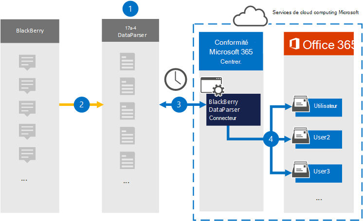

# Configurer un connecteur pour archiver les données BlackBerry

Utilisez [BlackBerry DataParser](https://www.17a-4.com/BlackBerry-dataparser/) de 17a-4 LLC pour importer et archiver les données d’entreprise BlackBerry dans les boîtes aux lettres utilisateur de votre organisation Microsoft 365. DataParser inclut un connecteur BlackBerry configuré pour capturer des éléments à partir d’une source de données tierce et importer ces éléments dans Microsoft 365. Le connecteur BlackBerry DataParser convertit les données BlackBerry au format de message électronique, puis importe ces éléments dans les boîtes aux lettres des utilisateurs dans Microsoft 365.

Une fois que les données BlackBerry sont stockées dans des boîtes aux lettres utilisateur, vous pouvez appliquer des fonctionnalités Microsoft Purview telles que la conservation pour litige, eDiscovery, les stratégies de rétention et les étiquettes de rétention, ainsi que la conformité des communications. L’utilisation d’un connecteur BlackBerry pour importer et archiver des données dans Microsoft 365 peut aider votre organisation à rester conforme aux stratégies gouvernementales et réglementaires.

[!INCLUDE [purview-preview](../includes/purview-preview.md)]

## Vue d’ensemble de l’archivage des données BlackBerry

La vue d’ensemble suivante explique le processus d’utilisation d’un connecteur de données pour archiver des données BlackBerry dans Microsoft 365.

1. Votre organisation utilise 17a-4 pour configurer BlackBerry DataParser.

2. Régulièrement, les éléments BlackBerry sont collectés par le DataParser. DataParser convertit également le contenu d’un message au format de message électronique.

3. Le connecteur BlackBerry DataParser que vous créez dans le portail de conformité Microsoft Purview se connecte à DataParser et transfère les messages vers un emplacement de stockage Azure sécurisé dans le cloud Microsoft.

4. Un sous-dossier dans le dossier Boîte de réception nommé **BlackBerry DataParser** est créé dans les boîtes aux lettres utilisateur, et les éléments BlackBerry sont importés dans ce dossier. Le connecteur détermine la boîte aux lettres dans laquelle importer les éléments à l’aide de la valeur de la propriété *Email*. Chaque élément BlackBerry contient cette propriété, qui est remplie avec l’adresse e-mail de chaque participant.

## Avant de configurer un connecteur

- Créez un compte DataParser pour les connecteurs Microsoft. Pour ce faire, contactez [17a-4 LLC](https://www.17a-4.com/contact/). Vous devez vous connecter à ce compte lorsque vous créez le connecteur à l’étape 1.

- L’utilisateur qui crée le connecteur BlackBerry DataParser à l’étape 1 (et l’exécute à l’étape 3) doit se voir attribuer le rôle de Administration connecteur de données. Ce rôle est requis pour ajouter des connecteurs dans la page **Connecteurs de données** du portail de conformité. Ce rôle est ajouté par défaut à plusieurs groupes de rôles. Pour obtenir la liste de ces groupes de rôles, consultez la section « Rôles dans les portails defender et de conformité » dans [Rôles et groupes de rôles dans les portails de conformité Microsoft 365 Defender et Microsoft Purview](../security/office-365-security/permissions-in-the-security-and-compliance-center.md#roles-in-the-defender-and-compliance-portals). Un administrateur de votre organisation peut également créer un groupe de rôles personnalisé, attribuer le rôle de Administration connecteur de données, puis ajouter les utilisateurs appropriés en tant que membres. Pour obtenir des instructions, consultez la section « Créer un groupe de rôles personnalisé » dans [Autorisations dans le portail de conformité](microsoft-365-compliance-center-permissions.md#create-a-custom-role-group).

- Ce connecteur de données 17a-4 est disponible dans les environnements GCC dans le cloud Microsoft 365 US Government. Les applications et services tiers peuvent impliquer le stockage, la transmission et le traitement des données client de votre organisation sur des systèmes tiers qui se trouvent en dehors de l’infrastructure Microsoft 365 et ne sont donc pas couverts par les engagements de Microsoft Purview et de protection des données. Microsoft ne fait aucune déclaration selon laquelle l’utilisation de ce produit pour se connecter à des applications tierces implique que ces applications tierces sont conformes à FEDRAMP.

## Étape 1 : Configurer un connecteur BlackBerry DataParser

La première étape consiste à accéder à la page Connecteurs de données dans le portail de conformité et à créer un connecteur 17a-4 pour les données BlackBerry.

1. Accédez à <https://compliance.microsoft.com> , puis sélectionnez **Connecteurs** >  de données **BlackBerry DataParser**.

2. Dans la page de description du produit **BlackBerry DataParser** , sélectionnez **Ajouter un connecteur**.

3. Dans la page **Conditions d’utilisation du service** , sélectionnez **Accepter**.

4. Entrez un nom unique qui identifie le connecteur, puis sélectionnez **Suivant**.

5. Connectez-vous à votre compte 17a-4 et suivez les étapes décrites dans l’Assistant Connexion à BlackBerry DataParser.

## Étape 2 : Configurer le connecteur BlackBerry DataParser

Utilisez la prise en charge 17a-4 pour configurer le connecteur BlackBerry DataParser.

## Étape 3 : Mapper les utilisateurs

Le connecteur BlackBerry DataParser mappera automatiquement les utilisateurs à leurs adresses e-mail Microsoft 365 avant d’importer des données dans Microsoft 365.

## Étape 4 : Surveiller le connecteur BlackBerry DataParser

Après avoir créé un connecteur BlackBerry DataParser, vous pouvez afficher l’état du connecteur dans le portail de conformité.

1. Accédez à <https://compliance.microsoft.com> et sélectionnez **Connecteurs de données** dans la navigation de gauche.

2. Sélectionnez l’onglet **Connecteurs** , puis sélectionnez le connecteur BlackBerry DataParser que vous avez créé pour afficher la page de menu volant, qui contient les propriétés et les informations sur le connecteur.

3. Sous **État du connecteur avec la source**, sélectionnez le lien **Télécharger le journal** pour ouvrir (ou enregistrer) le journal d’état du connecteur. Ce journal contient des informations sur les données importées dans le cloud Microsoft.

## Problèmes connus

Pour l’instant, nous ne prenons pas en charge l’importation de pièces jointes ou d’éléments d’une taille supérieure à 10 Mo. La prise en charge des éléments plus volumineux sera disponible ultérieurement.
