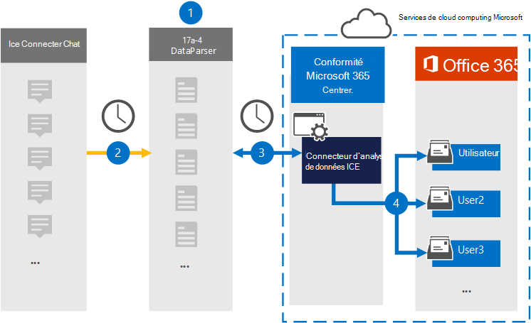

# Configurer un connecteur pour archiver les données de conversation ICE Connect

Utilisez [ICE DataParser](https://www.17a-4.com/ice-dataparser/) de 17a-4 LLC pour importer et archiver des données de ICE Connect Chat vers des boîtes aux lettres utilisateur dans votre organisation Microsoft 365. DataParser inclut un connecteur ICE Chat configuré pour capturer des éléments à partir d’une source de données tierce et importer ces éléments dans Microsoft 365. Le connecteur ICE DataParser convertit les données de conversation ICE Connect au format de message électronique, puis importe ces éléments dans des boîtes aux lettres utilisateur dans Microsoft 365.

Une fois les données de conversation ICE Connect stockées dans des boîtes aux lettres utilisateur, vous pouvez appliquer des fonctionnalités Microsoft Purview telles que la conservation des litiges, la découverte électronique, les stratégies de rétention et les étiquettes de rétention, ainsi que la conformité des communications. L’utilisation d’un connecteur ICE DataParser pour importer et archiver des données dans Microsoft 365 peut aider votre organisation à rester conforme aux stratégies gouvernementales et réglementaires.

[!INCLUDE [purview-preview](../includes/purview-preview.md)]

## Vue d’ensemble de l’archivage des données ice Chat

La vue d’ensemble suivante explique le processus d’utilisation d’un connecteur de données pour archiver les données ice Connect Chat dans Microsoft 365.

1. Votre organisation travaille avec la version 17a-4 pour configurer ice DataParser.

2. Régulièrement, les éléments de conversation ICE Connect sont collectés par dataParser. DataParser convertit également le contenu d’un message au format de message électronique.

3. Le connecteur ICE DataParser que vous créez dans le portail de conformité Microsoft Purview se connecte à DataParser et transfère les messages vers un emplacement de stockage Azure sécurisé dans le cloud Microsoft.

4. Un sous-dossier dans le dossier boîte de réception nommé **ICE DataParser** est créé dans les boîtes aux lettres utilisateur, et les éléments de conversation ICE Connect sont importés dans ce dossier. Le connecteur détermine la boîte aux lettres vers laquelle importer des éléments à l’aide de la valeur de la propriété *Email*. Chaque élément de conversation ICE Connect contient cette propriété, qui est remplie avec l’adresse e-mail de chaque participant.

## Avant de configurer un connecteur

- Créez un compte DataParser pour les connecteurs Microsoft. Pour ce faire, contactez [le 17a-4 LLC](https://www.17a-4.com/contact/). Vous devez vous connecter à ce compte lorsque vous créez le connecteur à l’étape 1.

- L’utilisateur qui crée le connecteur ICE DataParser à l’étape 1 (et le termine à l’étape 3) doit avoir le rôle de connecteur de données Administration. Ce rôle est requis pour ajouter des connecteurs sur la page **Connecteurs de données** dans le portail de conformité. Ce rôle est ajouté par défaut à plusieurs groupes de rôles. Pour obtenir la liste de ces groupes de rôles, consultez la section « Rôles dans les centres de sécurité et de conformité » dans [Autorisations dans le Centre de sécurité & conformité](../security/office-365-security/permissions-in-the-security-and-compliance-center.md#roles-in-the-security--compliance-center). Un administrateur de votre organisation peut également créer un groupe de rôles personnalisé, attribuer le rôle Administration connecteur de données, puis ajouter les utilisateurs appropriés en tant que membres. Pour obtenir des instructions, consultez la section « Créer un groupe de rôles personnalisé » dans [Autorisations dans le portail de conformité Microsoft Purview](microsoft-365-compliance-center-permissions.md#create-a-custom-role-group).

- Ce connecteur de données 17a-4 est disponible dans les environnements GCC dans le cloud Microsoft 365 US Government. Les applications et services tiers peuvent impliquer le stockage, la transmission et le traitement des données client de votre organisation sur des systèmes tiers qui ne font pas partie de l’infrastructure Microsoft 365 et ne sont donc pas couverts par les engagements de Microsoft Purview et de protection des données. Microsoft ne fait aucune représentation que l’utilisation de ce produit pour se connecter à des applications tierces implique que ces applications tierces sont conformes FEDRAMP.

## Étape 1 : Configurer un connecteur ICE DataParser

La première étape consiste à accéder à la page Connecteurs de données dans le portail de conformité et à créer un connecteur 17a-4 pour les données ice Connect Chat.

1. Accédez à <https://compliance.microsoft.com> ice DataParser, puis sélectionnez **connecteurs** > **de données ICE DataParser**.

2. Dans la page de description **du produit ICE DataParser** , sélectionnez **Ajouter un connecteur**.

3. Dans la page **Conditions d’utilisation** , sélectionnez **Accepter**.

4. Entrez un nom unique qui identifie le connecteur, puis sélectionnez **Suivant**.

5. Connectez-vous à votre compte 17a-4 et suivez les étapes de l’Assistant Connexion ICE DataParser.

## Étape 2 : Configurer le connecteur ICE DataParser

Utilisez le support 17a-4 pour configurer le connecteur ICE DataParser.

## Étape 3 : Mapper les utilisateurs

Le connecteur ICE DataParser mappe automatiquement les utilisateurs à leurs adresses de messagerie Microsoft 365 avant d’importer des données dans Microsoft 365.

## Étape 4 : Surveiller le connecteur ICE DataParser

Après avoir créé un connecteur ICE DataParser, vous pouvez afficher l’état du connecteur dans le portail de conformité.

1. Accédez aux <https://compliance.microsoft.com> **connecteurs de données** et sélectionnez-les dans le volet de navigation gauche.

2. Sélectionnez l’onglet **Connecteurs** , puis le connecteur ICE DataParser que vous avez créé pour afficher la page de menu volant, qui contient les propriétés et les informations sur le connecteur.

3. Sous **État du connecteur avec source**, **sélectionnez** le lien Télécharger le journal pour ouvrir (ou enregistrer) le journal d’état du connecteur. Ce journal contient des informations sur les données qui ont été importées dans le cloud Microsoft. Pour plus d’informations, consultez [Afficher les journaux d’administration pour les connecteurs de données](data-connector-admin-logs.md).

## Problèmes connus

Pour l’instant, nous ne prenons pas en charge l’importation de pièces jointes ou d’éléments supérieurs à 10 Mo. La prise en charge des éléments plus volumineux sera disponible ultérieurement.
