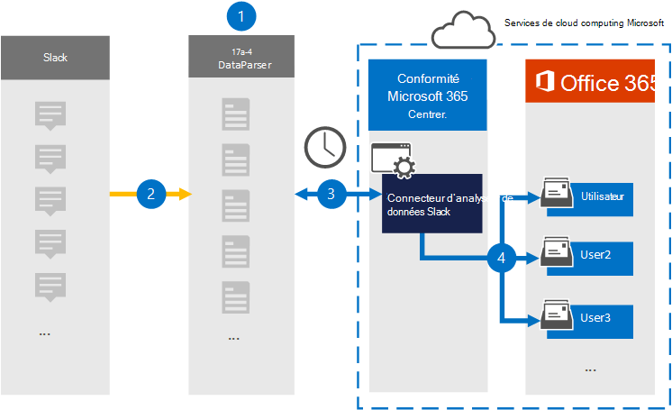

# Configurer un connecteur pour archiver les données Slack

Utilisez [DataParser de 17a-4 LLC](https://www.17a-4.com/slack-dataparser/) pour importer et archiver des données à partir de la plateforme Slack vers les boîtes aux lettres des utilisateurs de Microsoft 365 organisation. DataParser inclut un connecteur Slack configuré pour capturer des éléments à partir d’une source de données tierce et importer ces éléments dans Microsoft 365. Le connecteur Slack DataParser convertit les données Slack au format de message électronique, puis importe ces éléments dans les boîtes aux lettres des utilisateurs Microsoft 365.

Une fois les données Slack stockées dans les boîtes aux lettres des utilisateurs, vous pouvez appliquer des fonctionnalités de conformité Microsoft 365 telles que la conservation pour litige, eDiscovery, les stratégies et étiquettes de rétention, ainsi que la conformité des communications. L’utilisation d’un connecteur Slack pour importer et archiver des données dans Microsoft 365 peut aider votre organisation à respecter les stratégies gouvernementales et réglementaires.

## Vue d’ensemble de l’archivage des données Slack

La vue d’ensemble suivante explique le processus d’utilisation d’un connecteur de données pour archiver des données Slack dans Microsoft 365.

1. Votre organisation travaille avec 17a-4 pour configurer l’analyseur de données Slack.

2. Régulièrement, les éléments Slack sont collectés par DataParser. DataParser convertit également le contenu d’un message au format de message électronique.

3. Le connecteur Slack DataParser que vous créez dans le Centre de conformité Microsoft 365 se connecte à DataParser et transfère les messages vers un emplacement stockage Azure sécurisé dans le cloud Microsoft.

4. Un sous-dossier du dossier Boîte de réception nommé **Slack DataParser** est créé dans les boîtes aux lettres utilisateur et les éléments Slack sont importés dans ce dossier. Le connecteur détermine la boîte aux lettres dans laquelle importer des éléments à l’aide de la valeur de la *propriété Email* . Chaque élément Slack contient cette propriété, qui est remplie avec l’adresse e-mail de chaque participant.

## Avant de configurer un connecteur

- Créez un compte DataParser pour les connecteurs Microsoft. Pour ce faire, contactez [17a-4 LLC](https://www.17a-4.com/contact/). Vous devez vous inscrire à ce compte lorsque vous créez le connecteur à l’étape 1.

- L’utilisateur qui crée le connecteur Slack DataParser à l’étape 1 (et le termine à l’étape 3) doit se voir attribuer le rôle d’administrateur du connecteur de données. Ce rôle est requis pour ajouter des connecteurs sur la page **Connecteurs de données** dans le Centre de conformité Microsoft 365. Ce rôle est ajouté par défaut à plusieurs groupes de rôles. Pour obtenir la liste de ces groupes de rôles, consultez la section « Rôles dans les centres de sécurité et conformité » dans Autorisations dans le Centre de sécurité [& conformité](../security/office-365-security/permissions-in-the-security-and-compliance-center.md#roles-in-the-security--compliance-center). Un administrateur de votre organisation peut également créer un groupe de rôles personnalisé, attribuer le rôle Administrateur du connecteur de données, puis ajouter les utilisateurs appropriés en tant que membres. Pour obtenir des instructions, consultez la section « Créer un groupe de rôles personnalisé » dans [Autorisations dans le Centre de conformité Microsoft 365](microsoft-365-compliance-center-permissions.md#create-a-custom-role-group).

- Ce connecteur de données 17a-4 est disponible dans les environnements Cloud de la communauté du secteur public dans le cloud Microsoft 365 gouvernement américain. Les applications et services tiers peuvent impliquer le stockage, la transmission et le traitement des données client de votre organisation sur des systèmes tiers qui sont en dehors de l’infrastructure Microsoft 365 et qui, par conséquent, ne sont pas couverts par les engagements en matière de conformité et de protection des données Microsoft 365. Microsoft ne fait aucune représentation que l’utilisation de ce produit pour se connecter à des applications tierces implique que ces applications tierces sont conformes FEDRAMP.

## Étape 1 : Configurer un connecteur Slack DataParser

La première étape consiste à accéder à la page Connecteurs de données dans le Centre de conformité Microsoft 365 et à créer un connecteur 17a-4 pour les données Slack.

1. Go to <https://compliance.microsoft.com> and then click **Data connectorsSlack** >  **DataParser**.

2. Dans la page **de description du produit Slack DataParser** , cliquez **sur Ajouter un connecteur**.

3. Dans la page **Conditions d’utilisation** , cliquez sur **Accepter**.

4. Entrez un nom unique qui identifie le connecteur, puis cliquez sur **Suivant**.

5. Connectez-vous à votre compte 17a-4 et complétez les étapes de l’Assistant Connexion Slack DataParser.

## Étape 2 : Configurer le connecteur Slack DataParser

Travaillez avec la prise en charge 17a-4 pour configurer le connecteur Slack DataParser.

## Étape 3 : Ma cartographier les utilisateurs

Le connecteur Slack DataParser mamme automatiquement les utilisateurs à leurs adresses Microsoft 365 courrier avant d’importer des données dans Microsoft 365.

## Étape 4 : Surveiller le connecteur Slack DataParser

Après avoir créé un connecteur Slack DataParser, vous pouvez afficher l’état du connecteur dans le Centre de conformité Microsoft 365.

1. Go to <https://compliance.microsoft.com> and click **Data connectors** in the left nav.

2. Cliquez sur **l’onglet Connecteurs** , puis sélectionnez le connecteur Slack DataParser que vous avez créé pour afficher la page de présentation, qui contient les propriétés et les informations sur le connecteur.

3. Sous **État du connecteur avec source**, **cliquez sur le** lien Télécharger le journal pour ouvrir (ou enregistrer) le journal d’état du connecteur. Ce journal contient des données qui ont été importées dans le cloud Microsoft.

## Problèmes détectés

Pour l’instant, nous ne ons pas en charge l’importation de pièces jointes ou d’éléments dont la taille est supérieure à 10 Mo. La prise en charge des éléments plus volumineux sera disponible à une date ultérieure.
