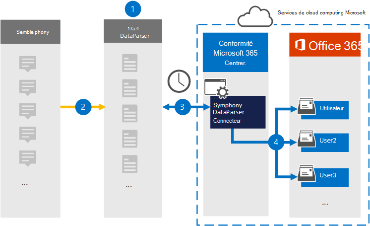

# Configurer un connecteur pour archiver les données de Symphony

Utilisez Symphony [DataParser](https://www.17a-4.com/Symphony-dataparser/) de 17a-4 LLC pour importer et archiver des données de communications Symphony dans des boîtes aux lettres utilisateur de votre organisation Microsoft 365. DataParser inclut un connecteur Symphony configuré pour capturer des éléments à partir d’une source de données tierce et importer ces éléments dans Microsoft 365. Le connecteur Symphony DataParser convertit les données Symphony au format d’e-mail, puis importe ces éléments dans des boîtes aux lettres utilisateur dans Microsoft 365.

Une fois que les données Symphony sont stockées dans des boîtes aux lettres utilisateur, vous pouvez appliquer Microsoft 365 fonctionnalités de conformité telles que la conservation des litiges, la découverte électronique, les stratégies de rétention et les étiquettes de rétention, ainsi que la conformité des communications. L’utilisation d’un connecteur Symphony pour importer et archiver des données dans Microsoft 365 peut aider votre organisation à rester conforme aux stratégies gouvernementales et réglementaires.

## Vue d’ensemble de l’archivage des données Symphony

La vue d’ensemble suivante explique le processus d’utilisation d’un connecteur de données pour archiver des données Symphony dans Microsoft 365.

1. Votre organisation travaille avec 17a-4 pour configurer symphony DataParser.

2. Régulièrement, les éléments Symphony sont collectés par le DataParser. DataParser convertit également le contenu d’un message au format de message électronique.

3. Le connecteur Symphony DataParser que vous créez dans le Centre de conformité Microsoft 365 se connecte à DataParser et transfère les messages à un emplacement stockage Azure sécurisé dans le cloud Microsoft.

4. Un sous-dossier du dossier Boîte de réception nommé **Symphony DataParser** est créé dans les boîtes aux lettres utilisateur, et les éléments Symphony sont importés dans ce dossier. Le connecteur détermine la boîte aux lettres vers laquelle importer des éléments à l’aide de la valeur de la propriété *Email* . Chaque élément Symphony contient cette propriété, qui est remplie avec l’adresse e-mail de chaque participant.

## Avant de configurer un connecteur

- Créez un compte DataParser pour les connecteurs Microsoft. Pour ce faire, contactez [le 17a-4 LLC](https://www.17a-4.com/contact/). Vous devez vous connecter à ce compte lorsque vous créez le connecteur à l’étape 1.

- Le rôle Administrateur du connecteur de données doit être attribué à l’utilisateur qui crée le connecteur Symphony DataParser à l’étape 1 (et le termine à l’étape 3). Ce rôle est nécessaire pour ajouter des connecteurs sur la page **Connecteurs de données** dans le Centre de conformité Microsoft 365. Ce rôle est ajouté par défaut à plusieurs groupes de rôles. Pour obtenir la liste de ces groupes de rôles, consultez la section « Rôles dans les centres de sécurité et de conformité » dans [Autorisations dans le Centre de sécurité & conformité](../security/office-365-security/permissions-in-the-security-and-compliance-center.md#roles-in-the-security--compliance-center). Un administrateur de votre organisation peut également créer un groupe de rôles personnalisé, attribuer le rôle Administrateur du connecteur de données, puis ajouter les utilisateurs appropriés en tant que membres. Pour obtenir des instructions, consultez la section « Créer un groupe de rôles personnalisé » dans [Autorisations dans le Centre de conformité Microsoft 365](microsoft-365-compliance-center-permissions.md#create-a-custom-role-group).

- Ce connecteur de données 17a-4 est disponible dans Cloud de la communauté du secteur public environnements dans le cloud Microsoft 365 US Government. Les applications et services tiers peuvent impliquer le stockage, la transmission et le traitement des données client de votre organisation sur des systèmes tiers qui ne font pas partie de l’infrastructure Microsoft 365 et ne sont donc pas couverts par les engagements de conformité et de protection des données Microsoft 365. Microsoft ne fait aucune représentation que l’utilisation de ce produit pour se connecter à des applications tierces implique que ces applications tierces sont conformes FEDRAMP.

## Étape 1 : Configurer un connecteur Symphony DataParser

La première étape consiste à accéder à la page Connecteurs de données dans le Centre de conformité Microsoft 365 et à créer un connecteur 17a-4 pour les données Symphony.

1. Accédez à <https://compliance.microsoft.com> Data **connectorsSymphony** >  DataParser, puis cliquez dessus.

2. Dans la page de description **du produit Symphony DataParser** , cliquez sur **Ajouter un connecteur**.

3. Dans la page **Conditions d’utilisation** , cliquez sur **Accepter**.

4. Entrez un nom unique qui identifie le connecteur, puis cliquez sur **Suivant**.

5. Connectez-vous à votre compte 17a-4 et suivez les étapes de l’Assistant Connexion Symphony DataParser.

## Étape 2 : Configurer le connecteur Symphony DataParser

Utilisez le support 17a-4 pour configurer le connecteur Symphony DataParser.

## Étape 3 : Mapper les utilisateurs

Le connecteur Symphony DataParser mappe automatiquement les utilisateurs à leurs adresses e-mail Microsoft 365 avant d’importer des données dans Microsoft 365.

## Étape 4 : Surveiller le connecteur Symphony DataParser

Après avoir créé un connecteur Symphony DataParser, vous pouvez afficher l’état du connecteur dans le Centre de conformité Microsoft 365.

1. Accédez et <https://compliance.microsoft.com> cliquez sur **Connecteurs de données** dans le volet de navigation gauche.

2. Cliquez sur l’onglet **Connecteurs** , puis sélectionnez le connecteur Symphony DataParser que vous avez créé pour afficher la page de menu volant, qui contient les propriétés et les informations sur le connecteur.

3. Sous **État du connecteur avec source**, cliquez sur le lien **Télécharger le journal** pour ouvrir (ou enregistrer) le journal d’état du connecteur. Ce journal contient des données qui ont été importées dans le cloud Microsoft.

## Problèmes détectés

Pour l’instant, nous ne prenons pas en charge l’importation de pièces jointes ou d’éléments supérieurs à 10 Mo. La prise en charge des éléments plus volumineux sera disponible ultérieurement.
