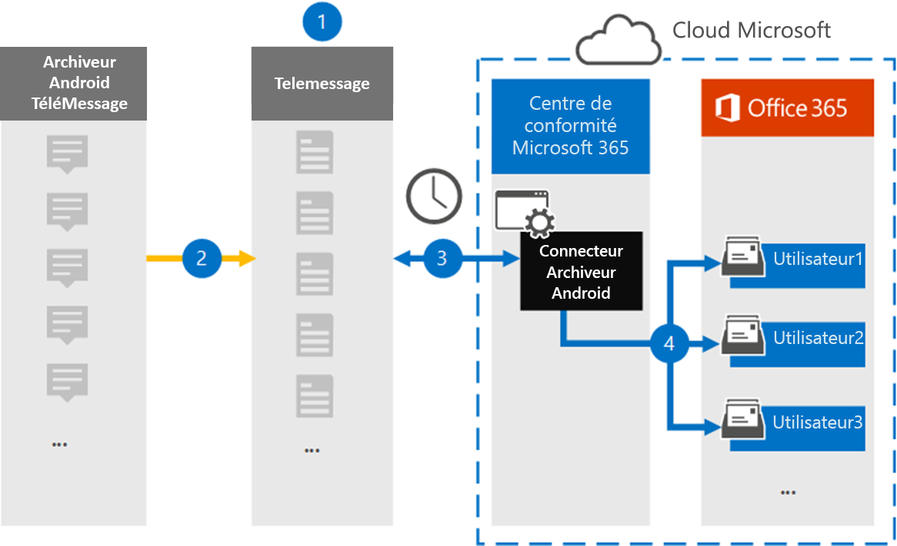

# Configurer un connecteur pour archiver les données mobiles Android

Utilisez un connecteur TeleMessage dans le centre de conformité Microsoft 365 pour importer et archiver des SMS, MMS, appels vocaux et journaux d’appels à partir de téléphones mobiles Android. Après avoir configuré et configuré un connecteur, il se connecte au compte TeleMessage de votre organisation une fois par jour et importe la communication mobile des employés à l’aide de l’archiveur Android TeleMessage dans les boîtes aux lettres de Microsoft 365.

Une fois que les données des téléphones mobiles Android sont stockées dans les boîtes aux lettres des utilisateurs, vous pouvez appliquer des fonctionnalités de conformité Microsoft 365 telles que la conservation pour litige, la recherche de contenu et les stratégies de rétention Microsoft 365 aux données de l’archiveur Android. Par exemple, vous pouvez effectuer une recherche dans la communication mobile de l’archiveur Android à l’aide de la recherche de contenu ou associer la boîte aux lettres qui contient les données du connecteur d’archivage Android à un dépositaire dans Advanced eDiscovery cas. L’utilisation d’un connecteur d’archivage Android pour importer et archiver des données dans Microsoft 365 peut aider votre organisation à respecter les stratégies gouvernementales et réglementaires.

## Vue d’ensemble de l’archivage des données mobiles Android

La vue d’ensemble suivante explique le processus d’utilisation d’un connecteur pour archiver les données mobiles Android dans Microsoft 365.

1. Votre organisation travaille avec TeleMessage pour configurer un connecteur d’archivage Android. Pour plus d’informations, [voir l’Archiveur Android.](https://www.telemessage.com/office365-activation-for-android-archiver/)

2. En temps réel, SMS, MMS, les appels vocaux et les journaux d’appels des téléphones mobiles Android de votre organisation sont copiés sur le site TeleMessage.

3. Le connecteur d’archivage Android que vous créez dans le centre de conformité Microsoft 365 se connecte au site TeleMessage tous les jours et transfère les données Android des 24 heures précédentes vers un emplacement stockage Azure sécurisé dans le cloud Microsoft. Le connecteur convertit également les données Android au format de message électronique.

4. Le connecteur importe les éléments de communication mobile dans la boîte aux lettres d’un utilisateur spécifique. Un nouveau dossier nommé Android Archiver est créé dans la boîte aux lettres de l’utilisateur spécifique et les éléments y sont importés. Le connecteur est mappage à l’aide de la valeur de la propriété *d’adresse* de messagerie de l’utilisateur. Chaque message électronique contient cette propriété, qui est remplie avec l’adresse e-mail de chaque participant du message électronique. Outre le mappage automatique des utilisateurs à l’aide de la valeur de la propriété *d’adresse* de messagerie de l’utilisateur, vous pouvez également définir un mappage personnalisé en chargeant un fichier de mappage CSV. Ce fichier de mappage doit contenir le numéro mobile et l’adresse Microsoft 365 boîte aux lettres correspondante pour chaque utilisateur. Si vous activez le mappage utilisateur automatique et fournissez un mappage personnalisé, pour chaque élément de courrier électronique, le connecteur examinera d’abord le fichier de mappage personnalisé. S’il ne trouve pas un utilisateur Microsoft 365 valide qui correspond au numéro de téléphone mobile d’un utilisateur, le connecteur utilise la propriété d’adresse de messagerie de l’utilisateur de l’élément de courrier. Si le connecteur ne trouve pas d’utilisateur Microsoft 365 valide dans le fichier de mappage personnalisé ou dans la propriété d’adresse de messagerie de *l’utilisateur* de l’élément de courrier, l’élément n’est pas importé.

## Avant de configurer un connecteur

Certaines des étapes d’implémentation requises pour archiver les données de communication Android sont externes à Microsoft 365 et doivent être effectuées avant de pouvoir créer le connecteur dans le centre de conformité.

- Commandez [le service d’archivage Android à partir de TeleMessage](https://www.telemessage.com/mobile-archiver/order-mobile-archiver-for-o365) et obtenez un compte d’administration valide pour votre organisation. Vous devrez vous inscrire à ce compte lorsque vous créerez le connecteur.

- Enregistrez tous les utilisateurs qui ont besoin du service d’archivage Android dans le compte TeleMessage. Lors de l’inscription des utilisateurs, n’oubliez pas d’utiliser la même adresse de messagerie que celle utilisée pour Microsoft 365 compte.

- Installez et activez l’application TeleMessage Android Archiver sur les téléphones mobiles de vos employés.

- Le rôle Importation/Exportation de boîte aux lettres doit être attribué à l’utilisateur qui crée un connecteur d’archivage Android dans Exchange Online. Cela est nécessaire pour ajouter des connecteurs dans la page **Connecteurs** de données dans le centre Microsoft 365 conformité. Par défaut, ce rôle n’est affecté à aucun groupe de rôles dans Exchange Online. Vous pouvez ajouter le rôle Importation/Exportation de boîte aux lettres au groupe de rôles Gestion de l’organisation dans Exchange Online. Vous pouvez également créer un groupe de rôles, attribuer le rôle Importation/Exportation de boîte aux lettres, puis ajouter les utilisateurs appropriés en tant que membres. Pour plus d’informations, voir les [sections](/Exchange/permissions-exo/role-groups#modify-role-groups) Créer des groupes de rôles ou Modifier des groupes de rôles dans l’article « Gérer les groupes de rôles dans Exchange Online ». 

- Ce connecteur de données est disponible dans Cloud de la communauté du secteur public environnements dans le cloud Microsoft 365 gouvernement américain. Les applications et services tiers peuvent impliquer le stockage, la transmission et le traitement des données client de votre organisation sur des systèmes tiers qui sont en dehors de l’infrastructure Microsoft 365 et qui, par conséquent, ne sont pas couverts par les engagements en matière de conformité et de protection des données Microsoft 365. Microsoft ne fait aucune représentation que l’utilisation de ce produit pour se connecter à des applications tierces implique que ces applications tierces sont conformes FEDRAMP.

## Créer un connecteur d’archivage Android

La dernière étape consiste à créer un connecteur d’archivage Android dans le centre Microsoft 365 conformité. Le connecteur utilise les informations que vous fournissez pour vous connecter au site TeleMessage et transférer la communication Android vers les boîtes aux lettres utilisateur correspondantes dans Microsoft 365.

1. Go to [https://compliance.microsoft.com](https://compliance.microsoft.com) and click **Data connectors**  >  **Android Archiver**.

2. Dans la page de description **du produit De l’archiveur Android,** cliquez **sur Ajouter un connecteur.**

3. Dans la page **Conditions d’utilisation,** cliquez sur **Accepter.**

4. Dans la page **Connexion à TeleMessage,** sous l’étape 3, entrez les informations requises dans les zones suivantes, puis cliquez sur **Suivant**.

   - **Nom d’utilisateur :** Votre nom d’utilisateur TeleMessage.

   - **Mot de passe :** Votre mot de passe TeleMessage.

5. Une fois le connecteur créé, fermez la fenêtre pop-up et cliquez sur **Suivant**.

6. Dans la page **Mappage des** utilisateurs, activez le mappage utilisateur automatique et cliquez sur **Suivant.** Si vous avez besoin d’un mappage personnalisé, téléchargez un fichier CSV, puis cliquez sur **Suivant**.

7. Examinez vos paramètres, puis cliquez sur **Terminer** pour créer le connecteur.

8. Go to the Connectors tab in **Data connectors** page to see the progress of the import process for the new connector.

## Problèmes connus

- Pour l’instant, l’importation de pièces jointes ou d’éléments dont la taille est supérieure à 10 Mo n’est pas prise en charge. La prise en charge des éléments plus volumineux sera disponible à une date ultérieure.
