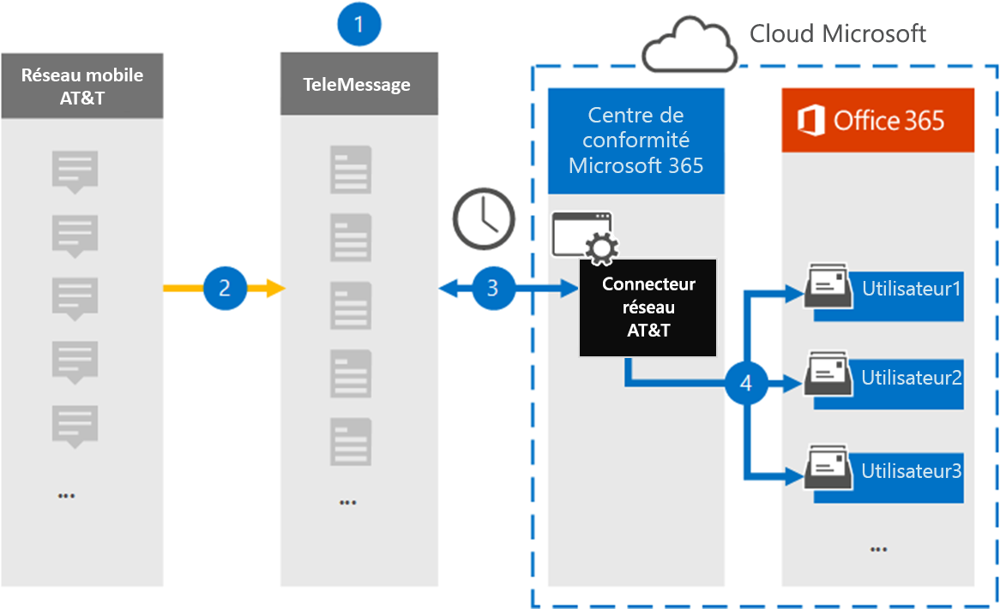

# Configurer un connecteur pour l’archivage sur&T SMS/MMS Data (préversion)

Utilisez un connecteur de Télémessage dans le centre de conformité Microsoft 365 pour importer et archiver des données SMS et MMS à partir de&réseau mobile. Une fois que vous avez configuré et configuré un connecteur, celui-ci se connecte à votre organisation à&réseau T une fois par jour, et importe les données SMS et MMS vers des boîtes aux lettres dans Microsoft 365.

Une fois que les messages SMS et MMS sont stockés dans des boîtes aux lettres utilisateur, vous pouvez appliquer des fonctionnalités de conformité de Microsoft 365 telles que la conservation pour litige, la recherche de contenu et les stratégies de rétention de Microsoft 365 à des données réseau&T. Par exemple, vous pouvez effectuer des recherches sur des données réseau&T à l’aide de la recherche de contenu ou associer la boîte aux lettres qui contient les données de connecteur réseau AT&T à un dépositaire dans un cas avancé de découverte électronique. L’utilisation d’un connecteur réseau AT&T pour importer et archiver des données dans Microsoft 365 peut aider votre organisation à respecter les stratégies gouvernementales et réglementaires.

## Vue d’ensemble de l’archivage sur&T Network Data

La vue d’ensemble suivante décrit le processus d’utilisation d’un connecteur pour l’archivage sur des données réseau&T dans Microsoft 365.

1. Votre organisation utilise le télémessage pour configurer un connecteur réseau AT&T. Pour plus d’informations, consultez la rubrique [sur&T Network archiver](https://www.telemessage.com/office365-activation-for-atnt-network-archiver/).

2. Une fois toutes les 24 heures, les messages SMS et MMS provenant de votre organisation sur&réseau T sont copiés sur le site de Télémessage.

3. Le connecteur réseau AT&T que vous créez dans le centre de conformité Microsoft 365 se connecte au site de Télémessage quotidiennement et transfère les messages SMS et MMS des dernières 24 heures vers un emplacement de stockage Azure sécurisé dans le Cloud Microsoft. Le connecteur convertit également le contenu des messages SMS et MMS au format d’un message électronique.

4. Le connecteur importe les éléments de communication mobile vers la boîte aux lettres d’utilisateurs spécifiques. Un nouveau dossier nommé **sur&T SMS/MMS Network archiver** est créé dans la boîte aux lettres de l’utilisateur et les éléments y sont importés. Le connecteur effectue ce mappage à l’aide de la valeur de la propriété d' *adresse de messagerie* de l’utilisateur. Chaque message SMS et MMS contient cette propriété, qui est renseignée avec l’adresse de messagerie de chaque participant du message.
 
   Outre le mappage utilisateur automatique à l’aide de la valeur de la propriété de l' *adresse de messagerie* de l’utilisateur, vous pouvez également définir un mappage personnalisé en chargeant un fichier de mappage CSV. Ce fichier de mappage contient le numéro de téléphone mobile et l’adresse de messagerie Microsoft 365 correspondante pour les utilisateurs de votre organisation. Si vous activez le mappage utilisateur automatique et le mappage personnalisé, pour chaque élément de messagerie que le connecteur examine d’abord dans le fichier de mappage personnalisé. S’il ne trouve pas d’utilisateur valide de Microsoft 365 correspondant à un numéro de téléphone mobile, le connecteur utilise les valeurs de la propriété adresse de messagerie de l’élément qu’il tente d’importer. Si le connecteur ne trouve pas d’utilisateur Microsoft 365 valide dans le fichier de mappage personnalisé ou dans la propriété adresse de messagerie de l’élément de courrier, l’élément n’est pas importé.

## Avant de commencer

La plupart des étapes d’implémentation requises pour l’archivage sur des données réseau&T sont externes à Microsoft 365 et doivent être terminées pour que vous puissiez créer le connecteur dans le centre de conformité.

- Commandez le [service mobile archiver à partir du Télémessage](https://www.telemessage.com/mobile-archiver/order-mobile-archiver-for-o365/) et obtenez un compte d’administration valide pour votre organisation. Vous devez vous connecter à ce compte lorsque vous créez le connecteur dans le centre de conformité.

- Obtenez votre compte AT&et les informations de contact de facturation pour pouvoir remplir les formulaires d’intégration de Télémessage et commander le service d’archivage de messages à partir de&T.

- Inscrivez tous les utilisateurs qui ont besoin d’un archivage réseau SMS/MMS dans&T dans le compte de Télémessage. Lors de l’inscription des utilisateurs, veillez à utiliser la même adresse de messagerie que celle utilisée pour leur compte Microsoft 365.

- Vos employés doivent disposer de téléphones mobiles appartenant à une entreprise et appartenant à une entreprise sur le réseau mobile AT&T. Les messages d’archivage dans Microsoft 365 ne sont pas disponibles pour les appareils appartenant aux employés ou «apportez vos propres périphériques (BYOD).

- Votre organisation doit consentir à autoriser le service d’importation Office 365 à accéder aux données de boîte aux lettres dans votre organisation. Vous devrez fournir ce consentement lors de la création du connecteur. Pour accepter cette demande, accédez à [cette page](https://login.microsoftonline.com/common/oauth2/authorize?client_id=570d0bec-d001-4c4e-985e-3ab17fdc3073&response_type=code&redirect_uri=https://portal.azure.com/&nonce=1234&prompt=admin_consent), connectez-vous à l’aide des informations d’identification d’un administrateur général Office 365, puis acceptez la demande. Vous devez effectuer cette étape avant de pouvoir créer un connecteur réseau AT&T.

- L’utilisateur qui crée un connecteur réseau AT&T doit se voir attribuer le rôle importation/exportation de boîte aux lettres dans Exchange Online. Cela est nécessaire pour ajouter des connecteurs dans la page **connecteurs de données** dans le centre de conformité Microsoft 365. Par défaut, ce rôle n’est affecté à aucun groupe de rôles dans Exchange Online. Vous pouvez ajouter le rôle exportation d’importation de boîte aux lettres au groupe de rôles gestion de l’organisation dans Exchange Online. Vous pouvez aussi créer un groupe de rôles, attribuer le rôle d’exportation d’importation de boîte aux lettres, puis ajouter les utilisateurs appropriés en tant que membres. Pour plus d’informations, reportez-vous aux sections [créer des groupes de rôles](https://docs.microsoft.com/Exchange/permissions-exo/role-groups#create-role-groups) ou modifier des [groupes](https://docs.microsoft.com/Exchange/permissions-exo/role-groups#modify-role-groups) de rôles dans l’article « gérer des groupes de rôles dans Exchange Online ».

## Créer un connecteur réseau AT&T

Une fois que vous avez terminé les conditions préalables décrites dans la section précédente, vous pouvez créer un connecteur réseau AT&T dans le centre de conformité Microsoft 365. Le connecteur utilise les informations que vous fournissez pour vous connecter au site de Télémessage et transférer les messages SMS et MMS vers les boîtes aux lettres utilisateur correspondantes dans Microsoft 365.

1. Accédez à [https://compliance.microsoft.com](https://compliance.microsoft.com/) , puis cliquez sur **connecteurs de données**sur  \  **&réseau**.

2. Sur la page Description du **produit réseau sur&T** , cliquez sur **Ajouter un connecteur** .

3. Sur la page **conditions de service** , cliquez sur **accepter**.

4. Sur la page **connexion à un message** , sous étape 3, entrez les informations requises dans les zones suivantes, puis cliquez sur **suivant**.

   - **Nom d’utilisateur :** Nom d’utilisateur de votre Télémessage.

   - **Mot de passe :** Mot de passe de votre Télémessage.

5. Une fois le connecteur créé, vous pouvez fermer la fenêtre contextuelle et passer à la page suivante.

6. Sur la page mappage de l' **utilisateur** , activez mappage utilisateur automatique. Pour activer le mappage personnalisé, téléchargez un fichier CSV contenant les informations de mappage de l’utilisateur, puis cliquez sur **suivant**.

7. Fournissez le consentement de l’administrateur, puis cliquez sur **suivant**.

   Pour fournir le consentement de l’administrateur, vous devez être connecté avec les informations d’identification d’un administrateur général Office 365, puis accepter la demande de consentement. Si vous n’êtes pas connecté en tant qu’administrateur général, vous pouvez accéder à [cette page](https://login.microsoftonline.com/common/oauth2/authorize?client_id=570d0bec-d001-4c4e-985e-3ab17fdc3073&response_type=code&redirect_uri=https://portal.azure.com/&nonce=1234&prompt=admin_consent) et vous connecter à l’aide des informations d’identification d’administrateur général pour accepter la demande. 

8. Vérifiez vos paramètres, puis cliquez sur **Terminer** pour créer le connecteur.

9. Accédez à l’onglet **connecteurs** de la page **connecteurs de données** dans le centre de conformité pour voir la progression du processus d’importation pour le nouveau connecteur.

## Problèmes connus

- Le connecteur n’importe pas d’élément d’une taille supérieure à 10 Mo.
