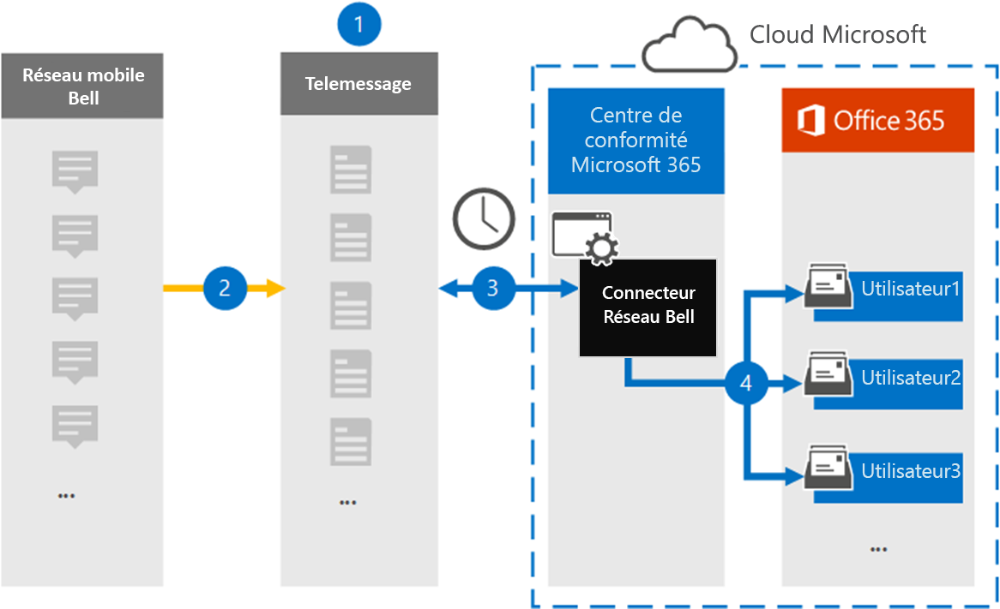

# Configuration d’un connecteur pour l’archivage des données réseau Bell

Utilisez un connecteur de Télémessage dans le centre de conformité Microsoft 365 pour importer et archiver des messages SMS (Short Messaging Service) et MMS (Multimedia Messaging Service) à partir du réseau Bell. Une fois que vous avez configuré et configuré un connecteur, celui-ci se connecte au réseau Bell de votre organisation une fois par jour et importe les messages SMS et MMS vers des boîtes aux lettres dans Microsoft 365.

Une fois que les messages SMS et MMS sont stockés dans des boîtes aux lettres utilisateur, vous pouvez appliquer les fonctionnalités de conformité de Microsoft 365 telles que la conservation pour litige, la recherche de contenu et les stratégies de rétention 365 Microsoft pour les données réseau Bell. Par exemple, vous pouvez rechercher Bell Network SMS/MMS à l’aide de la recherche de contenu ou associer la boîte aux lettres qui contient les données Bell Network Connector à un dépositaire dans un cas avancé de découverte électronique. L’utilisation d’un connecteur de réseau Bell pour importer et archiver des données dans Microsoft 365 peut aider votre organisation à respecter les stratégies gouvernementales et réglementaires.

## Vue d’ensemble de l’archivage Bell Network Data

La vue d’ensemble suivante décrit le processus d’utilisation d’un connecteur pour archiver les données réseau Bell dans Microsoft 365.

1. Votre organisation fonctionne avec les télémessages et Bell pour configurer un connecteur réseau Bell. Pour plus d’informations, consultez la rubrique [Bell Network archiver](https://www.telemessage.com/office365-activation-for-bell-network-archiver).

2. Une fois toutes les 24 heures, les messages SMS et MMS provenant du réseau Bell de votre organisation sont copiés sur le site de Télémessage.

3. Le connecteur réseau Bell que vous créez dans le centre de conformité Microsoft 365 se connecte au site de messagerie tous les jours et transfère les messages SMS et MMS des dernières 24 heures vers un emplacement de stockage Azure sécurisé dans le Cloud Microsoft. Le connecteur convertit également le contenu des messages SMS et MMS au format d’un message électronique.

4. Le connecteur importe les éléments de communication mobile vers la boîte aux lettres d’utilisateurs spécifiques. Un nouveau dossier nommé **Bell SMS/MMS Network archiver** est créé dans la boîte aux lettres d’un utilisateur spécifique et les éléments y sont importés. Le connecteur effectue ce mappage à l’aide de la valeur de la propriété d' *adresse de messagerie* de l’utilisateur. Chaque message SMS et MMS contient cette propriété, qui est renseignée avec l’adresse de messagerie de chaque participant du message.

   Outre le mappage utilisateur automatique à l’aide de la valeur de la propriété de l' *adresse de messagerie* de l’utilisateur, vous pouvez également définir un mappage personnalisé en chargeant un fichier de mappage CSV. Ce fichier de mappage contient le numéro de téléphone mobile et l’adresse de messagerie Microsoft 365 correspondante pour les utilisateurs de votre organisation. Si vous activez un mappage utilisateur et un mappage personnalisés, pour chaque élément réseau Bell, le connecteur examine d’abord le fichier de mappage personnalisé. S’il ne trouve pas un utilisateur Microsoft 365 valide correspondant au numéro de téléphone mobile d’un utilisateur, le connecteur utilise les valeurs de la propriété adresse de messagerie de l’élément qu’il tente d’importer. Si le connecteur ne trouve pas d’utilisateur Microsoft 365 valide dans le fichier de mappage personnalisé ou dans la propriété adresse de messagerie de l’élément réseau Bell, l’élément n’est pas importé.

## Avant de commencer

Certaines étapes de mise en œuvre requises pour l’archivage des données réseau Bell sont externes à Microsoft 365 et doivent être effectuées avant de pouvoir créer un connecteur dans le centre de conformité.

- Commandez le [service Bell Network archiver à partir de Télémessage](https://www.telemessage.com/mobile-archiver/order-mobile-archiver-for-o365/) et obtenez un compte d’administration valide pour votre organisation. Vous devez vous connecter à ce compte lorsque vous créez le connecteur dans le centre de conformité.

- Obtenez votre compte réseau Bell et les détails du contact de facturation pour pouvoir remplir les formulaires d’intégration de Télémessage et commander le service d’archivage de messages à partir de Bell.

- Inscrivez tous les utilisateurs qui nécessitent l’archivage réseau Bell SMS/MMS dans le compte de Télémessage. Lors de l’inscription des utilisateurs, veillez à utiliser la même adresse de messagerie que celle utilisée pour leur compte Microsoft 365.

- Vos employés doivent avoir des téléphones mobiles appartenant à une entreprise et appartenant à une entreprise sur le réseau mobile Bell. Les messages d’archivage dans Microsoft 365 ne sont pas disponibles pour les appareils appartenant aux employés ou «apportez vos propres périphériques (BYOD).

- L’utilisateur qui crée un connecteur réseau Bell doit disposer du rôle d’exportation d’importation de boîte aux lettres dans Exchange Online. Cela est nécessaire pour ajouter des connecteurs dans la page **connecteurs de données** dans le centre de conformité Microsoft 365. Par défaut, ce rôle n’est affecté à aucun groupe de rôles dans Exchange Online. Vous pouvez ajouter le rôle exportation d’importation de boîte aux lettres au groupe de rôles gestion de l’organisation dans Exchange Online. Vous pouvez aussi créer un groupe de rôles, attribuer le rôle d’exportation d’importation de boîte aux lettres, puis ajouter les utilisateurs appropriés en tant que membres. Pour plus d’informations, reportez-vous aux sections [créer des groupes de rôles](https://docs.microsoft.com/Exchange/permissions-exo/role-groups#create-role-groups) ou modifier des [groupes](https://docs.microsoft.com/Exchange/permissions-exo/role-groups#modify-role-groups) de rôles dans l’article « gérer des groupes de rôles dans Exchange Online ».

## Créer un connecteur réseau Bell

La dernière étape consiste à créer un connecteur réseau Bell dans le centre de conformité Microsoft 365. Le connecteur utilise les informations que vous fournissez pour vous connecter au site de Télémessage et transférer les messages SMS/MMS vers les boîtes aux lettres utilisateur correspondantes dans Microsoft 365.

1. Accédez à [https://compliance.microsoft.com](https://compliance.microsoft.com) , puis cliquez sur **connecteurs de données**  >  **Bell SMS/MMS Network archiver**.

2. Sur la page Description du produit **Bell Network** , cliquez sur **Ajouter un connecteur** .

3. Sur la page **conditions de service** , cliquez sur **accepter**.

4. Sur la page **connexion à un message** , sous étape 3, entrez les informations requises dans les zones suivantes, puis cliquez sur **suivant**.

   - **Nom d’utilisateur :** Nom d’utilisateur de votre Télémessage.

   - **Mot de passe :** Mot de passe de votre Télémessage.

5. Une fois le connecteur créé, vous pouvez fermer la fenêtre contextuelle et passer à la page suivante.

6. Sur la page mappage de l' **utilisateur** , activez mappage utilisateur automatique. Pour activer le mappage personnalisé, téléchargez un fichier CSV contenant les informations de mappage de l’utilisateur, puis cliquez sur **suivant**.

7. Vérifiez vos paramètres, puis cliquez sur **Terminer** pour créer le connecteur.

8. Accédez à l’onglet **connecteurs** de la page **connecteurs de données** dans le centre de conformité pour voir la progression du processus d’importation pour le nouveau connecteur.

## Problèmes connus

- Pour le moment, nous ne prenons pas en charge l’importation de pièces jointes ou d’éléments dont la taille est supérieure à 10 Mo. La prise en charge des éléments plus importants sera disponible ultérieurement.
