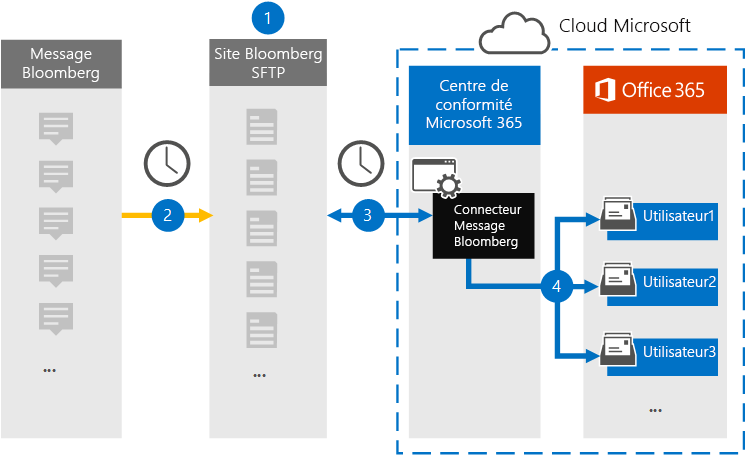

# Configuration d’un connecteur pour l’archivage des données de message Bloomberg

Utilisez un connecteur de données dans le centre de conformité Microsoft 365 pour importer et archiver des données de messagerie électronique des services financiers à partir de l’outil de collaboration [message Bloomberg](https://www.bloomberg.com/professional/product/collaboration/) . Une fois que vous avez configuré et configuré un connecteur, celui-ci se connecte au site Bloomberg Secure FTP (SFTP) de votre organisation une fois par jour et importe des éléments de courrier électronique vers des boîtes aux lettres dans Microsoft 365.

Une fois que les données de message Bloomberg sont stockées dans les boîtes aux lettres des utilisateurs, vous pouvez appliquer les fonctionnalités de conformité de Microsoft 365 telles que la conservation pour litige, la recherche de contenu, l’archivage inaltérable, l’audit, la conformité de la communication et les stratégies de rétention de Microsoft 365 aux données de message Bloomberg. Par exemple, vous pouvez rechercher des messages électroniques de message Bloomberg à l’aide de l’outil de recherche de contenu ou associer la boîte aux lettres qui contient les données de message Bloomberg à un dépositaire dans un cas avancé de découverte électronique. L’utilisation d’un connecteur de messages Bloomberg pour importer et archiver des données dans Microsoft 365 peut aider votre organisation à respecter les stratégies gouvernementales et réglementaires.

## Vue d’ensemble de l’archivage des données de message Bloomberg

La vue d’ensemble suivante décrit le processus d’utilisation d’un connecteur pour archiver les données de message Bloomberg dans Microsoft 365.

1. Votre organisation travaille avec Bloomberg pour configurer un site Bloomberg SFTP. Vous allez également utiliser Bloomberg pour configurer le message Bloomberg afin de copier les messages électroniques vers le site Bloomberg SFTP.

2. Une fois toutes les 24 heures, les messages électroniques provenant du message Bloomberg sont copiés sur le site Bloomberg SFTP.

3. Le connecteur de messages Bloomberg que vous créez dans le centre de conformité Microsoft 365 se connecte au site de Bloomberg SFTP tous les jours et transfère les messages électroniques des 24 heures précédents vers une zone de stockage Azure sécurisée dans le Cloud Microsoft.

4. Le connecteur importe les éléments de message électronique dans la boîte aux lettres d’un utilisateur spécifique. Un nouveau dossier nommé BloombergMessage est créé dans la boîte aux lettres de l’utilisateur spécifique et les éléments y sont importés. 

   Le connecteur effectue cette opération à l’aide de la valeur de la propriété CorporateEmailAddress. Chaque message électronique contient cette propriété, qui est renseignée avec l’adresse de messagerie de chaque participant du message électronique. Outre le mappage utilisateur automatique à l’aide de la valeur de la propriété *CorporateEmailAddress* , vous pouvez également définir un mappage personnalisé en chargeant un fichier de mappage CSV. Ce fichier de mappage contient un UUID Bloomberg et l’adresse de boîte aux lettres Microsoft 365 correspondante pour chaque utilisateur de votre organisation. Si vous activez le mappage utilisateur automatique et que vous fournissez un mappage personnalisé, pour chaque élément de courrier, le connecteur regarde d’abord le fichier de mappage personnalisé. S’il ne trouve pas d’utilisateur Microsoft 365 valide correspondant à l’UUID Bloomberg d’un utilisateur, le connecteur utilise la propriété *CorporateEmailAddress* de l’élément de courrier électronique. Si le connecteur ne trouve pas d’utilisateur valide de Microsoft 365 dans le fichier de mappage personnalisé ou dans la propriété *CorporateEmailAddress* de l’élément de courrier, l’élément n’est pas importé.

## Avant de commencer

Certaines des étapes d’implémentation requises pour archiver les données de message Bloomberg sont externes à Microsoft 365 et doivent être terminées pour que vous puissiez créer le connecteur dans le centre de conformité.

- S’abonner à [Bloomberg Anywhere](https://www.bloomberg.com/professional/product/remote-access/?bbgsum-page=DG-WS-PROF-PROD-BBA). Cette opération est nécessaire afin que vous puissiez vous connecter à Bloomberg Anywhere pour accéder au site Bloomberg SFTP que vous devez configurer et configurer.

- Configurez un site Bloomberg SFTP (Secure File Transfer Protocol). Après avoir travaillé avec Bloomberg pour configurer le site SFTP, les données du message Bloomberg sont téléchargées sur le site SFTP tous les jours. Le connecteur que vous créez à l’étape 2 se connecte à ce site SFTP et transfère les données de messagerie vers des boîtes aux lettres Microsoft 365. SFTP chiffre également les données de message Bloomberg qui sont envoyées aux boîtes aux lettres pendant le processus de transfert.

  Pour plus d’informations sur Bloomberg SFTP (également appelé *BB-SFTP*) :

  - Consultez le document « standards de connectivité SFTP » sur le [support Bloomberg](https://www.bloomberg.com/professional/support/documentation/).

  - Contacter le [support client Bloomberg](https://service.bloomberg.com/portal/sessions/new?utm_source=bloomberg-menu&utm_medium=csc).

   > [!NOTE]
   > Si votre organisation a déjà déployé un connecteur pour archiver les données Bloomberg instantanées, vous n’avez pas besoin de configurer un autre site SFTP. Vous pouvez utiliser le même site SFTP pour le connecteur de messages Bloomberg.

- Une fois que vous avez travaillé avec Bloomberg pour configurer un site SFTP, Bloomberg vous fournira des informations après avoir répondu au message d’implémentation Bloomberg. Enregistrez une copie des informations suivantes. Vous l’utilisez pour configurer un connecteur à l’étape 3.

  - Le code de confirmation, qui est un ID pour votre organisation et est utilisé pour se connecter au site Bloomberg SFTP.

  - Mot de passe pour votre site Bloomberg SFTP

  - URL du site de Bloomberg SFTP (par exemple, sftp.bloomberg.com). En outre, Bloomberg peut également fournir une adresse IP correspondante pour le site de Bloomberg SFTP, qui peut également être utilisée pour configurer le connecteur.

  - Numéro de port pour le site Bloomberg SFTP

- L’utilisateur qui crée un connecteur de message Bloomberg à l’étape 3 (et qui télécharge les clés publiques et l’adresse IP à l’étape 1) doit se voir attribuer le rôle d’exportation d’importation de boîte aux lettres dans Exchange Online. Cela est nécessaire pour ajouter des connecteurs dans la page **connecteurs de données** dans le centre de conformité Microsoft 365. Par défaut, ce rôle n’est affecté à aucun groupe de rôles dans Exchange Online. Vous pouvez ajouter le rôle exportation d’importation de boîte aux lettres au groupe de rôles gestion de l’organisation dans Exchange Online. Vous pouvez aussi créer un groupe de rôles, attribuer le rôle d’exportation d’importation de boîte aux lettres, puis ajouter les utilisateurs appropriés en tant que membres. Pour plus d’informations, reportez-vous aux sections [créer des groupes de rôles](https://docs.microsoft.com/Exchange/permissions-exo/role-groups#create-role-groups) ou modifier des [groupes](https://docs.microsoft.com/Exchange/permissions-exo/role-groups#modify-role-groups) de rôles dans l’article « gérer des groupes de rôles dans Exchange Online ».

## Étape 1 : obtenir des clés publiques SSH et PGP

La première étape consiste à obtenir une copie des clés publiques pour le protocole SSH (Secure Shell) et PGP (Pretty bonne confidentialité). Utilisez ces clés à l’étape 2 pour configurer le site Bloomberg SFTP de sorte que le connecteur (que vous créez à l’étape 3) se connecte au site SFTP et transfère les données e-mail du message Bloomberg vers les boîtes aux lettres Microsoft 365. Vous pouvez également obtenir une adresse IP dans cette étape, que vous utiliserez lors de la configuration du site Bloomberg SFTP.

1. Accédez à [ https://compliance.microsoft.com\ ] ( https://compliance.microsoft.com) et cliquez sur **connecteurs de données** dans le volet de navigation de gauche.

2. Sur la page **connecteurs de données** , sous **message Bloomberg**, cliquez sur **Afficher**.

3. Sur la page Description du produit **Bloomberg message** , cliquez sur **Ajouter un connecteur** .

4. Sur la page **conditions de service** , cliquez sur **accepter**.

5. Sur le **site ajouter des informations d’identification pour Bloomberg SFTP** sous étape 1, cliquez sur les liens **Télécharger la clé SSH**, **Télécharger la clé PGP** et **Télécharger l’adresse IP** pour enregistrer une copie de chaque fichier sur votre ordinateur local. Ces fichiers contiennent les éléments suivants qui sont utilisés pour configurer le site de Bloomberg SFTP à l’étape 2 :

   - Clé publique SSH : cette clé permet de configurer le protocole SSH (Secure Shell) pour activer une connexion à distance sécurisée lorsque le connecteur se connecte au site Bloomberg SFTP.

   - Clé publique PGP : cette clé permet de configurer le chiffrement des données transférées à partir du site Bloomberg SFTP vers Microsoft 365.

   - Adresse IP : le site Bloomberg SFTP est configuré pour accepter une demande de connexion uniquement à partir de cette adresse IP, utilisée par le connecteur de messages Bloomberg que vous créez à l’étape 3.

6. Cliquez sur **Annuler** pour fermer l’Assistant. Vous revenez à cet Assistant à l’étape 3 pour créer le connecteur.

## Étape 2 : configurer le site Bloomberg SFTP

> [!NOTE]
> Comme indiqué précédemment, si votre organisation a déjà configuré un site Bloomberg SFTP pour archiver les données Bloomberg instantanées, vous n’avez pas besoin d’en configurer une autre. Vous pouvez spécifier le même site SFTP lors de la création du connecteur à l’étape 3.

L’étape suivante consiste à utiliser les clés publiques SSH et PGP, ainsi que l’adresse IP que vous avez obtenue à l’étape 1, pour configurer l’authentification SSH et le chiffrement PGP pour le site Bloomberg SFTP. Cela permet au connecteur de messages Bloomberg que vous créez à l’étape 3 de se connecter au site Bloomberg SFTP et de transférer les données de message Bloomberg à Microsoft 365. Vous devez utiliser le support client Bloomberg pour configurer votre site Bloomberg SFTP. Contactez le support technique de [client Bloomberg](https://service.bloomberg.com/portal/sessions/new?utm_source=bloomberg-menu&utm_medium=csc) pour obtenir de l’aide.

> [!IMPORTANT]
> Bloomberg recommande de joindre les trois fichiers que vous avez téléchargés à l’étape 1 à un message électronique et de les envoyer à leur équipe de support technique lorsqu’ils travaillent dessus pour configurer votre site Bloomberg SFTP.

## Étape 3 : créer un connecteur de message Bloomberg

La dernière étape consiste à créer un connecteur de message Bloomberg dans le centre de conformité Microsoft 365. Le connecteur utilise les informations que vous fournissez pour vous connecter au site Bloomberg SFTP et transférer les messages électroniques dans les boîtes aux lettres utilisateur correspondantes dans Microsoft 365.

1. Accédez à [https://compliance.microsoft.com](https://compliance.microsoft.com) , puis cliquez sur **connecteurs de données** dans le volet de navigation de gauche.

2. Sur la page **connecteurs de données** , sous **message Bloomberg**, cliquez sur **Afficher**.

3. Sur la page Description du produit **Bloomberg message** , cliquez sur **Ajouter un connecteur** .

4. Sur la page **conditions de service** , cliquez sur **accepter**.

5. Sur la page **Ajouter des informations d’identification pour le site de Bloomberg SFTP** , sous étape 3, entrez les informations requises dans les zones suivantes, puis cliquez sur **suivant**.

      - **Code de confirmation :** ID de votre organisation utilisé comme nom d’utilisateur pour le site Bloomberg SFTP.

      - **Mot de passe :** Mot de passe du site Bloomberg SFTP de votre organisation.

      - **URL sftp :** URL du site de Bloomberg SFTP (par exemple, sftp.bloomberg.com).

      - **Port sftp :** Numéro de port du site Bloomberg SFTP. Le connecteur utilise ce port pour se connecter au site SFTP.

6. Sur la page **mappage utilisateur** , activez le mappage utilisateur automatique et fournissez un mappage utilisateur personnalisé, selon les besoins.

7. Cliquez sur **suivant**, vérifiez vos paramètres, puis cliquez sur préparer pour créer le connecteur.

8. Accédez à la page **connecteurs de données** pour voir la progression du processus d’importation pour le nouveau connecteur.

## Problèmes connus

- Le Threading du message Bloomberg message importé dans Microsoft 365 n’est pas pris en charge. Les messages individuels envoyés à une personne sont importés, mais ils ne sont pas présentés dans une conversation de thread. Microsoft s’efforce de prendre en charge le Threading dans les versions ultérieures du connecteur de données de message Bloomberg.
