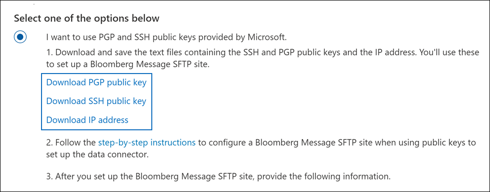

# Configurer un connecteur pour archiver les données de message Bloomberg

Utilisez un connecteur de données dans le portail de conformité Microsoft Purview pour importer et archiver les données de messagerie des services financiers à partir de l’outil [bloomberg Message](https://www.bloomberg.com/professional/product/collaboration/) Collaboration. Une fois que vous avez configuré et configuré un connecteur, il se connecte au site Bloomberg secure FTP (SFTP) de votre organisation une fois par jour et importe des éléments de messagerie dans des boîtes aux lettres dans Microsoft 365.

Une fois les données de message Bloomberg stockées dans des boîtes aux lettres utilisateur, vous pouvez appliquer des fonctionnalités Microsoft Purview telles que la conservation des litiges, la recherche de contenu, l’archivage sur place, l’audit, la conformité des communications et les stratégies de rétention Microsoft 365 aux données de message Bloomberg. Par exemple, vous pouvez rechercher des e-mails de message Bloomberg à l’aide de l’outil de recherche de contenu ou associer la boîte aux lettres qui contient les données de message Bloomberg à un consignateur dans un cas eDiscovery (Premium). L’utilisation d’un connecteur Message Bloomberg pour importer et archiver des données dans Microsoft 365 peut aider votre organisation à rester conforme aux politiques gouvernementales et réglementaires.

## Vue d’ensemble de l’archivage des données de message Bloomberg

La vue d’ensemble suivante explique le processus d’utilisation d’un connecteur pour archiver les données de message Bloomberg dans Microsoft 365.

1. Votre organisation travaille avec Bloomberg pour configurer un site Bloomberg SFTP. Vous travaillerez également avec Bloomberg pour configurer Bloomberg Message afin de copier des messages électroniques vers le site Bloomberg SFTP.

2. Toutes les 24 heures, les messages électroniques de Bloomberg Message sont copiés sur le site SFTP Bloomberg.

3. Le connecteur De message Bloomberg que vous créez dans le portail de conformité se connecte au site Bloomberg SFTP tous les jours et transfère les messages électroniques des 24 dernières heures vers une zone de stockage Azure sécurisée dans le cloud Microsoft.

4. Le connecteur importe les éléments de message électronique dans la boîte aux lettres d’un utilisateur spécifique. Un nouveau dossier nommé BloombergMessage est créé dans la boîte aux lettres de l’utilisateur spécifique et les éléments y sont importés.

   Pour ce faire, le connecteur utilise la valeur de la propriété CorporateEmailAddress. Chaque message électronique contient cette propriété, qui est remplie avec l’adresse e-mail de chaque participant du message électronique. En plus du mappage automatique des utilisateurs à l’aide de la valeur de la propriété *CorporateEmailAddress* , vous pouvez également définir un mappage personnalisé en chargeant un fichier de mappage CSV. Ce fichier de mappage contient un UUID Bloomberg et l’adresse de boîte aux lettres Microsoft 365 correspondante pour chaque utilisateur de votre organisation. Si vous activez le mappage automatique des utilisateurs et fournissez un mappage personnalisé, pour chaque élément de messagerie, le connecteur examine d’abord le fichier de mappage personnalisé. S’il ne trouve pas d’utilisateur Microsoft 365 valide qui correspond à l’UUID Bloomberg d’un utilisateur, le connecteur utilise la propriété *CorporateEmailAddress* de l’élément de messagerie. Si le connecteur ne trouve pas d’utilisateur Microsoft 365 valide dans le fichier de mappage personnalisé ou dans la propriété *CorporateEmailAddress* de l’élément de messagerie, l’élément n’est pas importé.

## Avant de configurer un connecteur

Certaines des étapes d’implémentation requises pour archiver les données de message Bloomberg sont externes à Microsoft 365 et doivent être effectuées avant de pouvoir créer le connecteur dans le centre de conformité.

- Pour configurer un connecteur De message Bloomberg, vous devez utiliser des clés et des phrases secrètes clés pour Pretty Good Privacy (PGP) et Secure Shell (SSH). Ces clés sont utilisées pour configurer le site SFTP Bloomberg et utilisées par le connecteur pour se connecter au site Bloomberg SFTP afin d’importer des données dans Microsoft 365. La clé PGP est utilisée pour configurer le chiffrement des données transférées du site Bloomberg SFTP vers Microsoft 365. La clé SSH est utilisée pour configurer l’interpréteur de commandes sécurisé afin d’activer une connexion à distance sécurisée lorsque le connecteur se connecte au site SFTP Bloomberg.

  Lors de la configuration d’un connecteur, vous avez la possibilité d’utiliser des clés publiques et des phrases secrètes de clé fournies par Microsoft, ou vous pouvez utiliser vos propres clés privées et phrases secrètes. Nous vous recommandons d’utiliser les clés publiques fournies par Microsoft. Toutefois, si votre organisation a déjà configuré un site Bloomberg SFTP à l’aide de clés privées, vous pouvez créer un connecteur à l’aide de ces mêmes clés privées.

- Abonnez-vous à [Bloomberg Anywhere](https://www.bloomberg.com/professional/product/remote-access/?bbgsum-page=DG-WS-PROF-PROD-BBA). Cela est nécessaire pour vous connecter à Bloomberg Anywhere pour accéder au site Bloomberg SFTP que vous devez configurer et configurer.

- Configurez un site Bloomberg SFTP (Secure File Transfer Protocol). Après avoir travaillé avec Bloomberg pour configurer le site SFTP, les données de Bloomberg Message sont chargées sur le site SFTP tous les jours. Le connecteur que vous créez à l’étape 2 se connecte à ce site SFTP et transfère les données de messagerie aux boîtes aux lettres Microsoft 365. SFTP chiffre également les données de message Bloomberg envoyées aux boîtes aux lettres pendant le processus de transfert.

  Pour plus d’informations sur Bloomberg SFTP (également appelé *BB-SFTP*) :

  - Consultez le document « Standards de connectivité SFTP » au [support Bloomberg](https://www.bloomberg.com/professional/support/documentation/).

  - Contactez le [support technique Bloomberg](https://service.bloomberg.com/portal/sessions/new?utm_source=bloomberg-menu&utm_medium=csc).

- Une fois que vous avez créé un site SFTP avec Bloomberg, Bloomberg vous fournira des informations une fois que vous aurez répondu au message électronique d’implémentation de Bloomberg. Enregistrez une copie des informations suivantes. Vous l’utilisez pour configurer un connecteur à l’étape 3.

  - Code d’entreprise, qui est un ID pour votre organisation et qui est utilisé pour se connecter au site Bloomberg SFTP.

  - Mot de passe de votre site Bloomberg SFTP

  - URL du site Bloomberg SFTP (par exemple, sftp.bloomberg.com). En outre, Bloomberg peut également fournir une adresse IP correspondante pour le site Bloomberg SFTP, qui peut également être utilisé pour configurer le connecteur.

  - Numéro de port pour le site Bloomberg SFTP

- Le connecteur Bloomberg Message peut importer un total de 200 000 éléments en une seule journée. S’il y a plus de 200 000 éléments sur le site SFTP, aucun de ces éléments n’est importé dans Microsoft 365.

- L’utilisateur qui crée un connecteur De message Bloomberg à l’étape 3 (et qui télécharge les clés publiques et l’adresse IP à l’étape 1) doit avoir le rôle d’administrateur du connecteur de données. Ce rôle est requis pour ajouter des connecteurs sur la page **Connecteurs de données** dans le portail de conformité. Ce rôle est ajouté par défaut à plusieurs groupes de rôles. Pour obtenir la liste de ces groupes de rôles, consultez la section « Rôles dans les centres de sécurité et de conformité » dans [Autorisations dans le Centre de sécurité & conformité](../security/office-365-security/permissions-in-the-security-and-compliance-center.md#roles-in-the-security--compliance-center). Un administrateur de votre organisation peut également créer un groupe de rôles personnalisé, attribuer le rôle Administrateur du connecteur de données, puis ajouter les utilisateurs appropriés en tant que membres. Pour obtenir des instructions, consultez la section « Créer un groupe de rôles personnalisé » dans [Autorisations dans le portail de conformité Microsoft Purview](microsoft-365-compliance-center-permissions.md#create-a-custom-role-group).

## Configurer un connecteur à l’aide de clés publiques

Les étapes de cette section vous montrent comment configurer un connecteur Message Bloomberg à l’aide des clés publiques pour Pretty Good Privacy (PGP) et Secure Shell (SSH).

### Étape 1 : Obtenir des clés publiques PGP et SSH

La première étape consiste à obtenir une copie des clés publiques PGP et SSH. Vous utilisez ces clés à l’étape 2 pour configurer le site Bloomberg SFTP afin d’autoriser le connecteur (que vous créez à l’étape 3) à se connecter au site SFTP et transférer les données de messagerie du message Bloomberg vers Microsoft 365 boîtes aux lettres. Vous obtenez également une adresse IP dans cette étape, que vous utilisez lors de la configuration du site SFTP Bloomberg.

1. Accédez et <https://compliance.microsoft.com> cliquez sur **Connecteurs de données** dans le volet de navigation gauche.

2. Dans la page **Connecteurs de données** sous **Message Bloomberg**, cliquez sur **Afficher**.

3. Dans la page de description du produit **Message Bloomberg** , cliquez sur **Ajouter un connecteur**

4. Dans la page **Conditions d’utilisation** , cliquez sur **Accepter**.

5. Dans la page **Ajouter des informations d’identification pour la source de contenu** , cliquez sur **Je veux utiliser les clés publiques PGP et SSH fournies par Microsoft**.

   

6. À l’étape 1, cliquez sur la **clé Télécharger SSH**, **téléchargez la clé PGP** et téléchargez les liens d’adresse **IP** pour enregistrer une copie de chaque fichier sur votre ordinateur local.

   

   Ces fichiers contiennent les éléments suivants qui sont utilisés pour configurer le site Bloomberg SFTP à l’étape 2 :

   - Clé publique PGP : cette clé est utilisée pour configurer le chiffrement des données transférées du site SFTP Bloomberg vers Microsoft 365.

   - Clé publique SSH : cette clé est utilisée pour configurer l’interpréteur de commandes sécurisé afin d’activer une connexion à distance sécurisée lorsque le connecteur se connecte au site Bloomberg SFTP.

   - Adresse IP : le site Bloomberg SFTP est configuré pour accepter les demandes de connexion à partir de cette adresse IP. La même adresse IP est utilisée par le connecteur De message Bloomberg pour se connecter au site SFTP et transférer les données de message Bloomberg vers Microsoft 365.

7. Cliquez sur **Annuler** pour fermer l’Assistant. Vous revenez à cet Assistant à l’étape 3 pour créer le connecteur.

### Étape 2 : Configurer le site Bloomberg SFTP

> [!NOTE]
> Si votre organisation a déjà configuré un site SFTP Bloomberg pour archiver des données Bloomberg instantanées à l’aide de clés PGP et SSH publiques, vous n’avez pas besoin d’en configurer un autre. Vous pouvez spécifier le même site SFTP lorsque vous créez le connecteur à l’étape 3.

L’étape suivante consiste à utiliser les clés publiques PGP et SSH et l’adresse IP que vous avez obtenues à l’étape 1 pour configurer le chiffrement PGP et l’authentification SSH pour le site Bloomberg SFTP. Cela permet au connecteur De message Bloomberg que vous créez à l’étape 3 de se connecter au site Bloomberg SFTP et de transférer les données de message Bloomberg vers Microsoft 365. Vous devez travailler avec le support client Bloomberg pour configurer votre site Bloomberg SFTP. Contactez le [support technique bloomberg](https://service.bloomberg.com/portal/sessions/new?utm_source=bloomberg-menu&utm_medium=csc) pour obtenir de l’aide.

> [!IMPORTANT]
> Bloomberg vous recommande d’attacher les trois fichiers que vous avez téléchargés à l’étape 1 à un e-mail et de l’envoyer à leur équipe de support technique lorsque vous travaillez avec eux pour configurer votre site Bloomberg SFTP.

### Étape 3 : Créer un connecteur de message Bloomberg

La dernière étape consiste à créer un connecteur Bloomberg Message dans le portail de conformité. Le connecteur utilise les informations que vous fournissez pour se connecter au site Bloomberg SFTP et transférer des messages électroniques vers les boîtes aux lettres utilisateur correspondantes dans Microsoft 365.

1. Accédez et <https://compliance.microsoft.com> cliquez sur **Connecteurs de données** dans le volet de navigation gauche.

2. Dans la page **Connecteurs de données** sous **Message Bloomberg**, cliquez sur **Afficher**.

3. Dans la page de description du produit **Message Bloomberg** , cliquez sur **Ajouter un connecteur**

4. Dans la page **Conditions d’utilisation** , cliquez sur **Accepter**.

5. Dans la page **Ajouter des informations d’identification pour la source de contenu** , cliquez sur **Je veux utiliser les clés publiques PGP et SSH fournies par Microsoft**.

6. À l’étape 3, entrez les informations requises dans les zones suivantes, puis cliquez sur **Valider la connexion**.

      - **Nom:** Nom du connecteur. Il doit être unique dans votre organisation.

      - **Code ferme :** ID de votre organisation utilisé comme nom d’utilisateur pour le site Bloomberg SFTP.

      - **Mot de passe:** Mot de passe du site Bloomberg SFTP de votre organisation.

      - **URL SFTP :** URL du site Bloomberg SFTP (par exemple, `sftp.bloomberg.com`). Vous pouvez également utiliser une adresse IP pour cette valeur.

      - **Port SFTP :** Numéro de port du site Bloomberg SFTP. Le connecteur utilise ce port pour se connecter au site SFTP.

7. Une fois la connexion validée, cliquez sur **Suivant**.

8. Dans la page **Définir l’utilisateur** , spécifiez les utilisateurs pour lequel importer des données.

     - **Tous les utilisateurs de votre organisation**. Sélectionnez cette option pour importer des données pour tous les utilisateurs.

     - **Seuls les utilisateurs en attente de litige**. Sélectionnez cette option pour importer des données uniquement pour les utilisateurs dont les boîtes aux lettres sont mises en attente pour litige. Cette option importe des données vers des boîtes aux lettres utilisateur dont la propriété LitigationHoldEnabled a la valeur True. Pour plus d’informations, consultez [Créer une conservation de litige](create-a-litigation-hold.md).

9. Dans la page **Map Bloomberg Message aux utilisateurs Microsoft 365**, activez le mappage automatique des utilisateurs et fournissez un mappage d’utilisateur personnalisé en fonction des besoins.

   > [!NOTE]
   > Le connecteur importe des éléments de message dans la boîte aux lettres d’un utilisateur spécifique. Un nouveau dossier nommé **BloombergMessage** est créé dans la boîte aux lettres de l’utilisateur spécifique et les éléments y sont importés. Le connecteur utilise la valeur de la propriété *CorporateEmailAddress* . Chaque message de conversation contient cette propriété, et la propriété est remplie avec l’adresse e-mail de chaque participant du message de conversation. Outre le mappage automatique des utilisateurs à l’aide de la valeur de la propriété *CorporateEmailAddress* , vous pouvez également définir un mappage personnalisé en chargeant un fichier de mappage CSV. Le fichier de mappage doit contenir l’UUID Bloomberg et l’adresse de boîte aux lettres Microsoft 365 correspondante pour chaque utilisateur. Si vous activez le mappage automatique des utilisateurs et fournissez un mappage personnalisé, pour chaque élément de message, le connecteur examine d’abord le fichier de mappage personnalisé. S’il ne trouve pas de Microsoft 365 utilisateur valide qui correspond à l’UUID Bloomberg d’un utilisateur, le connecteur utilise la propriété *CorporateEmailAddress* de l’élément de conversation. Si le connecteur ne trouve pas d’utilisateur Microsoft 365 valide dans le fichier de mappage personnalisé ou dans la propriété *CorporateEmailAddress* de l’élément de message, l’élément n’est pas importé.

10. Cliquez sur **Suivant**, passez en revue vos paramètres, puis cliquez sur **Terminer** pour créer le connecteur.

11. Accédez à la page **Connecteurs de données** pour voir la progression du processus d’importation du nouveau connecteur. Cliquez sur le connecteur pour afficher la page de menu volant, qui contient des informations sur le connecteur.

## Configurer un connecteur à l’aide de clés privées

Les étapes de cette section vous montrent comment configurer un connecteur Message Bloomberg à l’aide de clés privées PGP et SSH. Cette option de configuration de connecteur est destinée aux organisations qui ont déjà configuré un site SFTP Bloomberg à l’aide de clés privées.

### Étape 1 : Obtenir une adresse IP pour configurer le site Bloomberg SFTP

> [!NOTE]
> Si votre organisation a déjà configuré un site SFTP Bloomberg pour archiver des données Bloomberg instantanées à l’aide de clés privées PGP et SSH, vous n’avez pas à en configurer une autre. Vous pouvez spécifier le même site SFTP lorsque vous créez le connecteur à l’étape 2.

Si votre organisation a utilisé des clés privées PGP et SSH pour configurer un site SFTP Bloomberg, vous devez obtenir une adresse IP et la fournir au support client Bloomberg. Le site SFTP Bloomberg doit être configuré pour accepter les demandes de connexion à partir de cette adresse IP. La même adresse IP est utilisée par le connecteur De message Bloomberg pour se connecter au site SFTP et transférer les données de message Bloomberg vers Microsoft 365.

Pour obtenir l’adresse IP :

1. Accédez et <https://compliance.microsoft.com> cliquez sur **Connecteurs de données** dans le volet de navigation gauche.

2. Dans la page **Connecteurs de données** sous **Message Bloomberg**, cliquez sur **Afficher**.

3. Dans la page de description du produit **Message Bloomberg** , cliquez sur **Ajouter un connecteur**

4. Dans la page **Conditions d’utilisation** , cliquez sur **Accepter**.

5. Dans la page **Ajouter des informations d’identification pour la source de contenu** , cliquez sur **Je veux utiliser des clés privées PGP et SSH**.

6. À l’étape 1, cliquez sur **Télécharger l’adresse IP** pour enregistrer une copie du fichier d’adresse IP sur votre ordinateur local.

   

7. Cliquez sur **Annuler** pour fermer l’Assistant. Vous revenez à cet Assistant à l’étape 2 pour créer le connecteur.

Vous devez travailler avec le support client Bloomberg pour configurer votre site Bloomberg SFTP afin d’accepter les demandes de connexion à partir de cette adresse IP. Contactez le [support technique bloomberg](https://service.bloomberg.com/portal/sessions/new?utm_source=bloomberg-menu&utm_medium=csc) pour obtenir de l’aide.

### Étape 2 : Créer un connecteur de message Bloomberg

Une fois votre site Bloomberg SFTP configuré, l’étape suivante consiste à créer un connecteur Message Bloomberg dans le portail de conformité. Le connecteur utilise les informations que vous fournissez pour se connecter au site Bloomberg SFTP et transférer des messages électroniques vers les boîtes aux lettres utilisateur correspondantes dans Microsoft 365. Pour effectuer cette étape, veillez à avoir des copies des mêmes clés privées et phrases secrètes clés que celles que vous avez utilisées pour configurer votre site Bloomberg SFTP.

1. Accédez et <https://compliance.microsoft.com> cliquez sur **Connecteurs de données** dans le volet de navigation gauche.

2. Dans la page **Connecteurs de données** sous **Message Bloomberg**, cliquez sur **Afficher**.

3. Dans la page de description du produit **Message Bloomberg** , cliquez sur **Ajouter un connecteur**

4. Dans la page **Conditions d’utilisation** , cliquez sur **Accepter**.

5. Dans la page **Ajouter des informations d’identification pour la source de contenu** , cliquez sur **Je veux utiliser des clés privées PGP et SSH**.

   

6. À l’étape 3, entrez les informations requises dans les zones suivantes, puis cliquez sur **Valider la connexion**.

      - **Nom:** Nom du connecteur. Il doit être unique dans votre organisation.

      - **Code ferme :** ID de votre organisation utilisé comme nom d’utilisateur pour le site Bloomberg SFTP.

      - **Mot de passe:** Mot de passe du site Bloomberg SFTP de votre organisation.

      - **URL SFTP :** URL du site Bloomberg SFTP (par exemple, `sftp.bloomberg.com`). Vous pouvez également utiliser une adresse IP pour cette valeur.

      - **Port SFTP :** Numéro de port du site Bloomberg SFTP. Le connecteur utilise ce port pour se connecter au site SFTP.

      - **Clé privée PGP :** Clé privée PGP pour le site Bloomberg SFTP. Veillez à inclure la valeur de clé privée entière, y compris les lignes de début et de fin du bloc de clé.

      - **Phrase secrète de clé PGP :** Phrase secrète pour la clé privée PGP.

      - **Clé privée SSH :** Clé privée SSH pour le site Bloomberg SFTP. Veillez à inclure la valeur de clé privée entière, y compris les lignes de début et de fin du bloc de clé.

      - **Phrase secrète de clé SSH :** Phrase secrète pour la clé privée SSH.

7. Une fois la connexion validée, cliquez sur **Suivant**.

8. Dans la page **Définir l’utilisateur** , spécifiez les utilisateurs pour

     - **Tous les utilisateurs de votre organisation**. Sélectionnez cette option pour importer des données pour tous les utilisateurs.

     - **Seuls les utilisateurs en attente de litige**. Sélectionnez cette option pour importer des données uniquement pour les utilisateurs dont les boîtes aux lettres sont mises en attente pour litige. Cette option importe des données vers des boîtes aux lettres utilisateur dont la propriété LitigationHoldEnabled a la valeur True. Pour plus d’informations, consultez [Créer une conservation de litige](create-a-litigation-hold.md).

9. Dans la page **Map Bloomberg Message aux utilisateurs Microsoft 365**, activez le mappage automatique des utilisateurs et fournissez un mappage d’utilisateur personnalisé en fonction des besoins.

   > [!NOTE]
   > Le connecteur importe des éléments de message dans la boîte aux lettres d’un utilisateur spécifique. Un nouveau dossier nommé **BloombergMessage** est créé dans la boîte aux lettres de l’utilisateur spécifique et les éléments y sont importés. Le connecteur utilise la valeur de la propriété *CorporateEmailAddress* . Chaque message de conversation contient cette propriété, et la propriété est remplie avec l’adresse e-mail de chaque participant du message de conversation. Outre le mappage automatique des utilisateurs à l’aide de la valeur de la propriété *CorporateEmailAddress* , vous pouvez également définir un mappage personnalisé en chargeant un fichier de mappage CSV. Le fichier de mappage doit contenir l’UUID Bloomberg et l’adresse de boîte aux lettres Microsoft 365 correspondante pour chaque utilisateur. Si vous activez le mappage automatique des utilisateurs et fournissez un mappage personnalisé, pour chaque élément de message, le connecteur examine d’abord le fichier de mappage personnalisé. S’il ne trouve pas de Microsoft 365 utilisateur valide qui correspond à l’UUID Bloomberg d’un utilisateur, le connecteur utilise la propriété *CorporateEmailAddress* de l’élément de conversation. Si le connecteur ne trouve pas d’utilisateur Microsoft 365 valide dans le fichier de mappage personnalisé ou dans la propriété *CorporateEmailAddress* de l’élément de message, l’élément n’est pas importé.

10. Cliquez sur **Suivant**, passez en revue vos paramètres, puis cliquez sur **Terminer** pour créer le connecteur.

11. Accédez à la page **Connecteurs de données** pour voir la progression du processus d’importation du nouveau connecteur. Cliquez sur le connecteur pour afficher la page de menu volant, qui contient des informations sur le connecteur.

## Problèmes détectés

- Le thread du message Bloomberg importé dans Microsoft 365 n’est pas pris en charge. Les messages individuels envoyés à une personne sont importés, mais ils ne sont pas présentés dans une conversation thread. Microsoft s’efforce de prendre en charge le threading dans les versions ultérieures du connecteur de données Bloomberg Message.
