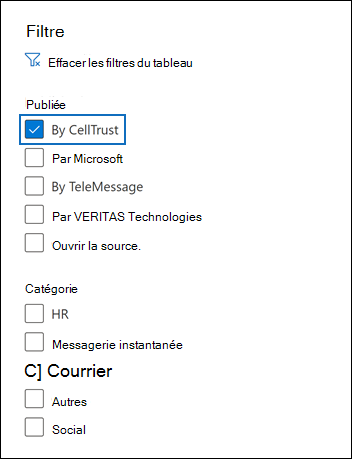

# Archiver les données de CellTrust SL2 vers Microsoft 365 (aperçu)

CellTrust SL2 capture les données de communications mobiles et s’intègre aux technologies d’archivage de pointe pour répondre aux exigences de découverte électronique pour les réglementations telles que FINRA, HIPAA, LOIA et TCPA. Le connecteur de données SL2 importe des éléments de communication mobiles dans Microsoft 365. Cet article décrit le processus d’intégration de SL2 à Microsoft 365 à l’aide du connecteur de données CellTrust SL2 pour l’archivage. L’exécution de ce processus suppose que vous êtes abonné au service CellTrust SL2 et que vous connaissez l’architecture SL2. Pour plus d’informations sur SL2, voir <www.celltrust.com>.

Une fois les données importées dans les boîtes aux lettres des utilisateurs dans Microsoft 365, vous pouvez appliquer des fonctionnalités de conformité Microsoft 365 telles que la conservation pour litige, eDiscovery, les stratégies de rétention Microsoft 365 et la conformité des communications. L’utilisation du connecteur de données CellTrust SL2 pour importer et archiver des données dans Microsoft 365 peut aider votre organisation à rester conforme aux stratégies gouvernementales et réglementaires.

## Vue d’ensemble de l’archivage avec le connecteur de données CellTrust SL2

La plateforme SL2 de CellTrust capture les données de communication à partir de plusieurs sources. Les sources de données SL2 sont de personne à personne (P2P) ou d’application à personne (A2P). Le processus décrit dans cet article concerne uniquement les sources de données P2P. Pour toutes les sources de données P2P, au moins une partie de la collaboration est un utilisateur SL2 abonné au service SL2. La vue d’ensemble suivante explique le processus d’utilisation du connecteur de données CellTrust SL2 dans Microsoft 365.

1. Les utilisateurs SL2 envoient et reçoivent des données vers et depuis les services SL2 dans Microsoft Azure cloud.

2. Votre organisation dispose d’un domaine SL2 dans l’environnement de service cloud SL2 de CellTrust. Votre domaine peut avoir une ou plusieurs unités d’organisation. Le service cloud SL2 transfère vos données vers une zone hautement sécurisée dans la plateforme Microsoft Azure, afin que vos données ne quittent jamais l’environnement Microsoft Azure client. Selon votre plan SL2 (Enterprise, SMB ou gouvernement), votre domaine est hébergé sur Microsoft Azure global ou Microsoft Azure secteur public.

3. Après avoir créé le connecteur de données Sl2 CellTrust, votre domaine et vos E/S (quel que soit votre plan SL2), commencez à envoyer des données Microsoft 365. Le flux de données est structuré pour prendre en charge les rapports basés sur des sources de données, des OUS ou le domaine par lui-même. Par conséquent, votre organisation n’a besoin que d’un connecteur pour alimenter toutes vos sources de données Microsoft 365.

4. Le connecteur crée un dossier sous chaque utilisateur mappé avec une licence Office 365 appropriée intitulée **CellTrust SL2**. Ce mappage connecte un utilisateur CellTrust SL2 à une boîte aux lettres Office 365 à l’aide d’une adresse e-mail. Si un ID d’utilisateur dans CellTrust SL2 n’a aucune correspondance dans Office 365, les données de l’utilisateur ne seront pas archivées.

## Avant de configurer un connecteur

- Vérifiez que vous avez un domaine dans l’environnement de service cloud CellTrust SL2. Pour plus d’informations sur l’obtention d’un domaine SL2 de production ou d’essai, [Contact CellTrust](https://www.celltrust.com/contact-us/#form).

- Obtenez les informations d’identification pour accéder au compte d’administrateur de votre domaine SL2.

- L’utilisateur qui crée le connecteur de données CellTrust SL2 à l’étape 1 (et le termine à l’étape 3) doit être affecté au rôle Importation/Exportation de boîte aux lettres dans Exchange Online. Ce rôle est requis pour ajouter des connecteurs sur la page **Connecteurs de données** dans la Centre de conformité Microsoft 365. Par défaut, ce rôle n’est pas attribué à un groupe de rôles dans Exchange Online. Vous pouvez ajouter le rôle Importation/Exportation de boîte aux lettres au groupe de rôles Gestion de l’organisation dans Exchange Online. Vous pouvez également créer un groupe de rôles, attribuer le rôle Importation/Exportation de boîte aux lettres, puis ajouter les utilisateurs appropriés en tant que membres. Pour plus d’informations, voir les [sections](/Exchange/permissions-exo/role-groups#modify-role-groups) Créer des groupes de rôles ou Modifier des groupes de rôles dans l’article « Gérer les groupes de rôles dans Exchange Online ». 

## Étape 1 : Créer un connecteur CellTrust SL2

La première étape consiste à créer un connecteur de données dans le Centre de conformité Microsoft 365.

1. Go to <https://compliance.microsoft.com> and click **Data connectors** on the left navigation pane.

2. Sous **l’onglet** Vue d’ensemble, cliquez sur **Filtrer,** sélectionnez **Par CellTrust,** puis appliquez le filtre.

   

3. Cliquez **sur CellTrust SL2 (aperçu).**

4. Dans la page de description du produit **CellTrust SL2 (aperçu),** cliquez **sur Ajouter un connecteur.**

5. Dans la page **Conditions d’utilisation,** cliquez sur **Accepter.**

6. Entrez un nom unique qui identifie le connecteur, puis cliquez sur **Suivant**. Le nom que vous entrez identifiera le connecteur sur la page **Connecteurs de données** après sa création.

7. Dans la page **Se connectez à votre compte CellTrust,** cliquez sur **Se connectez à CellTrust**. Vous serez redirigé vers le **portail CellTrust** pour Microsoft 365 dans une nouvelle fenêtre de navigateur.

## Étape 2 : Sélectionnez les domaines ou les OUS à archiver

L’étape suivante consiste à se connecter à un compte d’administrateur pour votre domaine CellTrust SL2 et à sélectionner les domaines et les O à archiver dans Microsoft 365.

1. Dans la page Connecteur **Microsoft 365** CellTrust, sélectionnez votre environnement dans le service cloud SL2 pour afficher une page de connexion.

   En règle générale, vous devriez voir une option représentant votre environnement. Toutefois, si vous avez des domaines dans plusieurs environnements, vous verrez des options pour chaque environnement. Après avoir fait une sélection, vous êtes redirigé vers la page de connexion SL2.

2. Connectez-vous avec vos informations d’identification de compte d’administrateur de domaine ou d’utilisateur.

   Si vous vous connectez en tant qu’administrateur de domaine SL2, vous verrez le nom de votre domaine et les O dans ce domaine. Si vous n’avez pas d’O, vous voyez uniquement le nom de votre domaine. Si vous vous connectez en tant qu’administrateur d’ou, vous ne voyez que le nom de votre ou.

3. Activez les unités métier que vous souhaitez archiver. La sélection du domaine ne sélectionne pas automatiquement les O. Vous devez activer chaque ouo séparément pour l’archiver.

   

4. Lorsque vous avez terminé vos sélections, fermez la fenêtre du navigateur et revenir à la page de l’Assistant dans Centre de conformité Microsoft 365. Après quelques secondes, l’Assistant passe automatiquement à l’étape suivante de mappage des utilisateurs.

## Étape 3 : Masons les utilisateurs et terminez la configuration du connecteur

La dernière étape consiste à ma cartographier les utilisateurs et à terminer la configuration du connecteur dans le Centre de conformité Microsoft 365.

1. Dans la page **Mappage des** utilisateurs, sélectionnez Activer le mappage automatique des utilisateurs si l’adresse de messagerie des utilisateurs est la même dans SL2 et Microsoft 365.  Dans le cas contraire, vous devez manuellement charger les adresses de messagerie des utilisateurs en chargeant un fichier CSV qui m’indique l’adresse SL2 des utilisateurs Microsoft 365'adresse.

2. Cliquez **sur** Suivant, examinez vos paramètres, puis cliquez sur **Terminer** pour créer le connecteur.

   Le nouveau connecteur est ajouté à la liste sur la page **Connecteurs de données.**

## Obtenir de l’aide de CellTrust

Consultez la page Du support client [CellTrust](https://www.celltrust.com/contact-us/#support) pour plus d’informations sur le contact de CellTrust pour obtenir de l’aide sur la configuration d’un connecteur de données CellTrust SL2.

## Plus d'informations

- Un administrateur de domaine peut configurer un connecteur pour le domaine ou n’importe quelle OUS de ce domaine. Si vous utilisez le compte Administrateur d’ou, vous ne pouvez configurer un connecteur que pour cette ou cette même ou plusieurs.

- Pour effectuer correctement les étapes ci-dessus, vous devez avoir une licence Microsoft 365 E5 et avoir les droits d’administrateur Microsoft Office appropriés.

- Pour tester le nouveau connecteur, envoyez un sms à l’aide de votre application mobile SL2 ou à partir de votre portail SL2. Go to your Microsoft 365 mailbox and open the **CellTrust SL2** folder in your Inbox. L’exposition des messages texte dans votre boîte aux lettres peut prendre quelques minutes.

- De nombreuses lois et réglementations exigent que la communication électronique soit conservée de telle sorte que, lorsqu’elle est demandée, elle puisse être produite en tant que preuve. La découverte électronique (eDiscovery) est utilisée pour se conformer à la production de communications électroniques. Enterprise Les solutions d’archivage des informations (EIA) sont conçues pour effectuer la découverte électronique et fournissent des fonctionnalités telles que la gestion des stratégies de rétention, la classification des données et la surveillance du contenu. Microsoft 365 offre une solution de rétention à long terme pour se conformer aux réglementations et normes qui affectent votre organisation.

- Le terme *archivage* tel qu’utilisé dans ce document fait référence à l’archivage dans le contexte d’une utilisation au sein d’une solution eIA (Enterprise Information Archiving). Les solutions EIA disposent de fonctionnalités eDiscovery qui produisent des documents pour des procédures juridiques, des litiges, des audits et des enquêtes. L’archivage dans le contexte de la sauvegarde et de la restauration utilisées pour la récupération d’urgence et la continuité d’activité n’est pas l’utilisation prévue du terme dans ce document.
