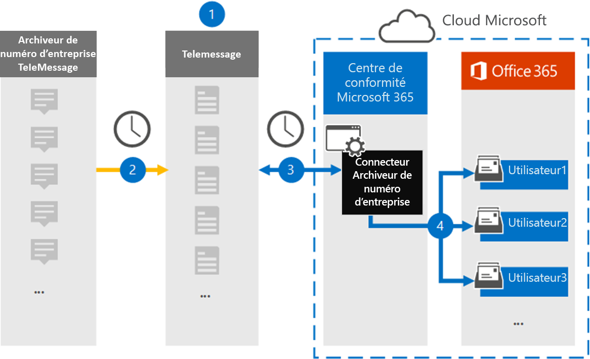

# Configurer un connecteur pour archiver les données de numéro d’entreprise

Utilisez un connecteur TeleMessage dans le portail de conformité Microsoft Purview pour importer et archiver des messages MMS (Short Messaging Service) et Multimedia Messaging Service (MMS), des messages de conversation, des enregistrements d’appels vocaux et des journaux d’appels vocaux à partir de l’archiveur numéro d’entreprise. Après avoir configuré et configuré un connecteur, il se connecte au compte TeleMessage de votre organisation une fois par jour et importe les données de communication mobile des employés à l’aide de l’archiveur numéro d’entreprise TeleMessage dans des boîtes aux lettres dans Microsoft 365.

Une fois que les données du connecteur TeleMessage Enterprise Number Archiver sont stockées dans des boîtes aux lettres utilisateur, vous pouvez appliquer des fonctionnalités Microsoft Purview telles que la conservation des litiges, la recherche de contenu, l’archivage In-Place, l’audit, la conformité des communications et les stratégies de rétention Microsoft 365 aux données de l’archiveur de numéros d’entreprise. Par exemple, vous pouvez rechercher les SMS, MMS et appels vocaux de TeleMessage Enterprise Number Archiver à l’aide de la recherche de contenu ou associer la boîte aux lettres qui contient les données du connecteur Enterprise Number Archiver à un consignateur dans un cas eDiscovery (Premium). L’utilisation d’un connecteur Enterprise Number Archiver pour importer et archiver des données dans Microsoft 365 peut aider votre organisation à rester conforme aux stratégies gouvernementales et réglementaires.

## Vue d’ensemble de l’archivage des données de numéro d’entreprise

La vue d’ensemble suivante explique le processus d’utilisation d’un connecteur pour archiver les données enterprise network dans Microsoft 365.

1. Votre organisation travaille avec TeleMessage pour configurer un connecteur Enterprise Number Archiver. Pour plus d’informations, reportez-vous à [cet article](https://www.telemessage.com/office365-activation-for-enterprise-number-archiver/).

2. Le connecteur Enterprise Number Archiver que vous créez dans le portail de conformité se connecte au site TeleMessage tous les jours et transfère les messages électroniques des 24 dernières heures vers une zone de stockage Azure sécurisée dans le cloud Microsoft.

3. Le connecteur importe les éléments de communication mobile dans la boîte aux lettres d’un utilisateur spécifique. Un nouveau dossier nommé Enterprise Number Archiver est créé dans la boîte aux lettres de l’utilisateur spécifique et les éléments y sont importés. Le connecteur effectue un mappage à l’aide de la valeur de la propriété *d’adresse Email de l’utilisateur*. Chaque message électronique contient cette propriété, qui est remplie avec l’adresse e-mail de chaque participant du message électronique. Outre le mappage automatique des utilisateurs à l’aide de la valeur de la propriété *d’adresse Email de l’utilisateur*, vous pouvez également définir un mappage personnalisé en chargeant un fichier de mappage CSV. Ce fichier de mappage doit contenir le numéro mobile de l’utilisateur et l’adresse de boîte aux lettres Microsoft 365 correspondante pour chaque utilisateur. Si vous activez le mappage automatique des utilisateurs et fournissez un mappage personnalisé, pour chaque élément de messagerie, le connecteur examine d’abord le fichier de mappage personnalisé. S’il ne trouve pas d’utilisateur Microsoft 365 valide qui correspond au numéro de téléphone mobile d’un utilisateur, le connecteur utilise la propriété d’adresse e-mail de l’utilisateur de l’élément de messagerie. Si le connecteur ne trouve pas d’utilisateur Microsoft 365 valide dans le fichier de mappage personnalisé ou dans la propriété *d’adresse e-mail de l’utilisateur* de l’élément de messagerie, l’élément n’est pas importé.

## Avant de configurer un connecteur

Certaines des étapes d’implémentation requises pour archiver les données de l’archiveur numéro d’entreprise sont externes à Microsoft 365 et doivent être effectuées avant de pouvoir créer le connecteur dans le centre de conformité.

- Commandez le [service Enterprise Number Archiver à partir de TeleMessage](https://www.telemessage.com/mobile-archiver/order-mobile-archiver-for-o365) et obtenez un compte d’administration valide pour votre organisation. Vous devez vous connecter à ce compte lorsque vous créez le connecteur dans le centre de conformité.

- Inscrivez tous les utilisateurs qui nécessitent l’archivage du réseau SMS/MMS numéro d’entreprise dans le compte TeleMessage. Lors de l’inscription des utilisateurs, veillez à utiliser la même adresse e-mail que celle utilisée pour leur compte Microsoft 365.

- Installez et activez l’application TeleMessage Enterprise Number Archiver sur les téléphones mobiles de vos employés.

- L’utilisateur qui crée un connecteur Enterprise Number Archiver doit avoir le rôle Administration connecteur de données. Ce rôle est requis pour ajouter des connecteurs sur la page **Connecteurs de données** dans le portail de conformité. Ce rôle est ajouté par défaut à plusieurs groupes de rôles. Pour obtenir la liste de ces groupes de rôles, consultez la section « Rôles dans les centres de sécurité et de conformité » dans [Autorisations dans le Centre de sécurité & conformité](../security/office-365-security/permissions-in-the-security-and-compliance-center.md#roles-in-the-security--compliance-center). Un administrateur de votre organisation peut également créer un groupe de rôles personnalisé, attribuer le rôle Administration connecteur de données, puis ajouter les utilisateurs appropriés en tant que membres. Pour obtenir des instructions, consultez la section « Créer un groupe de rôles personnalisé » dans [Autorisations dans le portail de conformité Microsoft Purview](microsoft-365-compliance-center-permissions.md#create-a-custom-role-group).

- Ce connecteur de données TeleMessage est disponible dans les environnements GCC dans le cloud Microsoft 365 US Government. Les applications et services tiers peuvent impliquer le stockage, la transmission et le traitement des données client de votre organisation sur des systèmes tiers qui ne font pas partie de l’infrastructure Microsoft 365 et ne sont donc pas couverts par les engagements de Microsoft Purview et de protection des données. Microsoft ne fait aucune représentation que l’utilisation de ce produit pour se connecter à des applications tierces implique que ces applications tierces sont conformes FEDRAMP.

## Créer un connecteur Enterprise Number Archiver

Une fois que vous avez rempli les conditions préalables décrites dans la section précédente, vous pouvez créer un connecteur Enterprise Number Archiver dans le portail de conformité. Le connecteur utilise les informations que vous fournissez pour vous connecter au site TeleMessage et transférer des SMS, MMS et des messages d’appel vocal vers les boîtes aux lettres utilisateur correspondantes dans Microsoft 365.

1. Accédez à l’archiveur [https://compliance.microsoft.com](https://compliance.microsoft.com/) de **numéro d’entreprise** **des connecteurs de données**, puis cliquez dessus\>.

2. Dans la page de description du produit **Enterprise Number Archiver** , cliquez sur **Ajouter un connecteur**

3. Dans la page **Conditions d’utilisation** , cliquez sur **Accepter**.

4. Dans la page **Connexion à TeleMessage** , sous l’étape 3, entrez les informations requises dans les zones suivantes, puis cliquez sur **Suivant**.

   - **Nom d'utilisateur:** Votre nom d’utilisateur TeleMessage.

   - **Mot de passe:** Votre mot de passe TeleMessage.

5. Une fois le connecteur créé, vous pouvez fermer la fenêtre contextuelle et accéder à la page suivante.

6. Dans la page **De mappage d’utilisateurs** , activez le mappage automatique des utilisateurs. Pour activer le mappage personnalisé, chargez un fichier CSV qui contient les informations de mappage utilisateur, puis cliquez sur **Suivant**.

7. Passez en revue vos paramètres, puis cliquez sur **Terminer** pour créer le connecteur.

8. Accédez à l’onglet Connecteurs de la page **Connecteurs de données** pour voir la progression du processus d’importation du nouveau connecteur.

## Problèmes connus

- Pour l’instant, nous ne prenons pas en charge l’importation de pièces jointes ou d’éléments supérieurs à 10 Mo. La prise en charge des éléments plus volumineux sera disponible ultérieurement.