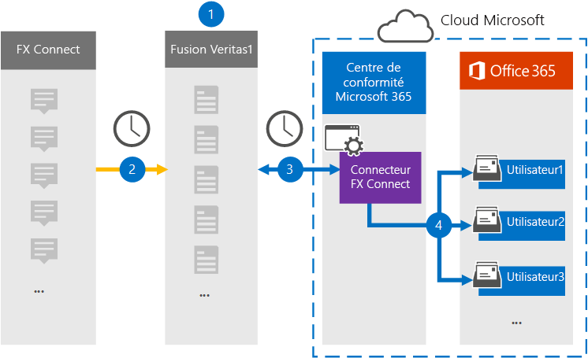

# Configurer un connecteur pour archiver les données FX Connect

Utilisez un connecteur Globanet dans le centre de conformité Microsoft 365 pour importer et archiver des données à partir de la plateforme FX Connect collaboration vers des boîtes aux lettres utilisateur dans votre organisation Microsoft 365. Globanet fournit un connecteur [FX Connect](https://globanet.com/fx-connect/) qui est configuré pour capturer des éléments de connexion FX et les importer dans Microsoft 365. Le connecteur convertit le contenu de FX Connect, tel que les échanges, les messages et les autres détails du compte FX Connect de votre organisation, vers un format de message électronique, puis importe ces éléments dans la boîte aux lettres de l’utilisateur dans Microsoft 365.

Une fois les données FX Connect stockées dans les boîtes aux lettres des utilisateurs, vous pouvez appliquer les fonctionnalités de conformité de Microsoft 365 telles que la conservation pour litige, eDiscovery, les stratégies de rétention et les étiquettes de rétention, ainsi que la conformité des communications. L’utilisation d’un connecteur FX Connect pour importer et archiver des données dans Microsoft 365 peut aider votre organisation à respecter les stratégies gouvernementales et réglementaires.

## Vue d’ensemble des données d’archivage FX Connect

La vue d’ensemble suivante décrit le processus d’utilisation d’un connecteur pour archiver les informations de connexion FX dans Microsoft 365.

1. Votre organisation fonctionne avec FX Connect pour installer et configurer un site FX Connect.

2. Une fois toutes les 24 heures, les éléments des comptes FX Connect sont copiés sur le site Merge1 Globanet. Le connecteur convertit également les éléments de connexion FX au format d’un message électronique.

3. Le connecteur FX Connect que vous créez dans le centre de conformité 365 de Microsoft, se connecte au site Merge1 Globanet tous les jours et transfère les éléments de connexion à un emplacement de stockage Azure sécurisé dans le Cloud Microsoft.

4. Le connecteur importe des éléments dans les boîtes aux lettres d’utilisateurs spécifiques en utilisant la valeur de la propriété *email* du mappage utilisateur automatique, comme décrit à l' [étape 3](#step-3-map-users-and-complete-the-connector-setup). Un sous-dossier du dossier boîte de réception nommé **FX Connect** est créé dans les boîtes aux lettres utilisateur, et les éléments sont importés dans ce dossier. Le connecteur effectue cette opération à l’aide de la valeur de la propriété *email* . Chaque élément FX Connect contient cette propriété, qui est renseignée avec l’adresse de messagerie de chaque participant de l’élément.

## Avant de commencer

- Créez un compte Globanet Merge1 pour Microsoft Connectors.  Pour ce faire, contactez le [support client Globanet](https://globanet.com/ms-connectors-contact). Vous devez vous connecter à ce compte lorsque vous créez le connecteur à l’étape 1.

- L’utilisateur qui crée le connecteur FX Connect à l’étape 1 (et le termine à l’étape 3) doit être affecté au rôle importation/exportation de boîte aux lettres dans Exchange Online. Ce rôle est nécessaire pour ajouter des connecteurs sur la page **connecteurs de données** dans le centre de conformité Microsoft 365. Par défaut, ce rôle n’est affecté à aucun groupe de rôles dans Exchange Online. Vous pouvez ajouter le rôle exportation d’importation de boîte aux lettres au groupe de rôles gestion de l’organisation dans Exchange Online. Vous pouvez aussi créer un groupe de rôles, attribuer le rôle d’exportation d’importation de boîte aux lettres, puis ajouter les utilisateurs appropriés en tant que membres. Pour plus d’informations, reportez-vous aux sections [créer des groupes de rôles](https://docs.microsoft.com/Exchange/permissions-exo/role-groups#create-role-groups) ou modifier des [groupes](https://docs.microsoft.com/Exchange/permissions-exo/role-groups#modify-role-groups) de rôles dans l’article « gérer des groupes de rôles dans Exchange Online ».

## Étape 1 : configurer le connecteur FX Connect

La première étape consiste à accéder à la page **connecteurs de données** dans le centre de conformité Microsoft 365 et à créer un connecteur pour les données de connexion FX.

1. Accédez à [https://compliance.microsoft.com](https://compliance.microsoft.com/) , puis cliquez sur **Data Connectors**  >  **FX Connect**.

2. Sur la page Description du produit **FX Connect** , cliquez sur **Ajouter un connecteur**.

3. Sur la page **conditions de service** , cliquez sur **accepter**.

4. Entrez un nom unique qui identifie le connecteur, puis cliquez sur **suivant**.

5. Connectez-vous à votre compte Merge1 pour configurer le connecteur.

## Étape 2 : configurer le connecteur FX Connect sur le site Merge1 Globanet

La deuxième étape consiste à configurer le connecteur FX Connect sur le site Merge1. Pour plus d’informations sur la configuration du connecteur FX Connect, reportez-vous au Guide de l' [utilisateur des connecteurs tiers Merge1](https://docs.ms.merge1.globanetportal.com/Merge1%20Third-Party%20Connectors%20FX%20Connect%20User%20Guide%20.pdf).

Une fois que vous avez cliqué sur **enregistrer & terminer**, vous êtes redirigé vers le centre de conformité Microsoft 365, sur la page **mappage utilisateur** de l’Assistant connecteur.

## Étape 3 : mapper les utilisateurs et terminer l’installation du connecteur

Pour mapper les utilisateurs et terminer l’installation du connecteur dans le centre de conformité Microsoft 365, procédez comme suit :

1. Sur la page **Map FX Connect users to Microsoft 365 Users** , activez le mappage utilisateur automatique. Les éléments de connexion FX incluent une propriété appelée *courrier électronique*, qui contient des adresses de messagerie pour les utilisateurs de votre organisation. Si le connecteur peut associer cette adresse à un utilisateur de Microsoft 365, les éléments sont importés dans la boîte aux lettres de cet utilisateur.

2. Sur la page consentement de l' **administrateur** , cliquez sur **fournir le consentement**. Vous serez redirigé vers le site Microsoft. Cliquez sur **accepter** pour fournir le consentement.

   Votre organisation doit consentir à autoriser le service d’importation Office 365 à accéder aux données de boîte aux lettres dans votre organisation. Pour fournir le consentement de l’administrateur, vous devez être connecté avec les informations d’identification d’un administrateur général Microsoft 365, puis accepter la demande de consentement. Si vous n’êtes pas connecté en tant qu’administrateur général, vous pouvez accéder à [cette page](https://login.microsoftonline.com/common/oauth2/authorize?client_id=570d0bec-d001-4c4e-985e-3ab17fdc3073&response_type=code&redirect_uri=https://portal.azure.com/&nonce=1234&prompt=admin_consent) et vous connecter à l’aide des informations d’identification d’administrateur général pour accepter la demande.

3. Cliquez sur **suivant**, vérifiez vos paramètres, puis accédez à la page **connecteurs de données** pour voir la progression du processus d’importation pour le nouveau connecteur.

## Étape 4 : surveiller le connecteur FX Connect

Après avoir créé le connecteur FX Connect, vous pouvez afficher l’état du connecteur dans le centre de conformité Microsoft 365.

1. Accédez à <https://compliance.microsoft.com/> , puis cliquez sur **connecteurs de données** dans le volet de navigation de gauche.

2. Cliquez sur l’onglet **connecteurs** , puis sélectionnez le connecteur **FX Connect** pour afficher la page de menu volant, qui contient les propriétés et les informations relatives au connecteur.

3. Sous **État du connecteur avec source**, cliquez sur le lien **Télécharger le journal** pour ouvrir (ou enregistrer) le journal d’État du connecteur. Ce journal contient des données qui ont été importées dans Microsoft Cloud.

## Problèmes connus

- Pour le moment, nous ne prenons pas en charge l’importation de pièces jointes ou d’éléments dont la taille est supérieure à 10 Mo. La prise en charge des éléments plus importants sera disponible ultérieurement.
