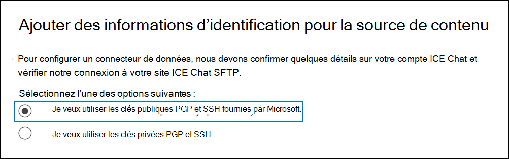

# Configurer un connecteur pour archiver les données ICE Chat

Utilisez un connecteur natif dans le centre Microsoft 365 conformité pour importer et archiver les données de conversation des services financiers à partir de l'outil de collaboration ICE Chat. Après avoir configuré et configuré un connecteur, il se connecte au site FTP sécurisé (SFTP) ICE Chat (SFTP) de votre organisation une fois par jour, convertit le contenu des messages de conversation au format de message électronique, puis importe ces éléments dans les boîtes aux lettres dans Microsoft 365.

Une fois que les données de conversation ICE sont stockées dans les boîtes aux lettres des utilisateurs, vous pouvez appliquer des fonctionnalités de conformité Microsoft 365 telles que la conservation pour litige, eDiscovery, l'archivage, l'audit, la conformité des communications et les stratégies de rétention Microsoft 365 aux données ice Chat. Par exemple, vous pouvez rechercher des messages ICE Chat à l'aide de la recherche de contenu ou associer la boîte aux lettres qui contient les données ice Chat à un dépositaire dans Advanced eDiscovery cas. L'utilisation d'un connecteur de conversation ICE pour importer et archiver des données dans Microsoft 365 peut aider votre organisation à rester conforme aux stratégies gouvernementales et réglementaires.

## Vue d'ensemble de l'archivage des données ICE Chat

La vue d'ensemble suivante explique le processus d'utilisation d'un connecteur pour archiver les données de conversation ICE dans Microsoft 365.

1. Votre organisation travaille avec ICE Chat pour configurer un site ICE Chat SFTP. Vous allez également travailler avec ICE Chat pour configurer ICE Chat afin de copier les messages de conversation sur votre site ICE Chat SFTP.

2. Une fois toutes les 24 heures, les messages de conversation de ICE Chat sont copiés sur votre site ICE Chat SFTP.

3. Le connecteur de conversation ICE que vous créez dans le centre de conformité Microsoft 365 se connecte au site ICE Chat SFTP tous les jours et transfère les messages de conversation des 24 heures précédentes vers un emplacement stockage Azure sécurisé dans le cloud Microsoft. Le connecteur convertit également le contenu d'une conversation en format de message électronique.

4. Le connecteur importe des éléments de message de conversation dans les boîtes aux lettres d'utilisateurs spécifiques. Un nouveau dossier nommé **ICE Chat** est créé dans les boîtes aux lettres utilisateur et les éléments de message de conversation sont importés dans ce dossier. Le connecteur utilise la valeur des propriétés *SenderEmail* et *RecipientEmail.* Chaque message de conversation contient ces propriétés, qui sont remplies avec l'adresse e-mail de l'expéditeur et chaque destinataire/participant du message de conversation.

   Outre le mappage automatique des utilisateurs qui utilise les valeurs des *propriétés SenderEmail* et *RecipientEmail* (ce qui signifie que le connecteur importe un message de conversation dans la boîte aux lettres de l'expéditeur et les boîtes aux lettres de chaque destinataire), vous pouvez également définir un mappage utilisateur personnalisé en chargeant un fichier de mappage CSV. Ce fichier de mappage contient *l'ID* de conversation ICE et l'adresse Microsoft 365 boîte aux lettres correspondante pour chaque utilisateur de votre organisation. Si vous activez le mappage automatique des utilisateurs et fournissez un fichier de mappage personnalisé, pour chaque élément de conversation, le connecteur examinera d'abord le fichier de mappage personnalisé. S'il ne trouve pas de compte d'utilisateur Microsoft 365 valide correspondant à l'ID de conversation ICE d'un utilisateur, le connecteur utilise les propriétés *SenderEmail* et *RecipientEmail* de l'élément de conversation pour importer l'élément dans les boîtes aux lettres des participants de la conversation. Si le connecteur ne trouve pas d'utilisateur Microsoft 365 valide dans le fichier de mappage personnalisé ou dans les propriétés *SenderEmail* et *RecipientEmail,* l'élément n'est pas importé.

## Avant de configurer un connecteur

Certaines des étapes d'implémentation requises pour archiver les données ICE Chat sont externes à Microsoft 365 et doivent être effectuées avant de pouvoir créer le connecteur dans le centre de conformité.

- ICE Chat facture à ses clients des frais de conformité externe. Votre organisation doit contacter le groupe ventes ICE Chat pour discuter et signer le contrat de services de données ICE Chat, que vous pouvez obtenir à l'aide de [https://www.theice.com/publicdocs/agreements/ICE\_Data\_Services\_Agreement.pdf](https://www.theice.com/publicdocs/agreements/ICE\_Data\_Services\_Agreement.pdf) . Ce contrat est entre ICE Chat et votre organisation et n'implique pas Microsoft. Après avoir installé un site ICE Chat SFTP à l'étape 2, ICE Chat fournit les informations d'identification FTP directement à votre organisation. Ensuite, vous qui fourniriez ces informations d'identification à Microsoft lors de la configuration du connecteur à l'étape 3.

- Vous devez configurer un site ICE Chat SFTP avant de créer le connecteur à l'étape 3. Après avoir travaillé avec ICE Chat pour configurer le site SFTP, les données de ICE Chat sont téléchargées sur le site SFTP tous les jours. Le connecteur que vous créez à l'étape 3 se connecte à ce site SFTP et transfère les données de conversation vers Microsoft 365 boîtes aux lettres. SFTP chiffre également les données ICE Chat envoyées aux boîtes aux lettres pendant le processus de transfert.

- Pour configurer un connecteur de conversation ICE, vous devez utiliser des clés et des phrases clés pour PGP (Pretty Good Privacy) et SSH (Secure Shell). Ces clés sont utilisées pour configurer le site ICE Chat SFTP et utilisées par le connecteur pour se connecter au site ICE Chat SFTP afin d'importer des données dans Microsoft 365. La clé PGP est utilisée pour configurer le chiffrement des données transférées du site SFTP ICE Chat vers Microsoft 365. La clé SSH est utilisée pour configurer un environnement de ligne de commande sécurisé afin d'activer une connexion à distance sécurisée lorsque le connecteur se connecte au site SFTP ICE Chat.

  Lors de la configuration d'un connecteur, vous avez la possibilité d'utiliser des clés publiques et des phrases clés fournies par Microsoft, ou vous pouvez utiliser vos propres clés privées et phrases passphrases. Nous vous recommandons d'utiliser les clés publiques fournies par Microsoft. Toutefois, si votre organisation a déjà configuré un site ICE Chat SFTP à l'aide de clés privées, vous pouvez créer un connecteur à l'aide de ces mêmes clés privées.

- Le connecteur ICE Chat peut importer un total de 200 000 éléments en une seule journée. S'il y a plus de 200 000 éléments sur le site SFTP, aucun de ces éléments n'est importé dans Microsoft 365.

- L'administrateur qui crée le connecteur de conversation ICE à l'étape 3 (et qui télécharge les clés publiques et l'adresse IP à l'étape 1) doit se voir attribuer le rôle Importation/Exportation de boîte aux lettres dans Exchange Online. Ce rôle est requis pour ajouter des connecteurs sur la page **Connecteurs** de données dans le centre Microsoft 365 conformité. Par défaut, ce rôle n’est affecté à aucun groupe de rôles dans Exchange Online. Vous pouvez ajouter le rôle Importation/Exportation de boîte aux lettres au groupe de rôles Gestion de l'organisation dans Exchange Online. Vous pouvez également créer un groupe de rôles, attribuer le rôle Importation/Exportation de boîte aux lettres, puis ajouter les utilisateurs appropriés en tant que membres. Pour plus d'informations, voir les [sections](/Exchange/permissions-exo/role-groups#modify-role-groups) Créer des groupes de rôles ou Modifier des groupes de rôles dans l'article « Gérer les groupes de rôles dans Exchange Online ». 

## Configurer un connecteur à l'aide de clés publiques

Les étapes de cette section vous montrent comment configurer un connecteur de conversation ICE à l'aide des clés publiques pour PGP (Pretty Good Privacy) et SSH (Secure Shell).

### Étape 1 : Obtenir des clés publiques PGP et SSH

La première étape consiste à obtenir une copie des clés publiques pour PGP (Pretty Good Privacy) et SSH (Secure Shell). Vous utilisez ces clés à l'étape 2 pour configurer le site ICE Chat SFTP afin d'autoriser le connecteur (que vous créez à l'étape 3) à se connecter au site SFTP et à transférer les données ICE Chat vers les boîtes aux lettres Microsoft 365. Vous obtenez également une adresse IP dans cette étape, que vous utiliserez lors de la configuration du site SFTP ICE Chat.

1. Go to [https://compliance.microsoft.com](https://compliance.microsoft.com) and click **Data connectors** in the left nav.

2. Dans la page **Connecteurs de données** sous **ICE Chat,** cliquez sur **Afficher.**

3. Dans la page **ICE Chat,** cliquez **sur Ajouter un connecteur.**

4. Dans la page **Conditions d'utilisation,** cliquez sur **Accepter.**

5. Dans la page Ajouter des informations d'identification pour la source de contenu, cliquez sur Je veux utiliser les clés **publiques** PGP et SSH fournies **par Microsoft.**

   

6. À l'étape 1, cliquez sur la clé **Télécharger SSH,** téléchargez la clé **PGP** et téléchargez les liens d'adresse **IP** pour enregistrer une copie de chaque fichier sur votre ordinateur local.

   

   Ces fichiers contiennent les éléments suivants qui sont utilisés pour configurer le site ICE Chat SFTP à l'étape 2 :

   - Clé publique PGP : cette clé est utilisée pour configurer le chiffrement des données transférées du site SFTP ICE Chat vers Microsoft 365.

   - Clé publique SSH : cette clé est utilisée pour configurer le SSH sécurisé afin d'activer une connexion à distance sécurisée lorsque le connecteur se connecte au site SFTP ICE Chat.

   - Adresse IP : le site ICE Chat SFTP est configuré pour accepter une demande de connexion uniquement à partir de cette adresse IP, qui est utilisée par le connecteur ICE Chat que vous créez à l'étape 3.

7. Cliquez **sur Annuler** pour fermer l'Assistant. Vous revenir à cet Assistant à l'étape 3 pour créer le connecteur.

### Étape 2 : Configurer le site ICE Chat SFTP

L'étape suivante consiste à utiliser les clés publiques PGP et SSH et l'adresse IP obtenue à l'étape 1 pour configurer le chiffrement PGP et l'authentification SSH pour le site ICE Chat SFTP. Cela permet au connecteur ICE Chat que vous créez à l'étape 3 de se connecter au site ICE Chat SFTP et de transférer les données ICE Chat vers Microsoft 365. Vous devez travailler avec le support technique ICE Chat pour configurer votre site ICE Chat SFTP.

### Étape 3 : Créer un connecteur ICE Chat

La dernière étape consiste à créer un connecteur ICE Chat dans le centre Microsoft 365 conformité. Le connecteur utilise les informations que vous fournissez pour vous connecter au site ICE Chat SFTP et transférer des messages de conversation vers les boîtes aux lettres utilisateur correspondantes dans Microsoft 365.

1. Go to [https://compliance.microsoft.com](https://compliance.microsoft.com) and click **Data connectors** in the left nav.

2. Dans la page **Connecteurs de données** sous **ICE Chat,** cliquez sur **Afficher.**

3. Dans la page **ICE Chat,** cliquez **sur Ajouter un connecteur.**

4. Dans la page **Conditions d'utilisation,** cliquez sur **Accepter.**

5. Dans la page **Ajouter des informations d'identification pour** la source de contenu, cliquez sur Je veux utiliser les clés publiques PGP et **SSH.**

6. À l'étape 3, entrez les informations requises dans les zones suivantes, puis cliquez sur **Valider la connexion.**

   - **Code d'entreprise :** ID de votre organisation, qui est utilisé comme nom d'utilisateur pour le site ICE Chat SFTP.

   - **Mot de passe :** Mot de passe de votre site ICE Chat SFTP.

   - **URL SFTP :** URL du site ICE Chat SFTP (par exemple, `sftp.theice.com` ). Vous pouvez également utiliser une adresse IP pour cette valeur.

   - **Port SFTP :** Numéro de port du site ICE Chat SFTP. Le connecteur utilise ce port pour se connecter au site SFTP.

7. Une fois la connexion validée, cliquez sur **Suivant.**

8. Dans la page Mappage des utilisateurs **externes Microsoft 365** utilisateurs, activez le mappage automatique des utilisateurs et fournissez un mappage utilisateur personnalisé selon les besoins. Vous pouvez télécharger une copie du fichier CSV de mappage utilisateur sur cette page. Vous pouvez ajouter les mappages utilisateur au fichier, puis le télécharger.

   > [!NOTE]
   > Comme indiqué précédemment, le fichier CSV du fichier de mappage personnalisé contient l'ID de conversation ICE et l'adresse Microsoft 365 boîte aux lettres correspondante pour chaque utilisateur. Si vous activez le mappage automatique des utilisateurs et fournissez un mappage personnalisé, pour chaque élément de conversation, le connecteur examinera d'abord le fichier de mappage personnalisé. S'il ne trouve pas d'utilisateur Microsoft 365 valide correspondant à l'identit de conversation ICE d'un utilisateur, le connecteur importe l'élément dans les boîtes aux lettres des utilisateurs spécifiés dans les propriétés *SenderEmail* et *RecipientEmail* de l'élément de conversation. Si le connecteur ne trouve pas d'utilisateur Microsoft 365 valide par mappage utilisateur automatique ou personnalisé, l'élément n'est pas importé.

9. Cliquez **sur** Suivant, examinez vos paramètres, puis cliquez sur **Terminer** pour créer le connecteur.

10. Go to the **Data connectors** page to see the progress of the import process for the new connector.

## Configurer un connecteur à l'aide de clés privées

Les étapes de cette section vous montrent comment configurer un connecteur de conversation ICE à l'aide de clés privées PGP et SSH. Cette option de configuration de connecteur est destinée aux organisations qui ont déjà configuré un site ICE Chat SFTP à l'aide de clés privées.

### Étape 1 : Obtenir une adresse IP pour configurer le site ICE Chat SFTP

Si votre organisation a utilisé des clés privées PGP et SSH pour configurer un site ICE Chat SFTP, vous devez obtenir une adresse IP et la fournir au support client ICE Chat. Le site SFTP ICE Chat doit être configuré pour accepter les demandes de connexion de cette adresse IP. La même adresse IP est utilisée par le connecteur ICE Chat pour se connecter au site SFTP et transférer les données ICE Chat vers Microsoft 365.

Pour obtenir l'adresse IP :

1. Go to <https://compliance.microsoft.com> and click **Data connectors** in the left nav.

2. Dans la page **Connecteurs de données** sous **ICE Chat,** cliquez sur **Afficher.**

3. Dans la page **description du produit ICE Chat,** cliquez sur Ajouter un **connecteur**

4. Dans la page **Conditions d'utilisation,** cliquez sur **Accepter.**

5. Dans la page **Ajouter des informations d'identification pour** la source de contenu, cliquez sur Je veux utiliser les clés privées PGP et **SSH.**

   

6. À l'étape 1, cliquez **sur Télécharger l'adresse IP** pour enregistrer une copie du fichier d'adresse IP sur votre ordinateur local.

   

7. Cliquez **sur Annuler** pour fermer l'Assistant. Vous revenir à cet Assistant à l'étape 2 pour créer le connecteur.

Vous devez travailler avec le support client ICE Chat pour configurer votre site ICE Chat SFTP afin d'accepter les demandes de connexion provenant de cette adresse IP.

### Étape 2 : Créer un connecteur de conversation ICE

Une fois votre site SFTP ICE Chat configuré, l'étape suivante consiste à créer un connecteur de conversation ICE dans le centre Microsoft 365 conformité. Le connecteur utilise les informations que vous fournissez pour vous connecter au site ICE Chat SFTP et transférer des messages électroniques vers les boîtes aux lettres utilisateur correspondantes dans Microsoft 365. Pour effectuer cette étape, assurez-vous d'avoir des copies des mêmes clés privées et phrases clés que vous avez utilisées pour configurer votre site ICE Chat SFTP.

1. Go to <https://compliance.microsoft.com> and click **Data connectors** in the left nav.

2. Dans la page **Connecteurs de données** sous **ICE Chat,** cliquez sur **Afficher.**

3. Dans la page **description du produit ICE Chat,** cliquez sur Ajouter un **connecteur**

4. Dans la page **Conditions d'utilisation,** cliquez sur **Accepter.**

5. Dans la page **Ajouter des informations d'identification pour** la source de contenu, cliquez sur Je veux utiliser les clés privées PGP et **SSH.**

6. À l'étape 3, entrez les informations requises dans les zones suivantes, puis cliquez sur **Valider la connexion.**

      - **Nom :** Nom du connecteur. Il doit être unique dans votre organisation.

      - **Code d'entreprise :** ID de votre organisation utilisé comme nom d'utilisateur pour le site ICE Chat SFTP.

      - **Mot de passe :** Mot de passe du site SFTP ICE Chat de votre organisation.

      - **URL SFTP :** URL du site ICE Chat SFTP (par exemple, `sftp.theice.com` ). Vous pouvez également utiliser une adresse IP pour cette valeur.

      - **Port SFTP :** Numéro de port du site ICE Chat SFTP. Le connecteur utilise ce port pour se connecter au site SFTP.

      - **Clé privée PGP :** Clé privée PGP pour le site ICE Chat SFTP. N'oubliez pas d'inclure la valeur de clé privée entière, y compris les lignes de début et de fin du bloc de touches.

      - **Phrase clé PGP :** Phrase passphrase pour la clé privée PGP.

      - **Clé privée SSH :** Clé privée SSH pour le site ICE Chat SFTP. N'oubliez pas d'inclure la valeur de clé privée entière, y compris les lignes de début et de fin du bloc de touches.

      - **Phrase clé SSH :** Phrase passphrase pour la clé privée SSH.

7. Une fois la connexion validée, cliquez sur **Suivant.**

8. Dans la page **Mappage des** utilisateurs ICE Chat Microsoft 365 utilisateurs, activez le mappage automatique des utilisateurs et fournissez un mappage utilisateur personnalisé selon les besoins.

   > [!NOTE]
   > Comme indiqué précédemment, le fichier CSV du fichier de mappage personnalisé contient l'ID de conversation ICE et l'adresse Microsoft 365 boîte aux lettres correspondante pour chaque utilisateur. Si vous activez le mappage utilisateur automatique et fournissez un mappage personnalisé, pour chaque élément de conversation, le connecteur examinera d'abord le fichier de mappage personnalisé. S'il ne trouve pas d'utilisateur Microsoft 365 valide correspondant à l'identit de conversation ICE d'un utilisateur, le connecteur importe l'élément dans les boîtes aux lettres des utilisateurs spécifiés dans les propriétés *SenderEmail* et *RecipientEmail* de l'élément de conversation. Si le connecteur ne trouve pas d'utilisateur Microsoft 365 valide par mappage utilisateur automatique ou personnalisé, l'élément n'est pas importé.

9. Cliquez **sur** Suivant, examinez vos paramètres, puis cliquez sur **Terminer** pour créer le connecteur.

10. Go to the **Data connectors** page to see the progress of the import process for the new connector. Cliquez sur le connecteur pour afficher la page volante, qui contient des informations sur le connecteur.
