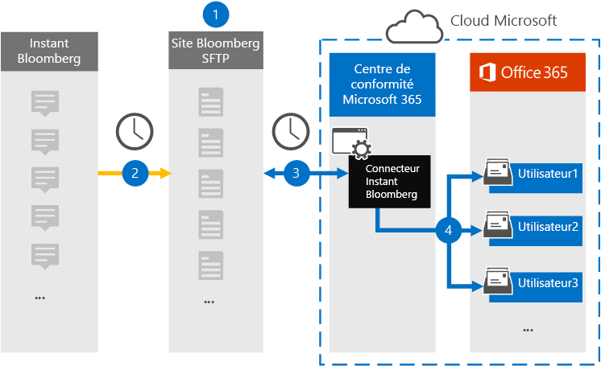
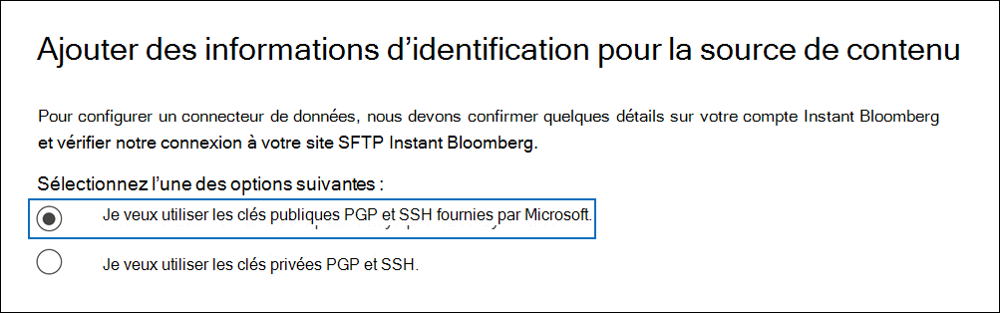

# Configurer un connecteur pour archiver des données Instant Bloomberg

Utilisez un connecteur natif dans le Centre de conformité Microsoft 365 pour importer et archiver des données de conversation de services financiers à partir de l’outil de collaboration [Instant Bloomberg.](https://www.bloomberg.com/professional/product/collaboration/) Une fois que vous avez configuré et configuré un connecteur, il se connecte au site FTP sécurisé Bloomberg (SFTP) de votre organisation une fois par jour, convertit le contenu des messages de conversation au format de message électronique, puis importe ces éléments dans des boîtes aux lettres dans Microsoft 365.

Une fois les données Instant Bloomberg stockées dans les boîtes aux lettres des utilisateurs, vous pouvez appliquer des fonctionnalités de conformité Microsoft 365 telles que la conservation pour litige, la recherche de contenu, l’archivage In-Place, l’audit, la conformité des communications et les stratégies de rétention Microsoft 365 aux données Instant Bloomberg. Par exemple, vous pouvez rechercher des messages de conversation Instant Bloomberg à l’aide de la recherche de contenu ou associer la boîte aux lettres contenant les données Instant Bloomberg à un dépositaire dans Advanced eDiscovery cas. L’utilisation d’un connecteur Instant Bloomberg pour importer et archiver des données dans Microsoft 365 peut aider votre organisation à rester conforme aux stratégies gouvernementales et réglementaires.

## Vue d’ensemble de l’archivage des données Instant Bloomberg

La vue d’ensemble suivante explique le processus d’utilisation d’un connecteur pour archiver les données de conversation Instant Bloomberg dans Microsoft 365. 

1. Votre organisation collabore avec Bloomberg pour configurer un site SFTP Bloomberg. Vous allez également travailler avec Bloomberg pour configurer Instant Bloomberg afin de copier des messages de conversation sur votre site SFTP Bloomberg.

2. Une fois toutes les 24 heures, les messages de conversation de Instant Bloomberg sont copiés sur le site SFTP Bloomberg.

3. Le connecteur Instant Bloomberg que vous créez dans le Centre de conformité Microsoft 365 se connecte au site SFTP Bloomberg tous les jours et transfère les messages de conversation des 24 heures précédentes vers une zone stockage Azure sécurisée dans Microsoft Cloud. Le connecteur convertit également le contenu d’une conversation en format de message électronique.

4. Le connecteur importe les éléments de message de conversation dans la boîte aux lettres d’un utilisateur spécifique. Un nouveau dossier nommé InstantBloomberg est créé dans la boîte aux lettres de l’utilisateur spécifique et les éléments y sont importés. Pour ce faire, le connecteur utilise la valeur de la *propriété CorporateEmailAddress.* Chaque message de conversation contient cette propriété, qui est remplie avec l’adresse e-mail de chaque participant du message de conversation. Outre le mappage automatique des utilisateurs à l’aide de la valeur de la propriété *CorporateEmailAddress,* vous pouvez également définir un mappage personnalisé en téléchargeant un fichier de mappage CSV. Ce fichier de mappage doit contenir un UUID Bloomberg et l’adresse Microsoft 365 boîte aux lettres correspondante pour chaque utilisateur. Si vous activez le mappage utilisateur automatique et fournissez un mappage personnalisé, pour chaque élément de conversation, le connecteur examinera d’abord le fichier de mappage personnalisé. S’il ne trouve pas un utilisateur Microsoft 365 valide qui correspond à l’UUID Bloomberg d’un utilisateur, le connecteur utilise la propriété *CorporateEmailAddress* de l’élément de conversation. Si le connecteur ne trouve pas d’utilisateur Microsoft 365 valide dans le fichier de mappage personnalisé ou la propriété *CorporateEmailAddress* de l’élément de conversation, l’élément n’est pas importé.

## Avant de configurer un connecteur

Certaines des étapes d’implémentation requises pour archiver des données Instant Bloomberg sont externes à Microsoft 365 et doivent être effectuées avant de pouvoir créer le connecteur dans le centre de conformité.

- Pour configurer un connecteur Instant Bloomberg, vous devez utiliser des clés et des phrases clés pour PGP (Pretty Good Privacy) et Secure Shell (SSH). Ces clés sont utilisées pour configurer le site SFTP Bloomberg et utilisées par le connecteur pour se connecter au site Bloomberg SFTP afin d’importer des données vers Microsoft 365. La clé PGP est utilisée pour configurer le chiffrement des données transférées du site SFTP Bloomberg vers Microsoft 365. La clé SSH est utilisée pour configurer un environnement de ligne de commande sécurisé afin d’activer une connexion à distance sécurisée lorsque le connecteur se connecte au site SFTP Bloomberg.

  Lors de la configuration d’un connecteur, vous avez la possibilité d’utiliser des clés publiques et des phrases clés fournies par Microsoft, ou vous pouvez utiliser vos propres clés privées et phrases passphrases. Nous vous recommandons d’utiliser les clés publiques fournies par Microsoft. Toutefois, si votre organisation a déjà configuré un site SFTP Bloomberg à l’aide de clés privées, vous pouvez créer un connecteur à l’aide de ces mêmes clés privées.

- S’abonner [à Bloomberg Anywhere](https://www.bloomberg.com/professional/product/remote-access/?bbgsum-page=DG-WS-PROF-PROD-BBA). Cela est nécessaire pour vous connecter à Bloomberg Anywhere pour accéder au site SFTP Bloomberg que vous devez configurer.

- Configurer un site Bloomberg SFTP (Secure File Transfer Protocol). Après avoir travaillé avec Bloomberg pour configurer le site SFTP, les données d’Instant Bloomberg sont téléchargées sur le site SFTP tous les jours. Le connecteur que vous créez à l’étape 2 se connecte à ce site SFTP et transfère les données de conversation vers Microsoft 365 boîtes aux lettres. SFTP chiffre également les données de conversation Instant Bloomberg qui sont envoyées aux boîtes aux lettres pendant le processus de transfert.

  Pour plus d’informations sur Bloomberg SFTP (également appelé *BB-SFTP)*:

  - Consultez le document « Normes de connectivité SFTP » sur Le support [Bloomberg.](https://www.bloomberg.com/professional/support/documentation/)

  - Contactez [le support client Bloomberg.](https://service.bloomberg.com/portal/sessions/new?utm_source=bloomberg-menu&utm_medium=csc)

  Une fois que vous avez travaillé avec Bloomberg pour configurer un site SFTP, Bloomberg vous fournira des informations après avoir répondu au message électronique d’implémentation Bloomberg. Enregistrez une copie des informations suivantes. Vous l’utilisez pour configurer un connecteur à l’étape 3.

  - Code société, qui est un ID pour votre organisation et est utilisé pour se connecter au site SFTP Bloomberg.

  - Mot de passe pour votre site SFTP Bloomberg

  - URL du site SFTP Bloomberg (par exemple, sftp.bloomberg.com)

  - Numéro de port du site SFTP Bloomberg

- Le connecteur Instant Bloomberg peut importer un total de 200 000 éléments en une seule journée. S’il y a plus de 200 000 éléments sur le site SFTP, aucun de ces éléments n’est importé dans Microsoft 365.

- L’utilisateur qui crée un connecteur Instant Bloomberg à l’étape 3 (et qui télécharge les clés publiques et l’adresse IP à l’étape 1) doit se voir attribuer le rôle Importation/Exportation de boîte aux lettres dans Exchange Online. Cela est nécessaire pour ajouter des connecteurs dans la page **Connecteurs** de données dans la Centre de conformité Microsoft 365. Par défaut, ce rôle n’est affecté à aucun groupe de rôles dans Exchange Online. Vous pouvez ajouter le rôle Importation/Exportation de boîte aux lettres au groupe de rôles Gestion de l’organisation dans Exchange Online. Vous pouvez également créer un groupe de rôles, attribuer le rôle Importation/Exportation de boîte aux lettres, puis ajouter les utilisateurs appropriés en tant que membres. Pour plus d’informations, voir les [sections](/Exchange/permissions-exo/role-groups#modify-role-groups) Créer des groupes de rôles ou Modifier des groupes de rôles dans l’article « Gérer les groupes de rôles dans Exchange Online ». 

## Configurer un connecteur à l’aide de clés publiques

Les étapes de cette section vous montrent comment configurer un connecteur Instant Bloomberg à l’aide des clés publiques pour PGP (Pretty Good Privacy) et Secure Shell (SSH).

### Étape 1 : Obtenir des clés publiques et PGP et SSH

La première étape consiste à obtenir une copie des clés publiques pour PGP (Pretty Good Privacy) et SSH (Secure Shell). Vous utilisez ces clés à l’étape 2 pour configurer le site Bloomberg SFTP afin d’autoriser le connecteur (que vous créez à l’étape 3) à se connecter au site SFTP et à transférer les données de conversation Instant Bloomberg vers des boîtes aux lettres Microsoft 365. Vous obtenez également une adresse IP dans cette étape, que vous utilisez lors de la configuration du site SFTP Bloomberg.

1. Go to <https://compliance.microsoft.com> and click **Data connectors** in the left nav.

2. Dans la page **Connecteurs de données** sous **Instant Bloomberg**, cliquez sur **Afficher**.

3. Dans la page de description du produit **Instant Bloomberg,** cliquez **sur Ajouter un connecteur**

4. Dans la page **Conditions d’utilisation,** cliquez sur **Accepter.**

5. Dans la page Ajouter des informations d’identification pour la source de contenu, cliquez sur Je veux utiliser les clés **publiques** PGP et **SSH fournies par Microsoft.**

   

6. À l’étape 1, cliquez sur la clé **Télécharger SSH,** téléchargez la clé **PGP** et téléchargez les liens d’adresse **IP** pour enregistrer une copie de chaque fichier sur votre ordinateur local.

   

   Ces fichiers contiennent les éléments suivants qui sont utilisés pour configurer le site SFTP Bloomberg à l’étape 2 :

   - Clé publique PGP : cette clé est utilisée pour configurer le chiffrement des données transférées du site SFTP Bloomberg vers Microsoft 365.

   - Clé publique SSH : cette clé est utilisée pour configurer un environnement de ligne de commande sécurisé afin d’activer une connexion à distance sécurisée lorsque le connecteur se connecte au site SFTP Bloomberg.

   - Adresse IP : le site SFTP Bloomberg est configuré pour accepter les demandes de connexion de cette adresse IP. La même adresse IP est utilisée par le connecteur Instant Bloomberg pour se connecter au site SFTP et transférer des données Instant Bloomberg vers Microsoft 365.

7. Cliquez **sur Annuler** pour fermer l’Assistant. Vous revenir à cet Assistant à l’étape 3 pour créer le connecteur.

### Étape 2 : Configurer le site SFTP Bloomberg

L’étape suivante consiste à utiliser les clés publiques PGP et SSH et l’adresse IP obtenue à l’étape 1 pour configurer le chiffrement PGP et l’authentification SSH pour le site SFTP Bloomberg. Cela permet au connecteur Instant Bloomberg que vous créez à l’étape 3 de se connecter au site Bloomberg SFTP et de transférer des données Instant Bloomberg vers Microsoft 365. Vous devez travailler avec le support client Bloomberg pour configurer votre site SFTP Bloomberg. Contactez [le support client Bloomberg pour](https://service.bloomberg.com/portal/sessions/new?utm_source=bloomberg-menu&utm_medium=csc) obtenir de l’aide. 

> [!IMPORTANT]
> Bloomberg vous recommande d’associer les trois fichiers téléchargés à l’étape 1 à un message électronique et de l’envoyer à leur équipe de support technique lorsque vous travaillez avec eux pour configurer votre site SFTP Bloomberg.

### Étape 3 : Créer un connecteur Instant Bloomberg

La dernière étape consiste à créer un connecteur Instant Bloomberg dans le Centre de conformité Microsoft 365. Le connecteur utilise les informations que vous fournissez pour vous connecter au site Bloomberg SFTP et transférer des messages de conversation vers les boîtes aux lettres utilisateur correspondantes dans Microsoft 365.

1. Go to <https://compliance.microsoft.com> and then click Data **connectors**  >  **Instant Bloomberg**.

2. Dans la page de description du produit **Instant Bloomberg,** cliquez **sur Ajouter un connecteur**

3. Dans la page **Conditions d’utilisation,** cliquez sur **Accepter.**

4. Dans la page Ajouter des informations d’identification pour **le site Bloomberg SFTP,** sous l’étape 3, entrez les informations requises dans les zones suivantes, puis cliquez sur **Suivant**.

    - **Code d’entreprise :** ID de votre organisation utilisé comme nom d’utilisateur pour le site Bloomberg SFTP.

    - **Mot de passe :** Mot de passe du site SFTP Bloomberg.

    - **URL SFTP :** URL du site SFTP Bloomberg (par exemple, `sftp.bloomberg.com` ). Vous pouvez également utiliser une adresse IP pour cette valeur.

    - **Port SFTP :** Numéro de port du site SFTP Bloomberg. Le connecteur utilise ce port pour se connecter au site SFTP.

5. Dans la page Sélectionner les types de données **à importer,** sélectionnez les types de données requis à importer à partir des **messages**

6. Dans la page **Mappage des** utilisateurs Instant Bloomberg Microsoft 365 utilisateurs, activez le mappage automatique des utilisateurs et fournissez un mappage utilisateur personnalisé selon les besoins.

   > [!NOTE]
   > Le connecteur importe les éléments de message de conversation dans la boîte aux lettres d’un utilisateur spécifique. Un nouveau dossier nommé **InstantBloomberg** est créé dans la boîte aux lettres de l’utilisateur spécifique et les éléments y sont importés. Le connecteur utilise la valeur de la *propriété CorporateEmailAddress.* Chaque message de conversation contient cette propriété et la propriété est remplie avec l’adresse e-mail de chaque participant du message de conversation. Outre le mappage automatique des utilisateurs à l’aide de la valeur de la propriété *CorporateEmailAddress,* vous pouvez également définir un mappage personnalisé en chargeant un fichier de mappage CSV. Le fichier de mappage doit contenir l’UUID Bloomberg et l’adresse Microsoft 365 boîte aux lettres correspondante pour chaque utilisateur. Si vous activez le mappage utilisateur automatique et fournissez un mappage personnalisé, pour chaque élément de conversation, le connecteur examinera d’abord le fichier de mappage personnalisé. S’il ne trouve pas un utilisateur Microsoft 365 valide qui correspond à l’UUID Bloomberg d’un utilisateur, le connecteur utilise la propriété *CorporateEmailAddress* de l’élément de conversation. Si le connecteur ne trouve pas d’utilisateur Microsoft 365 valide dans le fichier de mappage personnalisé ou la propriété *CorporateEmailAddress* de l’élément de conversation, l’élément n’est pas importé.

7. Cliquez **sur** Suivant, examinez vos paramètres, puis cliquez sur **Terminer** pour créer le connecteur.

8. Go to the **Data connectors** page to see the progress of the import process for the new connector. Cliquez sur le connecteur pour afficher la page volante, qui contient des informations sur le connecteur.

## Configurer un connecteur à l’aide de clés privées

Les étapes de cette section vous montrent comment configurer un connecteur Instant Bloomberg à l’aide de clés privées PGP et SSH. Cette option de configuration de connecteur est destinée aux organisations qui ont déjà configuré un site SFTP Bloomberg à l’aide de clés privées.

### Étape 1 : Obtenir une adresse IP pour configurer le site SFTP Bloomberg

> [!NOTE]
> Si votre organisation a précédemment configuré un site SFTP Bloomberg pour archiver des données de message Bloomberg à l’aide de clés privées PGP et SSH, vous n’avez pas besoin d’en configurer un autre. Vous pouvez spécifier le même site SFTP lorsque vous créez le connecteur à l’étape 2.

Si votre organisation a utilisé des clés privées PGP et SSH pour configurer un site SFTP Bloomberg, vous devez obtenir une adresse IP et la fournir au support client Bloomberg. Le site SFTP Bloomberg doit être configuré pour accepter les demandes de connexion de cette adresse IP. La même adresse IP est utilisée par le connecteur Instant Bloomberg pour se connecter au site SFTP et transférer des données Instant Bloomberg vers Microsoft 365.

Pour obtenir l’adresse IP :

1. Go to <https://compliance.microsoft.com> and click **Data connectors** in the left nav.

2. Dans la page **Connecteurs de données** sous **Instant Bloomberg,** cliquez sur **Afficher.**

3. Dans la page de description du produit **Instant Bloomberg,** cliquez **sur Ajouter un connecteur**

4. Dans la page **Conditions d’utilisation,** cliquez sur **Accepter.**

5. Dans la page **Ajouter des informations d’identification pour** la source de contenu, cliquez sur Je veux utiliser les clés privées PGP et **SSH.**

6. À l’étape 1, cliquez **sur Télécharger l’adresse IP** pour enregistrer une copie du fichier d’adresse IP sur votre ordinateur local.

   

7. Cliquez **sur Annuler** pour fermer l’Assistant. Vous revenir à cet Assistant à l’étape 2 pour créer le connecteur.

Vous devez travailler avec le support client Bloomberg pour configurer votre site SFTP Bloomberg afin d’accepter les demandes de connexion provenant de cette adresse IP. Contactez [le support client Bloomberg pour](https://service.bloomberg.com/portal/sessions/new?utm_source=bloomberg-menu&utm_medium=csc) obtenir de l’aide.

### Étape 2 : Créer un connecteur Instant Bloomberg

Une fois votre site SFTP Bloomberg configuré, l’étape suivante consiste à créer un connecteur Instant Bloomberg dans le Centre de conformité Microsoft 365. Le connecteur utilise les informations que vous fournissez pour vous connecter au site Bloomberg SFTP et transférer des messages électroniques vers les boîtes aux lettres utilisateur correspondantes dans Microsoft 365. Pour effectuer cette étape, assurez-vous d’avoir des copies des mêmes clés privées et phrases clés que vous avez utilisées pour configurer votre site SFTP Bloomberg.

1. Go to <https://compliance.microsoft.com> and click **Data connectors** in the left nav.

2. Dans la page **Connecteurs de données** sous **Instant Bloomberg,** cliquez sur **Afficher.**

3. Dans la page de description du produit **Instant Bloomberg,** cliquez **sur Ajouter un connecteur**

4. Dans la page **Conditions d’utilisation,** cliquez sur **Accepter.**

5. Dans la page **Ajouter des informations d’identification pour** la source de contenu, cliquez sur Je veux utiliser les clés privées PGP et **SSH.**

   

6. À l’étape 3, entrez les informations requises dans les zones suivantes, puis cliquez sur **Valider la connexion.**

      - **Nom :** Nom du connecteur. Il doit être unique dans votre organisation.

      - **Code d’entreprise :** ID de votre organisation utilisé comme nom d’utilisateur pour le site Bloomberg SFTP.

      - **Mot de passe :** Mot de passe du site SFTP Bloomberg de votre organisation.

      - **URL SFTP :** URL du site SFTP Bloomberg (par exemple, `sftp.bloomberg.com` ). Vous pouvez également utiliser une adresse IP pour cette valeur.

      - **Port SFTP :** Numéro de port du site SFTP Bloomberg. Le connecteur utilise ce port pour se connecter au site SFTP.

      - **Clé privée PGP :** Clé privée PGP pour le site SFTP Bloomberg. N’oubliez pas d’inclure la valeur de clé privée entière, y compris les lignes de début et de fin du bloc de touches.

      - **Phrase clé PGP :** Phrase passphrase pour la clé privée PGP.

      - **Clé privée SSH :** Clé privée SSH pour le site Bloomberg SFTP. N’oubliez pas d’inclure la valeur de clé privée entière, y compris les lignes de début et de fin du bloc de touches.

      - **Phrase clé SSH :** Phrase passphrase pour la clé privée SSH.

7. Une fois la connexion validée, cliquez sur **Suivant.**

8. Dans la page **Mappage des** utilisateurs Instant Bloomberg Microsoft 365 utilisateurs, activez le mappage automatique des utilisateurs et fournissez un mappage utilisateur personnalisé selon les besoins.

   > [!NOTE]
   > Le connecteur importe les éléments de message de conversation dans la boîte aux lettres d’un utilisateur spécifique. Un nouveau dossier nommé **InstantBloomberg** est créé dans la boîte aux lettres de l’utilisateur spécifique et les éléments y sont importés. Le connecteur utilise la valeur de la *propriété CorporateEmailAddress.* Chaque message de conversation contient cette propriété et la propriété est remplie avec l’adresse e-mail de chaque participant du message de conversation. Outre le mappage automatique des utilisateurs à l’aide de la valeur de la propriété *CorporateEmailAddress,* vous pouvez également définir un mappage personnalisé en chargeant un fichier de mappage CSV. Le fichier de mappage doit contenir l’UUID Bloomberg et l’adresse Microsoft 365 boîte aux lettres correspondante pour chaque utilisateur. Si vous activez le mappage utilisateur automatique et fournissez un mappage personnalisé, pour chaque élément de conversation, le connecteur examinera d’abord le fichier de mappage personnalisé. S’il ne trouve pas un utilisateur Microsoft 365 valide qui correspond à l’UUID Bloomberg d’un utilisateur, le connecteur utilise la propriété *CorporateEmailAddress* de l’élément de conversation. Si le connecteur ne trouve pas d’utilisateur Microsoft 365 valide dans le fichier de mappage personnalisé ou la propriété *CorporateEmailAddress* de l’élément de conversation, l’élément n’est pas importé.

9. Cliquez **sur** Suivant, examinez vos paramètres, puis cliquez sur **Terminer** pour créer le connecteur.

10. Go to the **Data connectors** page to see the progress of the import process for the new connector. Cliquez sur le connecteur pour afficher la page volante, qui contient des informations sur le connecteur.
