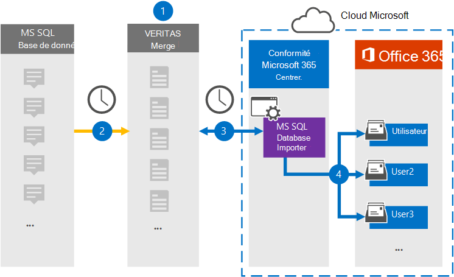

# Configurer un connecteur pour archiver des données à partir de MS SQL Database

Utilisez un connecteur Veritas dans le Centre de conformité Microsoft 365 pour importer et archiver des données à partir de MS SQL Database dans les boîtes aux lettres des utilisateurs de Microsoft 365 organisation. Veritas vous fournit un connecteur ms SQL Database Importer qui est configuré pour capturer des éléments à partir d’une base de données à l’aide d’un fichier de configuration XML et importer ces éléments dans Microsoft 365. Le connecteur convertit le contenu de MS SQL Database au format de message électronique, puis importe ces éléments dans les boîtes aux lettres des utilisateurs Microsoft 365.

Une fois le contenu de MS SQL Database stocké dans les boîtes aux lettres des utilisateurs, vous pouvez appliquer des fonctionnalités de conformité Microsoft 365 telles que la conservation pour litige, eDiscovery, les stratégies de rétention et les étiquettes de rétention. L’utilisation d’un connecteur SQL Database MS pour importer et archiver des données dans Microsoft 365 peut aider votre organisation à rester conforme aux stratégies gouvernementales et réglementaires.

## Vue d’ensemble de l’archivage des données de SQL MS

La vue d’ensemble suivante explique le processus d’utilisation d’un connecteur pour archiver les données MS SQL dans Microsoft 365.

1. Votre organisation collabore avec un fournisseur de services SQL Database MS pour configurer un site MS SQL Database web.

2. Toutes les 24 heures, les SQL Database MS sont copiés sur le site Veritas Merge1. Le connecteur convertit également ce contenu au format de message électronique.

3. Le connecteur ms SQL Database Importer que vous créez dans le Centre de conformité Microsoft 365, se connecte au site Veritas Merge1 tous les jours et transfère les messages vers un emplacement stockage Azure sécurisé dans le cloud Microsoft.

4. Le connecteur importe les éléments de SQL Database MS convertis dans les boîtes aux lettres d’utilisateurs spécifiques à l’aide de la valeur de la propriété *Email* du mappage automatique des utilisateurs, comme décrit à l’étape [3](#step-3-map-users-and-complete-the-connector-setup). Un sous-dossier du dossier Boîte de réception nommé **MS SQL Database Importer** est créé dans les boîtes aux lettres utilisateur et les éléments sont importés dans ce dossier. Le connecteur détermine la boîte aux lettres dans laquelle importer des éléments à l’aide de la valeur de la *propriété Email.* Chaque élément de la SQL Database MS contient cette propriété, qui est remplie avec l’adresse e-mail de chaque participant de l’élément.

## Avant de commencer

- Créez un compte Veritas Merge1 pour les connecteurs Microsoft. Pour créer un compte, contactez le support [technique Veritas.](https://www.veritas.com/content/support/) Vous devez vous inscrire à ce compte lorsque vous créez le connecteur à l’étape 1.

- L’utilisateur qui crée le connecteur ms SQL Database Importer à l’étape 1 (et le termine à l’étape 3) doit être affecté au rôle Importation/Exportation de boîte aux lettres dans Exchange Online. Ce rôle est requis pour ajouter des connecteurs sur la page Connecteurs de données dans la Centre de conformité Microsoft 365. Par défaut, ce rôle n’est affecté à aucun groupe de rôles dans Exchange Online. Vous pouvez ajouter le rôle Importation/Exportation de boîte aux lettres au groupe de rôles Gestion de l’organisation dans Exchange Online. Vous pouvez également créer un groupe de rôles, attribuer le rôle Importation/Exportation de boîte aux lettres, puis ajouter les utilisateurs appropriés en tant que membres. Pour plus d’informations, voir les [sections](/Exchange/permissions-exo/role-groups#modify-role-groups) Créer des groupes de rôles ou Modifier des groupes de rôles dans l’article « Gérer les groupes de rôles dans Exchange Online ». 

## Étape 1 : Configurer le connecteur ms SQL Database importer

La première étape consiste à accéder à la page **Connecteurs** de données dans le Centre de conformité Microsoft 365 et à créer un connecteur pour le SQL Database MS.

1. Go to [https://compliance.microsoft.com](https://compliance.microsoft.com) and then click Data **connectors**  >  **MS SQL Database Importer**.

2. Dans la page de description **du produit MS SQL Database importer,** cliquez **sur Ajouter un nouveau connecteur.**

3. Dans la page **Conditions d’utilisation,** cliquez sur **Accepter.**

4. Entrez un nom unique qui identifie le connecteur, puis cliquez sur **Suivant**.

5. Connectez-vous à votre compte Merge1 pour configurer le connecteur.

## Étape 2 : Configurer le connecteur ms SQL Database importer sur le site Veritas Merge1

La deuxième étape consiste à configurer le connecteur ms SQL Database importer sur le site Merge1. Pour plus d’informations sur la configuration de l’importateur SQL Database MS, voir le Guide de l’utilisateur [Merge1 Third-Party Connectors](https://docs.ms.merge1.globanetportal.com/Merge1%20Third-Party%20Connectors%20MS%20SQL%20Database%20Importer%20User%20Guide%20.pdf).

Une fois que vous avez **cliqué sur &** terminé, la **page** Mappage de l’utilisateur dans l’Assistant connecteur du Centre de conformité Microsoft 365 s’affiche.

## Étape 3 : Masons les utilisateurs et terminez la configuration du connecteur

Pour maîtr les utilisateurs et terminer la configuration du connecteur, suivez les étapes suivantes :

1. Dans la page Ma SQL Database les utilisateurs de l’importateur **Microsoft 365 utilisateurs,** activez le mappage automatique des utilisateurs. Les éléments de SQL Database MS incluent une propriété appelée *Courrier* électronique, qui contient les adresses de messagerie des utilisateurs de votre organisation. Si le connecteur peut associer cette adresse à un utilisateur Microsoft 365, les éléments sont importés dans la boîte aux lettres de cet utilisateur.

2. Cliquez **sur** Suivant, examinez vos paramètres et allez à la page **Connecteurs** de données pour voir la progression du processus d’importation pour le nouveau connecteur.

## Étape 4 : Surveiller le connecteur ms SQL Database importer

Après avoir créé le connecteur ms SQL Database importer, vous pouvez afficher l’état du connecteur dans le Centre de conformité Microsoft 365.

1. Go to <https://compliance.microsoft.com/> and click **Data connectors** in the left nav.

2. Cliquez sur **l’onglet Connecteurs,** puis sélectionnez le connecteur **MS SQL Database** **Importer** pour afficher la page de présentation, qui contient les propriétés et les informations sur le connecteur.

3. Sous **État du connecteur avec source,** cliquez sur le lien Télécharger le journal pour ouvrir (ou enregistrer) le journal d’état du connecteur.  Ce journal contient des données qui ont été importées dans le cloud Microsoft.

## Problèmes connus

- Pour l’instant, l’importation de pièces jointes ou d’éléments dont la taille est supérieure à 10 Mo n’est pas prise en charge. La prise en charge des éléments plus volumineux sera disponible à une date ultérieure.