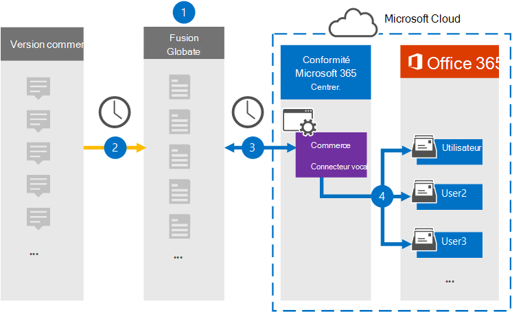

# Configurer un connecteur pour archiver les données Redtail Speak

Utilisez un connecteur Veritas dans le Centre de conformité Microsoft 365 pour importer et archiver des données à partir de Redtail Speak aux boîtes aux lettres d’utilisateur dans Microsoft 365 organisation. Veritas vous fournit un connecteur [Redtail Speak](https://globanet.com/redtail/) configuré pour capturer des éléments à partir du serveur SFTP de votre organisation où les éléments sont reçus de Redtail. Le connecteur convertit le contenu de Redtail Speak au format de message électronique, puis importe ces éléments dans la boîte aux lettres de l’utilisateur dans Microsoft 365.

Une fois que les données Redtail Speak sont stockées dans les boîtes aux lettres des utilisateurs, vous pouvez appliquer des fonctionnalités de conformité Microsoft 365 telles que la conservation pour litige, eDiscovery, les stratégies de rétention et les étiquettes de rétention. L’utilisation d’un connecteur Redtail Speak pour importer et archiver des données dans Microsoft 365 peut aider votre organisation à rester conforme aux stratégies gouvernementales et réglementaires.

## Vue d’ensemble de l’archivage des données Redtail Speak

La vue d’ensemble suivante explique le processus d’utilisation d’un connecteur pour archiver les données Redtail Speak Microsoft 365.

1. Votre organisation travaille avec Redtail Speak pour configurer une passerelle SMTP dans laquelle les messages sont transmis quotidiennement à partir de Redtail Speak vers le serveur SFTP de votre organisation.

2. Toutes les 24 heures, les éléments Redtail Speak sont copiés sur le site Veritas Merge1. Le connecteur convertit également les éléments Redtail Speak au format de message électronique.

3. Le connecteur Redtail Speak que vous créez dans le Centre de conformité Microsoft 365 se connecte au site Veritas Merge1 tous les jours et transfère les messages vers un emplacement stockage Azure sécurisé dans le cloud Microsoft.

4. Le connecteur importe les éléments Redtail Speak convertis dans les boîtes aux lettres d’utilisateurs spécifiques à l’aide de la valeur de la propriété *Email* du mappage automatique des utilisateurs, comme décrit à l’étape [3.](#step-3-map-users-and-complete-the-connector-setup) Un sous-dossier du dossier Boîte de réception nommé **Redtail Speak** est créé dans les boîtes aux lettres de l’utilisateur et les éléments sont importés dans ce dossier. Le connecteur détermine la boîte aux lettres dans laquelle importer des éléments à l’aide de la valeur de la *propriété Email.* Chaque élément Redtail Speak contient cette propriété, qui est remplie avec l’adresse e-mail de chaque participant de l’élément.

## Avant de commencer

- Créez un compte Veritas Merge1 pour les connecteurs Microsoft. Pour créer un compte, contactez le support [technique Veritas.](https://www.veritas.com/content/support/) Vous devez vous inscrire à ce compte lorsque vous créez le connecteur à l’étape 1.

- À l’étape 2, vous devez spécifier le serveur SFTP de votre organisation. Cette étape est nécessaire pour que Veritas Merge1 puisse le contacter pour collecter les données Redtail Speak via SFTP.

- L’utilisateur qui crée le connecteur Redtail Speak Importer à l’étape 1 (et le termine à l’étape 3) doit être affecté au rôle Importation/Exportation de boîte aux lettres dans Exchange Online. Ce rôle est requis pour ajouter des connecteurs sur la page Connecteurs de données dans la Centre de conformité Microsoft 365. Ce rôle n’est affecté à aucun groupe de rôles dans Exchange Online par défaut. Vous pouvez ajouter le rôle Importation/Exportation de boîte aux lettres au groupe de rôles Gestion de l’organisation dans Exchange Online. Vous pouvez également créer un groupe de rôles, attribuer le rôle Importation/Exportation de boîte aux lettres, puis ajouter les utilisateurs appropriés en tant que membres. Pour plus d’informations, voir les [sections](/Exchange/permissions-exo/role-groups#modify-role-groups) Créer des groupes de rôles ou Modifier des groupes de rôles dans l’article « Gérer les groupes de rôles dans Exchange Online ». 

## Étape 1 : Configurer le connecteur Redtail Speak

La première étape consiste à accéder à la page **Connecteurs** de données dans le Centre de conformité Microsoft 365 et à créer un connecteur pour les données Redtail Speak.

1. Go to [https://compliance.microsoft.com](https://compliance.microsoft.com/) and select **Data connectors** &gt; **Redtail Speak**.

2. Dans la page de description du produit **Redtail Speak,** **sélectionnez Ajouter un nouveau connecteur.**

3. Dans la page **Conditions d’utilisation,** sélectionnez **Accepter.**

4. Entrez un nom unique qui identifie le connecteur, puis sélectionnez **Suivant**.

5. Connectez-vous à votre compte Merge1 pour configurer le connecteur.

## Étape 2 : Configurer le connecteur Redtail Speak sur le site Veritas Merge1

La deuxième étape consiste à configurer le connecteur Redtail Speak sur le site Merge1. Pour plus d’informations sur la configuration du connecteur Redtail Speak, voir [merge1 Third-Party Connectors User Guide](https://docs.ms.merge1.globanetportal.com/Merge1%20Third-Party%20Connectors%20Redtail%20Speak%20User%20Guide%20.pdf).

Une fois que vous avez **sélectionné Enregistrer & terminé,** la **page** Mappage de l’utilisateur dans l’Assistant connecteur dans la Centre de conformité Microsoft 365 s’affiche.

## Étape 3 : Masons les utilisateurs et terminez la configuration du connecteur

Pour maîtr les utilisateurs et terminer la configuration du connecteur, suivez les étapes suivantes :

1. Dans la page Map Redtail Speak des utilisateurs **Microsoft 365 utilisateurs,** activez le mappage utilisateur automatique. Les éléments Redtail Speak incluent une propriété appelée *Email*, qui contient les adresses e-mail des utilisateurs de votre organisation. Si le connecteur peut associer cette adresse à un utilisateur Microsoft 365, les éléments sont importés dans la boîte aux lettres de cet utilisateur.

2. Sélectionnez **Suivant,** examinez vos paramètres et allez à la page **Connecteurs** de données pour voir la progression du processus d’importation pour le nouveau connecteur.

## Étape 4 : Surveiller le connecteur Redtail Speak

Après avoir créé le connecteur Redtail Speak, vous pouvez afficher l’état du connecteur dans le Centre de conformité Microsoft 365.

1. Sélectionnez [https://compliance.microsoft.com](https://compliance.microsoft.com/) **connecteurs de données dans** le navigation gauche.

2. Sélectionnez **l’onglet Connecteurs,** puis le connecteur **Redtail Speak** pour afficher la page de présentation. Cette page affiche les propriétés et les informations sur le connecteur.

3. Sous **État du connecteur avec source,** sélectionnez le lien du journal de téléchargement pour ouvrir (ou enregistrer) le journal d’état du connecteur.  Ce journal contient des données qui ont été importées dans le cloud Microsoft.

## Problèmes détectés

- Pour l’instant, l’importation de pièces jointes ou d’éléments dont la taille est supérieure à 10 Mo n’est pas prise en charge. La prise en charge des éléments plus volumineux sera disponible à une date ultérieure.