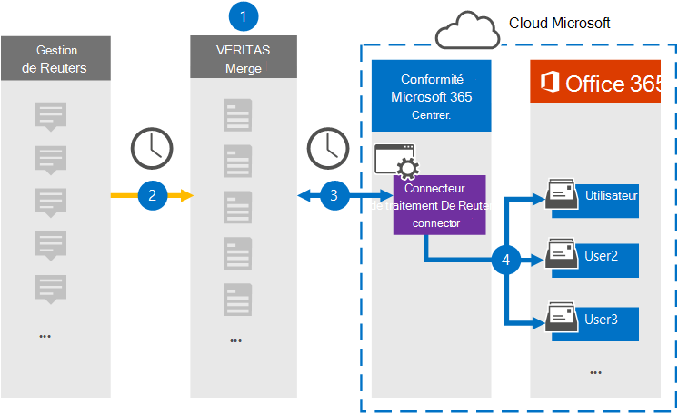

# Configurer un connecteur pour archiver les données de la transaction De Reuters

Utilisez un connecteur Globanet dans le Centre de conformité Microsoft 365 pour importer et archiver des données à partir de la plateforme Reuters Dealing vers les boîtes aux lettres des utilisateurs de votre organisation Microsoft 365. Globanet vous fournit un connecteur de traitement [De Reuters](https://globanet.com/reuters-dealing/) qui est configuré pour capturer des éléments à partir de la source de données tierce (régulièrement), puis importer ces éléments dans Microsoft 365. Le connecteur convertit les communications de traitement à partir du compte Reuters Dealing au format de message électronique, puis importe ces éléments dans la boîte aux lettres de l’utilisateur dans Microsoft 365.

Une fois que les données de la transaction De Reuters sont stockées dans les boîtes aux lettres des utilisateurs, vous pouvez appliquer des fonctionnalités de conformité Microsoft 365 telles que la conservation pour litige, eDiscovery, les stratégies et étiquettes de rétention, ainsi que la conformité des communications. L’utilisation d’un connecteur de transaction De Reuters pour importer et archiver des données dans Microsoft 365 peut aider votre organisation à rester conforme aux stratégies gouvernementales et réglementaires.

## Vue d’ensemble de l’archivage des données de la transaction De Reuters

La vue d’ensemble suivante explique le processus d’utilisation d’un connecteur pour archiver les données de traitement de Reuters dans Microsoft 365.

1. Votre organisation collabore avec Reuters Dealing pour configurer et configurer un site De transaction De Reuters.

2. Une fois toutes les 24 heures, les éléments de la transaction De Reuters sont copiés sur le site Globanet Merge1. Le connecteur convertit également les éléments au format de message électronique.

3. Le connecteur de transaction De Reuters que vous créez dans le Centre de conformité Microsoft 365 se connecte au site Globanet Merge1 tous les jours et transfère le contenu vers un emplacement de stockage Azure sécurisé dans le cloud Microsoft.

4. Le connecteur importe des éléments dans les boîtes aux lettres d’utilisateurs spécifiques à l’aide de la valeur de la propriété *Email* du mappage automatique des utilisateurs, comme décrit à l’étape [3](#step-3-map-users-and-complete-the-connector-setup). Un sous-dossier du dossier Boîte de réception nommé **« Reuters Dealing** » est créé dans les boîtes aux lettres utilisateur et les éléments sont importés dans ce dossier. Le connecteur détermine la boîte aux lettres dans laquelle importer des éléments à l’aide de la valeur de la *propriété Email.* Chaque élément De traitement de Reuters contient cette propriété, qui est remplie avec l’adresse e-mail de chaque participant de l’élément.

## Avant de commencer

- Créez un compte Globanet Merge1 pour les connecteurs Microsoft. Pour créer un compte, contactez le support [technique Globanet.](https://globanet.com/contact-us) Vous devez vous inscrire à ce compte lorsque vous créez le connecteur à l’étape 1.

- L’utilisateur qui crée le connecteur de traitement De Reuters à l’étape 1 (et le termine à l’étape 3) doit être affecté au rôle Importation/Exportation de boîte aux lettres dans Exchange Online. Ce rôle est requis pour ajouter des connecteurs sur la page **Connecteurs de** données dans le Centre de conformité Microsoft 365. Par défaut, ce rôle n’est affecté à aucun groupe de rôles dans Exchange Online. Vous pouvez ajouter le rôle Importation/Exportation de boîte aux lettres au groupe de rôles Gestion de l’organisation dans Exchange Online. Vous pouvez également créer un groupe de rôles, attribuer le rôle Importation/Exportation de boîte aux lettres, puis ajouter les utilisateurs appropriés en tant que membres. Pour plus d’informations, voir les [sections](https://docs.microsoft.com/Exchange/permissions-exo/role-groups#modify-role-groups) [Créer](https://docs.microsoft.com/Exchange/permissions-exo/role-groups#create-role-groups) des groupes de rôles ou Modifier des groupes de rôles dans l’article « Gérer les groupes de rôles dans Exchange Online ».

## Étape 1 : Configurer le connecteur de traitement De Reuters

La première étape consiste à accéder à la page **Connecteurs** de données dans Microsoft 365 et à créer un connecteur pour les données de traitement De Reuters.

1. Go to [https://compliance.microsoft.com](https://compliance.microsoft.com/) and then click Data **connectors**  >  **Reuters Dealing**.

2. Dans la page de description du produit **De Reuters Dealing,** cliquez **sur Ajouter un connecteur.**

3. Dans la page **Conditions d’utilisation,** cliquez sur **Accepter.**

4. Entrez un nom unique qui identifie le connecteur, puis cliquez sur **Suivant**.

5. Connectez-vous à votre compte Merge1 pour configurer le connecteur.

## Étape 2 : Configurer le connecteur de traitement De Reuters sur le site Globanet Merge1

La deuxième étape consiste à configurer le connecteur de traitement De Reuters sur Globanet sur le site Merge1. Pour plus d’informations sur la configuration du connecteur de traitement De Reuters, voir [Merge1 Third-Party Connectors User Guide](https://docs.ms.merge1.globanetportal.com/Merge1%20Third-Party%20Connectors%20Reuters%20Dealing%20User%20Guide%20.pdf).

Une fois que vous avez **cliqué sur Enregistrer & terminé,** la **page** Mappage de l’utilisateur dans l’Assistant Connecteur dans le Centre de conformité Microsoft 365 s’affiche.

## Étape 3 : Masons les utilisateurs et terminez la configuration du connecteur

Pour ma cartographier les utilisateurs et terminer la configuration du connecteur dans le Centre de conformité Microsoft 365, suivez les étapes suivantes :

1. Dans la page Ma mappage des utilisateurs de Reuters à des utilisateurs **Microsoft 365,** activez le mappage automatique des utilisateurs.

   Les éléments De traitement de Reuters incluent une propriété appelée *Courrier* électronique, qui contient les adresses de messagerie des utilisateurs de votre organisation. Si le connecteur peut associer cette adresse à un utilisateur Microsoft 365, les éléments sont importés dans la boîte aux lettres de cet utilisateur.

2. Cliquez **sur** Suivant, examinez vos paramètres et allez à la page **Connecteurs** de données pour voir la progression du processus d’importation pour le nouveau connecteur.

## Étape 4 : Surveiller le connecteur de traitement de Reuters

Après avoir créé le connecteur de traitement De Reuters, vous pouvez afficher l’état du connecteur dans le Centre de conformité Microsoft 365.

1. Go to [https://compliance.microsoft.com](https://compliance.microsoft.com/) and click **Data connectors** in the left nav.

2. Cliquez sur **l’onglet Connecteurs,** puis sélectionnez le connecteur de traitement **De Reuters** pour afficher la page de présentation, qui contient les propriétés et les informations sur le connecteur.

3. Sous **État du connecteur avec source,** cliquez sur le lien Télécharger le journal pour ouvrir (ou enregistrer) le journal d’état du connecteur.  Ce journal contient des données qui ont été importées dans le cloud Microsoft.

## Problèmes connus

- Pour l’instant, l’importation de pièces jointes ou d’éléments dont la taille est supérieure à 10 Mo n’est pas prise en charge. La prise en charge des éléments plus volumineux sera disponible à une date ultérieure.
