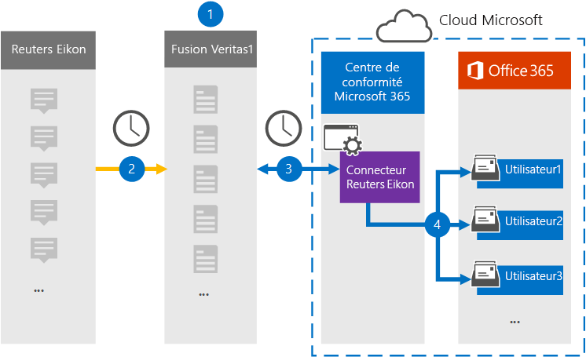

# Configurer un connecteur pour archiver les données Reuters Ekono

Utilisez un connecteur Veritas dans le portail de conformité Microsoft Purview pour importer et archiver des données de la plateforme Reuters Ekono vers des boîtes aux lettres utilisateur de votre organisation Microsoft 365. Veritas fournit un connecteur [Reuters Ekono](https://globanet.com/eikon/) configuré pour capturer des éléments à partir de la source de données tierce (régulièrement) et importer ces éléments dans Microsoft 365. Le connecteur convertit le contenu tel que les messages de personne à personne, les conversations de groupe, les pièces jointes et les exclusions de responsabilité du compte Reuters Ekono d’un utilisateur en un format de courrier électronique, puis importe ces éléments dans la boîte aux lettres de l’utilisateur dans Microsoft 365.

Une fois que les données Reuters Ekono sont stockées dans des boîtes aux lettres utilisateur, vous pouvez appliquer des fonctionnalités Microsoft Purview telles que la conservation des litiges, la découverte électronique, les stratégies de rétention et les étiquettes de rétention, ainsi que la conformité des communications. L’utilisation d’un connecteur Reuters Ekono pour importer et archiver des données dans Microsoft 365 peut aider votre organisation à rester conforme aux stratégies gouvernementales et réglementaires.

[!INCLUDE [purview-preview](../includes/purview-preview.md)]

## Vue d’ensemble de l’archivage des données Reuters Ekono

La vue d’ensemble suivante explique le processus d’utilisation d’un connecteur pour archiver les données Reuters Ekono dans Microsoft 365.

1. Votre organisation travaille avec Reuters Ekono pour configurer et configurer un site Reuters Ekono.

2. Toutes les 24 heures, les éléments Reuters Ekono sont copiés sur le site Veritas Merge1. Le connecteur convertit également les éléments Reuters Ekono au format de message électronique.

3. Le connecteur Reuters Ekono que vous créez dans le portail de conformité se connecte au site Veritas Merge1 tous les jours et transfère le contenu vers un emplacement de stockage Azure sécurisé dans le cloud Microsoft.

4. Le connecteur importe des éléments dans les boîtes aux lettres de certains utilisateurs en utilisant la valeur de la propriété *Email* du mappage automatique d’utilisateurs, comme décrit à [l’étape 3](#step-3-map-users-and-complete-the-connector-setup). Un sous-dossier du dossier Boîte de réception nommé **Reuters Ekono** est créé dans les boîtes aux lettres utilisateur et les éléments sont importés dans ce dossier. Le connecteur détermine la boîte aux lettres vers laquelle importer des éléments à l’aide de la valeur de la propriété *Email*. Chaque élément Reuters Ekono contient cette propriété, qui est remplie avec l’adresse e-mail de chaque participant de l’élément.

## Avant de commencer

- Créez un compte Veritas Merge1 pour les connecteurs Microsoft. Pour créer un compte, contactez [le support technique Veritas](https://globanet.com/ms-connectors-contact). Vous vous connecterez à ce compte lorsque vous créerez le connecteur à l’étape 1.

- L’utilisateur qui crée le connecteur Reuters Ekono à l’étape 1 (et le termine à l’étape 3) doit avoir le rôle de connecteur de données Administration. Ce rôle est requis pour ajouter des connecteurs sur la page **Connecteurs de données** dans le portail de conformité. Ce rôle est ajouté par défaut à plusieurs groupes de rôles. Pour obtenir la liste de ces groupes de rôles, consultez la section « Rôles dans les centres de sécurité et de conformité » dans [Autorisations dans le Centre de sécurité & conformité](../security/office-365-security/permissions-in-the-security-and-compliance-center.md#roles-in-the-security--compliance-center). Un administrateur de votre organisation peut également créer un groupe de rôles personnalisé, attribuer le rôle Administration connecteur de données, puis ajouter les utilisateurs appropriés en tant que membres. Pour obtenir des instructions, consultez la section « Créer un groupe de rôles personnalisé » dans [Autorisations dans le portail de conformité Microsoft Purview](microsoft-365-compliance-center-permissions.md#create-a-custom-role-group).

- Ce connecteur de données Veritas est en préversion publique dans les environnements GCC dans le cloud Microsoft 365 US Government. Les applications et services tiers peuvent impliquer le stockage, la transmission et le traitement des données client de votre organisation sur des systèmes tiers qui ne font pas partie de l’infrastructure Microsoft 365 et ne sont donc pas couverts par les engagements de Microsoft Purview et de protection des données. Microsoft ne fait aucune représentation que l’utilisation de ce produit pour se connecter à des applications tierces implique que ces applications tierces sont conformes FEDRAMP.

## Étape 1 : Configurer le connecteur Reuters Ekono

La première étape consiste à accéder à la page **Connecteurs de données** dans le portail de conformité et à créer un connecteur pour les données Reuters Ekono.

1. Accédez à [https://compliance.microsoft.com](https://compliance.microsoft.com/) et sélectionnez **Connecteurs** >  de données **Reuters Ekono**.

2. Dans la page de description du produit **Reuters Ekono** , sélectionnez **Ajouter un connecteur**.

3. Dans la page **Conditions d’utilisation** , sélectionnez **Accepter**.

4. Entrez un nom unique qui identifie le connecteur, puis sélectionnez **Suivant**.

5. Connectez-vous à votre compte Merge1 pour configurer le connecteur.

## Étape 2 : Configurer le connecteur Reuters Ekono sur le site Veritas Merge1

La deuxième étape consiste à configurer le connecteur Reuters Ekono sur le site Merge1. Pour plus d’informations sur la configuration du connecteur Reuters Ekono sur le site Veritas Merge1, consultez le [Guide de l’utilisateur des connecteurs tiers Merge1](https://docs.ms.merge1.globanetportal.com/Merge1%20Third-Party%20Connectors%20Reuters%20Eikon%20User%20Guide%20.pdf).

Une fois que vous avez sélectionné **Enregistrer & Terminer**, la page de **mappage utilisateur** de l’Assistant Connecteur dans le portail de conformité s’affiche.

## Étape 3 : Mapper les utilisateurs et terminer la configuration du connecteur

Pour mapper les utilisateurs et terminer la configuration du connecteur dans le portail de conformité, procédez comme suit :

1. Dans la page **Mapper des utilisateurs externes à des utilisateurs Microsoft 365** , activez le mappage automatique des utilisateurs. Les éléments Reuters Ekono incluent une propriété appelée *Email*, qui contient des adresses e-mail pour les utilisateurs de votre organisation. Si le connecteur peut associer cette adresse à un utilisateur Microsoft 365, les éléments sont importés dans la boîte aux lettres de cet utilisateur.

2. Sélectionnez **Suivant**, passez en revue vos paramètres, puis accédez à la page **Connecteurs de données** pour voir la progression du processus d’importation du nouveau connecteur.

## Étape 4 : Surveiller le connecteur Reuters Ekono

Après avoir créé le connecteur Reuters Ekono, vous pouvez afficher l’état du connecteur dans le portail de conformité.

1. Accédez aux [https://compliance.microsoft.com](https://compliance.microsoft.com) **connecteurs de données** et sélectionnez-les dans le volet de navigation gauche.

2. Sélectionnez l’onglet **Connecteurs** , puis sélectionnez le connecteur **Reuters Ekono** pour afficher la page de menu volant. Cette page contient les propriétés et les informations sur le connecteur.

3. Sous **État du connecteur avec source**, **sélectionnez** le lien Télécharger le journal pour ouvrir (ou enregistrer) le journal d’état du connecteur. Ce journal contient des informations sur les données qui ont été importées dans le cloud Microsoft. Pour plus d’informations, consultez [Afficher les journaux d’administration pour les connecteurs de données](data-connector-admin-logs.md).

## Problèmes connus

- Pour l’instant, nous ne prenons pas en charge l’importation de pièces jointes ou d’éléments supérieurs à 10 Mo. La prise en charge des éléments plus volumineux sera disponible ultérieurement.
