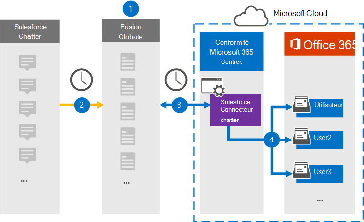

# Configurer un connecteur pour archiver les données salesforce

Utilisez un connecteur Globanet dans le Centre de conformité Microsoft 365 pour importer et archiver des données à partir de la plateforme SalesforceCourir vers les boîtes aux lettres utilisateur de votre organisation Microsoft 365. Globanet fournit un [connecteur Salesforce Connector](http://globanet.com/chatter/) qui capture des éléments à partir de la source de données tierce et importe ces éléments dans Microsoft 365. Le connecteur convertit le contenu tel que les conversations, les pièces jointes et les publications de Salesforce Convert au format de message électronique, puis importe ces éléments dans la boîte aux lettres de l’utilisateur dans Microsoft 365.

Une fois que les données salesforces sont stockées dans les boîtes aux lettres des utilisateurs, vous pouvez appliquer des fonctionnalités de conformité Microsoft 365 telles que la conservation pour litige, eDiscovery, les stratégies de rétention et les étiquettes de rétention. L’utilisation d’un connecteur Salesforce Connector pour importer et archiver des données dans Microsoft 365 peut aider votre organisation à rester conforme aux stratégies gouvernementales et réglementaires.

## Vue d’ensemble de l’archivage des données salesforce

La vue d’ensemble suivante explique le processus d’utilisation d’un connecteur pour archiver les données Salesforce Chatter dans Microsoft 365.

1. Votre organisation collabore avec Salesforce Configure pour configurer un site Salesforce Chatter.

2. Une fois toutes les 24 heures, les éléments Salesforce Merge sont copiés sur le site Globanet Merge1. Le connecteur insérable également les éléments salesforce vers un format de message électronique.

3. Le connecteur Salesforce Connector Que vous créez dans le Centre de conformité Microsoft 365, se connecte au site Globanet Merge1 tous les jours et transfère le contenu de Las Computing vers un emplacement de stockage Azure sécurisé dans le cloud Microsoft.

4. Le connecteur importe les éléments convertis dans les boîtes aux lettres d’utilisateurs spécifiques à l’aide de la valeur de la propriété *Email* du mappage automatique des utilisateurs, comme décrit à l’étape [3.](#step-3-map-users-and-complete-the-connector-setup) Un sous-dossier du dossier Boîte de réception nommé **Salesforce Chatter** est créé dans les boîtes aux lettres de l’utilisateur et les éléments sont importés dans ce dossier. Le connecteur détermine la boîte aux lettres dans laquelle importer des éléments à l’aide de la valeur de la *propriété Email.* Chaque élément Dent contient cette propriété, qui est remplie avec l’adresse e-mail de chaque participant de l’élément.

## Avant de commencer

- Créez un compte Merge1 pour les connecteurs Microsoft. Pour créer un compte, contactez le support [technique Globanet.](https://globanet.com/contact-us/) Vous devez vous inscrire à ce compte lorsque vous créez le connecteur à l’étape 1.

- Créer une application Salesforce et acquérir un jeton sur [https://salesforce.com](https://salesforce.com) . Vous devez vous connecter au compte Salesforce en tant qu’administrateur et obtenir un jeton personnel d’utilisateur pour importer des données. En outre, les déclencheurs doivent être publiés sur le site DeLice pour capturer les mises à jour, les suppressions et les modifications. Ces déclencheurs créent un billet sur un canal et Merge1 capture les informations à partir du canal. Pour obtenir des instructions détaillées sur la création de l’application et l’acquisition du jeton, voir le Guide de l’utilisateur [Merge1 Third-Party Connectors](https://docs.ms.merge1.globanetportal.com/Merge1%20Third-Party%20Connectors%20SalesForce%20Chatter%20User%20Guide%20.pdf).

- L’utilisateur qui crée le connecteur Salesforce Connector à l’étape 1 (et le termine à l’étape 3) doit être affecté au rôle Importation/Exportation de boîte aux lettres dans Exchange Online. Ce rôle est requis pour ajouter des connecteurs sur la page **Connecteurs de** données dans le Centre de conformité Microsoft 365. Par défaut, ce rôle n’est affecté à aucun groupe de rôles dans Exchange Online. Vous pouvez ajouter le rôle Importation/Exportation de boîte aux lettres au groupe de rôles Gestion de l’organisation dans Exchange Online. Vous pouvez également créer un groupe de rôles, attribuer le rôle Importation/Exportation de boîte aux lettres, puis ajouter les utilisateurs appropriés en tant que membres. Pour plus d’informations, voir les [sections](https://docs.microsoft.com/Exchange/permissions-exo/role-groups#modify-role-groups) [Créer](https://docs.microsoft.com/Exchange/permissions-exo/role-groups#create-role-groups) des groupes de rôles ou Modifier des groupes de rôles dans l’article « Gérer les groupes de rôles dans Exchange Online ».

## Étape 1 : Configurer le connecteur Salesforce Connector

La première étape consiste à accéder à la page **Connecteurs** de données dans le Centre de conformité Microsoft 365 et à créer un connecteur pour les données de Type de données.

1. Go to [https://compliance.microsoft.com](https://compliance.microsoft.com/) and then click Data **connectors**  >  **Salesforce Click**.

2. Dans la page description du produit **Salesforce Descriptive,** cliquez **sur Ajouter un connecteur.**

3. Dans la page **Conditions d’utilisation,** cliquez sur **Accepter.**

4. Entrez un nom unique qui identifie le connecteur, puis cliquez sur **Suivant**.

5. Connectez-vous à votre compte Merge1 pour configurer le connecteur.

## Étape 2 : Configurer salesforce merge sur le site Globanet Merge1

La deuxième étape consiste à configurer le connecteur Salesforce Connector sur le site Globanet Merge1. Pour plus d’informations sur la configuration du connecteur Salesforce Connector, voir [merge1 Third-Party Connectors User Guide](https://docs.ms.merge1.globanetportal.com/Merge1%20Third-Party%20Connectors%20SalesForce%20Chatter%20User%20Guide%20.pdf).

Une fois que vous avez **cliqué sur Enregistrer & terminé,** la **page** Mappage de l’utilisateur dans l’Assistant Connecteur dans le Centre de conformité Microsoft 365 s’affiche.

## Étape 3 : Masons les utilisateurs et terminez la configuration du connecteur

Pour ma cartographier les utilisateurs et terminer la configuration du connecteur dans le Centre de conformité Microsoft 365, suivez les étapes suivantes :

1. Dans la page **Masquage des utilisateurs salesforce vers des utilisateurs Microsoft 365,** activez le mappage automatique des utilisateurs. Les éléments Salesforce Chatter incluent une propriété appelée *Email*, qui contient les adresses de messagerie des utilisateurs de votre organisation. Si le connecteur peut associer cette adresse à un utilisateur Microsoft 365, les éléments sont importés dans la boîte aux lettres de cet utilisateur.

2. cliquez **sur** Suivant, examinez vos paramètres, puis allez à la page **Connecteurs** de données pour voir la progression du processus d’importation pour le nouveau connecteur.

## Étape 4 : Surveiller le connecteur Salesforce Connector

Après avoir créé le connecteur Salesforce Connector, vous pouvez afficher l’état du connecteur dans le Centre de conformité Microsoft 365.

1. Go to [https://compliance.microsoft.com](https://compliance.microsoft.com/) and click **Data connectors** in the left nav.

2. cliquez sur **l’onglet Connecteurs,** puis cliquez sur le connecteur **Salesforce Connector pour** afficher la page volante, qui contient les propriétés et les informations sur le connecteur.

3. Sous **État du connecteur avec source,** cliquez sur le lien Télécharger le journal pour ouvrir (ou enregistrer) le journal d’état du connecteur.  Ce journal contient des données importées dans le cloud Microsoft.

## Problèmes connus

- Pour l’instant, l’importation de pièces jointes ou d’éléments dont la taille est supérieure à 10 Mo n’est pas prise en charge. La prise en charge des éléments plus volumineux sera disponible à une date ultérieure.
