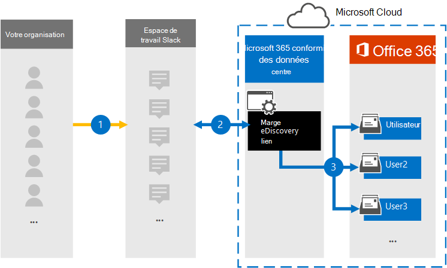

# Configurer un connecteur pour archiver les données Slack eDiscovery (préversion)

Le connecteur de données Slack eDiscovery fourni par Microsoft vous permet d’importer et d’archiver des données de messagerie instantanée (telles que des messages, des pièces jointes, des liens et des révisions) à partir des espaces de travail Slack de votre organisation vers Microsoft 365. Le connecteur de données extrait les données de l’API Slack, les convertit au format d’e-mail, puis importe ces éléments dans des boîtes aux lettres utilisateur dans Microsoft 365. Une fois les données Slack importées, vous pouvez appliquer des solutions de conformité, telles que la conservation des litiges, les Microsoft Purview eDiscovery (Premium), la conformité des communications et les paramètres de rétention au contenu Slack. L’utilisation d’un connecteur de données Slack eDiscovery pour importer et archiver des données dans Microsoft 365 peut aider votre organisation à rester conforme aux stratégies gouvernementales et réglementaires.

Si vous souhaitez participer à la préversion, contactez l’équipe à dcfeedback@microsoft.com.

## Vue d’ensemble de l’archivage des données Slack eDiscovery

La vue d’ensemble suivante explique le processus d’utilisation d’un connecteur de données Microsoft pour archiver les données Slack dans Microsoft 365.

1. Votre organisation travaille avec Slack pour configurer et configurer un espace de travail Slack.

2. Une fois le connecteur de données configuré, les messages des espaces de travail Slack de votre organisation sont copiés dans des boîtes aux lettres utilisateur dans Microsoft 365. Le connecteur de données convertit également le contenu d’un message de conversation au format de message électronique.

3. Le connecteur importe les messages de conversation convertis dans les boîtes aux lettres d’utilisateurs spécifiques. Un sous-dossier dans le dossier Boîte de réception nommé **Slack eDiscovery** est créé dans les boîtes aux lettres utilisateur et les éléments de message de conversation sont importés dans ce dossier.

## Avant de configurer un connecteur

- Votre organisation a besoin de l’abonnement Enterprise Grid pour Slack. Pour plus d’informations, consultez [les abonnements et fonctionnalités Slack](https://slack.com/intl/en-gb/help/articles/115003205446-Slack-subscriptions-and-features-).

- L’utilisateur qui crée le connecteur de données doit disposer du rôle d’application **Des propriétaires d’organisation** dans son organisation Slack. Pour plus d’informations, consultez [Types de rôles dans Slack](https://slack.com/intl/en-gb/help/articles/360018112273-Types-of-roles-in-Slack).

- Obtenez le nom d’utilisateur et le mot de passe du compte d’entreprise Slack de votre organisation. Vous utilisez ces informations d’identification pour vous connecter à ce compte lorsque vous créez le connecteur de données. Il est également recommandé de configurer l’approvisionnement automatique d’utilisateurs dans votre organisation Slack pour utiliser l’authentification unique (SSO). [Rôles dans le Centre de sécurité & conformité](../security/office-365-security/permissions-in-the-security-and-compliance-center.md#roles-in-the-security--compliance-center)

- L’utilisateur qui crée le connecteur Slack eDiscovery doit se faire attribuer le rôle de connecteur de données Administration. Ce rôle est nécessaire pour ajouter des connecteurs sur la page **Connecteurs de données** dans le portail de conformité Microsoft Purview. Ce rôle est ajouté par défaut à plusieurs groupes de rôles. Pour obtenir la liste de ces groupes de rôles, consultez la section « Rôles dans les centres de sécurité et de conformité » dans [Autorisations dans le Centre de sécurité & conformité](../security/office-365-security/permissions-in-the-security-and-compliance-center.md#roles-in-the-security--compliance-center). Un administrateur de votre organisation peut également créer un groupe de rôles personnalisé, attribuer le rôle Administration connecteur de données, puis ajouter les utilisateurs appropriés en tant que membres. Pour obtenir des instructions, consultez la section « Créer un groupe de rôles personnalisé » dans [Autorisations dans le portail de conformité Microsoft Purview](microsoft-365-compliance-center-permissions.md#create-a-custom-role-group).

## Étape 1 : Créer un connecteur Slack eDiscovery

1. Accédez aux <https://compliance.microsoft.com> **connecteurs de données** dans le volet de navigation gauche et cliquez dessus.

2. Sous l’onglet **Vue d’ensemble** , cliquez sur **Filtrer** , sélectionnez **Par Microsoft**, puis appliquez le filtre.

3. Cliquez sur **Slack eDiscovery (préversion).**

4. Dans la page de description du produit **Slack eDiscovery (préversion),** cliquez sur **Ajouter un connecteur**.

5. Dans la page **de l’Assistant Conditions d’utilisation** , cliquez sur **Accepter**.

6. Entrez un nom unique qui identifie le connecteur, puis cliquez sur **Suivant**. Le nom que vous entrez identifie le connecteur dans la page **Connecteurs de données** une fois que vous l’avez créé.

## Étape 2 : Se connecter à votre organisation Slack

1. Dans la page de l’Assistant **Connexion à Slack** , cliquez sur **Se connecter à Slack** pour vous connecter à l’espace de travail Slack de votre organisation.

2. Dans la page **Connexion Slack à votre** espace de travail, tapez le nom de l’espace de travail à partir duquel vous souhaitez archiver les données, puis cliquez sur **Continuer**.

   Une page s’affiche avec le nom de votre espace de travail Slack et une invite de connexion.

3. Cliquez sur le lien dans la chaîne **Que les propriétaires d’organisation peuvent également se connecter ici**.

4. Dans la page de connexion de l’espace de travail, entrez l’adresse e-mail et le mot de passe du compte d’entreprise Slack de votre organisation, puis cliquez sur **Se connecter**.

   Une fois que vous vous êtes connecté, une page s’affiche qui demande l’autorisation d’accéder à votre organisation Slack par l’application connecteur.

5. Cliquez sur **Autoriser** pour autoriser l’application à administrer votre organisation.

   Une fois que vous avez cliqué sur **Autoriser**, la page Slack se ferme et la page **Mapper les utilisateurs Slack eDiscovery à des utilisateurs Microsoft 365** dans l’Assistant Connecteur s’affiche.

## Étape 3 : Spécifier les utilisateurs pour lequel importer des données

Sélectionnez l’une des options suivantes pour spécifier les utilisateurs dont vous souhaitez importer les données Slack eDiscovery.

- **Tous les utilisateurs de votre organisation**. Sélectionnez cette option pour importer des données pour tous les utilisateurs.

- **Seuls les utilisateurs en attente de litige**. Sélectionnez cette option pour importer des données uniquement pour les utilisateurs dont les boîtes aux lettres sont mises en attente pour litige. Cette option importe des données vers des boîtes aux lettres utilisateur dont la propriété LitigationHoldEnabled a la valeur True. Pour plus d’informations, consultez [Créer une conservation de litige](create-a-litigation-hold.md).

## Étape 4 : Mapper les utilisateurs et sélectionner les types de données à importer

1. Configurez une ou les deux options suivantes pour mapper les utilisateurs Slack à leurs boîtes aux lettres Microsoft 365.

   - **Mappage automatique des utilisateurs**. Sélectionnez cette option pour mapper automatiquement les noms d’utilisateur Slack aux boîtes aux lettres Microsoft 365. Le connecteur utilise la valeur de la propriété *Email*, que contient chaque message ou élément Slack. Cette propriété est remplie avec une adresse e-mail de chaque participant du message. Si le connecteur peut associer les adresses e-mail aux utilisateurs Microsoft 365 correspondants, l’élément est importé dans la boîte aux lettres Microsoft 365 de ces utilisateurs. Pour utiliser cette option, l’authentification unique doit être configurée pour votre organisation Slack.

   - **Mappage d’utilisateur personnalisé**. Vous avez également la possibilité d’utiliser le mappage d’utilisateurs personnalisé au lieu (ou en plus) du mappage automatique des utilisateurs. Avec cette option, vous devez créer et charger un fichier CSV qui mappe l’ID de membre Slack des utilisateurs à leur adresse e-mail Microsoft 365. Pour ce faire, cliquez sur **Télécharger le modèle de mappage CSV**, remplissez le fichier CSV avec l’ID de membre Slack et l’adresse e-mail Microsoft 365 pour tous les utilisateurs de votre organisation, puis sélectionnez et chargez le fichier CSV dans l’Assistant. Veillez à ne pas modifier les en-têtes de colonne dans le fichier CSV. Voici un exemple de fichier de mappage CSV :

     |**ExternalUserId**  | **O365UserMailbox**   |
     |:-------------------|:-----------------------|
     | U01MDTF0QV6        | alexjones@contoso.onmicrosoft.com |
     | U02MDTF1RW7| pilarp@contoso.onmicrosoft.com|
     | U03MDTF2SX8 | sarad@contoso.onmicrosoft.com|
     |||

   > [!TIP]
   > Les ID de membre pour les utilisateurs peuvent être obtenus en cliquant sur le ... Bouton Plus dans le profil d’un utilisateur, puis sélectionnant **Copier l’ID de membre**. Vous pouvez également utiliser la [méthode API Slack users.list](https://api.slack.com/methods/users.list) pour obtenir les ID de tous les membres d’une équipe Slack.

   Si vous activez le mappage automatique des utilisateurs et fournissez un fichier de mappage personnalisé, le connecteur examine d’abord le fichier de mappage personnalisé pour mapper l’utilisateur Slack à une boîte aux lettres Microsoft 365. Si le connecteur ne trouve pas d’utilisateur Microsoft 365 valide qui correspond à l’utilisateur Slack, le connecteur utilise la propriété *Email* de l’élément Slack. Si le connecteur ne trouve pas d’utilisateur Microsoft 365 valide dans le fichier de mappage personnalisé ou la propriété *Email* de l’élément de message, l’élément n’est pas importé.

2. Dans la page **Sélectionner les types de données à importer** , sélectionnez les types de données Slack que vous souhaitez importer. Si vous souhaitez importer des messages à partir de tous les canaux, sélectionnez toutes les options. Sinon, sélectionnez uniquement les types de données que vous souhaitez importer.

     Outre les messages Slack, vous pouvez également spécifier d’autres types de contenu Slack à importer dans Microsoft 365. 

3. Après avoir configuré les types de données à importer, cliquez sur **Suivant**, passez en revue les paramètres du connecteur, puis cliquez sur **Terminer** pour créer le connecteur.

## Étape 5 : Surveiller le connecteur Slack eDiscovery

Après avoir créé le connecteur Slack eDiscovery, vous pouvez afficher l’état du connecteur dans le portail de conformité.

1. Accédez et [https://compliance.microsoft.com](https://compliance.microsoft.com/) cliquez sur **Connecteurs de données** dans le volet de navigation gauche.

2. Cliquez sur l’onglet **Connecteurs** , puis sélectionnez le connecteur **Slack eDiscovery** pour afficher la page de menu volant, qui contient les propriétés et les informations sur le connecteur.

3. Sous **État du connecteur avec source**, cliquez sur le lien **Télécharger le journal** pour ouvrir (ou enregistrer) le journal d’état du connecteur. Ce journal contient des informations sur les données qui ont été importées dans le cloud Microsoft. Pour plus d’informations, consultez [Afficher les journaux d’administration pour les connecteurs de données](data-connector-admin-logs.md).

## Problèmes connus

- Pour l’instant, nous ne prenons pas en charge l’importation de pièces jointes ou d’éléments supérieurs à 10 Mo. La prise en charge des éléments plus volumineux sera disponible ultérieurement.
