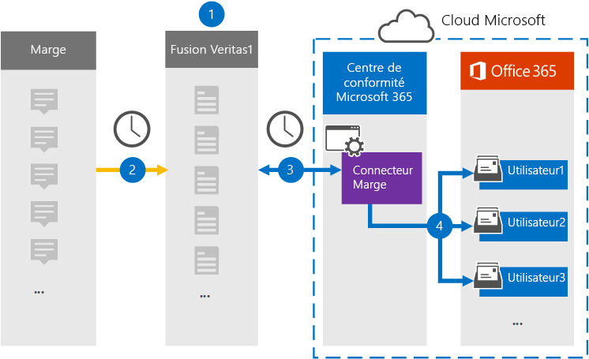

# Configurer un connecteur pour archiver les données Slack eDiscovery

Utilisez un connecteur Veritas dans le portail de conformité Microsoft Purview pour importer et archiver des données tierces à partir des médias sociaux, de la messagerie instantanée et des plateformes de collaboration de documents dans les boîtes aux lettres de votre organisation Microsoft 365. Veritas fournit un connecteur [Slack](https://globanet.com/slack/) configuré pour capturer des éléments à partir de la source de données tierce (régulièrement), puis importer ces éléments dans Microsoft 365. Slack extrait des messages et des fichiers de l’API Slack et les convertit au format d’e-mail, puis importe l’élément dans des boîtes aux lettres utilisateur.

Une fois que les données slack eDiscovery sont stockées dans des boîtes aux lettres utilisateur, vous pouvez appliquer des fonctionnalités Microsoft Purview telles que la conservation des litiges, la découverte électronique, les stratégies de rétention et les étiquettes de rétention, ainsi que la conformité des communications. L’utilisation d’un connecteur Slack pour importer et archiver des données dans Microsoft 365 peut aider votre organisation à rester conforme aux stratégies gouvernementales et réglementaires.

## Vue d’ensemble de l’archivage des données Slack eDiscovery

La vue d’ensemble suivante explique le processus d’utilisation d’un connecteur pour archiver les informations Slack dans Microsoft 365.

1. Votre organisation travaille avec Slack pour configurer et configurer un site Slack.

2. Toutes les 24 heures, les messages de conversation de Slack eDiscovery sont copiés sur le site Veritas Merge1. Le connecteur convertit également le contenu d’un message de conversation au format de message électronique.

3. Le connecteur Slack eDiscovery que vous créez dans le portail de conformité, se connecte au site Veritas Merge1 tous les jours et transfère les messages de conversation vers un emplacement de stockage Azure sécurisé dans le cloud Microsoft.

4. Le connecteur importe les éléments de message de conversation convertis dans les boîtes aux lettres d’utilisateurs spécifiques à l’aide de la valeur de la propriété *Email* et du mappage automatique des utilisateurs, comme décrit à l’étape 3. Un nouveau sous-dossier dans le dossier Boîte de réception nommé **Slack eDiscovery** est créé dans les boîtes aux lettres utilisateur, et les éléments de message de conversation sont importés dans ce dossier. Le connecteur détermine la boîte aux lettres vers laquelle importer des éléments à l’aide de la valeur de la propriété *Email*. Chaque message de conversation contient cette propriété, qui est remplie avec l’adresse e-mail de chaque participant du message de conversation.

## Avant de commencer

- Créez un compte Veritas Merge1 pour les connecteurs Microsoft. Pour créer un compte, contactez [le support technique Veritas](https://globanet.com/ms-connectors-contact). Vous vous connecterez à ce compte lorsque vous créerez le connecteur à l’étape 1.

- Obtenez le nom d’utilisateur et le mot de passe du compte d’entreprise Slack de votre organisation. Vous devez vous connecter à ce compte à l’étape 2 lorsque vous configurez Slack.

- L’utilisateur qui crée le connecteur Slack eDiscovery à l’étape 1 (et le termine à l’étape 3) doit avoir le rôle de connecteur de données Administration. Ce rôle est requis pour ajouter des connecteurs sur la page **Connecteurs de données** dans le portail de conformité. Ce rôle est ajouté par défaut à plusieurs groupes de rôles. Pour obtenir la liste de ces groupes de rôles, consultez la section « Rôles dans les centres de sécurité et de conformité » dans [Autorisations dans le Centre de sécurité & conformité](../security/office-365-security/permissions-in-the-security-and-compliance-center.md#roles-in-the-security--compliance-center). Un administrateur de votre organisation peut également créer un groupe de rôles personnalisé, attribuer le rôle Administration connecteur de données, puis ajouter les utilisateurs appropriés en tant que membres. Pour obtenir des instructions, consultez la section « Créer un groupe de rôles personnalisé » dans [Autorisations dans le portail de conformité Microsoft Purview](microsoft-365-compliance-center-permissions.md#create-a-custom-role-group).

- Ce connecteur de données Veritas est en préversion publique dans les environnements GCC dans le cloud Microsoft 365 US Government. Les applications et services tiers peuvent impliquer le stockage, la transmission et le traitement des données client de votre organisation sur des systèmes tiers qui ne font pas partie de l’infrastructure Microsoft 365 et ne sont donc pas couverts par les engagements de Microsoft Purview et de protection des données. Microsoft ne fait aucune représentation que l’utilisation de ce produit pour se connecter à des applications tierces implique que ces applications tierces sont conformes FEDRAMP.

## Étape 1 : Configurer le connecteur Slack eDiscovery

La première étape consiste à accéder à la page **Connecteurs de données** dans le portail de conformité et à créer un connecteur pour les données Slack.

1. Accédez, [https://compliance.microsoft.com](https://compliance.microsoft.com/) puis cliquez sur **Connecteurs** >  de données **Slack eDiscovery**.

2. Dans la page de description du produit **Slack eDiscovery** , cliquez sur **Ajouter un connecteur**.

3. Dans la page **Conditions d’utilisation** , cliquez sur **Accepter**.

4. Entrez un nom unique qui identifie le connecteur, puis cliquez sur **Suivant**.

5. Connectez-vous à votre compte Merge1 pour configurer le connecteur.

## Étape 2 : Configurer Slack eDiscovery

La deuxième étape consiste à configurer le connecteur Slack eDiscovery sur le site Merge1. Pour plus d’informations sur la configuration du connecteur Slack eDiscovery sur le site Veritas Merge1, consultez le [Guide utilisateur des connecteurs tiers Merge1](https://docs.ms.merge1.globanetportal.com/Merge1%20Third-Party%20Connectors%20Slack%20eDiscovery%20User%20Guide.pdf).

Une fois que vous avez cliqué sur **Enregistrer & Terminer**, la page De **mappage utilisateur** de l’Assistant Connecteur dans le portail de conformité s’affiche.

## Étape 3 : Mapper les utilisateurs et terminer la configuration du connecteur

1. Dans la page **Mapper des utilisateurs externes à des utilisateurs Microsoft 365** , activez le mappage automatique des utilisateurs.

   Les éléments Slack eDiscovery incluent une propriété appelée *Email*, qui contient des adresses e-mail pour les utilisateurs de votre organisation. Si le connecteur peut associer cette adresse à un utilisateur Microsoft 365, les éléments sont importés dans la boîte aux lettres de cet utilisateur.

2. Cliquez sur **Suivant**, passez en revue vos paramètres et accédez à la page **Connecteurs de données** pour voir la progression du processus d’importation du nouveau connecteur.

## Étape 4 : Surveiller le connecteur Slack eDiscovery

Après avoir créé le connecteur Slack eDiscovery, vous pouvez afficher l’état du connecteur dans le portail de conformité.

1. Accédez et [https://compliance.microsoft.com](https://compliance.microsoft.com) cliquez sur **Connecteurs de données** dans le volet de navigation gauche.

2. Cliquez sur l’onglet **Connecteurs** , puis sélectionnez le connecteur **Slack eDiscovery** pour afficher la page de menu volant. Cette page contient les propriétés et les informations sur le connecteur.

3. Sous **État du connecteur avec source**, cliquez sur le lien **Télécharger le journal** pour ouvrir (ou enregistrer) le journal d’état du connecteur. Ce journal contient des informations sur les données qui ont été importées dans le cloud Microsoft. Pour plus d’informations, consultez [Afficher les journaux d’administration pour les connecteurs de données](data-connector-admin-logs.md).

## Problèmes connus

- Pour l’instant, nous ne prenons pas en charge l’importation de pièces jointes ou d’éléments supérieurs à 10 Mo. La prise en charge des éléments plus volumineux sera disponible ultérieurement.