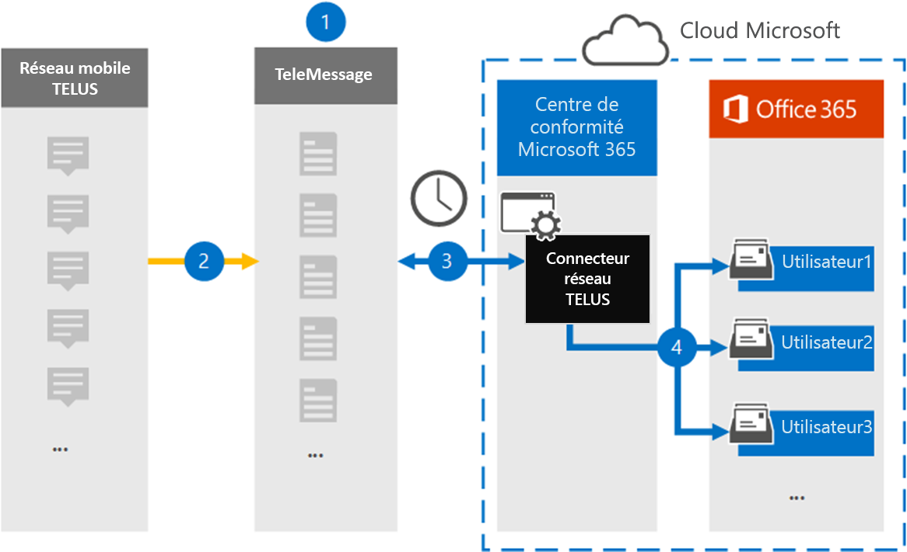

# Configurer un connecteur pour archiver les données du réseau TELUS

Utilisez le connecteur TeleMessage dans le portail de conformité Microsoft Purview pour importer et archiver les données du service de messagerie courte (SMS) à partir du réseau TELUS de votre organisation. Une fois que vous avez configuré et configuré un connecteur, il se connecte au réseau TELUS de votre organisation une fois par jour et importe les données SMS dans les boîtes aux lettres dans Microsoft 365.

Une fois les SMS stockés dans les boîtes aux lettres des utilisateurs, vous pouvez appliquer des fonctionnalités Microsoft Purview telles que la conservation pour litige, la recherche de contenu et les stratégies de rétention Microsoft 365 aux données DE TELUS. Par exemple, vous pouvez effectuer une recherche dans les messages SMS DE TELUS à l’aide de la recherche de contenu ou associer la boîte aux lettres contenant les données DE TELUS à un consignataire dans un cas eDiscovery (Premium). L’utilisation d’un connecteur RÉSEAU TELUS pour importer et archiver des données dans Microsoft 365 peut aider votre organisation à rester conforme aux stratégies gouvernementales et réglementaires.

[!INCLUDE [purview-preview](../includes/purview-preview.md)]

## Vue d’ensemble de l’archivage des données du réseau TELUS

La vue d’ensemble suivante explique le processus d’utilisation d’un connecteur pour archiver les données du réseau TELUS dans Microsoft 365.

1. Votre organisation collabore avec TéléMessage et TELUS pour configurer un connecteur réseau TELUS. Pour plus d’informations, consultez [Archiver réseau TELUS](https://www.telemessage.com/office365-activation-for-telus-network-archiver/).

2. En temps réel, les SMS du Réseau TELUS de votre organisation sont copiés sur le site De télémessage.

3. Le connecteur réseau TELUS que vous créez dans le portail de conformité se connecte au site TeleMessage tous les jours et transfère les SMS des dernières 24 heures vers un emplacement de stockage Azure sécurisé dans le cloud Microsoft. Le connecteur convertit également le contenu des SMS au format de message électronique.

4. Le connecteur importe les éléments de communication mobiles dans la boîte aux lettres d’un utilisateur spécifique. Un nouveau dossier nommé **TELUS SMS Network Archiver** est créé dans la boîte aux lettres de l’utilisateur spécifique et les éléments y sont importés. Le connecteur effectue le mappage à l’aide de la valeur de la propriété *d’adresse Email de l’utilisateur*. Chaque SMS contient cette propriété, qui est remplie avec l’adresse e-mail de chaque participant du sms.

   En plus du mappage automatique des utilisateurs à l’aide de la valeur de la propriété *d’adresse Email de l’utilisateur*, vous pouvez également implémenter un mappage personnalisé en chargeant un fichier de mappage CSV. Ce fichier de mappage contient le numéro de téléphone mobile et l’adresse e-mail Microsoft 365 correspondante pour les utilisateurs de votre organisation. Si vous activez à la fois le mappage automatique des utilisateurs et le mappage personnalisé, pour chaque élément TELUS, le connecteur examine d’abord le fichier de mappage personnalisé. S’il ne trouve pas d’utilisateur Microsoft 365 valide correspondant au numéro de téléphone mobile d’un utilisateur, le connecteur utilise les valeurs de la propriété d’adresse e-mail de l’élément qu’il tente d’importer. Si le connecteur ne trouve pas d’utilisateur Microsoft 365 valide dans le fichier de mappage personnalisé ou dans la propriété d’adresse e-mail de l’élément TELUS, l’élément n’est pas importé.

## Avant de configurer un connecteur

Certaines des étapes d’implémentation requises pour archiver les données du réseau TELUS sont externes à Microsoft 365 et doivent être effectuées avant de pouvoir créer un connecteur dans le centre de conformité.

- Commandez le [service Telus Network Archiver à partir de TeleMessage](https://www.telemessage.com/mobile-archiver/order-mobile-archiver-for-o365) et obtenez un compte d’administration valide pour votre organisation. Vous devez vous connecter à ce compte lorsque vous créez le connecteur dans le centre de conformité.

- Obtenez votre compte réseau TELUS et les coordonnées de facturation afin de pouvoir remplir les formulaires d’intégration télémessage et commander le service d’archivage des messages auprès de TELUS.

- Inscrivez tous les utilisateurs qui nécessitent l’archivage réseau TELUS SMS dans le compte TéléMessage. Lorsque vous inscrivez des utilisateurs, veillez à utiliser la même adresse e-mail que celle utilisée pour leur compte Microsoft 365.

- Vos employés doivent avoir des téléphones mobiles appartenant à l’entreprise et responsables de l’entreprise sur le réseau mobileTELUS. L’archivage des messages dans Microsoft 365 n’est pas disponible pour les appareils BYOD (Bring Your Own Devices) ou appartenant aux employés.

- L’utilisateur qui crée un connecteur réseau TELUS doit se voir attribuer le rôle Connecteur de données Administration. Ce rôle est requis pour ajouter des connecteurs dans la page **Connecteurs de données** du portail de conformité. Ce rôle est ajouté par défaut à plusieurs groupes de rôles. Pour obtenir la liste de ces groupes de rôles, consultez la section « Rôles dans les portails defender et de conformité » dans [Rôles et groupes de rôles dans les portails de conformité Microsoft 365 Defender et Microsoft Purview](../security/office-365-security/permissions-in-the-security-and-compliance-center.md#roles-in-the-defender-and-compliance-portals). Un administrateur de votre organisation peut également créer un groupe de rôles personnalisé, attribuer le rôle de Administration connecteur de données, puis ajouter les utilisateurs appropriés en tant que membres. Pour obtenir des instructions, consultez la section « Créer un groupe de rôles personnalisé » dans [Autorisations dans le portail de conformité Microsoft Purview](microsoft-365-compliance-center-permissions.md#create-a-custom-role-group).

- Ce connecteur de données TeleMessage est disponible dans les environnements GCC dans le cloud Microsoft 365 US Government. Les applications et services tiers peuvent impliquer le stockage, la transmission et le traitement des données client de votre organisation sur des systèmes tiers qui se trouvent en dehors de l’infrastructure Microsoft 365 et ne sont donc pas couverts par les engagements de Microsoft Purview et de protection des données. Microsoft ne fait aucune déclaration selon laquelle l’utilisation de ce produit pour se connecter à des applications tierces implique que ces applications tierces sont conformes à FEDRAMP.

## Créer un connecteur réseau TELUS

Une fois que vous avez rempli les conditions préalables décrites dans la section précédente, vous pouvez créer le connecteur réseau TELUS dans le portail de conformité. Le connecteur utilise les informations que vous fournissez pour vous connecter au site TeleMessage et transférer des SMS vers les boîtes aux lettres utilisateur correspondantes dans Microsoft 365.

1. Accédez à [https://compliance.microsoft.com](https://compliance.microsoft.com/) , puis sélectionnez **Connecteurs** >  de données **RÉSEAU TELUS**.

2. Dans la page description du produit **du réseau TELUS**, sélectionnez **Ajouter un connecteur**.

3. Dans la page **Conditions d’utilisation du service** , sélectionnez **Accepter**.

4. Dans la page **Connexion au télémessage** , sous Étape 3, entrez les informations requises dans les zones suivantes, puis sélectionnez **Suivant**.

   - **Nom d'utilisateur:** Votre nom d’utilisateur TeleMessage.

   - **Mot de passe:** Votre mot de passe de télémessage.

5. Une fois le connecteur créé, vous pouvez fermer la fenêtre contextuelle et accéder à la page suivante.

6. Dans la page **Mappage d’utilisateurs** , activez le mappage automatique des utilisateurs, puis sélectionnez **Suivant**. Si vous avez besoin d’un mappage personnalisé, chargez un fichier CSV, puis sélectionnez **Suivant**.

7. Passez en revue vos paramètres, puis sélectionnez **Terminer** pour créer le connecteur.

8. Accédez à l’onglet Connecteurs de la page **Connecteurs de données** pour voir la progression du processus d’importation du nouveau connecteur.

## Problèmes connus

- Pour l’instant, nous ne prenons pas en charge l’importation de pièces jointes ou d’éléments d’une taille supérieure à 10 Mo. La prise en charge des éléments plus volumineux sera disponible ultérieurement.
