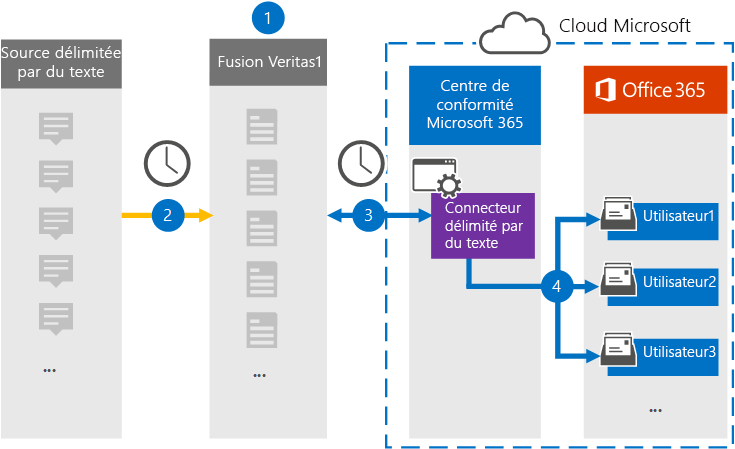

# Configurer un connecteur pour archiver des données délimitées par du texte

Utilisez un connecteur Veritas dans le Centre de conformité Microsoft 365 pour importer et archiver des données délimitées par du texte dans des boîtes aux lettres utilisateur dans Microsoft 365 organisation. Veritas fournit  un connecteur délimité par du texte qui est configuré pour capturer des éléments à partir d’une source de données tierce (régulièrement) et importer ces éléments dans Microsoft 365. Le connecteur convertit le contenu de la source de données délimitée par du texte au format de message électronique, puis importe ces éléments dans la boîte aux lettres de l’utilisateur dans Microsoft 365.

Une fois que les données délimitées par du texte sont stockées dans les boîtes aux lettres des utilisateurs, vous pouvez appliquer des fonctionnalités de conformité Microsoft 365 telles que la conservation pour litige, eDiscovery et les stratégies et étiquettes de rétention. L’utilisation d’un connecteur de données délimité par du texte pour importer et archiver des données dans Microsoft 365 peut aider votre organisation à rester conforme aux stratégies gouvernementales et réglementaires.

## Vue d’ensemble de l’archivage des données délimitées par du texte

La vue d’ensemble suivante explique le processus d’utilisation d’un connecteur pour archiver des informations sources délimitées par du texte Microsoft 365.

1. Votre organisation travaille avec la source délimitée par du texte pour configurer un site délimité par du texte.

2. Une fois toutes les 24 heures, les messages de conversation de la source délimitée par du texte sont copiés sur le site Veritas Merge1. Le connecteur convertit également le contenu au format de message électronique.

3. Le connecteur délimité par du texte que vous créez dans le Centre de conformité Microsoft 365 se connecte au site Veritas Merge1 tous les jours et transfère les messages vers un emplacement stockage Azure sécurisé dans le cloud Microsoft.

4. Le connecteur importe les éléments de message convertis dans les boîtes aux lettres d’utilisateurs spécifiques à l’aide de la valeur de la propriété *Email* du mappage automatique des utilisateurs, comme décrit à l’étape 3. Un nouveau **sous-dossier** du dossier Boîte de réception nommé Texte délimité est créé dans les boîtes aux lettres de l’utilisateur et les éléments de message sont importés dans ce dossier. Le connecteur détermine la boîte aux lettres dans laquelle importer des éléments à l’aide de la valeur de la *propriété Email.* Chaque message contient cette propriété, qui est remplie avec l’adresse e-mail de chaque participant.

## Avant de commencer

- Créez un compte Veritas Merge1 pour les connecteurs Microsoft. Pour créer ce compte, contactez le support [technique Veritas.](https://globanet.com/ms-connectors-contact) Vous vous connectez à ce compte lorsque vous créez le connecteur à l’étape 1.

- L’utilisateur qui crée le connecteur délimité par du texte à l’étape 1 (et le termine à l’étape 3) doit être affecté au rôle Importation/Exportation de boîte aux lettres dans Exchange Online. Ce rôle est requis pour ajouter des connecteurs sur la page **Connecteurs** de données dans la Centre de conformité Microsoft 365. Par défaut, ce rôle n’est pas attribué à un groupe de rôles dans Exchange Online. Vous pouvez ajouter le rôle Importation/Exportation de boîte aux lettres au groupe de rôles Gestion de l’organisation dans Exchange Online. Vous pouvez également créer un groupe de rôles, attribuer le rôle Importation/Exportation de boîte aux lettres, puis ajouter les utilisateurs appropriés en tant que membres. Pour plus d’informations, voir les [sections](/Exchange/permissions-exo/role-groups#modify-role-groups) Créer des groupes de rôles ou Modifier des groupes de rôles dans l’article « Gérer les groupes de rôles dans Exchange Online ». 

## Étape 1 : Configurer le connecteur délimité par du texte

La première étape consiste à accéder à la page **Connecteurs** de données dans le Centre de conformité Microsoft 365 et à créer un connecteur pour les données délimitées par du texte.

1. Go to [https://compliance.microsoft.com](https://compliance.microsoft.com/) and then click Data **connectors**  >  **Text-Delimited**.

2. Dans la page de description **du** produit délimitée par du texte, cliquez sur **Ajouter un connecteur.**

3. Dans la page **Conditions d’utilisation,** cliquez sur **Accepter.**

4. Entrez un nom unique qui identifie le connecteur, puis cliquez sur **Suivant**.

5. Connectez-vous à votre compte Merge1 pour configurer le connecteur.

## Étape 2 : Configurer le connecteur délimité par du texte sur le site Veritas Merge1

La deuxième étape consiste à configurer le connecteur délimité par du texte sur le site Merge1. Pour plus d’informations sur la configuration du connecteur délimité par du texte sur le site Veritas Merge1, voir [Merge1 Third-Party Connectors User Guide](https://docs.ms.merge1.globanetportal.com/Merge1%20Third-Party%20Connectors%20text-delimited%20User%20Guide%20.pdf).

Une fois que vous avez **cliqué sur &** terminé, la **page** Mappage de l’utilisateur dans l’Assistant connecteur du Centre de conformité Microsoft 365 s’affiche.

## Étape 3 : Masons les utilisateurs et terminez la configuration du connecteur

Pour maîtr les utilisateurs et terminer la configuration du connecteur dans le Centre de conformité Microsoft 365, suivez les étapes suivantes :

1. Dans la page **Ma mappage des utilisateurs externes Microsoft 365 utilisateurs,** activez le mappage automatique des utilisateurs. Les éléments sources délimités par du texte incluent une propriété appelée *Courrier* électronique, qui contient les adresses de messagerie des utilisateurs de votre organisation. Si le connecteur peut associer cette adresse à un utilisateur Microsoft 365, les éléments sont importés dans la boîte aux lettres de cet utilisateur.

2. Cliquez **sur** Suivant, examinez vos paramètres, puis allez à la page **Connecteurs** de données pour voir la progression du processus d’importation pour le nouveau connecteur.

## Étape 4 : Surveiller le connecteur délimité par du texte

Après avoir créé le connecteur délimité par du texte, vous pouvez afficher l’état du connecteur dans le Centre de conformité Microsoft 365.

1. Go to [https://compliance.microsoft.com](https://compliance.microsoft.com) and click **Data connectors** in the left nav.

2. Cliquez sur **l’onglet Connecteurs,** puis sélectionnez le connecteur délimité par du texte pour afficher la page de présentation.  Cette page contient les propriétés et les informations sur le connecteur.

3. Sous **État du connecteur avec source,** cliquez sur le lien Télécharger le journal pour ouvrir (ou enregistrer) le journal d’état du connecteur.  Ce journal contient des informations sur les données qui ont été importées dans le cloud Microsoft.

## Problèmes détectés

- Pour l’instant, l’importation de pièces jointes ou d’éléments dont la taille est supérieure à 10 Mo n’est pas prise en charge. La prise en charge des éléments plus volumineux sera disponible à une date ultérieure.