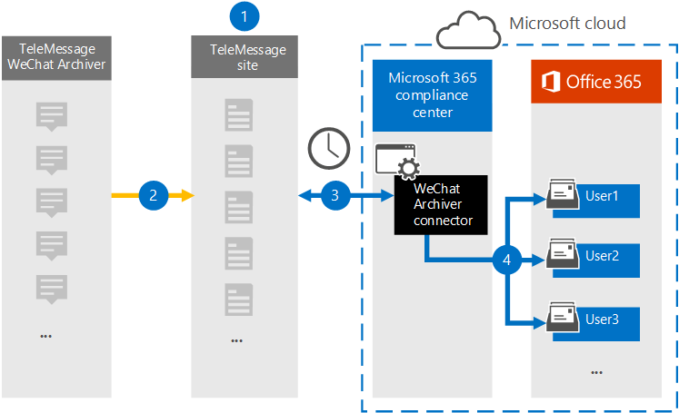

# Configurer un connecteur pour archiver les données WeChat

[!include[Purview banner](../includes/purview-rebrand-banner.md)]

Utilisez le connecteur TeleMessage dans le portail de conformité Microsoft Purview pour importer et archiver des appels WeChat et WeCom, des conversations, des pièces jointes, des fichiers et des messages rappelés. Après avoir configuré et configuré un connecteur, il se connecte au compte TeleMessage de votre organisation et importe la communication mobile des employés à l’aide de l’archiveur WeChat TeleMessage vers des boîtes aux lettres dans Microsoft 365.

Une fois que les données du connecteur WeChat Archiver sont stockées dans des boîtes aux lettres utilisateur, vous pouvez appliquer des fonctionnalités Microsoft Purview telles que la conservation des litiges, eDiscovery, l’archivage In-Place, l’audit, la conformité des communications et les stratégies de rétention Microsoft 365 aux données de communication WeChat. Par exemple, vous pouvez effectuer une recherche dans la communication WeChat à l’aide de la recherche de contenu ou associer la boîte aux lettres contenant les données du connecteur d’archivage WeChat à un consignateur dans un cas eDiscovery (Premium). L’utilisation d’un connecteur d’archivage WeChat pour importer et archiver des données dans Microsoft 365 peut aider votre organisation à rester conforme aux réglementations et aux stratégies réglementaires de gouvernance d’entreprise.

## Vue d’ensemble de l’archivage des données de communication WeChat

La vue d’ensemble suivante explique le processus d’utilisation d’un connecteur pour archiver les données de communication WeChat dans Microsoft 365.

1. Votre organisation travaille avec TeleMessage pour configurer un connecteur Archiver WeChat.

2. En temps réel, les données WeChat de votre organisation sont copiées sur le site TeleMessage.

3. Le connecteur WeChat Archiver que vous créez dans le portail de conformité se connecte au site TeleMessage tous les jours et transfère les messages électroniques des 24 dernières heures vers une zone de stockage Azure sécurisée dans le cloud Microsoft.

4. Le connecteur importe les éléments de communication mobile dans la boîte aux lettres d’un utilisateur spécifique. Un nouveau dossier nommé WeChat Archiver sera créé dans la boîte aux lettres de l’utilisateur spécifique et les éléments y seront importés. Le connecteur effectue un mappage à l’aide de la valeur de la propriété *d’adresse e-mail de l’utilisateur* . Chaque message électronique contient cette propriété, qui est remplie avec l’adresse e-mail de chaque participant du message électronique. Outre le mappage automatique des utilisateurs à l’aide de la valeur de la propriété *d’adresse e-mail de l’utilisateur* , vous pouvez également définir un mappage personnalisé en chargeant un fichier de mappage CSV. Ce fichier de mappage doit contenir le numéro mobile de l’utilisateur et l’adresse de boîte aux lettres Microsoft 365 correspondante pour chaque utilisateur. Si vous activez le mappage automatique des utilisateurs et fournissez un mappage personnalisé, pour chaque élément de messagerie, le connecteur examine d’abord le fichier de mappage personnalisé. S’il ne trouve pas de Microsoft 365 utilisateur valide qui correspond au numéro de téléphone mobile d’un utilisateur, le connecteur utilise la propriété d’adresse e-mail de l’utilisateur de l’élément de messagerie. Si le connecteur ne trouve pas de Microsoft 365 utilisateur valide dans le fichier de mappage personnalisé ou dans la propriété *d’adresse e-mail de l’élément* de courrier, l’élément n’est pas importé.

## Avant de configurer un connecteur

- Utilisez TeleMessage pour configurer un connecteur d’archive WeChat. Pour plus d’informations, consultez [Activation de l’archiveur WeChat TeleMessage pour Microsoft 365](https://www.telemessage.com/microsoft-365-activation-for-wechat-archiver/).

- Configurez un connecteur TeleMessage pour Microsoft 365 et obtenez un compte d’administration d’entreprise valide. Pour plus d’informations, consultez [Order Microsoft 365 Mobile Archiving](https://www.telemessage.com/mobile-archiver/order-mobile-archiver-for-microsoft-365/).

- Inscrivez tous les utilisateurs qui nécessitent l’archivage WeChat dans le compte TeleMessage avec la même adresse e-mail que celle utilisée pour le compte Microsoft 365 de l’utilisateur.

- Vous devez installer l’application Tencent WeCom sur les téléphones mobiles des utilisateurs de votre organisation et l’activer. L’application WeCom permet aux utilisateurs de communiquer et de discuter avec d’autres utilisateurs WeChat et WeCom.

- L’utilisateur qui crée un connecteur d’archivage WeChat dans le portail de conformité doit disposer du rôle Administrateur du connecteur de données. Ce rôle est requis pour ajouter des connecteurs sur la page **Connecteurs de données** dans le portail de conformité. Ce rôle est ajouté par défaut à plusieurs groupes de rôles. Pour obtenir la liste de ces groupes de rôles, consultez la section « Rôles dans les centres de sécurité et de conformité » dans [Autorisations dans le Centre de sécurité & conformité](../security/office-365-security/permissions-in-the-security-and-compliance-center.md#roles-in-the-security--compliance-center). Un administrateur de votre organisation peut également créer un groupe de rôles personnalisé, attribuer le rôle Administrateur du connecteur de données, puis ajouter les utilisateurs appropriés en tant que membres. Pour obtenir des instructions, consultez la section « Créer un groupe de rôles personnalisé » dans [Autorisations dans le portail de conformité Microsoft Purview](microsoft-365-compliance-center-permissions.md#create-a-custom-role-group).

- Ce connecteur de données TeleMessage est disponible dans Cloud de la communauté du secteur public environnements dans le cloud Microsoft 365 US Government. Les applications et services tiers peuvent impliquer le stockage, la transmission et le traitement des données client de votre organisation sur des systèmes tiers qui ne font pas partie de l’infrastructure Microsoft 365 et ne sont donc pas couverts par les engagements de Microsoft Purview et de protection des données. Microsoft ne fait aucune représentation que l’utilisation de ce produit pour se connecter à des applications tierces implique que ces applications tierces sont conformes FEDRAMP.

## Créer un connecteur WeChat Archiver

Suivez les étapes décrites dans cette section pour créer un connecteur Archiver WeChat dans le portail de conformité. Le connecteur utilise les informations que vous fournissez pour se connecter au site TeleMessage et transférer les données de communication WeChat vers les boîtes aux lettres utilisateur correspondantes dans Microsoft 365.

1. Accédez à l’archiveur <https://compliance.microsoft.com> **Data connectorsWeChat** > , puis cliquez **dessus**.

2. Dans la page de description du produit **WeChat Archiver** , cliquez sur **Ajouter un connecteur**

3. Dans la page **Conditions d’utilisation** , cliquez sur **Accepter**.

4. Dans la page **Connexion à TeleMessage** , sous l’étape 3, entrez les informations requises dans les zones suivantes, puis cliquez sur **Suivant**.

    - **Nom d’utilisateur** : nom d’utilisateur TeleMessage.

    - **Mot de passe** : votre mot de passe TeleMessage.

5. Une fois le connecteur créé, vous pouvez fermer la fenêtre contextuelle pour accéder à la page suivante.

6. Dans la page **De mappage d’utilisateurs** , activez le mappage automatique des utilisateurs. Vous pouvez également charger un fichier CSV de mappage d’utilisateur personnalisé.

7. Cliquez sur **Suivant**, passez en revue vos paramètres, puis cliquez sur **Terminer** pour créer le connecteur.

8. Accédez à l’onglet **Connecteurs** de la page **Connecteurs de données** pour voir la progression du processus d’importation du nouveau connecteur.

## Problèmes détectés

- Pour l’instant, nous ne prenons pas en charge l’importation de pièces jointes ou d’éléments supérieurs à 10 Mo. La prise en charge des éléments plus volumineux sera disponible ultérieurement.
