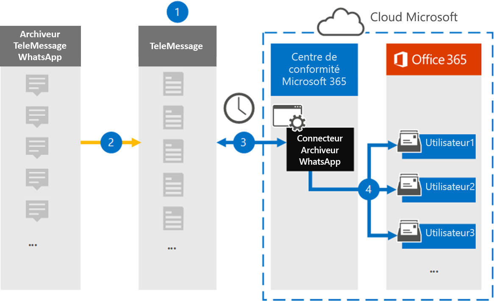

# Configurer un connecteur pour archiver les données WhatsApp

Utilisez le connecteur TeleMessage dans le portail de conformité Microsoft Purview pour importer et archiver les appels, les conversations, les pièces jointes, les fichiers et les messages supprimés whatsApp. Après avoir configuré et configuré un connecteur, il se connecte au compte TeleMessage de votre organisation une fois par jour et importe la communication mobile des employés à l’aide de TeleMessage WhatsApp Phone Archiver ou TeleMessage WhatsApp Cloud Archiver vers des boîtes aux lettres dans Microsoft 365.

Une fois que les données WhatsApp sont stockées dans des boîtes aux lettres utilisateur, vous pouvez appliquer des fonctionnalités Microsoft Purview telles que la conservation des litiges, la recherche de contenu et les stratégies de rétention Microsoft 365 aux données WhatsApp. Par exemple, vous pouvez rechercher des messages WhatsApp à l’aide de la recherche de contenu ou associer la boîte aux lettres qui contient les messages WhatsApp à un consignateur dans un cas eDiscovery (Premium). L’utilisation d’un connecteur WhatsApp pour importer et archiver des données dans Microsoft 365 peut aider votre organisation à rester conforme aux stratégies gouvernementales et réglementaires.

## Vue d’ensemble de l’archivage des données WhatsApp

La vue d’ensemble suivante explique le processus d’utilisation d’un connecteur pour archiver les données WhatsApp dans Microsoft 365.

1. Votre organisation travaille avec TeleMessage pour configurer un connecteur WhatsApp Archiver. Pour plus d’informations, consultez [WhatsApp Archiver](https://www.telemessage.com/office365-activation-for-whatsapp-archiver).

2. En temps réel, les données WhatsApp de votre organisation sont copiées sur le site TeleMessage.

3. Le connecteur WhatsApp que vous créez dans le portail de conformité se connecte au site TeleMessage tous les jours et transfère les données WhatsApp des 24 heures précédentes vers un emplacement de stockage Azure sécurisé dans le cloud Microsoft. Le connecteur convertit également les données WhatsApp de contenu au format de message électronique.

4. Le connecteur importe les données WhatsApp dans la boîte aux lettres d’un utilisateur spécifique. Un nouveau dossier nommé **WhatsApp Archiver** est créé dans la boîte aux lettres de l’utilisateur spécifique et les éléments y sont importés. Le connecteur effectue ce mappage à l’aide de la valeur de la propriété Adresse *e-mail de l’utilisateur* . Chaque message WhatsApp contient cette propriété, qui est remplie avec l’adresse e-mail de chaque participant du message.

   Outre le mappage automatique des utilisateurs à l’aide de la valeur de la propriété *d’adresse e-mail de l’utilisateur* , vous pouvez également implémenter un mappage personnalisé en chargeant un fichier de mappage CSV. Ce fichier de mappage contient le numéro de téléphone mobile et l’adresse e-mail Microsoft 365 correspondante pour les utilisateurs de votre organisation. Si vous activez le mappage automatique des utilisateurs et le mappage personnalisé, pour chaque élément WhatsApp, le connecteur examine d’abord le fichier de mappage personnalisé. S’il ne trouve pas d’utilisateur Microsoft 365 valide qui correspond au numéro de téléphone mobile d’un utilisateur, le connecteur utilise les valeurs dans la propriété d’adresse e-mail de l’élément qu’il tente d’importer. Si le connecteur ne trouve pas d’utilisateur Microsoft 365 valide dans le fichier de mappage personnalisé ou dans la propriété d’adresse e-mail de l’élément WhatsApp, l’élément n’est pas importé.

## Avant de configurer un connecteur

Certaines des étapes d’implémentation requises pour archiver les données de communication WhatsApp sont externes à Microsoft 365 et doivent être effectuées avant de pouvoir créer le connecteur dans le centre de conformité.

- Commandez le [service WhatsApp Archiver à partir de TeleMessage](https://www.telemessage.com/mobile-archiver/order-mobile-archiver-for-o365) et obtenez un compte d’administration valide pour votre organisation. Vous devez vous connecter à ce compte lorsque vous créez le connecteur dans le centre de conformité.

- Inscrivez tous les utilisateurs qui nécessitent l’archivage WhatsApp dans le compte TeleMessage. Lors de l’inscription des utilisateurs, veillez à utiliser la même adresse e-mail que celle utilisée pour leur compte Microsoft 365.

- Installez l’application TeleMessage [WhatsApp Phone Archiver](https://www.telemessage.com/mobile-archiver/whatsapp-phone-archiver-2/) sur les téléphones mobiles de vos employés et activez-la. Vous pouvez également installer les applications WhatsApp ou WhatsApp Business standard sur les téléphones mobiles de vos employés et activer le service WhatsApp Cloud Archiver en analysant un code QR sur le site web TeleMessage. Pour plus d’informations, consultez [WhatsApp Cloud Archiver](https://www.telemessage.com/mobile-archiver/whatsapp-archiver/whatsapp-cloud-archiver/).

- L’utilisateur qui crée un connecteur Verizon Network doit se faire attribuer le rôle de connecteur de données Administration. Ce rôle est requis pour ajouter des connecteurs sur la page **Connecteurs de données** dans le portail de conformité. Ce rôle est ajouté par défaut à plusieurs groupes de rôles. Pour obtenir la liste de ces groupes de rôles, consultez la section « Rôles dans les centres de sécurité et de conformité » dans [Autorisations dans le Centre de sécurité & conformité](../security/office-365-security/permissions-in-the-security-and-compliance-center.md#roles-in-the-security--compliance-center). Un administrateur de votre organisation peut également créer un groupe de rôles personnalisé, attribuer le rôle Administration connecteur de données, puis ajouter les utilisateurs appropriés en tant que membres. Pour obtenir des instructions, consultez la section « Créer un groupe de rôles personnalisé » dans [Autorisations dans le portail de conformité Microsoft Purview](microsoft-365-compliance-center-permissions.md#create-a-custom-role-group).

- Ce connecteur de données TeleMessage est disponible dans les environnements GCC dans le cloud Microsoft 365 US Government. Les applications et services tiers peuvent impliquer le stockage, la transmission et le traitement des données client de votre organisation sur des systèmes tiers qui ne font pas partie de l’infrastructure Microsoft 365 et ne sont donc pas couverts par les engagements de Microsoft Purview et de protection des données. Microsoft ne fait aucune représentation que l’utilisation de ce produit pour se connecter à des applications tierces implique que ces applications tierces sont conformes FEDRAMP.

## Créer un connecteur WhatsApp Archiver

Une fois que vous avez rempli les prérequis décrits dans la section précédente, vous pouvez créer le connecteur WhatsApp dans le portail de conformité. Le connecteur utilise les informations que vous fournissez pour se connecter au site TeleMessage et transférer les données WhatsApp vers les boîtes aux lettres utilisateur correspondantes dans Microsoft 365.

1. Accédez à l’archiveur [https://compliance.microsoft.com](https://compliance.microsoft.com/)**WhatsApp** **connecteurs** >  de données, puis cliquez dessus.

2. Dans la page de description du produit **WhatsApp Archiver** , cliquez sur **Ajouter un connecteur**

3. Dans la page **Conditions d’utilisation** , cliquez sur **Accepter**.

4. Dans la page **Connexion à TeleMessage** , sous l’étape 3, entrez les informations requises dans les zones suivantes, puis cliquez sur **Suivant**.

   - **Nom d'utilisateur:** Votre nom d’utilisateur TeleMessage.

   - **Mot de passe:** Votre mot de passe TeleMessage.

5. Une fois le connecteur créé, vous pouvez fermer la fenêtre contextuelle et accéder à la page suivante.

6. Dans la page **De mappage d’utilisateurs** , activez le mappage automatique des utilisateurs, puis cliquez sur **Suivant**. Si vous avez besoin d’un mappage personnalisé, chargez un fichier CSV, puis cliquez sur **Suivant**.

7. Passez en revue vos paramètres, puis cliquez sur **Terminer** pour créer le connecteur.

8. Accédez à l’onglet Connecteurs de la page **Connecteurs de données** pour voir la progression du processus d’importation du nouveau connecteur.

## Problèmes détectés

- Pour l’instant, nous ne prenons pas en charge l’importation de pièces jointes ou d’éléments supérieurs à 10 Mo. La prise en charge des éléments plus volumineux sera disponible ultérieurement.
