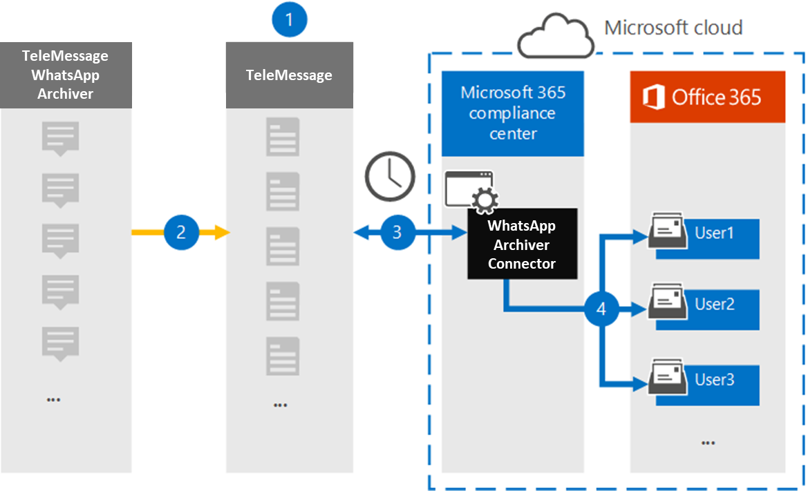

# Configurer un connecteur pour archiver les données WhatsApp

Utilisez le connecteur TeleMessage dans le centre de conformité Microsoft 365 pour importer et archiver des appels, des conversations, des pièces jointes, des fichiers et des messages supprimés. Une fois que vous avez configuré et configuré un connecteur, il se connecte au compte TeleMessage de votre organisation une fois par jour et importe la communication mobile des employés à l’aide de l’archiveur de l’application WhatsApp telemessage Téléphone ou de l’archiveur cloud TeleMessage WhatsApp dans les boîtes aux lettres de Microsoft 365.

Une fois que les données WhatsApp sont stockées dans les boîtes aux lettres des utilisateurs, vous pouvez appliquer des fonctionnalités de conformité Microsoft 365 telles que la conservation pour litige, la recherche de contenu et les stratégies de rétention Microsoft 365 aux données WhatsApp. Par exemple, vous pouvez rechercher des messages WhatsApp à l’aide de la recherche de contenu ou associer la boîte aux lettres qui contient les messages WhatsApp à un dépositaire dans Advanced eDiscovery cas. L’utilisation d’un connecteur WhatsApp pour importer et archiver des données dans Microsoft 365 peut aider votre organisation à rester conforme aux stratégies gouvernementales et réglementaires.

## Vue d’ensemble de l’archivage des données WhatsApp

La vue d’ensemble suivante explique le processus d’utilisation d’un connecteur pour archiver les données WhatsApp dans Microsoft 365.

1. Votre organisation travaille avec TeleMessage pour configurer un connecteur d’archivage WhatsApp. Pour plus d’informations, [voir l’Archiveur WhatsApp.](https://www.telemessage.com/office365-activation-for-whatsapp-archiver)

2. En temps réel, les données WhatsApp de votre organisation sont copiées sur le site TeleMessage.

3. Le connecteur WhatsApp que vous créez dans le centre de conformité Microsoft 365 se connecte au site TeleMessage tous les jours et transfère les données WhatsApp des 24 heures précédentes vers un emplacement stockage Azure sécurisé dans le cloud Microsoft. Le connecteur convertit également les données WhatsApp de contenu au format de message électronique.

4. Le connecteur importe les données WhatsApp dans la boîte aux lettres d’un utilisateur spécifique. Un nouveau dossier nommé **WhatsApp Archiver** est créé dans la boîte aux lettres de l’utilisateur spécifique et les éléments y sont importés. Le connecteur fait ce mappage à l’aide de la valeur de la propriété *d’adresse* de messagerie de l’utilisateur. Chaque message WhatsApp contient cette propriété, qui est remplie avec l’adresse e-mail de chaque participant du message.

   Outre le mappage automatique des utilisateurs à l’aide de la valeur de la propriété *d’adresse* de messagerie de l’utilisateur, vous pouvez également implémenter un mappage personnalisé en chargeant un fichier de mappage CSV. Ce fichier de mappage contient le numéro de téléphone mobile et l’adresse Microsoft 365 de messagerie des utilisateurs de votre organisation. Si vous activez à la fois le mappage utilisateur automatique et le mappage personnalisé, pour chaque élément WhatsApp, le connecteur examine d’abord le fichier de mappage personnalisé. S’il ne trouve pas d’utilisateur Microsoft 365 valide correspondant au numéro de téléphone mobile d’un utilisateur, le connecteur utilise les valeurs de la propriété d’adresse de messagerie de l’élément qu’il tente d’importer. Si le connecteur ne trouve pas d’utilisateur Microsoft 365 valide dans le fichier de mappage personnalisé ou dans la propriété d’adresse de messagerie de l’élément WhatsApp, l’élément n’est pas importé.

## Avant de configurer un connecteur

Certaines des étapes d’implémentation requises pour archiver les données de communication WhatsApp sont externes à Microsoft 365 et doivent être effectuées avant de pouvoir créer le connecteur dans le centre de conformité.

- Commandez [le service d’archivage WhatsApp à partir de TeleMessage](https://www.telemessage.com/mobile-archiver/order-mobile-archiver-for-o365) et obtenez un compte d’administration valide pour votre organisation. Vous devrez vous inscrire à ce compte lorsque vous créerez le connecteur dans le centre de conformité.

- Enregistrez tous les utilisateurs qui nécessitent l’archivage WhatsApp dans le compte TeleMessage. Lors de l’inscription des utilisateurs, n’oubliez pas d’utiliser la même adresse de messagerie que celle utilisée pour Microsoft 365 compte.

- Installez l’application TeleMessage [WhatsApp Téléphone Archiver](https://www.telemessage.com/mobile-archiver/whatsapp-phone-archiver-2/) sur les téléphones mobiles de vos employés et activez-la. Vous pouvez également installer les applications WhatsApp ou WhatsApp Business normales sur les téléphones mobiles de vos employés et activer le service d’archivage cloud de WhatsApp en analysant un code QR sur le site web TeleMessage. Pour plus d’informations, [voir WhatsApp Cloud Archiver](https://www.telemessage.com/mobile-archiver/whatsapp-archiver/whatsapp-cloud-archiver/).

- Le rôle Importation/Exportation de boîte aux lettres doit être attribué à l’utilisateur qui crée un connecteur réseau Verizon dans Exchange Online. Cela est nécessaire pour ajouter des connecteurs dans la page **Connecteurs** de données dans le centre Microsoft 365 conformité. Par défaut, ce rôle n’est affecté à aucun groupe de rôles dans Exchange Online. Vous pouvez ajouter le rôle Importation/Exportation de boîte aux lettres au groupe de rôles Gestion de l’organisation dans Exchange Online. Vous pouvez également créer un groupe de rôles, attribuer le rôle Importation/Exportation de boîte aux lettres, puis ajouter les utilisateurs appropriés en tant que membres. Pour plus d’informations, voir les [sections](/Exchange/permissions-exo/role-groups#modify-role-groups) Créer des groupes de rôles ou Modifier des groupes de rôles dans l’article « Gérer les groupes de rôles dans Exchange Online ». 

- Ce connecteur de données est disponible dans Cloud de la communauté du secteur public environnements dans le cloud Microsoft 365 gouvernement américain. Les applications et services tiers peuvent impliquer le stockage, la transmission et le traitement des données client de votre organisation sur des systèmes tiers qui sont en dehors de l’infrastructure Microsoft 365 et qui, par conséquent, ne sont pas couverts par les engagements en matière de conformité et de protection des données Microsoft 365. Microsoft ne fait aucune représentation que l’utilisation de ce produit pour se connecter à des applications tierces implique que ces applications tierces sont conformes FEDRAMP.

## Créer un connecteur d’archivage WhatsApp

Une fois que vous avez rempli les conditions préalables décrites dans la section précédente, vous pouvez créer le connecteur WhatsApp dans le centre Microsoft 365 conformité. Le connecteur utilise les informations que vous fournissez pour vous connecter au site TeleMessage et transférer les données WhatsApp vers les boîtes aux lettres utilisateur correspondantes dans Microsoft 365.

1. Go to [https://compliance.microsoft.com](https://compliance.microsoft.com/) and then click Data **connectors**  >  **WhatsApp Archiver**.

2. Dans la page description **du produit De l’Archiveur WhatsApp,** cliquez **sur Ajouter un connecteur**

3. Dans la page **Conditions d’utilisation,** cliquez sur **Accepter.**

4. Dans la page **Connexion à TeleMessage,** sous l’étape 3, entrez les informations requises dans les zones suivantes, puis cliquez sur **Suivant**.

   - **Nom d’utilisateur :** Votre nom d’utilisateur TeleMessage.

   - **Mot de passe :** Votre mot de passe TeleMessage.

5. Une fois le connecteur créé, vous pouvez fermer la fenêtre pop-up et passer à la page suivante.

6. Dans la page **Mappage des** utilisateurs, activez le mappage utilisateur automatique et cliquez sur **Suivant.** Si vous avez besoin d’un mappage personnalisé, téléchargez un fichier CSV, puis cliquez sur **Suivant**.

7. Examinez vos paramètres, puis cliquez sur **Terminer** pour créer le connecteur.

8. Go to the Connectors tab in **Data connectors** page to see the progress of the import process for the new connector.

## Problèmes connus

- Pour l’instant, l’importation de pièces jointes ou d’éléments dont la taille est supérieure à 10 Mo n’est pas prise en charge. La prise en charge des éléments plus volumineux sera disponible à une date ultérieure.
